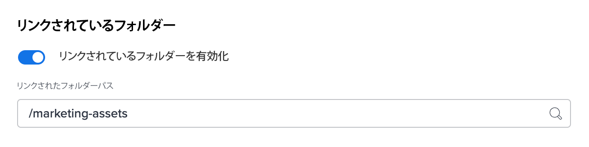
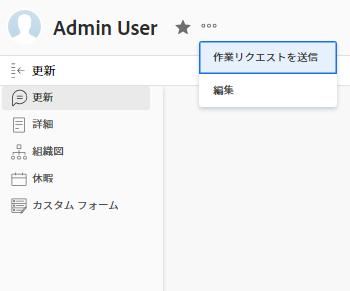

# スニペット

<!-- Add snippets within the section that the snippet is used. Snippets that are used throughout the Workfront documentation set should be added to the "General" section. -->

<!-- General -->

## ハイライト表示されたプレビュー {#highlighted-preview}

このページで強調表示されている情報は、まだ一般に利用できない機能を示しています。 この機能は、プレビューサンドボックス環境でのみ使用できます。

## 記事全体を対象とした強調表示されたプレビュー {#highlighted-preview-article-level}

このページの情報は、まだ一般に提供されていない機能を指します。 この機能は、プレビューサンドボックス環境でのみ使用できます。

## AEC/シェルに適用されないナビゲーション機能に関する重要な注意事項 {#important-not-on-aec}

>[!IMPORTANT]
>
>このページで説明する手順は、まだにオンボーディングされていない組織にのみ適用されます。 [!DNL Adobe Experience Cloud].
>
> 組織が [!DNL Adobe Experience Cloud]を参照してください。 [[!DNL Adobe Unified Experience] 対象 [!DNL Workfront]](/help/quicksilver/workfront-basics/navigate-workfront/workfront-navigation/adobe-unified-experience.md).

## 手順 1 — メインメニューのみをクリックする {#step1-click-main-menu}

1. 次をクリック： **[!UICONTROL メインメニュー]** アイコン  Adobe Workfrontの右上隅にある、または（使用可能な場合）、 **[!UICONTROL メインメニュー]** アイコン  をクリックします。

## 手順 1 — メインメニューをクリックし、をクリックします。 {#step1-click-mm-then-click}

1. 次をクリック： **[!UICONTROL メインメニュー]** アイコン  Adobe Workfrontの右上隅にある、または（使用可能な場合）、 **[!UICONTROL メインメニュー]** アイコン  左上隅で、

## 手順 1 — プロフィール画像をクリックする — {#step1-click-profile-pic}

1. 次をクリック： **[!UICONTROL メインメニュー]** アイコン  Adobe Workfrontの右上隅で、プロフィール画像の横にあるユーザー名をクリックします。 または（使用可能な場合）、上部のナビゲーション領域のプロフィール画像をクリックし、 **[!UICONTROL Workfront Profile]**.

<!-- Admin and Setup -->

## 手順 1 — セットアップの手引き {#step-1-to-setup}

1. 次をクリック： **[!UICONTROL メインメニュー]** アイコン  Adobe Workfrontの右上隅にある、または（使用可能な場合）、 **[!UICONTROL メインメニュー]** アイコン  左上隅で、 **[!UICONTROL 設定]** .

## 適切なグループをチームに関連付ける {#right-group-team}

適切なグループにカーソルを合わせ、情報アイコンをクリックすると、適切なグループがチームに関連付けられていることを確認できます  それがその横に表示されます。 グループの上のグループの階層や管理者の名前など、グループに関する情報が一覧表示されるツールチップが表示されます。

## Admin Consoleのオンボーディングに関する重要な注意事項 {#important-admin-console-onboard}

>[!IMPORTANT]
>
>このページで説明する手順は、まだAdobe Admin Consoleにオンボーディングされていない組織にのみ適用されます。
>
>組織がAdobe Admin Consoleにオンボーディングされている場合は、 [プラットフォームベースの管理上の違い (Adobe Workfront/Adobeビジネスプラットフォーム )](/help/quicksilver/administration-and-setup/get-started-wf-administration/actions-in-admin-console.md).

## 手順 1 — ユーザーにアクセスする {#step-1-to-users}

1. 次をクリック： **[!UICONTROL メインメニュー]** アイコン  Adobe Workfrontの右上隅にある、または（使用可能な場合）、 **[!UICONTROL メインメニュー]** アイコン  左上隅で、 **[!UICONTROL ユーザー]** .

<!-- Agile -->

## 手順 1 — ボードへのアクセス — {#step1-to-boards}

1. 次をクリック： **[!UICONTROL メインメニュー]** アイコン  Adobe Workfrontの右上隅にある、または（使用可能な場合）、 **[!UICONTROL メインメニュー]** アイコン  左上隅で、 **[!UICONTROL ボード]**.

<!-- Calendars -->

<!-- Documents -->

## リンクされたフォルダの設定 {#setup-linked-folder}

Workfrontプロジェクト内でフォルダーにリンクされたExperience Managerーを作成できるようにします。 フォルダーをリンクすると、そのフォルダーに追加されたすべてのアセットが自動的にWorkfrontと Experience Manager の両方に表示されます。 Workfront内のリンクされたフォルダーにアセットを初めて追加すると、そのアセットのメタデータがExperience Manager Assetsにプッシュされます。

次の手順では、リンクされたフォルダーを作成する場所を指定します。 各統合では、リンクされたすべてのフォルダーに対して 1 つの場所のみを指定できます。

リンクされたフォルダーを設定するには：

1. 切り替え **有効なリンク済みフォルダー** オン。
1. フォルダーパスを選択して、この統合に関連付けられたすべてのリンク済みフォルダーをライブにする場所を指定します。
   

   >[!NOTE]
   >
   >リンクされたフォルダーを作成するには、Adobe Experience Manager Assets で指定したフォルダーへの書き込みアクセス権が必要です。

1. 「**保存**」をクリックします。

<!-- Home -->

## 手順 1 — ホームに戻る — {#step1-to-home}

1. 次をクリック： **[!UICONTROL メインメニュー]** アイコン  Adobe Workfrontの右上隅にある、または（使用可能な場合）、 **[!UICONTROL メインメニュー]** アイコン  左上隅で、 **[!UICONTROL ホーム]**.

## ホームアイコンをクリックします。 {#click-home}

1. 次をクリック： [!UICONTROL ホーム] アイコン  Adobe Workfrontの左上隅に

>[!NOTE]
>Workfront管理者が、 [!UICONTROL ホーム] アイコンを次に示します。
>
>* 組織を説明するようにカスタマイズされた画像に置き換えます。 この場合、アイコンはこの記事に示すものとは異なります。
>* リンクされたページを別のページに置き換えます。 この場合、 **[!UICONTROL メインメニュー]**  ページの右上隅にある、または（使用可能な場合） **[!UICONTROL メインメニュー]** アイコン  左上隅で、 **[!UICONTROL ホーム]**.
>

<!-- Integrations -->

## 前提条件 {#cc-install-prereq}

使用しているAdobe Creative Cloudアプリケーション用の正しいプラグインをインストールする必要があります。
* Photoshopについては、 [Adobe Workfront for Photoshopのインストール](/help/quicksilver/workfront-integrations-and-apps/adobe-workfront-for-creative-cloud/wf-cc-install-ps.md)
* XDの場合は、 [Adobe Workfront for XDのインストール](/help/quicksilver/workfront-integrations-and-apps/adobe-workfront-for-creative-cloud/wf-adobe-xd-install.md)
* InDesign、Illustrator、Premiere Pro、After Effectsについては、 [Adobe Workfrontをインストールしてデザインとビデオを作成](/help/quicksilver/workfront-integrations-and-apps/adobe-workfront-for-creative-cloud/wf-install-cc.md)

## CC Applications リスト {#cc-app-list}

* Photoshop
* XD
* InDesign
* Illustrator
* Premiere Pro
* After Effects

## CC アプリケーションリストの WF {#cc-plugin-app-list}

* InDesign
* Illustrator
* Premiere Pro
* After Effects

## 自動配達確認設定の調整 {#adjust-proof-settings}

1. （オプション）自動配達確認ワークフロー設定を調整します

   <table>
      <tr>
         <td colspan="2" ><strong>配達確認ステージ</strong>
         </td>
      </tr>
      <tr>
         <td>ステージの無効化
         </td>
         <td>
      <ol>

   <li>「すべて選択」を切り替えて、すべてのステージを無効にします。 
      
または
</li>
      <li>個々のステージを切り替えます。</li>

   </ol>
         </td>
      </tr>
      <tr>
         <td>受信者を追加
         </td>
         <td>
      <ol>

   <li>「新しい受信者を追加」ボックスに、ユーザーの名前を入力します。

   <li>配達確認の役割を指定します。

   <li>受信者に関する E メールアラートのタイプを選択します。 
      </li>
      </ol>
         </td>
      </tr>
      <tr>
         <td>期限を設定
         </td>
         <td>
      <ol>

   <li>期限を選択します。
      </li>
      </ol>
         </td>
      </tr>
      <tr>
         <td colspan="2" ><strong>メール通知</strong>
         </td>
      </tr>
      <tr>
         <td>配達確認について受信者に通知
         </td>
         <td>
      <ol>

   <li>配達確認の作成時にユーザーに通知する場合は、このチェックボックスをオンにします。
      </li>
      </ol>
         </td>
      </tr>
      <tr>
         <td>カスタムメッセージを追加
         </td>
         <td>
      <ol>

   <li>件名を入力します。

   <li>カスタムメッセージを入力します。
      </li>
      </ol>
         </td>
      </tr>
      </table>

<!-- Log Time -->

<!-- Manage Work -->

<!-- Mobile -->

## モバイル配達確認 — 詳細メニュー {#mobile-proof-more-menu}

1. ドキュメントの配達確認を開き、 **[!UICONTROL 詳細]** メニュー  をクリックします。 次に、 **[!UICONTROL 詳細]**.

<!-- Notifications -->

<!-- Teams and Groups -->

<!-- Proofing -->

## 手順 1 — 校正に進む — {#step1-to-proofing}

1. Workfrontで、 **[!UICONTROL メインメニュー]** アイコン または（使用可能な場合）、 **[!UICONTROL メインメニュー]** 左上隅のアイコン を選択し、「 **[!UICONTROL 校正]** Workfront Proof にアクセスする

## 最新の DPV バージョン {#latest-version}

**最新バージョン**:5/15/2023時点で 2.1.24

<!-- Release -->

<!-- Reports -->

<!-- Resource Management -->

<!-- Review and approve work -->

<!-- Scenario Planner -->

## 手順 1 — シナリオプランナーの概要 — {#step1-to-scenario-planner}

1. 次をクリック： **[!UICONTROL メインメニュー]** アイコン , ( または  （使用可能な場合）、 **[!UICONTROL シナリオ]**.

<!-- Teams -->

## 手順 1 — チームにアクセスする — {#step1-to-team}

1. 次をクリック： **[!UICONTROL メインメニュー]** アイコン  Adobe Workfrontの右上隅にある、または（使用可能な場合）、 **[!UICONTROL メインメニュー]** アイコン  左上隅で、 **[!UICONTROL チーム]**.

## 1 つ以上のステータスの「完了」ボタン {#configure-done-button}

「完了」ボタンを使用して、作業項目に適用するステータスを変更できます。 また、複数のステータスを設定し、適切なステータスをユーザーが選択できるようにすることもできます。

1. 次をクリック： **[!UICONTROL メインメニュー]** アイコン  Adobe Workfrontの右上隅にある、または（使用可能な場合）、 **[!UICONTROL メインメニュー]** アイコン  左上隅で、 **[!UICONTROL チーム]**.

1. 次をクリック： **[!UICONTROL チームの切り替え]** アイコンをクリックし、ドロップダウンメニューから新しいチームを選択するか、検索バーでチームを検索します。
1. 次をクリック： **[!UICONTROL 詳細]** メニュー、次に「 **[!UICONTROL 編集]**.
1. 次を検索： **[!UICONTROL 完了ボタン]** の一番下のセクション **[!UICONTROL チーム設定]** ページ。

1. 各作業項目タイプに対して 1 つ以上のステータスを選択します。

   >[!NOTE]
   >
   >タスクまたは問題のステータスを選択する際は、次の点を考慮してください。
   >
   >* 作業項目の種類ごとに 1 つのステータスを選択すると、ユーザーが項目の [ 完了 ] をクリックしたとき、タスクまたは問題のステータスがそのステータスに設定されます。 作業項目のタイプごとに複数のステータスを設定する場合、「完了」ボタンにドロップダウンメニューが表示され、作業項目のステータスを変更するには、ステータスを選択する必要があります。
   >* 「完了」ボタンには、システムレベルのステータスのみを関連付けることができます。 グループ固有のステータスを作業項目のステータスに関連付けることはできません。
   >* アイテムに割り当てられたユーザーが、そのアイテムを「完了」ボタンに関連付けられたステータスに配置すると、選択したステータスが「完了」、「クローズ」、「作業中」のどちらであるかに関係なく、そのユーザーの「完了」と表示されます。
   >   
   >   
   >  例えば、「完了」ボタンを「処理中」に関連付けると、ステータスを「新規」から「処理中」に変更したユーザーに対して、作業項目が「完了」と表示されます。
   >   
   >* 問題のタイプはカスタマイズ可能で、環境によっては、以下に示すように異なる名前が付けられる場合があります。\
   >  デフォルトのタスクと問題のタイプは次のとおりです。
   >     
   >   * タスク
   >   * 問題
   >   * リクエスト
   >   * 変更依頼
   >   * バグレポート

   タスクまたはイシューが複数のユーザーに割り当てられている場合は、チームに選択した複数のステータスに加えて、ドロップダウンメニューに「Done with my part」オプションが表示されます。

1. 「**[!UICONTROL 変更を保存]**」をクリックします。

## ユーザをホームチームに関連付ける {#associate-users-with-home-team}

[ 完了 ] ボタンの機能に対する変更をユーザに表示するには、ユーザのホームチームを設定変更したチームに設定を変更します。

ユーザーをホームチームに関連付けるには：

1. 次をクリック： **[!UICONTROL メインメニュー]** アイコン  Adobe Workfrontの右上隅にある、または（使用可能な場合）、 **[!UICONTROL メインメニュー]** アイコン  をクリックします。

1. クリック **[!UICONTROL ユーザー]**&#x200B;をクリックし、ホームチームに関連付ける 1 人または複数のユーザを選択します。
1. 次をクリック： **[!UICONTROL 詳細]** メニューから、 **[!UICONTROL 編集]**.\
   

1. 内 **[!UICONTROL 組織]** セクションで、 **[!UICONTROL ホームチーム]** フィールドに入力します。 設定をユーザーに関連付けるチームの名前を入力します。 リストにチームの名前が表示されたら、そのチームの名前をクリックします。

1. 「**[!UICONTROL 変更を保存]**」をクリックします。選択したユーザがホームチームに関連付けられます。
これで、「完了」ボタンに関連付けられたステータスを含むチーム設定が、これらのユーザーに対して表示されます。

<!-- Timesheets -->

<!-- Workfront Goals -->

## 手順 1 — 目標の設定 — {#step1-to-goals}

1. 次をクリック： **[!UICONTROL メインメニュー]** アイコン  画面の右上隅にある、または（使用可能な場合） **[!UICONTROL メインメニュー]** アイコン  左上隅で、 **[!UICONTROL 目標]**.

   「Workfront目標」領域が開きます。

<!-- Workfront Fusion -->

<!-- Wokfront Library -->

<!-- Workfront Basics -->

<!-- Workfront Proof -->

<!-- TEST -->

## スニペット番号のテスト {#snippet-number-test}

1. これはスニペットのステップで、2 つのうち最初のステップです。
1. これはスニペットのステップで、2 つ目のステップです。

<!--

For each snippets, create a head 2 section and add an anchor, such as

## Classic note {#classic-note}

In any .md file, add {{classic-note}} where you want that shared snippet content to appear.

-->