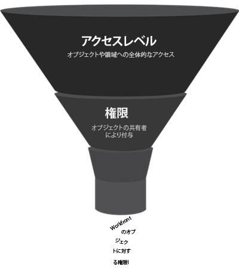

# アクセスレベルと権限の連携の仕組み

Adobe Workfront 管理者は、各ユーザーが持つ必要のあるアクセスレベルを決定します。このアクセスレベルは、ユーザーがシステム内のオブジェクトタイプやエリアで表示および操作できる内容を定義します。

また、他のユーザーが個々のオブジェクトに対して特定の権限を共有し、付与すると、ユーザーは個々のオブジェクトにアクセスできます。

例えば、アクセスレベルでタスクを作成できると表示されていて、特定のプロジェクトに対して受け取る権限でタスクを追加できない場合、Workfront の他の場所でタスクを作成できても、そのプロジェクトにタスクを追加できません。

この記事では、この組み合わせの仕組みを説明します。

## アクセスレベル

Workfront へのログインには、Workfront 管理者が各ユーザーに割り当てたアクセスレベルが必要です。

デフォルトのアクセスレベルは次のとおりです。

* システム管理者（プランライセンスに添付）
* プランナー（プランライセンスに添付）
* 作業者（作業ライセンスに添付）
* レビュアー（レビューライセンスに添付）
* 要求者（要求ライセンスに添付）
* 外部ユーザー（外部メールライセンスに添付）

各デフォルトのアクセスレベルの Workfront ライセンスによって、そのアクセスレベルで何が利用可能で設定可能かが決まります。Workfront ライセンスについて詳しくは、[Adobe Workfront のライセンスの概要](../../../administration-and-setup/add-users/access-levels-and-object-permissions/wf-licenses.md)を参照してください。

アクセスレベルは割り当てられたユーザーに対して、Workfront 内の次のオブジェクトタイプとエリアで表示および実行できる内容を定義します。

* プロジェクト
* タスク
* イシュー
* ポートフォリオ
* レポート、ダッシュボード、カレンダー
* フィルター、ビュー、グループ化
* ドキュメント
* その他のユーザー
* テンプレート
* 財務データ
* リソース管理
* シナリオプランナー
* Workfront Goals

カスタムアクセスレベルでは、これらのオブジェクトとエリアの設定を行って、それらにユーザーがどのようにアクセスするかを変更できます。アクセスレベルに関連付けられたライセンスと、オブジェクトまたはエリアのタイプに応じて、アクセスレベルを設定して、オブジェクトまたはエリアへのアクセスを禁止したり、表示アクセスを許可したり、編集アクセスを許可したりできます。

>[!IMPORTANT]
>
>ユーザーを設定した後で参照できるように、組み込みのアクセスレベルを変更しないことを強くお勧めします。アクセスレベルをカスタマイズするには、デフォルトのアクセスレベルをコピーし、そのコピーを変更します。（システム管理者と外部ユーザーを除くすべてのアクセスレベルで、これを実行できます）。

各デフォルトのアクセスレベルの詳細については、 [組み込みのアクセスレベル](../../../administration-and-setup/add-users/access-levels-and-object-permissions/default-access-levels-in-workfront.md).

ユーザーにアクセスレベルを割り当てる手順については、[ユーザーのプロファイルの編集](../../../administration-and-setup/add-users/create-and-manage-users/edit-a-users-profile.md)を参照してください。

## 権限

ユーザーはシステム内の誰かとオブジェクトを共有する際に、オブジェクトに対する次の権限のいずれかを受信者に付与できます。

* **表示**：このレベルの権限を使用すると、受信者は次のいずれかの方法でオブジェクトを共有できます。

   * システム全体で、すべてのユーザーが表示可能（一部のオブジェクトでは利用不可）
   * Workfront のライセンスを持たない外部ユーザー（一部のオブジェクトでは利用不可）
   * メールアドレス（ドキュメントでのみ利用可能）

* **投稿**：（一部のオブジェクトでは利用不可）
* **管理**：誰かがオブジェクトを共有する場合、そのオブジェクトに対する受信者の権限は、受信者のアクセスレベルと、共有者が付与したオブジェクトに対する権限の組み合わせによって決まります。その組み合わせで利用可能な最低レベルのアクセスによって、受信者がオブジェクトに対して何を実行できるかが決まります。

  >[!INFO]
  >
  >**例：**&#x200B;受信者のアクセスレベルでプロジェクトの編集が許可されていない場合、共有者が管理権限を付与しても、そのユーザーはプロジェクトを編集または削除できません。
  >
  >また、受信者のアクセスレベルでプロジェクトの編集が許可されているが、共有者がプロジェクトに対する表示のみの権限を付与している場合、ユーザーはプロジェクトを編集または削除できません。

次の表は、ユーザーのオブジェクト（ユーザーのアクセスレベルで定義）に対する一般的なアクセス権と、特定の共有オブジェクトに対する権限を比較したものです。

<table style="table-layout:auto"> 
 <col> 
 <col> 
 <col> 
 <thead> 
  <tr> 
   <th> </th> 
   <th>アクセスレベル </th> 
   <th>権限 </th> 
  </tr> 
 </thead> 
 <tbody> 
  <tr> 
   <td>ユーザーのアクセスレベルで Workfront 管理者が付与</td> 
   <td>✓</td> 
   <td> </td> 
  </tr> 
  <tr> 
   <td>オブジェクトレベルでオブジェクトを共有するユーザーが付与</td> 
   <td> </td> 
   <td>✓</td> 
  </tr> 
  <tr> 
   <td> 
上位の共有オブジェクトから継承 
   </td> 
   <td> </td> 
   <td>✓</td> 
  </tr> 
 </tbody> 
</table>

>[!NOTE]
>
>* ユーザーが特定の権限を持つオブジェクトを共有し、そのオブジェクトの下に子オブジェクトがある場合、受信者はそれらの子オブジェクトに対して同じ権限を継承します。
>* アクセスレベルによってユーザーが特定のオブジェクトを削除できないように制限されている場合、ユーザーはそれらのオブジェクトに含まれる子オブジェクトを削除できなくなります。
>

## その他のシナリオの例

Olivia が Tony と Workfront のプロジェクトを共有すると、Tony のそのプロジェクトへのアクセス権は、次の 2 つの要素の組み合わせによって決まります。

* Workfront 管理者によって割り当てられた Tony のアクセスレベル
* Olivia によって指定された、プロジェクトに対する Tony の権限

プロジェクトに対する Tony のアクションは、プロジェクト上でさらに制限できますが、彼のアクセスレベルで許可されているものを超えて自由に制限することはできません。

* Tony のアクセスレベルでタスクの作成が許可されない場合、Olivia がタスクを追加する権限を与えても、タスクをプロジェクトに追加できません。
* Tony のアクセスレベルではタスクの作成が許可されているが、Olivia がプロジェクトにタスクを追加する権限を付与していない場合、そのプロジェクトにタスクを追加することはできませんが、権限が付与されている他のプロジェクトにタスクを追加することはできます。
