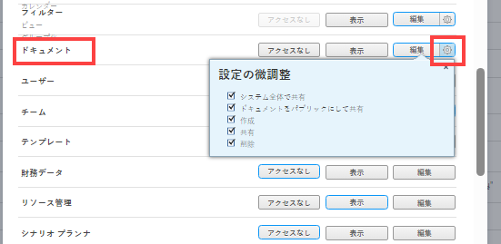

# ドキュメントへのアクセス権の付与

Adobe Workfront管理者は、アクセスレベルを使用して、ドキュメントに対するユーザーのアクセスを定義できます。詳しくは、 [アクセスレベルの概要](../../../administration-and-setup/add-users/access-levels-and-object-permissions/access-levels-overview.md).

このアクセスは、ドキュメントフォルダにも適用されます。

カスタムアクセスレベルを使用して、Workfrontの他のオブジェクトタイプへのユーザーのアクセスを管理する方法について詳しくは、 [カスタムアクセスレベルの作成または変更](../../../administration-and-setup/add-users/configure-and-grant-access/create-modify-access-levels.md).

## アクセス要件

この記事の手順を実行するには、次のアクセス権が必要です。

<table style="table-layout:auto"> 
 <col> 
 <col> 
 <tbody> 
  <tr> 
   <td role="rowheader">Adobe Workfrontプラン</td> 
   <td>任意</td> 
  </tr> 
  <tr> 
   <td role="rowheader">Adobe Workfrontライセンス</td> 
   <td>計画</td> 
  </tr> 
  <tr> 
   <td role="rowheader">アクセスレベル設定</td> 
   <td> 
Workfront管理者である。&gt;.
 
<b>注意</b>:まだアクセス権がない場合は、Workfront管理者に、アクセスレベルに追加の制限を設定しているかどうかを問い合わせてください。 Workfront管理者がアクセスレベルを変更する方法について詳しくは、 <a href="../../../administration-and-setup/add-users/configure-and-grant-access/create-modify-access-levels.md" class="MCXref xref" data-mc-variable-override="">カスタムアクセスレベルの作成または変更</a>.
 </td> 
  </tr> 
 </tbody> 
</table>

## カスタムアクセスレベルを使用してドキュメントへのユーザーアクセスを設定する

1. アクセスレベルの作成または編集を開始します ( [カスタムアクセスレベルの作成または変更](../../../administration-and-setup/add-users/configure-and-grant-access/create-modify-access-levels.md).
1. 歯車アイコンをクリックします。  の **表示** または **編集** 「ドキュメント」の右にあるボタンをクリックし、 **設定を微調整する**.

   

   ユーザーがアクセス権のあるプロジェクト、タスクおよびタスクに関する以下の作業を許可できます。

   <table style="table-layout:auto"> 
    <col> 
    <col> 
    <tbody> 
     <tr> 
      <td role="rowheader">作成</td> 
      <td>ドキュメントをアップロードします。</td> 
     </tr> 
     <tr> 
      <td role="rowheader">削除</td> 
      <td> 
アップロードしたドキュメントを削除します。
 
この <b>作成</b> このオプションが有効な場合、オプションは自動的に有効になります。
 </td> 
     </tr> 
     <tr> 
      <td role="rowheader">共有</td> 
      <td>特定のユーザー、ジョブの役割、チームとドキュメントを共有します。</td> 
     </tr> 
     <tr> 
      <td role="rowheader">ドキュメントをパブリックにして共有</td> 
      <td>ドキュメントを外部ユーザーと共有します (Workfrontライセンスをお持ちではありません )。</td> 
     </tr> 
     <tr> 
      <td role="rowheader">システム全体で共有</td> 
      <td> 
ドキュメントをWorkfrontインスタンス内のすべてのユーザーが使用できるようにします。
 
次の場合に、システム内の誰でもこの方法で共有されたドキュメントを表示できます。
 
       <ul> 
        <li> 
アップロード先のドキュメントページへのリンクを送信します。
 </li> 
        <li> 
Workfrontで検索します。
 </li> 
       </ul> 
この <b>共有</b> このオプションが有効な場合、オプションは自動的に有効になります。
 </td> 
     </tr> 
    </tbody> 
   </table>

   >[!NOTE]
   >
   >特定の種類のオブジェクトに対してアクセスレベルの設定を行う場合、その設定は、低いランクのオブジェクトに対するユーザーのアクセスには影響しません。 たとえば、ユーザーのアクセスレベルでプロジェクトの削除を制限できますが、プロジェクトよりも下位のドキュメントの削除は制限されません。オブジェクトの階層の詳細については、「 [オブジェクトの相互依存性と階層](../../../workfront-basics/navigate-workfront/workfront-navigation/understand-objects.md#understanding-interdependency-and-hierarchy-of-objects) 記事内 [Adobe Workfrontのオブジェクトについて](../../../workfront-basics/navigate-workfront/workfront-navigation/understand-objects.md).

1. （オプション）ドキュメントの継承された権限を上位のオブジェクトから制限するには、 **追加の制限の設定**&#x200B;を選択し、「 **ドキュメントのアクセス権をプロジェクト、タスク、問題などから継承しない**.
1. （オプション）作業中のアクセスレベルの他のオブジェクトや領域のアクセス設定を構成するには、 [Adobe Workfrontへのアクセスの設定](../../../administration-and-setup/add-users/configure-and-grant-access/configure-access.md)例： [タスクへのアクセス権の付与](../../../administration-and-setup/add-users/configure-and-grant-access/grant-access-tasks.md) および [財務データへのアクセス権の付与](../../../administration-and-setup/add-users/configure-and-grant-access/grant-access-financial.md).
1. 完了したら、「 **保存**.

   アクセスレベルを作成したら、そのレベルをユーザーに割り当てることができます。 詳しくは、 [ユーザーのプロファイルの編集](../../../administration-and-setup/add-users/create-and-manage-users/edit-a-users-profile.md).

## ライセンスタイプ別のドキュメントへのアクセス

各アクセスレベルのユーザーがドキュメントで実行できる操作の詳細については、「 [ドキュメント](../../../administration-and-setup/add-users/access-levels-and-object-permissions/functionality-available-for-each-object-type.md#document) 記事内 [各オブジェクトタイプで使用できる機能](../../../administration-and-setup/add-users/access-levels-and-object-permissions/functionality-available-for-each-object-type.md).

## 共有ドキュメントへのアクセス

ドキュメントをWorkfrontにアップロードした後、他のユーザーと共有するには、そのユーザーに権限を付与します。詳しくは、 [ドキュメントの共有](../../../workfront-basics/grant-and-request-access-to-objects/document-permissions.md).

<!--
If you make changes here, make them also in the "Grant access to" articles where this snippet had to be converted to text:
* reports, dashboards, and calendars
* financial data<
* issue
-->

別のユーザーとオブジェクトを共有する場合、そのオブジェクトに対する受信者の権限は次の 2 つの組み合わせによって決まります。

* オブジェクトの受信者に付与する権限
* オブジェクトのタイプに関する受信者のアクセスレベル設定
