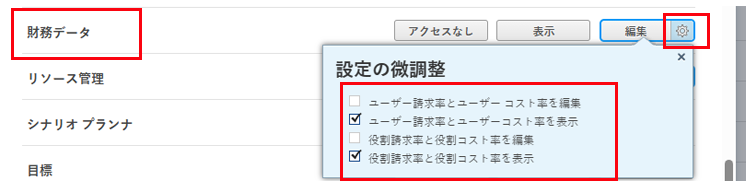

# 財務データへのアクセス権の付与

{{highlighted-preview}}

Adobe Workfront管理者は、ユーザーのアクセスレベルを使用して、次に対するユーザーのアクセスを定義できます。詳しくは、 [アクセスレベルの概要](../../../administration-and-setup/add-users/access-levels-and-object-permissions/access-levels-overview.md):

* Workfrontのプロジェクトに関する財務情報
* リソース計画ツールのリソース予算情報

## アクセス要件

この記事の手順を実行するには、次のアクセス権が必要です。

<table style="table-layout:auto"> 
 <col> 
 <col> 
 <tbody> 
  <tr> 
   <td role="rowheader">Adobe Workfrontプラン</td> 
   <td>任意</td> 
  </tr> 
  <tr> 
   <td role="rowheader">Adobe Workfrontライセンス</td> 
   <td>計画</td> 
  </tr> 
  <tr> 
   <td role="rowheader">アクセスレベル設定</td> 
   <td> 
Workfront管理者である。
 
<b>注意</b>:まだアクセス権がない場合は、Workfront管理者に、アクセスレベルに追加の制限を設定しているかどうかを問い合わせてください。 Workfront管理者がアクセスレベルを変更する方法について詳しくは、 <a href="../../../administration-and-setup/add-users/configure-and-grant-access/create-modify-access-levels.md" class="MCXref xref" data-mc-variable-override="">カスタムアクセスレベルの作成または変更</a>.
 </td> 
  </tr> 
 </tbody> 
</table>

## 財務データへのアクセスを許可する際の考慮事項

Workfrontの財務データへのアクセス権をユーザーに付与する場合は、次の点を考慮してください。

* アクセスレベルで財務データへのアクセスが許可されていないユーザーは、プロジェクトのリスクを生み出すことはできません。 詳しくは、 [プロジェクトのリスクの作成と編集](../../../manage-work/projects/define-a-business-case/create-edit-risks-on-projects.md).
* また、アクセスレベルを使用して、ユーザーが予算の割り当てやリソースの割り当ての表示に使用できるリソース管理アクティビティを決定することもできます。 詳しくは、 [リソース管理へのアクセス権の付与](../../../administration-and-setup/add-users/configure-and-grant-access/grant-access-resource-management.md).

## カスタムアクセスレベルを使用して財務データへのユーザーアクセスを設定する

1. アクセスレベルの作成または編集を開始します ( [カスタムアクセスレベルの作成または変更](../../../administration-and-setup/add-users/configure-and-grant-access/create-modify-access-levels.md).
1. 歯車アイコンをクリックします。  の **表示** または **編集** 「財務データ」の右にあるボタンをクリックし、次の中から付与する能力を選択します。 **設定を微調整する**.

   

1. （オプション） **次の管理アクセスを許可：** 「 」領域で、次のオプションを選択します。

   <table style="table-layout:auto"> 
    <col> 
    <col> 
    <tbody> 
     <tr> 
      <td role="rowheader">為替レート</td> 
      <td> 
Workfrontに新しい通貨を追加します。
 
このアクセス権がない場合、ユーザーは作成するプロジェクトに既存の通貨のみ追加できます。
 </td> 
     </tr> 
     <tr> 
      <td role="rowheader">費用</td> 
      <td> 
Workfrontのオブジェクトに関するすべての費用を表示します。
 
この場合、ユーザーは新しい費用タイプを作成できません。
 
このアクセス権がない場合、ユーザーは次の項目のみを表示できます。
 
       <ul> 
        <li>管理するプロジェクト、タスクまたは問題に関する費用</li> 
        <li>自費</li> 
        <li>部下の費用</li> 
       </ul> </td> 
     </tr> 
    </tbody> 
   </table>

1. （オプション）作業中のアクセスレベルの他のオブジェクトや領域のアクセス設定を構成するには、 [Adobe Workfrontへのアクセスの設定](../../../administration-and-setup/add-users/configure-and-grant-access/configure-access.md) 例： [タスクへのアクセス権の付与](../../../administration-and-setup/add-users/configure-and-grant-access/grant-access-tasks.md).
1. 完了したら、「 **保存**.

   アクセスレベルを作成したら、そのレベルをユーザーに割り当てることができます。 詳しくは、 [ユーザーのプロファイルの編集](../../../administration-and-setup/add-users/create-and-manage-users/edit-a-users-profile.md).

## 共有された財務情報へのアクセス

他のユーザーに権限を付与することで、プロジェクト、タスクまたはイシューに関する財務情報を他のユーザーと共有できます。詳しくは、 [オブジェクトに対する財務権限の共有](../../../workfront-basics/grant-and-request-access-to-objects/share-financial-permissions-object.md).

<!--
If you make changes here, make them also in the "Grant access to" articles where this snippet had to be converted to text:
* reports, dashboards, and calendars
* financial data
* issue
-->

別のユーザーとオブジェクトを共有する場合、そのオブジェクトに対する受信者の権限は次の 2 つの組み合わせによって決まります。

* オブジェクトの受信者に付与する権限
* オブジェクトのタイプに関する受信者のアクセスレベル設定

## ライセンスタイプ別の財務情報へのアクセス

各アクセスレベルのユーザーが財務情報に対して実行できる操作については、「 [財務データ](../../../administration-and-setup/add-users/access-levels-and-object-permissions/functionality-available-for-each-object-type.md#financia) 記事内 [各オブジェクトタイプで使用できる機能](../../../administration-and-setup/add-users/access-levels-and-object-permissions/functionality-available-for-each-object-type.md).

## 次の設定による財務情報へのアクセス

次の情報は、財務データに対するユーザーのアクセスを制御するアクセスレベル設定の使用方法を理解するのに役立ちます。

### アクセスなし

財務データへのアクセス権を持たないユーザーは、次の項目にアクセスできません。

* Project および Task オブジェクトの下の Finance セクション
* ビジネス事例
* 請求率および請求レコード
* レートカード
* ユーザーの環境設定での 1 時間あたりのコストと 1 時間あたりの請求

  歯車アイコンを使用して設定できます  上記の手順 4 の「表示」ボタンをクリックします。

* ジョブロールに関する 1 時間あたりのコストと 1 時間あたりの請求

  歯車アイコンを使用して設定できます  上記の手順 4 の「表示」ボタンをクリックします。

### アクセスを表示

財務データへの表示アクセス権を持つユーザーは、次の項目を表示（編集は不可）できます。

* Project および Task オブジェクトの下の Finance セクション
* ビジネス事例
* 請求率および請求レコード
* ユーザーの環境設定での 1 時間あたりのコストと 1 時間あたりの請求

  歯車アイコンを使用して設定できます  上記の手順 4 の「表示」ボタンをクリックします。

* ジョブロールに関する 1 時間あたりのコストと 1 時間あたりの請求

  歯車アイコンを使用して設定できます  上記の手順 4 の「表示」ボタンをクリックします。

### アクセスを編集

財務データに対する編集アクセス権を持つユーザーは、次の項目を表示および編集できます。

* Project および Task オブジェクトの下の Finance セクション
* ビジネス事例
* 請求率および請求レコード
* レートカード
* ユーザーの環境設定での 1 時間あたりのコストと 1 時間あたりの請求

  歯車アイコンを使用して設定できます  上記の手順 4 の「編集」ボタンをクリックします。

* ジョブロールに関する 1 時間あたりのコストと 1 時間あたりの請求

  歯車アイコンを使用して設定できます  上記の手順 4 の「編集」ボタンをクリックします。
