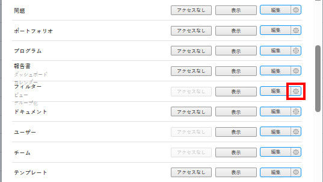

# フィルター、ビュー、グループ化に対するアクセス権を付与

[アクセスレベルの概要](../../../administration-and-setup/add-users/access-levels-and-object-permissions/access-levels-overview.md)の説明に従って、Adobe Workfront 管理者は、アクセスレベルを使用して、リストおよびレポートのフィルター、ビュー、グループ化コントロールに対するユーザーのアクセス権を定義できます。

フィルター、ビュー、グループ化コントロールについて詳しくは、[レポート要素：フィルター、ビューおよびグループ化](../../../reports-and-dashboards/reports/reporting-elements/reporting-elements-filters-views-groupings.md)を参照してください。

## アクセス要件

この記事の手順を実行するには、次のアクセス権が必要です。

<table style="table-layout:auto"> 
 <col> 
 <col> 
 <tbody> 
  <tr> 
   <td role="rowheader">Adobe Workfront プラン</td> 
   <td>任意</td> 
  </tr> 
  <tr> 
   <td role="rowheader">Adobe Workfront ライセンス</td> 
   <td>プラン</td> 
  </tr> 
  <tr> 
   <td role="rowheader">アクセスレベル設定</td> 
   <td> 
Workfront 管理者である必要があります。
 
<b>メモ</b>：まだアクセス権がない場合は、アクセスレベルに追加の制限が設定されていないかどうか Workfront 管理者にお問い合わせください。Workfront 管理者がアクセスレベルを変更する方法について詳しくは、<a href="../../../administration-and-setup/add-users/configure-and-grant-access/create-modify-access-levels.md" class="MCXref xref" data-mc-variable-override="">カスタムアクセスレベルの作成または変更</a>を参照してください。
 </td> 
  </tr> 
 </tbody> 
</table>

## カスタムアクセスレベルを使用して、フィルター、ビュー、グループ化に対するユーザーアクセスを設定

1. [カスタムアクセスレベルの作成または変更](../../../administration-and-setup/add-users/configure-and-grant-access/create-modify-access-levels.md)の説明に従って、アクセスレベルの作成または編集を開始します。
1. 「フィルター」の右にある「**表示**」ボタンまたは「**編集**」ボタン上の歯車アイコン  をクリックし、付与する機能を「**設定を微調整**」の下で選択します。

   

   デフォルトでは、計画、作業、レビュアーやリクエストのライセンスを持つユーザーは、完全な表示および編集の機能を持ちます。外部ユーザーライセンスを持つユーザーは、フィルター、ビュー、グループ化にアクセスできません。

   <!--If this changes, undraft section with table below
   -->

1. （オプション）作業中のアクセスレベルの他のオブジェクトやエリアのアクセス設定を指定するには、[Adobe Workfront へのアクセスを設定](../../../administration-and-setup/add-users/configure-and-grant-access/configure-access.md)にある記事のうちの 1 つ（[タスクへのアクセス権を付与](../../../administration-and-setup/add-users/configure-and-grant-access/grant-access-tasks.md)、[財務データへのアクセス権を付与](../../../administration-and-setup/add-users/configure-and-grant-access/grant-access-financial.md)など）に従って、作業を続けます。
1. 完了したら「**保存**」をクリックします。

   作成したアクセスレベルは、ユーザーに割り当てることができます。詳しくは、[ユーザープロファイルを編集](../../../administration-and-setup/add-users/create-and-manage-users/edit-a-users-profile.md)を参照してください。

<!--## Access to filters, views, and groupings by license type

Drafting out this section for now because the table is redundant since all four license types can do everything.-->

この表は、Workfront 管理者がそれぞれのライセンスタイプを持つユーザーに許可できるフィルター、ビュー、グループ化の内容を示しています。Workfront ライセンスタイプについて詳しくは、[Adobe Workfront のライセンスの概要](../../../administration-and-setup/add-users/access-levels-and-object-permissions/wf-licenses.md)を参照してください。

<table style="table-layout:auto">
<col>
<col>
<col>
<col>
<col>
<thead>
<tr>
<th> アクション </th>
<th> プランナー </th>
<th> 作業者 </th>
<th> レビュアー </th>
<th> リクエスター </th>
</tr>
</thead>
<tbody>
<tr>
<td>フィルター、ビュー、グループ化を編集</td>
<td>✓</td>
<td>✓</td>
<td>✓</td>
<td>✓</td>
</tr>
<tr>
<td>フィルター、ビュー、グループ化を作成</td>
<td>✓</td>
<td>✓</td>
<td>✓</td>
<td>✓</td>
</tr>
<tr>
<td>フィルター、ビュー、グループ化を表示</td>
<td>✓</td>
<td>✓</td>
<td>✓</td>
<td>✓</td>
</tr>
<tr>
<td>フィルター、ビュー、グループ化の削除</td>
<td>✓</td>
<td>✓</td>
<td>✓</td>
<td>✓</td>
</tr>
<tr>
<td>フィルター、ビュー、グループ化を共有</td>
<td>✓</td>
<td>✓</td>
<td>✓</td>
<td>✓</td>
</tr>
<tr>
<td>システム全体でフィルター、ビュー、グループ化を共有</td>
<td>✓</td>
<td>✓</td>
<td>✓</td>
<td>✓</td>
</tr>
</tbody>
</table>
