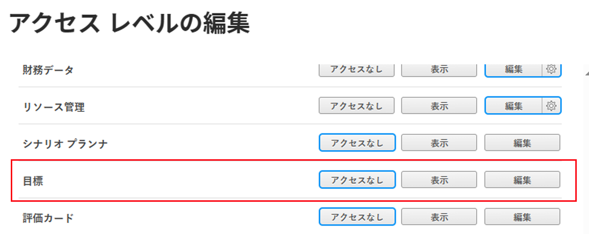

# Adobe Workfront目標へのアクセス権の付与

Adobe Workfront管理者は、アクセスレベルを使用して、Adobe Workfront Goals へのユーザーのアクセスを定義できます。詳しくは、 [アクセスレベルの概要](../../../administration-and-setup/add-users/access-levels-and-object-permissions/access-levels-overview.md).

## アクセス要件

ユーザーにWorkfront目標へのアクセス権を付与するには、以下が必要です。

<table style="table-layout:auto"> 
 <col> 
 <col> 
 <tbody> 
  <tr> 
   <td role="rowheader">Workfrontプラン</td> 
   <td> 
Pro 以上
 </td> 
  </tr> 
  <tr> 
   <td role="rowheader">Adobe Workfront license*</td> 
   <td>計画</td> 
  </tr> 
  <tr> 
   <td role="rowheader">製品</td> 
   <td>Workfront Goals 
Workfront Goals ライセンスについて詳しくは、Workfrontのアカウントマネージャーにお問い合わせください。 
 
Workfront目標は、新しいAdobe Workfrontエクスペリエンスでのみ使用できます。
 </td> 
  </tr> 
  <tr> 
   <td role="rowheader">アクセスレベル設定*</td> 
   <td> 
システム管理者のアクセスレベルが必要です。
 
<b>注意</b>:まだアクセス権がない場合は、Workfront管理者に、アクセスレベルに追加の制限を設定しているかどうかを問い合わせてください。 Workfront管理者がアクセスレベルを変更する方法について詳しくは、 <a href="../../../administration-and-setup/add-users/configure-and-grant-access/create-modify-access-levels.md" class="MCXref xref" data-mc-variable-override="">カスタムアクセスレベルの作成または変更</a>.
 </td> 
  </tr> 
 </tbody> 
</table>

&#42;保有しているプラン、ライセンスの種類、アクセスレベルを確認するには、Workfront管理者に問い合わせてください。

Workfront Goals へのアクセスについて詳しくは、 [Workfront目標の使用要件](../../../workfront-goals/goal-management/access-needed-for-wf-goals.md).

## カスタムアクセスレベルを使用したWorkfront Goals へのユーザーアクセス権の付与

1. アクセスレベルの作成または編集を開始します ( [カスタムアクセスレベルの作成または変更](../../../administration-and-setup/add-users/configure-and-grant-access/create-modify-access-levels.md).
1. 右側のオプションをクリックします。 **目標** をこのアクセスレベルに使用します。

   

   >[!NOTE]
   >
   >「外部」ライセンスタイプでは、Workfront目標の表示または編集アクセスは許可されていません。

1. （オプション）作業中のアクセスレベルの他のオブジェクトや領域のアクセス設定を構成するには、 [Adobe Workfrontへのアクセスの設定](../../../administration-and-setup/add-users/configure-and-grant-access/configure-access.md)例： [タスクへのアクセス権の付与](../../../administration-and-setup/add-users/configure-and-grant-access/grant-access-tasks.md) および [財務データへのアクセス権の付与](../../../administration-and-setup/add-users/configure-and-grant-access/grant-access-financial.md).
1. 完了したら、「 **保存**.

## ライセンスタイプ別のWorkfront目標へのアクセス

Workfront管理者は、アクセスレベルを使用して、プラン、作業、リクエスト、レビューのライセンスを持つユーザーにWorkfront目標へのアクセスを許可できます。
