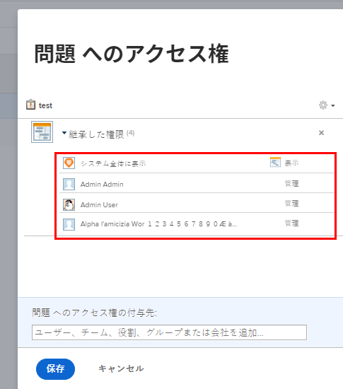

# 問題へのアクセス権の付与

Adobe Workfront管理者は、アクセスレベルを使用して問題に対するユーザーのアクセスを定義できます。詳しくは、 [アクセスレベルの概要](../../../administration-and-setup/add-users/access-levels-and-object-permissions/access-levels-overview.md).

カスタムアクセスレベルを使用して、Workfrontの他のオブジェクトタイプへのユーザーのアクセスを管理する方法について詳しくは、 [カスタムアクセスレベルの作成または変更](../../../administration-and-setup/add-users/configure-and-grant-access/create-modify-access-levels.md).

## アクセス要件

この記事の手順を実行するには、次のアクセス権が必要です。

<table style="table-layout:auto"> 
 <col> 
 <col> 
 <tbody> 
  <tr> 
   <td role="rowheader">Adobe Workfrontプラン</td> 
   <td>任意</td> 
  </tr> 
  <tr> 
   <td role="rowheader">Adobe Workfrontライセンス</td> 
   <td>計画</td> 
  </tr> 
  <tr> 
   <td role="rowheader">アクセスレベル設定</td> 
   <td> 
Workfront管理者である。
 
<b>注意</b>:まだアクセス権がない場合は、Workfront管理者に、アクセスレベルに追加の制限を設定しているかどうかを問い合わせてください。 Workfront管理者がアクセスレベルを変更する方法について詳しくは、 <a href="../../../administration-and-setup/add-users/configure-and-grant-access/create-modify-access-levels.md" class="MCXref xref" data-mc-variable-override="">カスタムアクセスレベルの作成または変更</a>.
 </td> 
  </tr> 
 </tbody> 
</table>

## カスタムアクセスレベルを使用して問題に対するユーザーアクセスを許可する

1. アクセスレベルの作成または編集を開始します ( [カスタムアクセスレベルの作成または変更](../../../administration-and-setup/add-users/configure-and-grant-access/create-modify-access-levels.md).
1. 歯車アイコンをクリックします。  の **表示** または **編集** 「問題」の右側のボタンをクリックし、 **設定を微調整する**.

1. （オプション）上位のオブジェクトの問題に対して継承された権限を制限するには、 **追加の制限の設定**&#x200B;を選択し、「 **ドキュメントのアクセス権をプロジェクト、タスク、問題などから継承しない**.

1. （オプション）作業中のアクセスレベルの他のオブジェクトや領域のアクセス設定を構成するには、 [Adobe Workfrontへのアクセスの設定](../../../administration-and-setup/add-users/configure-and-grant-access/configure-access.md)例： [タスクへのアクセス権の付与](../../../administration-and-setup/add-users/configure-and-grant-access/grant-access-tasks.md) および [財務データへのアクセス権の付与](../../../administration-and-setup/add-users/configure-and-grant-access/grant-access-financial.md).
1. 完了したら、「 **保存**.

   アクセスレベルを作成したら、そのレベルをユーザーに割り当てることができます。 詳しくは、 [ユーザーのプロファイルの編集](../../../administration-and-setup/add-users/create-and-manage-users/edit-a-users-profile.md).

## ライセンスタイプ別の問題へのアクセス

各アクセスレベルのユーザーが問題に対してどのような処理を行うかについては、「 [問題](../../../administration-and-setup/add-users/access-levels-and-object-permissions/functionality-available-for-each-object-type.md#issues) 記事内 [各オブジェクトタイプで使用できる機能](../../../administration-and-setup/add-users/access-levels-and-object-permissions/functionality-available-for-each-object-type.md).

## 共有された問題へのアクセス

イシューの所有者または作成者として、イシューに対する権限を付与することで、他のユーザーと共有できます。詳しくは、 [イシューの共有](../../../workfront-basics/grant-and-request-access-to-objects/share-an-issue.md).

<!--

If you make changes here, make them also in the "Grant access to" articles where this snippet had to be converted to text:

* reports, dashboards, and calendars

* financial data

* issue

-->

別のユーザーとオブジェクトを共有する場合、そのオブジェクトに対する受信者の権限は次の 2 つの組み合わせによって決まります。

* オブジェクトの受信者に付与する権限
* オブジェクトのタイプに関する受信者のアクセスレベル設定

また、アクセスレベルで許可されている場合は、ユーザーはオブジェクト階層を通じて問題にアクセスできます。ユーザーが既にイシューの親プロジェクトまたはタスクに対する権限を持っている場合は、イシューに対する権限も持っています（前述の手順 3 を参照）。 イシューを共有すると、そのイシューに対する権限を継承したユーザーのリストが表示されます。

