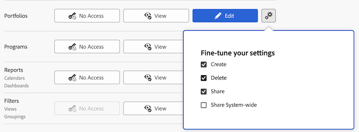

# ポートフォリオへのアクセス権の付与

Adobe Workfront 管理者は、[アクセスレベルの概要](../../../administration-and-setup/add-users/access-levels-and-object-permissions/access-levels-overview.md)で説明されているように、アクセスレベルを使用してユーザーのポートフォリオへのアクセス権を定義できます。

## アクセス要件

+++ 展開すると、この記事の機能のアクセス要件が表示されます。

<table style="table-layout:auto"> 
 <col> 
 <col> 
 <tbody> 
  <tr> 
   <td role="rowheader">Adobe Workfront プラン</td> 
   <td>任意</td> 
  </tr> 
  <tr> 
   <td role="rowheader">Adobe Workfront プラン</td> 
   <td>
標準

   
プラン
</td> 
  </tr> 
  <tr> 
   <td role="rowheader">アクセスレベル設定</td> 
   <td> 
Workfront 管理者である必要があります。
 </td> 
  </tr> 
 </tbody> 
</table>

この表の情報について詳しくは、[Workfront ドキュメントのアクセス要件](/help/quicksilver/administration-and-setup/add-users/access-levels-and-object-permissions/access-level-requirements-in-documentation.md)を参照してください。

+++

## カスタムアクセスレベルを使用してポートフォリオへのユーザーのアクセス権を設定

1. アクセスレベルの作成または編集を行います。詳しくは、[カスタムアクセスレベルの作成または変更](../../../administration-and-setup/add-users/configure-and-grant-access/create-modify-access-levels.md)を参照してください。
1. ポートフォリオの右側にある「**表示**」ボタンまたは「**編集**」ボタンの歯車アイコン  をクリックし、**設定の微調整**&#x200B;で許可する機能を選択します。

   

   >[!NOTE]
   >
   >特定の種類のオブジェクトに対してアクセスレベルの設定を行う場合、その設定は、低いランクのオブジェクトに対するユーザーのアクセスには影響しません。 例えば、ユーザーがアクセスレベルでポートフォリオを削除することを制限できますが、これは、ポートフォリオよりもランクの低いプロジェクトの削除をユーザーに制限するものではありません。オブジェクトの階層について詳しくは、[Adobe Workfrontでのオブジェクトの理解](../../../workfront-basics/navigate-workfront/workfront-navigation/understand-objects.md)の「[&#x200B; オブジェクトの相互依存関係と階層](../../../workfront-basics/navigate-workfront/workfront-navigation/understand-objects.md#understanding-interdependency-and-hierarchy-of-objects)」の節を参照してください。

1. （オプション）作業中のアクセスレベルで他のオブジェクトや他の領域のアクセス権を設定するには、[Adobe Workfront に対するアクセス権の設定](../../../administration-and-setup/add-users/configure-and-grant-access/configure-access.md)のリストに記載されている、[タスクへのアクセスの許可](../../../administration-and-setup/add-users/configure-and-grant-access/grant-access-tasks.md)や[財務データへのアクセスの許可](../../../administration-and-setup/add-users/configure-and-grant-access/grant-access-financial.md)などの記事を参照してください。
1. 完了したら「**保存**」をクリックします。

   作成したアクセスレベルは、ユーザーに割り当てることができます。 詳しくは、[ユーザープロファイルの編集](../../../administration-and-setup/add-users/create-and-manage-users/edit-a-users-profile.md)を参照してください。

## ライセンスタイプ別のポートフォリオへのアクセス権

それぞれのアクセスレベルのユーザーがポートフォリオで利用できる機能については、[各オブジェクトタイプで使用できる機能](../../../administration-and-setup/add-users/access-levels-and-object-permissions/functionality-available-for-each-object-type.md)の[ポートフォリオ](../../../administration-and-setup/add-users/access-levels-and-object-permissions/functionality-available-for-each-object-type.md#portfoli)の節を参照してください。

## 共有ポートフォリオへのアクセス権

ポートフォリオの所有者または作成者は、[ポートフォリオの共有](../../../workfront-basics/grant-and-request-access-to-objects/share-a-portfolio.md)で説明されているように、ポートフォリオに対するアクセス権を他のユーザーに付与することで、そのポートフォリオを他のユーザーと共有できます。

<!--

If you make changes here, make them also in the "Grant access to" articles where this snippet had to be converted to text:

* reports, dashboards, and calendars

* financial data

* issue

-->

別のユーザーとオブジェクトを共有する場合、そのオブジェクトに対する受信者の権限は次の 2 つ項目の組み合わせによって決まります。

* オブジェクトについて受信者に付与する権限
* オブジェクトのタイプについての受信者のアクセスレベル設定

ポートフォリオを共有する際にユーザーがポートフォリオに対して付与できる権限について詳しくは、[ポートフォリオの共有](../../../workfront-basics/grant-and-request-access-to-objects/share-a-portfolio.md)を参照してください。
