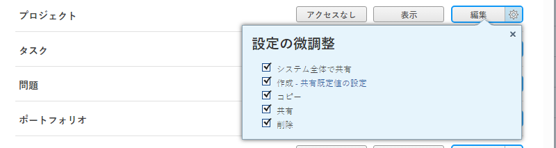
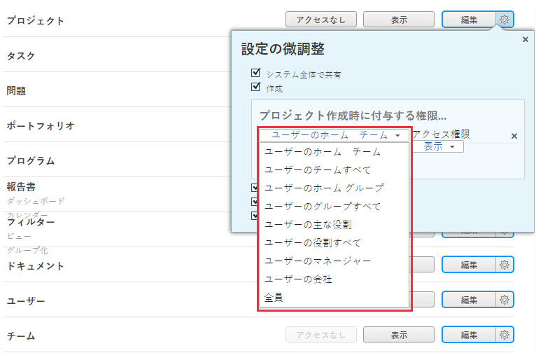
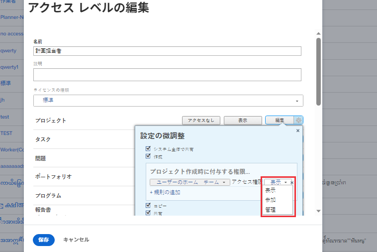

# プロジェクトへのアクセスを許可

<!-- Audited: 12/2023 -->

Adobe Workfront管理者は、次の記事で説明するように、アクセスレベルを使用して、ユーザーのプロジェクトへのアクセスを定義できます。
* [アクセスレベルの概要](../../../administration-and-setup/add-users/access-levels-and-object-permissions/access-levels-overview.md)
* [新規アクセスレベルの概要](/help/quicksilver/administration-and-setup/add-users/how-access-levels-work/access-level-overview.md)

カスタムアクセスレベルを使用して、Workfront の他のオブジェクトタイプへのユーザーのアクセスを管理する方法について詳しくは、[カスタムアクセスレベルの作成または変更](../../../administration-and-setup/add-users/configure-and-grant-access/create-modify-access-levels.md)を参照してください。

## アクセス要件

この記事の手順を実行するには、次のアクセス権が必要です。

<table style="table-layout:auto"> 
 <col> 
 <col> 
 <tbody> 
  <tr> 
   <td role="rowheader">Adobe Workfront プラン</td> 
   <td>任意</td> 
  </tr> 
    <tr> 
   <td role="rowheader">Adobe Workfront ライセンス</td> 
   <td> 
新規：標準 

 
または
 

現在：プラン 
 
</td> 
  </tr>

<tr> 
   <td role="rowheader">アクセスレベル設定</td> 
   <td> 
Workfront 管理者である必要があります。
 </td> 
  </tr> 
 </tbody> 
</table>

この表の情報の詳細については、 [Workfrontドキュメントのアクセス要件](/help/quicksilver/administration-and-setup/add-users/access-levels-and-object-permissions/access-level-requirements-in-documentation.md).

## カスタムアクセスレベルを使用してプロジェクトへのユーザーのアクセス権を設定

1. [カスタムアクセスレベルの作成または変更](../../../administration-and-setup/add-users/configure-and-grant-access/create-modify-access-levels.md)の説明に従って、アクセスレベルの作成または編集を開始します。
1. プロジェクトの右側にある「**表示**」ボタンまたは「**編集**」ボタンの歯車アイコン  をクリックし、**設定の微調整**&#x200B;で許可する機能を選択します。

   

   >[!NOTE]
   >
   >* 作業ライセンスを持つユーザーは、限られたプロジェクト権限を持ちます。プロジェクトに参加することはできますが、管理はできません。
   >* レビューライセンスを持つユーザーは、変換されたイシューからのプロジェクトに対する表示権限を持ちますが、その表示権限は制限されています。
   >* ユーザーが他のユーザーとプロジェクトを共有する際に付与できる権限について詳しくは、[Adobe Workfront でのプロジェクトの共有](../../../workfront-basics/grant-and-request-access-to-objects/share-a-project.md)を参照してください。
   >* 特定の種類のオブジェクトに対してアクセスレベルの設定を行う場合、その設定は、低いランクのオブジェクトに対するユーザーのアクセスには影響しません。例えば、ユーザーのアクセスレベルでユーザーによるプロジェクトの削除を制限できますが、プロジェクトよりも下位にあるタスクの削除は制限されません。オブジェクトの階層について詳しくは、[Adobe Workfront のオブジェクトについて](../../../workfront-basics/navigate-workfront/workfront-navigation/understand-objects.md)の記事にある[オブジェクトの相互依存性と階層](../../../workfront-basics/navigate-workfront/workfront-navigation/understand-objects.md#understanding-interdependency-and-hierarchy-of-objects)の節を参照してください。

1. （オプション）「作成」オプションの右側にある&#x200B;**共有のデフォルトを設定**&#x200B;をクリックし、続いて&#x200B;**ルールを追加**&#x200B;をクリックして、新しいプロジェクト用の共有ルールを追加します。

   このアクセスレベルのユーザーがプロジェクトを作成すると、プロジェクトが左側のメニューで選択したユーザーと自動的に共有されます。

   

   右側のメニューで、プロジェクトをこれらのユーザーと共有する方法を指定します。

   

   >[!NOTE]
   >
   >このアクセスレベルのユーザーがプロジェクトアクセステンプレートを使用している場合、テンプレートはアクセスレベルの共有設定を上書きします。プロジェクトアクセステンプレートについて詳しくは、[Adobe Workfront でのプロジェクトの共有](../../../workfront-basics/grant-and-request-access-to-objects/share-a-project.md)を参照してください。

   この手順を繰り返すことにより、アクセスレベルに必要な数のプロジェクト共有ルールを追加できます。

1. X をクリックして、**設定を微調整**&#x200B;ボックスを閉じます。
1. （オプション）作業中のアクセスレベルで他のオブジェクトや他の領域のアクセス権を設定するには、[Adobe Workfront に対するアクセス権の設定](../../../administration-and-setup/add-users/configure-and-grant-access/configure-access.md)のリストに記載されている、[タスクへのアクセスの許可](../../../administration-and-setup/add-users/configure-and-grant-access/grant-access-tasks.md)や[財務データへのアクセスの許可](../../../administration-and-setup/add-users/configure-and-grant-access/grant-access-financial.md)などの記事を参照してください。
1. 完了したら「**保存**」をクリックします。

   作成したアクセスレベルは、ユーザーに割り当てることができます。詳しくは、[ユーザーのプロファイルの編集](../../../administration-and-setup/add-users/create-and-manage-users/edit-a-users-profile.md)を参照してください。

## ライセンスタイプ別のレポート、ダッシュボード、カレンダーへのアクセス

各アクセスレベルのユーザーがイシューに対して実行できる内容については、[各オブジェクトタイプで利用可能な機能](../../../administration-and-setup/add-users/access-levels-and-object-permissions/functionality-available-for-each-object-type.md)の記事の[プロジェクト](../../../administration-and-setup/add-users/access-levels-and-object-permissions/functionality-available-for-each-object-type.md#projects)の節を参照してください。

## 共有プロジェクトへのアクセス権

イシューの所有者または作成者として、[Adobe Workfront でのプロジェクトの共有](../../../workfront-basics/grant-and-request-access-to-objects/share-a-project.md)の説明に従って、イシューに対する権限を付与することで、他のユーザーとイシューを共有できます。

<!--
If you make changes here, make them also in the "Grant access to" articles where this snippet had to be converted to text:
* reports, dashboards, and calendars
* financial data
* issue
-->

別のユーザーとオブジェクトを共有する場合、そのオブジェクトに対する受信者の権限は次の 2 つ項目の組み合わせによって決まります。

* オブジェクトについて受信者に付与する権限
* オブジェクトのタイプについての受信者のアクセスレベル設定
