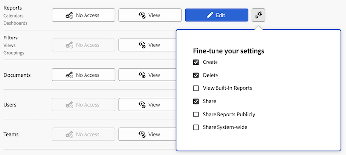

# レポート、ダッシュボード、カレンダーへのアクセス権の付与

Adobe Workfront管理者は、アクセスレベルを使用して、レポート、ダッシュボードおよびカレンダーに対するユーザーのアクセスを定義できます。詳しくは、 [アクセスレベルの概要](../../../administration-and-setup/add-users/access-levels-and-object-permissions/access-levels-overview.md).

このアクセスには、外部ページへのアクセスも含まれます。 外部ページについて詳しくは、 [財務データへのアクセス権の付与](../../../administration-and-setup/add-users/configure-and-grant-access/grant-access-financial.md).

>[!NOTE]
>
>* レポート、ダッシュボードおよびカレンダーへのアクセス権をユーザーに付与する場合は、そのユーザーにフィルター、表示およびグループへのアクセス権も付与する必要があります。 手順については、 [フィルター、ビューおよびグループに対するアクセス権の付与](../../../administration-and-setup/add-users/configure-and-grant-access/grant-access-fvg.md).
>* 誰かが別のユーザーとレポート、ダッシュボードまたはカレンダーを共有した場合、そのユーザーに対する受信者の権限は次の 2 つの組み合わせによって決まります。レポート、ダッシュボードおよびカレンダーに関する受信者のアクセスレベル設定 _および_ 共有者がレポート、ダッシュボードまたはカレンダーに対して付与した権限
>
>共有時にレポート、ダッシュボード、カレンダーに付与できる権限について詳しくは、 [レポート、ダッシュボード、カレンダーの共有](../../../workfront-basics/grant-and-request-access-to-objects/permissions-reports-dashboards-calendars.md).

## アクセス要件

この記事の手順を実行するには、次のアクセス権が必要です。

<table style="table-layout:auto"> 
 <col> 
 <col> 
 <tbody> 
  <tr> 
   <td role="rowheader">Adobe Workfrontプラン</td> 
   <td>任意</td> 
  </tr> 
  <tr> 
   <td role="rowheader">Adobe Workfrontライセンス</td> 
   <td>計画</td> 
  </tr> 
  <tr> 
   <td role="rowheader">アクセスレベル設定</td> 
   <td> 
Workfront管理者である。
 
<b>注意</b>:まだアクセス権がない場合は、Workfront管理者に、アクセスレベルに追加の制限を設定しているかどうかを問い合わせてください。 Workfront管理者がアクセスレベルを変更する方法について詳しくは、 <a href="../../../administration-and-setup/add-users/configure-and-grant-access/create-modify-access-levels.md" class="MCXref xref" data-mc-variable-override="">カスタムアクセスレベルの作成または変更</a>.
 </td> 
  </tr> 
 </tbody> 
</table>

## カスタムのアクセスレベルを使用して、レポート、ダッシュボード、およびカレンダーへのユーザーアクセスを設定する

1. アクセスレベルの作成または編集を開始します ( [カスタムアクセスレベルの作成または変更](../../../administration-and-setup/add-users/configure-and-grant-access/create-modify-access-levels.md).
1. 歯車アイコンをクリックします。  の **表示** または **編集** 」ボタンをクリックし、「 **設定を微調整する**.

   

   次のオプションは、デフォルトで有効になっています。

   * **作成**
   * **削除**
   * **組み込みレポートの表示**:Workfrontが作成したレポートを表示するには、このオプションを選択する必要があります。
   * **共有**
   * **レポートを公開する**:レポートへの公開リンクをWorkfrontアカウントを持たないユーザーと共有することで、レポートを公開できます。 このレベルの共有を許可するには、このオプションを選択する必要があります。
   * **システム全体で共有**:レポートは、Workfrontライセンスを持つシステム内のすべてのユーザーと共有できます。 このレベルの共有を許可するには、このオプションを選択する必要があります。

      レポート、ダッシュボード、カレンダーの共有について詳しくは、 [レポート、ダッシュボード、カレンダーの共有](../../../workfront-basics/grant-and-request-access-to-objects/permissions-reports-dashboards-calendars.md).

1. （オプション）作業中のアクセスレベルの他のオブジェクトや領域のアクセス設定を構成するには、 [Adobe Workfrontへのアクセスの設定](../../../administration-and-setup/add-users/configure-and-grant-access/configure-access.md)例： [タスクへのアクセス権の付与](../../../administration-and-setup/add-users/configure-and-grant-access/grant-access-tasks.md) および [財務データへのアクセス権の付与](../../../administration-and-setup/add-users/configure-and-grant-access/grant-access-financial.md).
1. 完了したら、「 **保存**.

   アクセスレベルを作成したら、そのレベルをユーザーに割り当てることができます。 詳しくは、 [ユーザーのプロファイルの編集](../../../administration-and-setup/add-users/create-and-manage-users/edit-a-users-profile.md).

## ライセンスタイプ別のレポート、ダッシュボード、カレンダーへのアクセス

各アクセスレベルのユーザーが問題に対してどのような処理を行うかについては、「 [レポート](../../../administration-and-setup/add-users/access-levels-and-object-permissions/functionality-available-for-each-object-type.md#reports) 記事内 [各オブジェクトタイプで使用できる機能](../../../administration-and-setup/add-users/access-levels-and-object-permissions/functionality-available-for-each-object-type.md).

## 共有レポート、ダッシュボード、カレンダーへのアクセス

レポート、ダッシュボード、カレンダーの所有者または作成者として、他のユーザーに権限を付与することで、レポート、ダッシュボードまたはカレンダーを他のユーザーと共有できます。詳しくは、 [レポート、ダッシュボード、カレンダーの共有](../../../workfront-basics/grant-and-request-access-to-objects/permissions-reports-dashboards-calendars.md).

<!--

If you make changes here, make them also in the "Grant access to" articles where this snippet had to be converted to text:

* reports, dashboards, and calendars

* financial data

* issue

-->

別のユーザーとオブジェクトを共有する場合、そのオブジェクトに対する受信者の権限は次の 2 つの組み合わせによって決まります。

* オブジェクトの受信者に付与する権限
* オブジェクトのタイプに関する受信者のアクセスレベル設定
