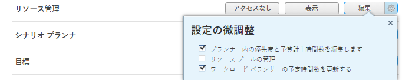

# リソース管理に対するアクセスの許可

Adobe Workfront 管理者は、アクセスレベルを使用して、リソース管理に対するユーザーのアクセスを定義できます。詳しくは、[アクセスレベルの概要](../../../administration-and-setup/add-users/access-levels-and-object-permissions/access-levels-overview.md)を参照してください。

## アクセス要件

この記事の手順を実行するには、次のアクセス権が必要です。

<table style="table-layout:auto"> 
 <col> 
 <col> 
 <tbody> 
  <tr> 
   <td role="rowheader">Adobe Workfront プラン</td> 
   <td>任意</td> 
  </tr> 
  <tr> 
   <td role="rowheader">Adobe Workfront ライセンス</td> 
   <td>プラン</td> 
  </tr> 
  <tr> 
   <td role="rowheader">アクセスレベル設定</td> 
   <td> 
Workfront 管理者である必要があります。
 
<b>メモ</b>：まだアクセス権がない場合は、Workfront 管理者に問い合わせて、アクセスレベルに追加の制限が設定されているかどうかを確認してください。Workfront 管理者がアクセスレベルを変更する方法について詳しくは、<a href="../../../administration-and-setup/add-users/configure-and-grant-access/create-modify-access-levels.md" class="MCXref xref" data-mc-variable-override="">カスタムアクセスレベルの作成または変更</a>を参照してください。
 </td> 
  </tr> 
 </tbody> 
</table>

## カスタムアクセスレベルを使用した、リソース管理ツールへのユーザーアクセス権の設定

1. アクセスレベルの作成または編集を行います。詳しくは、[カスタムアクセスレベルの作成または変更](../../../administration-and-setup/add-users/configure-and-grant-access/create-modify-access-levels.md)を参照してください。
1. リソース管理の右側にある&#x200B;**表示**&#x200B;ボタンまたは&#x200B;**編集**&#x200B;ボタンの歯車アイコン  をクリックし、付与する権限を「**設定の微調整**」で選択します。

   

   <table style="table-layout:auto"> 
    <col> 
    <col> 
    <tbody> 
     <tr> 
      <td role="rowheader">プランナー内の優先度と予算計上時間数を編集します</td> 
      <td> 
このライセンスを持つユーザーに対し、次の操作を許可します。
 
リソースプランナーでプロジェクトに優先順位を付けます。
 
リソース計画ツール（リソースプランナーおよびプロジェクトのビジネスケースのリソース予算計上セクション）でのリソースに対する予算配分。
 
このオプションは、デフォルトで有効になっています。
 </td> 
     </tr> 
     <tr> 
      <td role="rowheader">リソースプールの管理</td> 
      <td> 
このライセンスを持つユーザーが、リソースプールを作成、編集、削除できます。このオプションはデフォルトでは無効になっています。
 </td> 
     </tr> 
     <tr data-mc-conditions=""> 
      <td role="rowheader">ワークロード バランサーの予定時間数を更新する </td> 
      <td> 
このライセンスを持つユーザーが、ワークロードバランサーでユーザー割り当てを更新する際に、作業アイテムの予定時間数を更新することを許可します。割り当て時間数の合計は、作業アイテムの予定時間数になります。
 
このオプションはデフォルトでは無効になっています。
 
 詳しくは、<a href="../../../resource-mgmt/workload-balancer/manage-user-allocations-workload-balancer.md" class="MCXref xref">ワークロードバランサーでのユーザー割り当ての管理</a>を参照してください。
 </td> 
     </tr> 
    </tbody> 
   </table>

1. （オプション）作業中のアクセスレベルで他のオブジェクトや他の領域のアクセス権を設定するには、[Adobe Workfront に対するアクセス権の設定](../../../administration-and-setup/add-users/configure-and-grant-access/configure-access.md)のリストに記載されている、[タスクへのアクセスの許可](../../../administration-and-setup/add-users/configure-and-grant-access/grant-access-tasks.md)や[財務データへのアクセスの許可](../../../administration-and-setup/add-users/configure-and-grant-access/grant-access-financial.md)などの記事を参照してください。
1. 完了したら「**保存**」をクリックします。

   作成したアクセスレベルは、ユーザーに割り当てることができます。詳しくは、[ユーザープロファイルの編集](../../../administration-and-setup/add-users/create-and-manage-users/edit-a-users-profile.md)を参照してください。

## ライセンスタイプ別のリソース管理へのアクセス

各アクセスレベルのユーザーがリソース管理で実行できる操作について詳しくは、[各オブジェクトタイプで使用できる機能](../../../administration-and-setup/add-users/access-levels-and-object-permissions/functionality-available-for-each-object-type.md)の記事の[リソース管理](../../../administration-and-setup/add-users/access-levels-and-object-permissions/functionality-available-for-each-object-type.md#resource)の節を参照してください。

## 共有されたイシューへアクセス

<!--
If you make changes here, make them also in the "Grant access to" articles where this snippet had to be converted to text:
* reports, dashboards, and calendars
* financial data
* issue
-->

他のユーザーとオブジェクトを共有する場合、共有されたユーザーがそのオブジェクトのリソース配分を予算計上したり表示したりできる権限は、次の 3 つの組み合わせによって決まります。

* 共有されたユーザーの、リソース管理に関するアクセスレベル設定
* 共有されたユーザーの、財務データへのアクセス権。詳しくは、[財務データへのアクセスの許可](../../../administration-and-setup/add-users/configure-and-grant-access/grant-access-financial.md)を参照してください。
* 共有を行ったユーザーがオブジェクトに付与した、財務データに対する権限

ユーザーがオブジェクトの共有を行う際に、オブジェクトの財務データに付与できる権限について詳しくは、[オブジェクトに対する財務権限の共有](../../../workfront-basics/grant-and-request-access-to-objects/share-financial-permissions-object.md)を参照してください。
