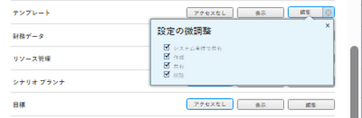

# テンプレートへのアクセス権の付与

Adobe Workfront 管理者は、アクセスレベルを使用して、[アクセスレベルの概要](../../../administration-and-setup/add-users/access-levels-and-object-permissions/access-levels-overview.md)の説明に従って、テンプレートへのユーザーのアクセスを定義できます。

プランライセンスを持つユーザーのみが、テンプレートへのフルアクセスを持つことができます。

カスタムアクセスレベルを使用して、Workfront の他のオブジェクトタイプへのユーザーのアクセスを管理する方法について詳しくは、[カスタムアクセスレベルの作成または変更](../../../administration-and-setup/add-users/configure-and-grant-access/create-modify-access-levels.md)を参照してください。

## アクセス要件

この記事の手順を実行するには、次のアクセス権が必要です。

<table style="table-layout:auto"> 
 <col> 
 <col> 
 <tbody> 
  <tr> 
   <td role="rowheader">Adobe Workfront プラン</td> 
   <td>任意</td> 
  </tr> 
  <tr> 
   <td role="rowheader">Adobe Workfront ライセンス</td> 
   <td>プラン</td> 
  </tr> 
  <tr> 
   <td role="rowheader">アクセスレベル設定</td> 
   <td> 
Workfront 管理者である必要があります。
 
<b>メモ</b>：まだアクセス権がない場合は、アクセスレベルに追加の制限が設定されていないかどうか Workfront 管理者にお問い合わせください。Workfront 管理者がユーザーのアクセスレベルを変更する方法については、<a href="../../../administration-and-setup/add-users/configure-and-grant-access/create-modify-access-levels.md" class="MCXref xref" data-mc-variable-override="">カスタムアクセスレベルの作成または変更</a>を参照してください。
 </td> 
  </tr> 
 </tbody> 
</table>

## カスタムアクセスレベルを使用してテンプレートへのユーザーアクセスを設定する

1. [カスタムアクセスレベルの作成または変更](../../../administration-and-setup/add-users/configure-and-grant-access/create-modify-access-levels.md)の説明に従って、アクセスレベルの作成または編集を開始します。
1. テンプレートの右の「**表示**」または「**編集**」ボタンの歯車アイコン  をクリックして、「**設定の微調整**」の下で付与する権限を選択します。

   

1. （オプション）作業中のアクセスレベルの他のオブジェクトやエリアのアクセス設定を指定するには、[Adobe Workfront へのアクセスを設定](../../../administration-and-setup/add-users/configure-and-grant-access/configure-access.md)にある記事のうちの 1 つ（[タスクへのアクセス権を付与](../../../administration-and-setup/add-users/configure-and-grant-access/grant-access-tasks.md)、[財務データへのアクセス権を付与](../../../administration-and-setup/add-users/configure-and-grant-access/grant-access-financial.md)など）に従って、作業を続けます。
1. 完了したら「**保存**」をクリックします。

   作成したアクセスレベルは、ユーザーに割り当てることができます。詳しくは、[ユーザープロファイルを編集](../../../administration-and-setup/add-users/create-and-manage-users/edit-a-users-profile.md)を参照してください。

## ライセンスタイプ別のテンプレートへのアクセス

各アクセスレベルのユーザーがテンプレートに対して実行できる内容について詳しくは、[各オブジェクトタイプで利用可能な機能](../../../administration-and-setup/add-users/access-levels-and-object-permissions/functionality-available-for-each-object-type.md)の記事の[テンプレート](../../../administration-and-setup/add-users/access-levels-and-object-permissions/functionality-available-for-each-object-type.md#template)の節を参照してください。

## 共有テンプレートへのアクセス

イシューの所有者または作成者として、イシューに対する権限を付与することで、[テンプレートの共有](../../../workfront-basics/grant-and-request-access-to-objects/share-a-template.md)の説明に従って、他のユーザーと共有できます。

<!--
If you make changes here, make them also in the "Grant access to" articles where this snippet had to be converted to text:
* reports, dashboards, and calendars
* financial data
* issue
-->

別のユーザーとオブジェクトを共有する場合、そのオブジェクトに対する受信者の権限は次の 2 つ項目の組み合わせによって決まります。

* オブジェクトについて受信者に付与する権限
* オブジェクトのタイプについての受信者のアクセスレベル設定
