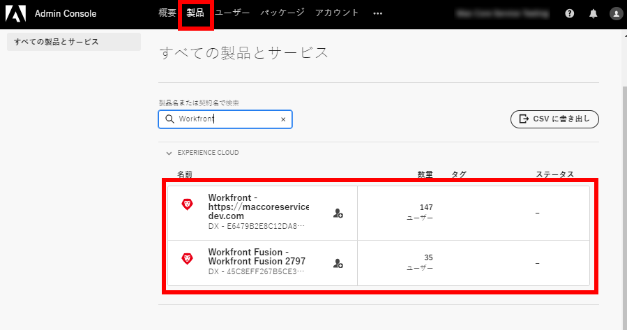
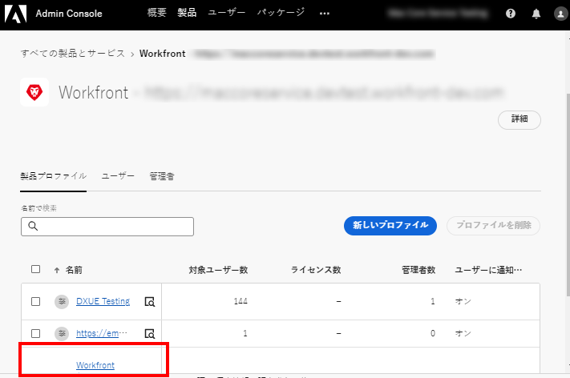
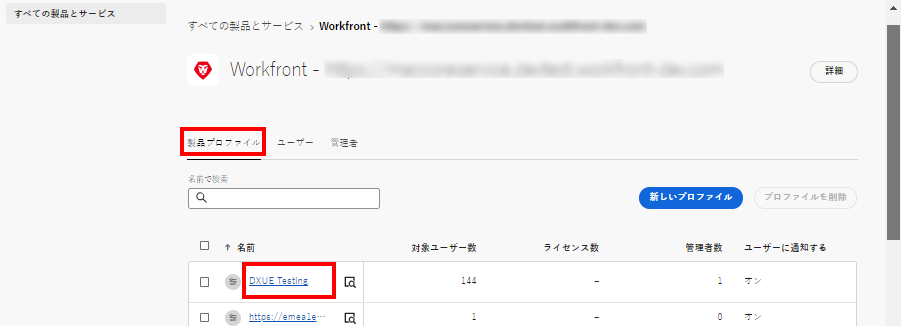
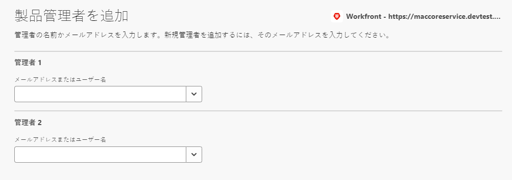

# Adobe Admin Console でのユーザー管理

>[!IMPORTANT]
>
>この記事に記載される機能は、Workfront の組織のインスタンスが Adobe Business Platform にオンボーディングされている場合にのみ使用できます。
>
>組織が Adobe Business Platform にオンボーディングされているかどうかによって手順が異なります。手順のリストについては、[プラットフォームベースの管理上の違い（Adobe Workfront／Adobe Business Platform）](../../../administration-and-setup/get-started-wf-administration/actions-in-admin-console.md)を参照してください。

アドビ管理者は、Adobe Admin Console を使用して Adobe Workfront ユーザーおよびシステム管理者を作成できます。Console では、組織全体のアドビ使用権限を一元的に管理できます。詳しくは、[Admin Console の概要](https://helpx.adobe.com/jp/enterprise/using/admin-console.html)を参照してください。

## アクセス要件

この記事の手順を実行するには、次のアクセス権が必要です。

<table style="table-layout:auto"> 
 <col> 
 </col> 
 <col> 
 </col> 
 <tbody> 
  <tr> 
   <td role="rowheader">Adobe Workfront プラン</td> 
   <td>任意</td> 
  </tr> 
  <tr> 
   <td role="rowheader">アドビ管理者権限</td> 
   <td> 
組織のアドビ製品の製品設定管理者である必要があります。
 </td> 
  </tr> 
 </tbody> 
</table>

## 前提条件

Workfront用のAdmin Consoleを使用する前に、コンソールに招待する電子メールが届きます。

1. アドビを初めて使用する場合で、組織のアドビソフトウェアおよびサービスの管理者権限があることを知らせるメールを受け取った場合には、メール内のボタンをクリックしてアドビアカウントを作成し、Admin Console を開きます。

   または

   既にアドビアカウントがある場合は、[Adobe Admin Console ページ](https://adminconsole.adobe.com/)に移動します。

## Adobe Admin Consoleのその他の詳細

* Workfront System Administrators は、Workfront 内から Workfront ユーザーを非アクティブ化できますが、Admin Console 内のユーザーは非アクティブ化されません。

  <!--
  
For information about deactivating a user in Workfront, see 

  -->

* ユーザーの&#x200B;**ホームグループ**&#x200B;は、作成したユーザーに基づいて決定されます。これは、Admin Console内からはカスタマイズできません。
* Workfront システム管理者のアクセスレベルは、Adobe Admin Console 内からのみ編集できます。

  <!--
  DRAFTED IN FLARE:
  How is this done?
  
  -->

* ユーザーのアクセスをシステム管理者から他のアクセスレベルに変更する場合は、まずAdmin Consoleを通じて行う必要があります。

  <!--
   This is not clear
  -->

* Workfrontのユーザーからシステム管理者のアクセス権を削除するには、Adobe Admin Consoleを使用して、製品プロファイル管理者としてユーザーを削除する必要があります。 これにより、ユーザーの Workfront アクセスレベルがシステム管理者から依頼者に変更されます。

  >[!IMPORTANT]
  >
  >製品プロファイル自体は変更しないでください。

## Workfront の実稼動インスタンスのユーザーと管理エリアへのアクセス {#access-the-user-and-admin-area-for-your-production-instance-of-workfront}

1. 次から： [Adobe Admin Consoleページ](https://adminconsole.adobe.com/)を選択し、 **製品** タブをクリックし、 **Workfront**.

   <!---->

1. 表示されるリストで、上部にあるリンクを選択します。

   これは、ユーザーが作業する実稼動インスタンスです。

   <!---->

   >[!TIP]
   >
   >リスト内の 2 つ目のリンクであるプレビューインスタンスは、実稼動環境を複製するテスト環境です。 詳しくは、[Adobe Workfront のプレビューサンドボックス環境](../../../administration-and-setup/set-up-workfront/workfront-testing-environments/wf-preview-sandbox-environment.md)を参照してください。
   >
   >
   >また、リストにサンドボックス環境へのリンクが表示される場合もあります。詳しくは、[Adobe Workfront のプレビューサンドボックス環境](../../../administration-and-setup/set-up-workfront/workfront-testing-environments/wf-preview-sandbox-environment.md)を参照してください。

1. 表示されるリストで「**製品プロファイル**」タブが選択された状態で、Workfront 製品プロファイルリンクの名前をクリックします。

   

   このリストには、Workfront の実稼動インスタンスに既に割り当てられているすべてのユーザーが含まれます。

   >[!IMPORTANT]
   >
   >製品プロファイル自体は変更しないでください。

1. この記事では、次のセクションのいずれかに進みます。

   * [Adobe Admin Console で Workfront のユーザーを作成](#create-users-in-workfront-with-the-adobe-admin-console)
   * [Adobe Admin Console で Workfront のシステム管理者を作成](#create-system-administrators-in-workfront-with-the-adobe-admin-console)

## Adobe Admin Console で Workfront のユーザーを作成 {#create-users-in-workfront-with-the-adobe-admin-console}

WorkfrontユーザーをAdobe Admin Consoleに追加する必要があります。 管理者は、Adobe Admin Consoleで直接ユーザーを作成できます。 グループ管理者は、Workfrontでユーザーを作成し、承認用に送信します。 承認されると、ユーザーがAdobe Admin Consoleに追加されます。

* [Adobe Admin Consoleで直接Workfrontにユーザーを作成](#create-users-in-workfront-directly-in-the-adobe-admin-console)
* [Workfrontでユーザーを作成し、Adobe Admin Consoleで承認する](#create-users-in-workfront-and-approve-them-for-the-adobe-admin-console)

### Adobe Admin Consoleで直接Workfrontにユーザーを作成

1. の節で説明されているように、Admin Consoleの「ユーザー」および「管理者」領域に移動します。 [Workfrontの実稼動インスタンスのユーザーと管理領域にアクセスする](#access-the-user-and-admin-area-for-your-production-instance-of-workfront) 」を参照してください。
1. リストの上部で「**ユーザー**」タブが選択された状態で、「**ユーザーを追加**」をクリックします。
1. 「**この製品プロファイルにユーザーを追加**」ボックスに、追加するユーザーのメールアドレスまたは名前を入力し、「**保存**」をクリックします。

   ユーザーは、Workfront で依頼者のアクセスレベルで作成されます。

   >[!IMPORTANT]
   >
   >製品プロファイル自体は変更しないでください。

1. Workfront で、ユーザーのアクセスレベルを変更します。

   Workfront 管理者がユーザーのアクセスレベルを変更する方法については、[ユーザーのプロファイルの編集](../../../administration-and-setup/add-users/create-and-manage-users/edit-a-users-profile.md)を参照してください。

1. さらにユーザーを追加するには、手順 3 と 4 を繰り返します。

   >[!NOTE]
   >
   >新規アドビユーザーの場合、Admin Console から登録プロセスを完了するための招待メールが送信されます。すべてのユーザーが登録プロセスを完了して、任意の登録アプリケーションにアクセスするAdobeが必要です。
   >
   >既存のアドビユーザーの場合、Workfront が使用可能になっていることを知らせるメールがユーザーに届く場合と届かない場合があります。これは、製品のAdobe管理者が制御するプリファレンスです。 Adobe管理者が、Workfront管理者とは異なるユーザーである場合があります。

### Workfrontでユーザーを作成し、Adobe Admin Consoleで承認する

Adobe Admin Consoleへのアクセス権を持たないグループ管理者は、このワークフローでユーザーを作成できます。

まず、グループ管理者がWorkfrontでユーザーを作成します。 これにより、「非アクティブ」ステータスと「承認待ち」ステータスのユーザーが作成されます。

次に、Workfront管理者がユーザーを承認します。 これにより、Workfrontのユーザーがアクティベートされ、Adobe Admin Consoleに追加されます。

#### Workfrontでのユーザーの作成（グループ管理者）

Workfrontでユーザーを作成する手順については、 [ユーザーを追加](/help/quicksilver/administration-and-setup/add-users/create-and-manage-users/add-users.md).

#### ユーザーを承認する (Workfront管理者 )

ユーザーを承認するには、次の手順に従います。

{{step-1-to-users}}

1. ユーザーを選択し、 **その他** アイコン .

1. ユーザーを承認するには、以下をクリックします。 **承認**&#x200B;を選択し、次に **送信**.

   または

   ユーザーを拒否し、Workfrontから削除するには、 **拒否**&#x200B;を選択し、次に **送信**.

   承認されたユーザーは、Adobe Admin Consoleに自動的に追加されます。

   拒否されたユーザーはWorkfrontから自動的に削除されます。

## Adobe Admin Console で Workfront のシステム管理者を作成 {#create-system-administrators-in-workfront-with-the-adobe-admin-console}

<!--Audited: 12/2023-->

システム管理者のアクセスレベルは、Adobe Admin Console でのみ付与されます。Workfront 内で管理者アクセスを許可または削除することはできません。

ユーザーを Workfront システム管理者にする前に、Workfront の実稼動インスタンスにユーザーを追加する必要があります。手順については、「 [Adobe Admin Consoleを使用したWorkfrontでのユーザー作成](#create-users-in-workfront-with-the-adobe-admin-console) 」を参照してください。

1. の節で説明されているように、Admin Consoleの「ユーザー」および「管理者」領域に移動します。 [Workfrontの実稼動インスタンスのユーザーと管理領域にアクセスする](#access-the-user-and-admin-area-for-your-production-instance-of-workfront) 」を参照してください。
1. ユーザーのリストの上にある「**管理者**」タブを選択します。
1. **管理者の追加**&#x200B;を選択します。
1. 「**製品プロファイル管理者の追加**」ボックスに、追加する管理者のメールアドレスまたは名前を入力し、「**保存**」を選択します。

   

   システム管理者は、Workfront で作成します。

   >[!IMPORTANT]
   >
   >製品プロファイル自体は変更しないでください。

<!--

&nbsp;

&nbsp;

&nbsp;

You can create Adobe Workfront users and system administrators with the <a href="https://adminconsole.adobe.com/" alt="Admin Console link">Adobe Admin Console</a>. The console is a central location for managing the Adobe entitlements across your organization. For more information, see the <a href="https://helpx.adobe.com/enterprise/using/admin-console.html" alt="Admin Console Overview">Admin Console Overview</a>.

Before using the Admin Console for Workfront, you should receive a receive an email inviting you to the console. Click in the invitation to accept it and create an account. You can also use an existing account, if already available.

<h2>Create users</h2>

Create users in WF with the Adobe admin console

-->

<!--

May need to add something about oging throug WF -- check with Jonah

To create users in Workfront with the Admin Console:

<ol>
<li value="1"> 
From the <a href="https://adminconsole.adobe.com/">Admin Console page</a>, select the <b>Products</b> tab and then select the <b>Workfront</b> product tile.
 </li>
<li value="2"> 
Select the link to the Workfront instance you want to change.
 </li>
<li value="3"> 
Select the Product profile link. This shows a list of the currently-assigned users. If the list is very long, you can also search for users in the search field above the list.
 </li>
<li value="4"> 
Select the <b>Add User</b> button.
 </li>
<li value="5"> 
In the <b>Add users</b> box, enter the email address or name of the user you want to add. Select <b>Save</b>. The administrator is created in Workfront with <b>Requestor</b> access level.
 </li>
</ol>
<h2>Create system administrators</h2>

To create system administrators:

<ol>
<li value="1"> 
Make product profile assignments first. To be a Workfront System Administrator, the user must be assigned the Workfront product profile and be an admin for that product profile.
 </li>
<li value="2"> 
From the console, select the <b>Products</b> tab and then select the <b>Admins</b> tab. 
 </li>
<li value="3"> 
Select <b>Add Admin</b>.
 </li>
<li value="4"> 
In the <b>Add product profile administrators</b> box, enter the email address or name of the administrator you want to add. Select <b>Save</b>. The user is created in Workfront with <b>Requestor</b> access level.
 </li>
</ol>
<h2>Additional details for the Admin Console</h2>
<ul>
<li> 
System Administrator access level is granted only on the Admin Console. You cannot grant or remove admin access from within Workfront.
 </li>
</ul>
<ul>
<li> 
Creating and deleting users inside Workfront is only possible through the Admin Console.
 </li>
<li> 
Workfront System Administrators can deactivate Workfront users from within Workfront, but this does not deactivate the user in the Admin Console.
 </li>
<li> 
All new users are are assigned <b>Requestor</b> access level upon creation. Also, the user <b>Home Group</b> is determined based on the user who created them. This is currently not customizable from within the Admin Console.
 </li>
<li> 
The Workfront System Administrator access level can only be edited from within the Adobe Admin Console.
 </li>
<li> 
Editing a user who is a system admin to any other access level must be done through the Admin Console first.
 </li>
<li> 
To remove Workfront system admin access, remove users as Product Profile Administrators. This action changes the user access level in Workfront from a system admin to a <b>Requestor</b>.
 </li>
</ul>

-->
