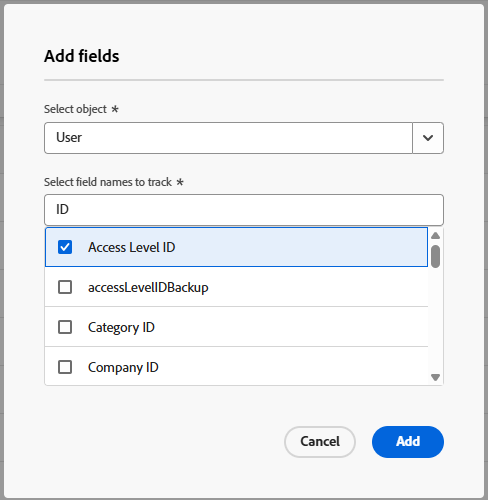

# 変更履歴で追跡するフィールドを設定します

{{highlighted-preview-article-level}}

Adobe Workfrontは、次のイベントを記録する自動システム更新を生成します。

* オブジェクトフィールドでユーザーが行う変更
* オブジェクトに対してユーザーが実行するアクション

これらのシステム更新には、次のタイプの情報が含まれています。

* 行われた変更
* 変更を行ったユーザーの名前
* 変更の日時

Workfront管理者は、Workfrontで追跡するオブジェクトフィールドとアクションを設定できます。

例えば、システム全体でイシューの名前に対して行われたすべての変更をWorkfrontで追跡できます。 イシュー名の変更は、変更履歴ログにエントリとして表示されます。 詳しくは、[変更履歴の表示と管理](/help/quicksilver/administration-and-setup/add-users/create-and-manage-users/view-and-manage-change-history.md)を参照してください。

## アクセス要件

+++ 展開すると、この記事の機能のアクセス要件が表示されます。

<table style="table-layout:auto"> 
 <col> 
 <col> 
 <tbody> 
  <tr> 
   <td>[!DNL Adobe Workfront] パッケージ</td> 
   <td>任意</td> 
  </tr> 
  <tr> 
   <td>[!DNL Adobe Workfront] ライセンス</td> 
   <td>[!UICONTROL Standard]</td> 
  </tr> 
  <tr> 
   <td>アクセスレベル設定</td> 
   <td>システム管理者</td> 
  </tr> 
 </tbody> 
</table>

詳しくは、[Workfront ドキュメントのアクセス要件](/help/quicksilver/administration-and-setup/add-users/access-levels-and-object-permissions/access-level-requirements-in-documentation.md)を参照してください。

+++

## フィールドトラッキングの制限

トラッキングできるフィールド数の制限は、Workfront パッケージによって定義されます。

| Workfront パッケージ | トラッキングされるフィールドの最大数 |
|---------|----------|
| 選択 | 700 |
| Prime | 3000 |
| Ultimate | 5000 |
| ワークフローの選択 | 1000 |
| ワークフロー Prime | 5000 |
| ワークフロー Ultimate | 制限なし |

## 追跡するフィールドを追加する

{{step-1-to-setup}}

1. 左側のパネルで、**追跡の変更/設定**&#x200B;をクリックします。
1. 設定画面で、**フィールドを追加**&#x200B;をクリックします。
1. 「**フィールドを追加**」ボックスで、オブジェクトを選択します。 オブジェクト名を入力し始め、リストに表示されたら選択します。
1. 次に、そのオブジェクトに対して追跡するフィールド名を選択します。 フィールド名を入力し始め、リストに表示されたら選択します。

   カスタムフィールドとネイティブフィールドの両方をオブジェクトで使用できます。
   既にトラッキングされているフィールドが、リストで選択された状態で表示されます。

   

1. 追跡するフィールドをすべて選択したら、**追加**&#x200B;をクリックします。

   フィールドが「トラッキングされたフィールド」リストに追加されます。

## 追跡しなくなったフィールドを削除

Workfront インターフェイス全体を通じて、特定の種類のオブジェクトをトラッキングする際にシステムがトラッキングしないフィールドを削除できます。

{{step-1-to-setup}}

1. 左側のパネルで、**追跡の変更/設定**&#x200B;をクリックします。
1. 設定画面で、トラッキングを停止するフィールドを選択します。

   同じフィールド名が複数表示される場合があります。 フィールドはオブジェクトごとにグループ化されているので、正しいフィールドを見つけることができます。 画面上部の検索ボックスを使用することもできます。

1. 画面下部のアクションバーで「**削除**」を選択します。
1. 確認メッセージで「**削除**」をクリックします。

   フィールドは、「トラッキングされたフィールド」リストから削除されます。

