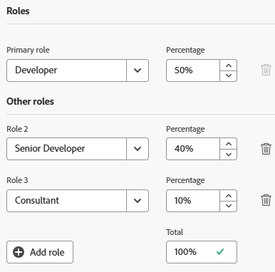
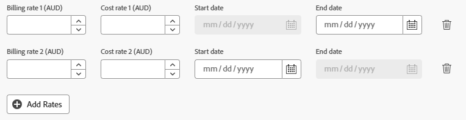

# ユーザーのプロファイルの編集

{{highlighted-preview}}

<!--

>[!IMPORTANT]
>
>The procedure described on this page applies only to organizations that have not yet been onboarded to the Admin Console. If your organization has been onboarded to the Adobe Admin Console, you must perform this action through the Adobe Admin Console.
>
>For instructions on editing a user's profile in the Adobe Admin Console, see the section "Edit user details" in the article [Manage users individually](https://helpx.adobe.com/enterprise/using/manage-users-individually.html) or contact your Adobe Admin Console Administrator.
>
>For a list of procedures that differ based on whether your organization has been onboarded to the Adobe Admin Console, see [Platform-based administration differences (Adobe Workfront/Adobe Business Platform)](../../../administration-and-setup/get-started-wf-administration/actions-in-admin-console.md).
-->

Adobe Workfront 管理者は、ユーザーを作成し、既存ユーザーのプロファイルを管理できます。ユーザーの作成については、[ユーザーの追加](../../../administration-and-setup/add-users/create-and-manage-users/add-users.md)を参照してください。

ユーザーが自分のプロファイルを更新する方法については、[ マイ設定の構成 ](/help/quicksilver/workfront-basics/manage-your-account-and-profile/configuring-your-user-profile/configure-my-settings.md) を参照してください。

## アクセス要件

+++ 展開すると、この記事の機能のアクセス要件が表示されます。

この記事の手順を実行するには、次のアクセス権が必要です。

<table style="table-layout:auto"> 
 <col> 
 <col> 
 <tbody> 
  <tr> 
   <td role="rowheader">Adobe Workfront プラン</td> 
   <td>任意</td> 
  </tr> 
  <tr> 
   <td role="rowheader">Adobe Workfront プラン</td> 
   <td>
新規：標準

または

現在：プラン
</td> 
  </tr> 
  <tr> 
   <td role="rowheader">アクセスレベル設定</td> 
   <td> 
次のいずれかが必要です。
 
    <ul> 
     <li> 
システム管理者のアクセス レベルです。 </li> 
     <li> 
<b>編集</b>アクセスに設定されたアクセスレベルでの<b>ユーザー</b>設定には、<b>作成</b>および<b>設定を微調整</b> の下で有効となる少なくとも 2 つのうち 1 つの<b>ユーザー管理者</b>オプションがあります。 
 
これら 2 つのオプションのうち、<b> ユーザー管理者（グループユーザー） </b> が有効になっている場合、ユーザーがメンバーになっているグループのグループ管理者である必要があります。
 </li> 
    </ul> </td> 
  </tr> 
 </tbody> 
</table>

この表の情報について詳しくは、[Workfront ドキュメントのアクセス要件](/help/quicksilver/administration-and-setup/add-users/access-levels-and-object-permissions/access-level-requirements-in-documentation.md)を参照してください。

+++

## ユーザープロファイルを編集

{{step-1-to-users}}

1. ユーザーを選択し、**編集** アイコン  をクリックします。

   ユーザーの編集ボックスが表示されます。

1. 「**ユーザーを編集**」ボックスで、任意のセクションの情報を変更し、いつでも **変更を保存** または **保存** をクリックします。

### 個人情報

* **名**
* **姓**

  >[!NOTE]
  >
  >Workfrontでユーザーの名前を編集しても、Adobe Admin Consoleでユーザーの名前が編集されることはありません。

* **メールアドレス**：ユーザーのメールアドレスは、Workfrontでのユーザー名でもあります。 このフィールドでは大文字と小文字が区別され、一意である必要があります。ユーザーが、一意でないメールアドレスを 10 分以内に 3 回追加しようとすると、reCAPTCHA 応答が表示されます。

  「**私はロボットではありません**」設定を選択してから続行します。

  メール許可リストを使用していて、リストにないメールドメインを入力した場合、ユーザーにはメール通知が届きません。許可リストに関して詳しくは、[メール許可リストの設定](/help/quicksilver/administration-and-setup/get-started-wf-administration/configure-your-email-allowlist.md)を参照してください。

  組織がAdobe Admin Consoleに移行されている場合、Workfrontでユーザーのメールアドレスを編集することはできません。 ユーザーのメールアドレスは、Adobe Admin Consoleで設定されます。

* **パスワードのリセット** / **パスワードの変更**：ユーザーのパスワードをリセットするには、このリンクをクリックします。 別のユーザーのパスワードをリセットするには、まず自分のパスワード入力する必要があります。

  別のユーザーのパスワードをリセットするには、Workfront 管理者またはグループ管理者である必要があります。

  グループ管理者の場合は、自分が担当するグループ内のユーザーのパスワードのみをリセットできます。また、ユーザー管理（グループユーザー）権限をアクセスレベルで有効にする必要があります。

  

  この設定は、デフォルトで無効になっています。詳しくは、[カスタムアクセスレベルの作成または変更](/help/quicksilver/administration-and-setup/add-users/configure-and-grant-access/create-modify-access-levels.md)を参照してください。

  Workfront 管理者のパスワードはリセットできません。

* **&lt;SSO Configuration> ユーザー名**：Workfront 管理者が Workfrontとの SSO 統合を有効にしてある場合は、このフィールドに SSO ユーザー名が表示されます。Workfront インスタンスに対して有効になっている SSO 設定のタイプが、このフィールドに表示されます。
* **&lt;SSO Configuration> 認証のみを許可**：Workfront 管理者が Workfront との SSO 統合を有効にし、SSO に対応するようにすべてのユーザーを更新してある場合、このフィールドはデフォルトで選択されています。Workfront インスタンスに対して有効になっている SSO 設定のタイプが、このフィールドに表示されます。

  このフィールドを選択した場合、ユーザーは SSO 資格情報を使用して Workfront にログインする必要があります。これをオフにすると、ユーザーは Workfront の資格情報で Workfront にログインできます。

  Workfrontに SSO ソリューションを設定する方法について詳しくは、[Adobe Workfrontでのシングルサインオンの概要 ](/help/quicksilver/administration-and-setup/add-users/single-sign-on/sso-in-workfront.md) を参照してください。

  SSO のユーザーの更新について詳しくは、[シングルサインオンのユーザーの更新](/help/quicksilver/administration-and-setup/add-users/single-sign-on/update-users-sso.md)を参照してください。

  >[!NOTE]
  >
  >グループ管理者の場合、&lt;SSO Configuration> フィールドを編集できるのは、担当するグループのユーザーのみです。また、ユーザー管理（グループユーザー）権限をアクセスレベルで有効にする必要があります。
  >
  >グループ管理者で、ユーザー管理者（すべてのユーザー）権限をアクセスレベルで有効にしている場合は、すべてのユーザーの &lt;SSO Configuration> フィールドを編集できます。

* **プロファイル写真**:**写真をアップロード**/**新規をアップロード** をクリックして、ユーザーのプロファイル写真を読み込みます。 JPG、GIF、PNG ファイルをアップロードできます。 ファイルサイズの上限は 4 MB です。

  プロファイル画像はユーザーのアバターとなり、ユーザー名が表示されている場所では、Workfront システム全体で表示されます。

* **ジョブ情報**：役職（「役職 **」フィールド内）や、ユーザーが担当する専門分野（「** 説明 **」フィールド内）など、ジョブに関する情報**
* **連絡先情報**：ユーザーの電話番号（**電話番号**、**内線**、および **携帯電話番号** フィールド）と住所（**住所**、**市区町村**、**都道府県**、**郵便番号**、**国** フィールド）

  ユーザーが統合ユーザー管理（UUM）またはAdobe Identity Management システム（IMS）に対して有効になっている場合、「連絡先情報」セクションの「**国**」フィールドでは、国コードの値（US、GB、IN など）のみを使用できます。

### 環境設定

* **タイムゾーン**: ユーザーのタイムゾーン。

  ユーザーが Workfront でタイムゾーンをまたいで共同作業できるようにスケジュールを使用する方法について詳しくは、[タイムゾーンをまたいだ作業](/help/quicksilver/workfront-basics/tips-tricks-and-troubleshooting/working-across-timezones.md)を参照してください。

* **メールのロケール**：ユーザーが希望するメールのロケール。これは、Workfront からこのユーザーに送信されるメール内の数値と日付の形式に影響します。

  >[!NOTE]
  >
  >組織がAdobe統合エクスペリエンスを使用している場合、ユーザーの言語環境設定はAdobe プロファイルに保存され、メールのロケールは使用されません。 これらの環境設定へのアクセスについて詳しくは、[Adobe Workfront統合エクスペリエンス ](/help/quicksilver/workfront-basics/navigate-workfront/workfront-navigation/adobe-unified-experience.md) を参照してください。

* **このテスト環境からメールを受信**：現在ログインしている環境からメール通知を受け取る場合は、このオプションを選択します。

  >[!NOTE]
  >
  >このオプションは、プレビューおよびサンドボックス環境でのみ使用できます。メール通知は、実稼動環境でデフォルトで有効になっています。

<!--* **Send work I assign to myself to my Working On tab**: This setting refers to a deprecated feature that has been removed from Workfront.-->

* **ドキュメントのアップロード中に自動的にプルーフを作成する**：ユーザーがアップロードしたドキュメントでプルーフをすぐに生成する場合は、このオプションをオンにします。

### 通知

新しいユーザーに対して有効にする必要があるメール通知を選択します。

Workfront 管理者は、システムレベルおよびグループレベルのすべてのレイアウトテンプレートを表示できます。

詳しくは、[システムの全員に対するイベント通知の設定](/help/quicksilver/administration-and-setup/manage-workfront/emails/configure-event-notifications-for-everyone-in-the-system.md)を参照してください。

### アクセス

* **アクティブ** / **ユーザーがアクティブ**：ユーザーがアクティブであることを示すには、このオプションを有効にします。 アクティブなユーザーは Workfront のライセンスを使用しています。このフィールドを無効にすると、ユーザーはアクティベートが解除され、Workfrontにログインできなくなります。

* **アクセスレベル**：このユーザーに割り当てるアクセスレベルを選択します。

  ユーザーにアクセスレベルを割り当てる場合、独自のアクセスレベル以下のレベルを割り当てることができます。 （例えば、アクセスレベルが「標準」の場合、管理者のアクセスレベルを割り当てることはできません。）

  ただし、Workfront 管理者がデフォルト以外の権限を有効にしたアクセスレベルが、自分のアクセスレベルで有効になっていない場合は、自分のアクセスレベルよりデフォルトで下位のアクセスレベルを割り当てることはできません。

  たとえば、タスクを削除するアクセス権のない標準ライセンスがある場合、Light ライセンスは標準ライセンスより低いものの、削除するアクセス権のある Light ライセンスを割り当てることはできません。 詳しくは、[カスタムアクセスレベルの作成または変更](/help/quicksilver/administration-and-setup/add-users/configure-and-grant-access/create-modify-access-levels.md)を参照してください。

  アクセスレベルについて詳しくは、[Adobe Workfront へのアクセスの設定](/help/quicksilver/administration-and-setup/add-users/configure-and-grant-access/configure-access.md)を参照してください。

  >[!NOTE]
  >
  >組織で新しいアクセスモデル（標準／ライト／コントリビューター）を使用している場合、そのユーザーが月の決定制限に達している場合、標準またはライトユーザーをコントリビューターアクセスレベルに再割り当てすることはできません。
  >
  >新しいアクセスモデルについて詳しくは、[新しいアクセスレベルの概要](/help/quicksilver/administration-and-setup/add-users/how-access-levels-work/access-level-overview.md)を参照してください。
  >
  >決定制限について詳しくは、[無償ユーザーに対する限定的なドキュメントおよびプルーフの決定の概要](/help/quicksilver/review-and-approve-work/proof-doc-decision-limits.md)を参照してください。

* **レイアウトテンプレート**：ユーザーのレイアウトテンプレートを選択します。 このレイアウトテンプレートは、ユーザーのホームグループ、ホームチームまたはプライマリロールに割り当てられたレイアウトテンプレートよりも優先されます。 レイアウトテンプレートの割り当て優先度の詳細については、「[ レイアウトテンプレートの作成と管理 ](/help/quicksilver/administration-and-setup/customize-workfront/use-layout-templates/create-and-manage-layout-templates.md) を参照してください。

  このフィールドで使用できるテンプレートのリストがアクセス権によってどう異なるかを次のリストで示します。

   * Workfront 管理者は、システムレベルおよびグループレベルのすべてのレイアウトテンプレートを表示できます。
   * グループ管理者は、システムレベルのレイアウトテンプレートと、管理するグループに関連付けられているレイアウトテンプレートを表示できます。
   * 標準またはプランのライセンスを持ち、ユーザーを編集するためのアクセス権を持つユーザーには、システムレベルのレイアウトテンプレートのみが表示されます。

     グループレベルのレイアウトテンプレートの詳細については、[ グループのレイアウトテンプレートの作成と変更 ](/help/quicksilver/administration-and-setup/manage-groups/work-with-group-objects/create-and-modify-a-groups-layout-templates.md) を参照してください。

### 組織

* **会社**：ユーザーの会社。ユーザーは、1 つの会社にのみ関連付けることができます。会社をユーザーに関連付ける前に、会社を作成する必要があります。アクティブな会社のみがリストに表示されます。会社の作成について詳しくは、[会社の作成と編集](/help/quicksilver/administration-and-setup/set-up-workfront/organizational-setup/create-and-edit-companies.md)を参照してください。
* **レポート先**：ユーザーに会社を指定した場合、このフィールドにユーザーの直接管理者を指定することもできます。 1 人のユーザーに設定できるマネージャーは 1 人だけです。先にユーザーが会社に関連付けられていないと、このフィールドは表示されません。
* **直属の部下**: ユーザーに会社を指定した場合は、ユーザーの直属の部下も指定できます。 1 人のユーザーが複数の部下を持つことができます。先にユーザーが会社に関連付けられていないと、このフィールドは表示されません。
* **ホームチーム**：ユーザーのホームチームを指定します。ユーザーが持つことができるホームチームは 1 つだけです。ホームチームは、レイアウトテンプレートを割り当てる場合や、ユーザーに割り当てられたタスクやイシューに対して「作業をする」ボタンを定義する場合に重要になります。
* **他のチーム**：ユーザーは複数のチームに属することができます。ユーザーは、ホームエリア内のチームのいずれかに割り当てられた作業アイテムを表示できます。
* **ホームグループ**/**現在のホームグループ**：ユーザーを割り当てる適切なグループを選択します。 その結果、ユーザーはグループと共有されているオブジェクトにアクセスできるようになります。また、レイアウトテンプレートをユーザーのホームグループと共有することもできます。

  必須フィールドです。すべてのユーザーは、ホームグループに関連付ける必要があります。選択しない場合、ホームグループが新しいユーザーのホームグループとして割り当てられます。

  次のいずれかに該当する場合にのみ、ユーザーにグループを割り当てることができます。

   * Workfront 管理者である
   * グループの管理者である
   * グループはパブリックです

* **その他のグループ**：ユーザーは複数のグループに属することができます。ユーザーにグループを割り当てることができるのは、Workfront管理者、グループの管理者、またはグループが公開されている場合のみです。

  >[!IMPORTANT]
  >
  >ユーザーを 100 を超えるグループに追加すると、グループのリストを読み込む Workfront のエリアで、パフォーマンスの問題が発生する場合があります。

  公開グループについて詳しくは、[グループの作成](/help/quicksilver/administration-and-setup/manage-groups/create-and-manage-groups/create-a-group.md)を参照してください。

  グループについて詳しくは、[グループの概要](/help/quicksilver/administration-and-setup/manage-groups/groups-overview/groups.md)を参照してください。

### リソース計画

* **作業時間**：ユーザーが実際の作業に使用できる（オーバーヘッドを含まない）フルタイム相当の（FTE）時間の割合を表します。「作業時間」は、1 までの小数で指定する必要があります。0 は指定できません。例えば、実際の作業可能時間が 20%の場合は 0.2 になります。

  フィールドのデフォルト値は 1 で、これはユーザーが FTE 時間全体を実際のプロジェクト関連の作業に費やすことを示します。

  この数値を使用して、プロジェクト関連の実際の作業に対するユーザーの作業可能時間が計算されます。

  Workfront でスケジュールを作成する方法について詳しくは、[スケジュールの作成](/help/quicksilver/administration-and-setup/set-up-workfront/configure-timesheets-schedules/create-schedules.md)を参照してください。

  スケジュール例外と休暇も、ユーザーのキャパシティに影響を与える可能性があります。

  Workfront では、設定エリアのリソース管理環境設定に応じて、ユーザーの空き時間を計算します。詳しくは、[リソース管理環境設定の指定](/help/quicksilver/administration-and-setup/set-up-workfront/configure-system-defaults/configure-resource-mgmt-preferences.md)を参照してください。

  >[!TIP]
  >
  >「作業時間」の値を 1 に設定すると、ユーザーがフルタイム当量の時間をプロジェクト関連の作業に使用できることを示します。

* **アクティベート解除のスケジュール** / **アクティベート解除日を設定**：このユーザーを特定の日付に特定の時間にアクティベート解除するようにスケジュールする場合は、このボックスをオンにする/  このボタンをクリック  します。
* **予定されているアクティベート解除日** / **アクティベート解除日**: ユーザーがアクティベートを解除された日時。 ユーザーを非アクティブ化するスケジュールについて詳しくは、[ ユーザーの非アクティブ化または再アクティブ化 ](/help/quicksilver/administration-and-setup/add-users/create-and-manage-users/deactivate-a-user.md#schedule-users-for-deactivation) の「[ 非アクティブ化するユーザーのスケジュール ](/help/quicksilver/administration-and-setup/add-users/create-and-manage-users/deactivate-a-user.md)」を参照してください。
* **プライマリの役割**：ユーザーが Workfront で果たすことができる主要担当業務です。ユーザーが割り当てられているタスクとイシューも、このジョブの役割に割り当てられます。リソース管理には、担当業務が不可欠です。このフィールドを更新できるのは、管理ユーザーアクセス権を持つ標準ライセンスまたはプランライセンスがある場合、またはWorkfront管理者の場合のみです。 管理ユーザーアクセス権を持つユーザーの設定について詳しくは、[ユーザーへのアクセス権の付与](/help/quicksilver/administration-and-setup/add-users/configure-and-grant-access/grant-access-other-users.md)を参照してください。

  リストには、アクティブな担当業務のみが表示されます。

* （条件付き）「**主要役割**」を選択すると、「**FTE の可用性の割合**」フィールドが表示されます。この担当業務に割り当てるユーザーのスケジュールの時間の割合を指定します。主要役割における FTEの可用性の割合のデフォルト値は 100%です。
* **その他の役割**：ユーザーは Workfront で複数の担当業務を持つことができます。リソース管理には、担当業務が不可欠です。ユーザーが実行できる担当業務の数に制限はありません。ただし、リソース管理が複雑になりすぎる可能性があるため、1 人のユーザーにあまり多くの担当業務を割り当てないことをお勧めします。

  リストには、アクティブな担当業務のみが表示されます。担当業務について詳しくは、[担当業務の作成と管理](/help/quicksilver/administration-and-setup/set-up-workfront/organizational-setup/create-manage-job-roles.md)を参照してください。

  このフィールドを更新できるのは、管理ユーザーアクセス権を持つ標準ライセンスまたはプランライセンスがある場合、またはWorkfront管理者の場合のみです。

  管理ユーザーアクセス権を持つユーザーの設定について詳しくは、[ユーザーへのアクセス権の付与](/help/quicksilver/administration-and-setup/add-users/configure-and-grant-access/grant-access-other-users.md)を参照してください。

* （条件付き）1 つまたは複数の&#x200B;**その他の役割**&#x200B;を選択した場合、それぞれの役割について「**FTE の空き時間の割合**」フィールドが表示されます。それぞれの担当業務に割り当てるユーザーのスケジュールの時間の割合を指定します。その他の役割における FTE の可用性の割合のデフォルト値は 0%です。

  その他の役割の FTE 可用性が 0%の場合、ユーザーがこれらのロールのタスクに割り当てられていない限り、リソースプランナーには表示されません。

   プレビュー中：
  

  実稼動環境で：
  

  すべての役割における **FTE の空き時間の割合**&#x200B;の合計を 100％にする必要があります。FTE の可用性の各割合では、リソースプランナーの各ユーザーの役割における空き時間が計算されます。ユーザーごとの各役割の空き時間は、それぞれのユーザーの空き時間に左右されます。

  ユーザーの空き時間は、Workfront 管理者がリソース管理環境設定で FTE を計算する際に選択した方法に応じて、Workfront によって計算されます。

  ユーザーの空き時間の計算について詳しくは、[リソースプランナーのユーザーと役割に対する時間と FTE の計算の概要](/help/quicksilver/resource-mgmt/resource-planning/calculate-hours-fte-for-users-roles-resource-planner.md)を参照してください。

  リソース管理の環境設定の指定について詳しくは、[リソース管理の環境設定の指定](/help/quicksilver/administration-and-setup/set-up-workfront/configure-system-defaults/configure-resource-mgmt-preferences.md)を参照してください。

   （オプション）ユーザーの担当業務がプロジェクト中に変更された場合、財務計算で有効日業務割り当てが使用されます。

  [**日付別のロールを定義**] をクリックし、[**プライマリ ロール**] および [**その他のロール**] を選択して、各ロールの割り当て率を入力します。 役割は、既存の役割と同じ（割合を変える）にすることも、新しい役割にすることもできます。これらの役割がアクティブになる開始日を選択します。 未来の日付にすることができます。最新の役割がアクティブになったら、「**以前の役割を表示**」をクリックして、以前の非アクティブな役割を表示できます。

* **スケジュール**：スケジュールをユーザーに関連付けます。ユーザーのスケジュールは、ユーザーが割り当てられているタスクのタイムラインを計算します。

  スケジュールをユーザーに関連付ける前に、スケジュールを作成する必要があります。スケジュールの作成について詳しくは、[スケジュールを作成](/help/quicksilver/administration-and-setup/set-up-workfront/configure-timesheets-schedules/create-schedules.md)を参照してください。

  >[!NOTE]
  >
  >ユーザーに関連付けるスケジュールをユーザーのタイムゾーンと一致させることをお勧めします。

  >[!IMPORTANT]
  >
  >Workfrontは、「**次を使用してリソースの空き時間を計算** 設定が **ユーザーのスケジュール** に設定されている場合にのみ、ユーザーのスケジュールを使用します。 この設定がリソース管理に使用されるスケジュールにどのように影響するかについては、[ リソース管理環境設定の構成 ](/help/quicksilver/administration-and-setup/set-up-workfront/configure-system-defaults/configure-resource-mgmt-preferences.md) を参照してください。

* **タイムシートプロファイル**：タイムシートプロファイルをユーザーに関連付けて、タイムシートプロファイルがユーザーのために自動的に生成されるようにします。

  このフィールドに入力できるプロファイルのリストは、アクセス権によって異なります。

   * Workfront 管理者は、すべてのシステムレベルおよびすべてのグループレベルのタイムシートプロファイルを表示することができます。
   * グループ管理者は、システムレベルのタイムシートプロファイルと、自分が管理するグループに関連付けられたタイムシートプロファイルを確認できます。
   * 標準またはプラン ライセンスを持ち、ユーザーを編集するアクセス権を持つユーザーには、システムレベルのタイムシートプロファイルのみが表示されます。 グループレベルのタイムシートプロファイルについて詳しくは、[タイムシートプロファイルの作成、編集、割り当て](/help/quicksilver/timesheets/create-and-manage-timesheets/create-timesheet-profiles.md)を参照してください。

* **デフォルトの時間タイプ**：ユーザーのデフォルトの時間タイプを選択します。これは、ユーザーが時刻をログに記録する際にデフォルトで使用される時間タイプです。
* **利用可能な時間タイプ**：ユーザーが使用できる時間タイプを選択します。これらの時間タイプは、ユーザーが時間を記録できる Workfront のどこにでも表示されます。ユーザーは、プロジェクトレベルおよびユーザーレベルで有効になっている時間タイプのみを表示できます。ユーザーが使用できる時間タイプについて詳しくは、[ 時間タイプと空き時間を定義 ](/help/quicksilver/timesheets/create-and-manage-timesheets/define-hour-types-and-availability.md) を参照してください。
* **ログイン時間**：ユーザーが作業項目に対して時間を時間単位または日単位でログインする必要があるかどうかを選択します。 詳しくは、[時間を時間単位で記録するか日単位で記録するかを設定](/help/quicksilver/timesheets/config-timesheet-prefs/config-time-logged-hrs-days.md)を参照してください。
* **FTE**：これは、ユーザーのフルタイム換算です。Workfront ではこの数値を使用して、システムレベルの「リソース管理環境設定」が「規定のスケジュール」に設定されている場合にのみ、規定のスケジュールに基づいてユーザーの空き時間が計算されます。

  FTE は、ユーザーが作業に費やせる時間を示します。これには、オーバーヘッドや、プロジェクト作業に費やされた時間が含まれます。例えば、ミーティングやトレーニングに費やした時間も FTE に含まれます。

  FTE は 1 以下の小数にする必要があり、0 にはできません。例えば、FTE 値が 0.5 で、Workfront のデフォルトのスケジュールが 40 時間の場合、そのユーザーは週に 20 時間空いています。

  このフィールドのデフォルトは 1 です。

  スケジュールの例外、休暇、および作業時間の値は、ユーザーの空き時間に影響を与える場合があります。

  Workfront では、設定エリアのリソース管理環境設定に応じて、ユーザーの空き時間を計算します。

  システムレベルのリソース管理環境設定がユーザーのスケジュールに設定されている場合、ここで指定した値は無視され、ユーザーはスケジュールで指定された内容に従って空いていると見なされます。

  詳しくは、[リソース管理の環境設定](/help/quicksilver/administration-and-setup/set-up-workfront/configure-system-defaults/configure-resource-mgmt-preferences.md)を参照してください。

  Workfront でスケジュールを作成する方法について詳しくは、[スケジュールの作成](/help/quicksilver/administration-and-setup/set-up-workfront/configure-timesheets-schedules/create-schedules.md)を参照してください。

* **リソースプール**：ユーザーをリソースプールに関連付けます。詳細については、[ リソース プールとユーザーの関連付け ](/help/quicksilver/resource-mgmt/resource-planning/resource-pools/associate-resource-pools-with-users.md) を参照してください。
* **コスト率**：ユーザーの 1 時間あたりのコストの量。

  有効日のコスト率については、「**レートを追加**」をクリックします。期間のコスト率の値を入力し、必要に応じて開始日と終了日を割り当てます。コスト率 1 には開始日が設定されず、最後のコスト率には終了日が設定されません。

  一部の日付は自動的に追加されます。例えば、コスト率 1 に終了日がなく、開始日が2023年5月1日のコスト率 2 を追加した場合、ギャップが生じないように、2023年4月30日の終了日がコスト率 1 に追加されます。

* **請求レート**：ユーザーの 1 時間あたりの請求額。

  有効日の請求レートについては、「**レートを追加**」をクリックします。期間の請求レートの値を入力し、必要に応じて開始日と終了日を割り当てます。請求レート 1 には開始日が設定されず、最後の請求レートには終了日が設定されません。

  一部の日付は自動的に追加されます。例えば、請求レート 1 に終了日がなく、開始日が 2023年5月1日の請求レート 2 を追加すると、ギャップが生じないように、請求レート 1 の終了日に 2023年4月30日が追加されます。

   プレビュー中：
  

  実稼動環境で：
  

### カスタムフォーム

既存のユーザーカスタムフォームをこのユーザーに関連付けます。カスタムフォームをユーザーに関連付けるには、カスタムフォームを作成する必要があります。アクティブなカスタムフォームのみがリストに表示されます。編集するアクセス権がないフィールドは、個々のカスタムフォームには表示されません。

>[!NOTE]
>
>外部検索フィールドやWorkfront ネイティブフィールドなどの高度なカスタムフォーム機能は、ユーザーを編集ダイアログではなく、詳細ページでユーザーレコードを開いた場合にのみ使用できます。 （ユーザーのリストで、ユーザー名をクリックすると詳細が開きます）。

カスタムフォームの作成について詳しくは、「[ カスタムフォームの作成 ](/help/quicksilver/administration-and-setup/customize-workfront/create-manage-custom-forms/form-designer/design-a-form/design-a-form.md)」を参照してください。

### コメント

ユーザーおよびユーザーのユーザープロファイルの「更新」領域に送信するコメントを入力します。

<!--
   <table style="table-layout:auto"> 
    <col> 
    <col> 
    <tbody> 
     <tr> 
      <td role="rowheader">Personal Info </td> 
      <td> 
       <ul> 
        <li>
<b>First Name</b>
</li>
        <li>
<b>Last Name</b>

<b>NOTE:</b>

Editing a user's name in Workfront does not edit the user's name in the Adobe Admin Console.
</li> 
        <li> 
<b>Email Address:</b> The email address for a user is also their username in Workfront. This field is case-sensitive and must be unique. If any user attempts to add a non-unique email address 3 times within a 10-minute window, a reCAPTCHA response appears.
 
 Select the <b>I am not a robot</b> setting before you can proceed.

If you use the email allowlist and enter an email domain not on the list, the user will not receive email notifications. For more information about the allowlist, see <a href="../../../administration-and-setup/get-started-wf-administration/configure-your-email-allowlist.md" class="MCXref xref">Configure your email allowlist</a>.

If your organization has been migrated to the Adobe Admin Console, you cannot edit a user's email address in Workfront. The user's email address is set in the Adobe Admin Console. </li> 
        <li> 
<b>Reset Password</b>: Click this link to reset the user's password. You must enter your own password before you can reset another user's password.
 
To reset another user's password, you must be a Workfront administrator, or a group administrator.
 
<b>NOTE</b>:  
          <ul> 
           <li> 
If you are a group administrator, you can reset passwords only for users in the groups where you are designated as an administrator. Also, the User Admin (Group Users) permission must be enabled in your access level:
 
  
 
This setting is disabled by default. For more information, see <a href="../../../administration-and-setup/add-users/configure-and-grant-access/create-modify-access-levels.md" class="MCXref xref">Create or modify custom access levels</a>.
 </li> 
           <li> 
You cannot reset the password of a Workfront administrator.
 </li> 
          </ul> 
 </li> 
        <li><b>&lt;SSO Configuration&gt; Username</b>: If your Workfront administrator enabled an SSO integration with Workfront, the SSO Username displays in this field. The type of SSO configuration enabled for your Workfront instance is visible in this field. </li> 
        <li> 
<b>OnlyAllow &lt;SSO Configuration&gt; Authentication</b>: If your Workfront administrator enabled an SSO integration with Workfront and has updated all users for SSO, this field is selected by default. The type of SSO configuration enabled for your Workfront instance is visible in this field.
 
When this field is selected, the user is required to log into Workfront with their SSO credentials. Unchecking it will allow them to log in to Workfront with their Workfront credentials.
 
For more information about configuring Workfront with an SSO solution, see <a href="../../../administration-and-setup/add-users/single-sign-on/sso-in-workfront.md" class="MCXref xref">Overview of single sign-on in Adobe Workfront</a>
 
For more information about updating users for SSO, see <a href="../../../administration-and-setup/add-users/single-sign-on/update-users-sso.md" class="MCXref xref">Update users for single sign-on</a>.
 
        
<b>NOTE</b>:
 
        
 If you are a group administrator, you can edit the &lt;SSO Configuration&gt; fields only for users in the groups where you are designated as such. Also, the User Admin (Group Users) permission must be enabled in your access level.
        
If you are a group administrator and you have the User Admin (All Users) permission enabled in your access level, you can edit the &lt;SSO Configuration&gt; fields for all users.
 </li> 
        <li><b>Job Info:</b> Information about the job, like the job title (in the <b>Title</b> field), and what area of expertise the user is responsible for (in the <b>Talk to Me About</b> field).</li> 
        <li>
<b>Contact Info</b>: The user's phone number (in the <b>Phone number, Ext.</b>, and <b>Mobile number</b> fields) and address (in the <b>Address, City, State, Postal Code, Country</b> fields ).

        
If the user is enabled for Unified User Management (UUM) or Adobe Identity Management System (IMS), the <b>Country</b> field in the Contact Info section only accepts country code values (for example, US, GB, IN).
</li>
       </ul> </td> 
     </tr> 
     <tr> 
      <td role="rowheader">Preferences </td> 
      <td> 
       <ul> 
      <li> 
<b>Time Zone:</b> The user's time zone.
 
For information about helping users collaborate in Workfront across time zones, see <a href="../../../workfront-basics/tips-tricks-and-troubleshooting/working-across-timezones.md" class="MCXref xref">Working across time zones</a>.
 </li>

      <li>
<b>Email Locale</b>: The user's preferred email locale. This affects the format of numbers and dates in the emails that come from Workfront to this user.

      
<b>NOTE:</b> When your organization is on the Adobe Unified Experience, the user's language preferences are stored in their Adobe profile and the email locale is not used. For information about accessing these preferences, see <a href="/help/quicksilver/workfront-basics/navigate-workfront/workfront-navigation/adobe-unified-experience.md">Adobe Unified Experience for Workfront</a>.
</li> 
      
      <li><b>Receive emails from this test environment</b>: Check this option if you want to receive email notifications from the environment that you are currently logged in.
      
<b>NOTE</b>

      
This option is available only in the Preview and Sandbox environments. Email notifications are enabled in the Production environment by default. 

      </li> 
      
      </li> 
       <li><b>Send work I assign to myself to my Working On tab</b>: This setting refers to a deprecated feature that has been removed from Workfront.</li> 
       <li><b>Automatically generate proofs when uploading documents</b>: Check this option if you want the documents that the user uploads to immediately generate a proof. </li>
       </ul> </td> 
     </tr> 
     <tr> 
      <td role="rowheader">Notifications</td> 
      <td> 
Select the email notifications which should be enabled for the new user.
 
You can select instant as well as daily digest notifications.
 
For more information, see <a href="../../../administration-and-setup/manage-workfront/emails/configure-event-notifications-for-everyone-in-the-system.md" class="MCXref xref">Configure event notifications for everyone in the system</a>.
 </td> 
     </tr> 
     <tr> 
      <td role="rowheader">Access</td> 
      <td> 
       <ul> 
      <li><b>Is Active:</b> Select this box to indicate that the user is active. Active users use a Workfront license. Clearing the box deactivates the user and prevents them from logging in to Workfront.</li> 
       <li> 
<b>Access Level:</b> Select the access level to assign to this user.
 
       
When you assign an access level to a user, you can assign a level equal to or lower than your own access level.

       
For example, if your access level is Plan, you cannot assign the Administrator access level. However, you cannot assign an access level that by default is lower than your own access level if the Workfront administrator has enabled non-default permissions on the access level that are not also enabled in your own access level. 

       
For example, if you have a Plan license with no access to delete tasks, you cannot assign someone a Work license with access to delete tasks, although the Work license is lower than the Plan license. For more information, see  <a href="../../../administration-and-setup/add-users/configure-and-grant-access/create-modify-access-levels.md" class="MCXref xref">Create or modify custom access levels</a>. 
 
       
For more information about access levels, see <a href="../../../administration-and-setup/add-users/configure-and-grant-access/configure-access.md" class="MCXref xref">Configure access to Adobe Workfront</a>.

       
 <b>NOTE:</b>
 
       
 If your organization uses the new access model (Standard/Light/Contributor), you cannot reassign a Standard or Light user to a Contributor access level if that user has already reached their decision limit for the month. 

For more information on the new access model, see <a href="../how-access-levels-work/access-level-overview.md" class="MCXref xref">New access levels overview</a>. 

For information on decision limits, see <a href="/help/quicksilver/review-and-approve-work/proof-doc-decision-limits.md" class="MCXref xref">Limited document and proof decision for non-paid users overview</a>.
</li> 
       <li> 
<b>Layout Template</b>: Choose a Layout Template for the user. This Layout Template takes precedence over any Layout Template assigned to the user's Home Group, Home Team or Primary Role. For more information about the assignment priority of Layout Templates, see <a href="../../../administration-and-setup/customize-workfront/use-layout-templates/create-and-manage-layout-templates.md" class="MCXref xref">Create and manage layout templates</a>.
 
<b>NOTE</b>:  
The following list describes how the list of templates you have available in this field depends on your access:
 
       <ul> 
       <li>As a Workfront administrator, you can see all system-level and group-level Layout Templates.</li> 
       <li>As a group administrator, you can see system-level layout template, as well as those associated with the groups that you manage.</li> 
       <li>As a user with a Plan license and access to edit users, you can see only system-level Layout Templates.</li> 
       </ul> 
For more information about group-level Layout Templates, see <a href="../../../administration-and-setup/customize-workfront/use-layout-templates/create-and-manage-layout-templates.md" class="MCXref xref">Create and manage layout templates</a>.
 
 </li> 
       </ul> </td> 
     </tr> 
     <tr> 
      <td role="rowheader">Organization </td> 
      <td> 
       <ul> 
      <li><b>Company</b>: The company of the user. Users can be associated only with one company. You must create a company before you can associate it with a user. Only active companies display in the list. For information about creating companies, see <a href="../../../administration-and-setup/set-up-workfront/organizational-setup/create-and-edit-companies.md" class="MCXref xref">Create and edit companies</a>.</li> 
      <li><b>Reports to:</b> If you specified a company for the user, you can also specify the direct manager of the user in this field. A user can have only one manager. This field does not display if the user is not associated with a company first. </li> 
      <li><b>Direct Reports:</b> If you specified a company for the user, you can also specify the direct reports of the user. A user can have multiple direct reports. This field does not display if the user is not associated with a company first.</li> 
      <li><b>Home Team</b>: Specify the home team for the user. Users can only have one home team. The Home Team is important when assigning a layout template or when defining the Work On It button for the tasks and issues assigned to the user. </li> 
      <li><b>Other Teams</b>: Users can belong to multiple teams. A user can view work items assigned to any of their teams in their Home area. </li> 
      <li> 
<b>Home Group:</b> Select an appropriate group to assign the user. This gives the user the ability to access objects that are shared with the group. You can also share layout templates with the user's Home Group.
 
This is a required field. Every user must be associated with a home group. If you don't select one, your Home Group is assigned as the new user's Home Group.
 
<b>NOTE</b>:
 
      
 You can assign a group to a user only if one of the following is true:

      <ul><li>you are a Workfront administrator</li>
      <li>you are the administrator of the group</li>
      <li>the group is public.</li></ul> 
      <li> 
<b>Other Groups</b>: Users can belong to multiple groups. You can assign a group to a user only if you are a Workfront administrator, you are the administrator of the group, or the group is public.
 
<b>IMPORTANT</b>:
 
      
Adding a user to more than 100 groups may cause performance issues in any area of Workfront that loads the list of groups.
 
For more information about public groups, see <a href="../../../administration-and-setup/manage-groups/create-and-manage-groups/create-a-group.md" class="MCXref xref">Create a group</a>.
 
For more information about groups, see <a href="../../../administration-and-setup/manage-groups/groups-overview/groups.md" class="MCXref xref">Groups overview</a>.
 </li> 
       </ul> </td> 
     </tr> 
     <tr> 
      <td role="rowheader">Resource Planning </td> 
      <td> 
       <ul>
       <li>
       <b>Work Time</b>: Represents the percentage of the Full Time Equivalent (FTE) time that the user is available for actual work, not including overhead. Work Time must be a decimal number up to 1, and it cannot be 0. For example, a 20% availability for actual work would be 0.2.

      The field's default is 1, indicating that a user spends their entire FTE on actual, project-related work.  

      The system uses this number to calculate the availability of the user for actual, project-related work. 

      For more information about creating schedules in Workfront, see <a href="../../set-up-workfront/configure-timesheets-schedules/create-schedules.md">Create a schedule</a>.

      Schedule exceptions and time off might also affect the user's capacity. 

      Workfront calculates a user's availability depending on the Resource Management preferences in your Setup area. For more information, see <a href="../../set-up-workfront/configure-system-defaults/configure-resource-mgmt-preferences.md">Configure Resource Management preferences</a>. 

      <b>TIP</b>

      Set the Work Time value to 1 to indicate that the user is available for project-related work their entire full-time equivalent.
      </li> 
      <li> <b>Schedule Deactivation</b>: Check this box if you want to schedule this user to be deactivated on a certain date and at a certain time. </li> 
       <li><b>Scheduled Deactivation Date</b>: The date and time on which the user becomes deactivated. For information about scheduling users for deactivation, see the <a href="../../../administration-and-setup/add-users/create-and-manage-users/deactivate-a-user.md#scheduling-users-for-deactivation" class="MCXref xref">Schedule users for deactivation</a> in <a href="../../../administration-and-setup/add-users/create-and-manage-users/deactivate-a-user.md" class="MCXref xref">Deactivate or reactivate a user</a>.</li> 
       <li> 
<b>Primary Role</b>: This is the primary job role that the user can fulfill in Workfront. Every task and issue that the user is assigned to is also assigned to this job role. Job roles are essential in resource management. You can update this field only if you have a Plan license with administrative user access, or if you are a Workfront administrator. For more information about setting up users with administrative user access, see <a href="../../../administration-and-setup/add-users/configure-and-grant-access/grant-access-other-users.md" class="MCXref xref">Grant access to users</a>.
 
Only active job roles display in the list. 
 </li> 
       <li>If you selected a <b>Primary Role</b>, the <b>Percentage of FTE Availability</b> field displays. Specify what percentage of time of the user's schedule is allocated to this job role. The default value for the Percentage of FTE Availability for the Primary Role is 100%. </li> 
       <li> 
<b>Other Roles</b>: A user can have multiple job roles in Workfront. Job roles are essential in resource management. There is no limit for how many job roles a user can fulfill. However, we recommend to not assign one user to an excessively large number of job roles, because resource management might become too complex for these users.
Only active job roles display in the list. For more information about job roles, see <a href="../../../administration-and-setup/set-up-workfront/organizational-setup/create-manage-job-roles.md" class="MCXref xref">Create and manage job roles</a>.
 
You can update this field only if you have a Plan license with administrative user access, or if you are a Workfront administrator.  For more information about setting up users with administrative user access, see <a href="../../../administration-and-setup/add-users/configure-and-grant-access/grant-access-other-users.md" class="MCXref xref">Grant access to users</a>.
 </li> 
       <li> 
(Conditional) If you selected one or multiple <b>Other Roles</b>, the <b>Percentage of FTE Availability</b> field displays for each role. Specify what percentage of time of the user's schedule is allocated to each job role. The default value for the Percentage of FTE Availability for the Other Roles is 0%.
 
<b>NOTE</b>:  If Other Roles have a 0% FTE Availability, they do not display in the Resource Planner, unless the users are assigned to tasks in these roles.
 
  
 
<b>NOTE</b>: 
The sum of all <b>Percentages of FTE Availability</b> for all roles must equal 100%. Each Percentage of FTE Availability calculates the Available Hours for each role per user in the Resource Planner. The Available Hours for each role per user depends on the available time for the user.
 
The available time for the user is calculated by Workfront depending on the method that has been selected by the Workfront administrator to calculate the FTE in the Resource Management Preferences.
 
For information about calculating availability for the user, see <a href="../../../resource-mgmt/resource-planning/calculate-hours-fte-for-users-roles-resource-planner.md" class="MCXref xref">Overview of calculating hours and FTE for users and roles in the Resource Planner</a>.
 
For information about configuring Resource Management preferences, see <a href="../../../administration-and-setup/set-up-workfront/configure-system-defaults/configure-resource-mgmt-preferences.md" class="MCXref xref">Configure Resource Management preferences</a>.
 

       
(Optional) Date effective job role assignments are used in financial calculations if the user's job role changes during a project.

Click <b>Define roles by date</b>, select the <b>Primary Role</b> and <b>Other Roles</b>, and enter the allocation percentage for each role. The roles could be the same as the existing roles (using different percentages), or new roles. Select the <b>Start date</b> when these roles become active. This can be a future date. When the newest roles become active, you can click <b>Show previous roles</b> to see the previous, inactive roles.
 </li>
       <li> 
<b>Schedule</b>: Associate a schedule with the user. The schedule of the user calculates the timeline of the tasks the user is assigned to.
 
You must create a schedule before you can associate it with a user. For more information about creating schedules, see <a href="../../../administration-and-setup/set-up-workfront/configure-timesheets-schedules/create-schedules.md" class="MCXref xref">Create a schedule</a>.
 
<b>NOTE</b>: We recommend that the schedule you associate with the user matches the user's Time Zone.
 </li> 
       <li> 
<b>Timesheet Profile</b>: Associate a Timesheet Profile with the user to ensure that timesheets generate automatically for the user.
 
<b>NOTE</b>:  The list of profiles you have available in this field depends on your access:
       <ul>
       <li>As a Workfront administrator, you can see all system-level and all group-level Timesheet Profiles.</li>
       <li>As a group administrator, you can see system-level Timesheet Profiles, as well as those associated with the groups that you manage.</li>
       <li>As a user with a Plan license and access to edit users, you can see only system-level Timesheet Profiles. For more information about group-level Timesheet Profiles, see <a href="../../../timesheets/create-and-manage-timesheets/create-timesheet-profiles.md" class="MCXref xref">Create, edit, and assign timesheet profiles</a>.</li>
      </ul>
 </li> 
       <li><b>Default Hour Type</b>: Select the default hour type for the user. This is the hour type that is used by default when the user logs time.</li> 
       <li><b>Available Hour Types</b>: Select the hour types that should be available to the user. These hour types are visible everywhere in Workfront where the user can log time. A user can only see the hour types that are enabled at the project level as well as the user level. For more information about what hour types are available to users, see <a href="../../../timesheets/create-and-manage-timesheets/define-hour-types-and-availability.md" class="MCXref xref">Define hour types and availability</a>.</li> 
       <li><b>Log Time in:</b> Select whether the user should log time on work items in hours or days. For more information, see <a href="../../../timesheets/config-timesheet-prefs/config-time-logged-hrs-days.md" class="MCXref xref">Configure whether time is logged in hours or days</a>.</li>
       
      <li> <b>FTE</b>: This is the Full Time Equivalent of the user. Workfront uses this number to calculate the availability of the user based on the Default Schedule only when the Resource Management Preferences at the system level are set to The Default Schedule. 

      
The FTE indicates the amount of time that the user can spend at work. This includes overhead, as well as time spent on project work. For example, time that is spent in meetings, or training is also included in the FTE.
 

      The FTE must be a decimal number up to 1, and it cannot be 0. For example, if the FTE value is 0.5 and the Default Schedule in Workfront is 40 hours, the user is available for 20 hours a week. 

      The field's default is 1.

      Schedule exceptions, time off might, and the value of Work Time may affect the availability of the user. 

      Workfront calculates a user's availability depending on the Resource Management preferences in your Setup area.

      If the Resource Management Preferences at the system level are set to The User's Schedule, the value you specify here is ignored and the user is considered to be available according to what is specified in their schedule. 

      For more information, see <a href="../../set-up-workfront/configure-system-defaults/configure-resource-mgmt-preferences.md">Configure Resource Management preferences</a>. 

      For more information about creating schedules in Workfront, see <a href="../../set-up-workfront/configure-timesheets-schedules/create-schedules.md">Create a schedule</a>.
      </li> 
      
      <li><b>Resource Pools</b>: Associate the user with Resource Pools. For more information, see <a href="../../../resource-mgmt/resource-planning/resource-pools/associate-resource-pools-with-users.md" class="MCXref xref">Associate resource pools with users </a>.</li> 
      
      <li><b>Cost Rate</b>: The amount of cost per hour for the user.
      
For date effective cost rates, click <strong>Add Rate</strong>. Enter the value of the cost rate for the time period, and assign a Start Date and End Date as needed. Cost Rate 1 will not have a start date and the last cost rate will not have an end date.

Some dates are added automatically. For example, if Cost Rate 1 does not have an end date, and you add Cost Rate 2 with a start date of May 1, 2023, an end date of April 30, 2023 is added to Cost Rate 1 so that no gaps exist.
</li> 
      
      <li><b>Billing Rate</b>: The amount of billing per hour for the user.
      
For date effective billing rates, click <strong>Add Rate</strong>. Enter the value of the billing rate for the time period, and assign a Start Date and End Date as needed. Billing Rate 1 will not have a start date and the last billing rate will not have an end date.
 
Some dates are added automatically. For example, if Billing Rate 1 does not have an end date, and you add a second with a start date of May 1, 2023, an end date of April 30, 2023 is added to Billing Rate 1 so that no gaps exist.

  
</li>

      </ul> </td> 
     </tr> 
     <tr> 
      <td role="rowheader">Custom Forms</td> 
      <td>
Associate an existing user custom form with this user. You must create a custom form before you can associate it with a user. Only active custom forms display in the list. Fields you do not have access to edit are not displayed in an individual custom form.
 
<strong>Note:</strong> Advanced custom form features such as External lookup fields and Workfront native fields are only available when you open the user record on the details page, not on the Edit User dialog. (From the list of users, click the user name to open the details.)
 
For information about creating custom forms, see <a href="/help/quicksilver/administration-and-setup/customize-workfront/create-manage-custom-forms/form-designer/design-a-form/design-a-form.md" class="MCXref xref">Create a custom form</a>.
</td> 
     </tr> 
     <tr> 
      <td role="rowheader">Comment</td> 
      <td>Type the comment you want to send to the users and to the Updates area of their user profiles.</td> 
     </tr> 
    </tbody> 
   </table>
-->
