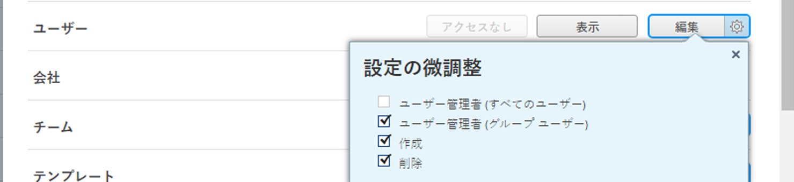
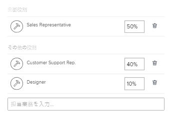
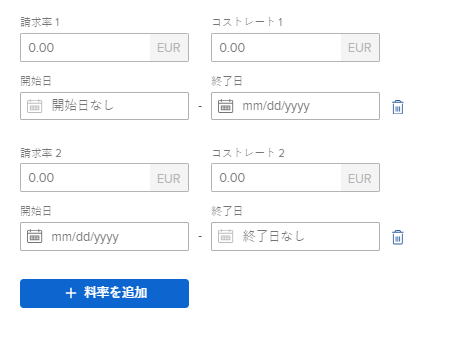

# ユーザーのプロファイルの編集

{{highlighted-preview}}

>[!IMPORTANT]
>
>このページで説明する手順は、まだAdmin Consoleにオンボーディングされていない組織にのみ適用されます。 組織がAdobe Admin Consoleにオンボーディングされている場合、Adobe Admin Consoleを通じてこの操作を実行する必要があります。
>
>Adobe Admin Consoleでユーザーのプロファイルを編集する手順については、この記事の「ユーザーの詳細を編集する」の節を参照してください [ユーザーを個別に管理](https://helpx.adobe.com/enterprise/using/manage-users-individually.html) または、Adobe Admin Console管理者に問い合わせてください。
>
>組織がAdobe Admin Consoleにオンボーディングされているかどうかに応じて異なる手順のリストについては、 [プラットフォームベースの管理上の違い (Adobe Workfront/Adobeビジネスプラットフォーム )](../../../administration-and-setup/get-started-wf-administration/actions-in-admin-console.md).

Adobe Workfront管理者は、新しいユーザーを作成し、既存のユーザーのプロファイルを管理できます。 ユーザーの作成について詳しくは、 [ユーザーを追加](../../../administration-and-setup/add-users/create-and-manage-users/add-users.md).

プランライセンスを持つユーザーは、ユーザーの作成と管理もできます。 ユーザーの編集に必要なアクセスについて詳しくは、 [ユーザーへのアクセス権の付与](../../../administration-and-setup/add-users/configure-and-grant-access/grant-access-other-users.md).

## アクセス要件

この記事の手順を実行するには、次の手順を実行する必要があります。

<table style="table-layout:auto"> 
 <col> 
 <col> 
 <tbody> 
  <tr> 
   <td role="rowheader">Adobe Workfrontプラン</td> 
   <td>任意</td> 
  </tr> 
  <tr> 
   <td role="rowheader">Adobe Workfrontライセンス</td> 
   <td>計画</td> 
  </tr> 
  <tr> 
   <td role="rowheader">アクセスレベル設定</td> 
   <td> 
次のいずれかが必要です。
 
    <ul> 
     <li> 
システム管理者のアクセスレベル。 詳しくは、 <a href="../../../administration-and-setup/add-users/configure-and-grant-access/grant-a-user-full-administrative-access.md" class="MCXref xref">ユーザーに完全な管理アクセス権を付与する</a>. 
 </li> 
     <li> 
<b>ユーザー</b> 次のように設定されたアクセスレベルの設定： <b>編集</b> アクセス、 <b>作成</b> そして少なくとも 2 つのうち 1 つは <b>ユーザー管理者</b> 以下で有効になるオプション <b>設定を微調整する</b> . 
 
この 2 つのオプションのうち、User <b>管理者（グループユーザー）</b> が有効になっている場合は、ユーザーがメンバーであるグループのグループ管理者である必要があります。
 
詳しくは、 <b>ユーザー</b> アクセスレベルでの設定については、 <a href="../../../administration-and-setup/add-users/configure-and-grant-access/grant-access-other-users.md" class="MCXref xref">ユーザーへのアクセス権の付与</a>.
 </li> 
    </ul> </td> 
  </tr> 
 </tbody> 
</table>

## ユーザープロファイルの編集

1. 次をクリック： **メインメニュー** アイコン  Adobe Workfrontの右上隅で、 **ユーザー** .
1. ユーザーを選択して、編集アイコンをクリックします。 .

1. Adobe Analytics の **ユーザーを編集** 表示されるボックスで、次の情報を変更し、 **変更を保存**:

   <table style="table-layout:auto"> 
    <col> 
    <col> 
    <tbody> 
     <tr> 
      <td role="rowheader">個人情報 </td> 
      <td> 
       <ul> 
        <li><b>名</b>, <b>姓</b></li> 
        <li> 
<b>電子メールアドレス：</b> ユーザーの電子メールアドレスは、Workfrontでのユーザー名でもあります。 このフィールドでは大文字と小文字が区別され、一意である必要があります。 10 分間以内に、一意でない電子メールアドレスを 3 回追加しようとすると、reCAPTCHA 応答が表示されます。
 
電子メールドメインを使用し許可リストに加えるて、リストにない電子メールドメインを入力した場合、ユーザーは電子メール通知を受け取りません。 このタブについて詳し許可リストに加えるくは、 <a href="../../../administration-and-setup/get-started-wf-administration/configure-your-email-allowlist.md" class="MCXref xref">電子メールの設定を行いま許可リストに加えるす。</a>.
 </li> 
        <li> 
<b>パスワードをリセット</b>：ユーザーのパスワードをリセットするには、このリンクをクリックします。 ユーザーのパスワードをリセットする前に、自分のパスワードを求められます。
 
別のユーザーのパスワードをリセットするには、Workfront管理者またはグループ管理者である必要があります。
 
<b>メモ</b>:  
          <ul> 
           <li> 
グループ管理者の場合は、自分が指定されたグループ内のユーザーのパスワードのみをリセットできます。 また、ユーザー管理（グループユーザー）権限をアクセスレベルで有効にする必要があります。
 
  
 
この設定は、デフォルトでは無効です。 詳しくは、 <a href="../../../administration-and-setup/add-users/configure-and-grant-access/create-modify-access-levels.md" class="MCXref xref">カスタムアクセスレベルの作成または変更</a>.
 </li> 
           <li> 
Workfront管理者のパスワードはリセットできません。
 </li> 
          </ul> 
 </li> 
        <li><b>&lt;sso configuration=""&gt; ユーザー名</b>:Workfront管理者がWorkfrontとの SSO 統合を有効にした場合、このフィールドに「SSO ユーザー名」が表示されます。 Workfrontインスタンスで有効になっている SSO 設定のタイプは、このフィールドに表示されます。 </li> 
        <li> 
<b>OnlyAllow &lt;sso configuration=""&gt; 認証</b>:Workfront管理者がWorkfrontとの SSO 統合を有効にし、SSO 用にすべてのユーザーを更新した場合、このフィールドはデフォルトで選択されます。 Workfrontインスタンスで有効になっている SSO 設定のタイプは、このフィールドに表示されます。
 
このフィールドを選択した場合、ユーザーは SSO 資格情報を使用してWorkfrontにログインする必要があります。 これをオフにすると、ユーザーはWorkfrontの資格情報を使用してWorkfrontにログインできます。
 
SSO ソリューションでのWorkfrontの設定について詳しくは、 <a href="../../../administration-and-setup/add-users/single-sign-on/sso-in-workfront.md" class="MCXref xref">Adobe Workfrontでのシングルサインオンの概要</a>
 
SSO のユーザーの更新の詳細は、 <a href="../../../administration-and-setup/add-users/single-sign-on/update-users-sso.md" class="MCXref xref">シングルサインオンのユーザーを更新する</a>.
 
<b>注意</b>：グループ管理者は、 &lt;sso configuration=""&gt; フィールドは、自分が指定されたグループ内のユーザーに対してのみ使用できます。 また、ユーザー管理者（グループユーザー）権限をアクセスレベルで有効にする必要があります。
        
グループ管理者で、ユーザー管理者（すべてのユーザー）権限をアクセスレベルで有効にしている場合は、 &lt;sso configuration=""&gt; すべてのユーザーのフィールド。
 </li> 
        <li><b>ジョブ情報：</b> 役職、ユーザーが担当する専門知識の領域など、ジョブに関する情報。</li> 
        <li>
<b>連絡先情報</b>：ユーザーの電話番号と住所。

        
ユーザーが統合ユーザー管理 (UUM) またはAdobeIdentity Managementシステム (IMS) に対して有効になっている場合、 <b>国</b> 「連絡先情報」セクションのフィールドには、国コードの値（例：US、GB、IN）のみを入力できます。
</li>
       </ul> </td> 
     </tr> 
     <tr> 
      <td role="rowheader">環境設定 </td> 
      <td> 
       <ul> 
      <li> 
<b>タイムゾーン：</b> ユーザーのタイムゾーン。
 
タイムゾーンをまたいでWorkfrontでユーザーが共同作業する際に役立つ情報については、 <a href="../../../workfront-basics/tips-tricks-and-troubleshooting/working-across-timezones.md" class="MCXref xref">タイムゾーンをまたいでの作業</a>.
 </li> 
       <li><b>電子メールのロケール</b>：ユーザーが優先する電子メールロケールです。 これは、Workfrontから送信される E メールの数値や日付の形式に影響します。</li>

   <li><b>このテスト環境からメールを受信</b>：現在ログインしている環境から電子メール通知を受け取る場合は、このオプションを選択します。
      
<b>メモ</b>

      このオプションは、プレビューおよびサンドボックス環境でのみ使用できます。 電子メール通知は、実稼動環境でデフォルトで有効になっています。 
      </li>

   <li><b>更新ステータスの完了率を表示</b>：このユーザーのタスクの「更新」領域内に完了率のバーを表示する場合は、このオプションを選択します。</li> 
       <li><b>自分に割り当てた作業を [ 作業 ] タブに送信する</b>：ユーザーが割り当てたすべてのものを「作業日」タブに直接表示するには、このオプションをチェックします。 デフォルトでは、ユーザーに割り当てられたすべての項目が「作業リクエスト」タブにリストされます。</li> 
       </ul> </td> 
     </tr> 
     <tr> 
      <td role="rowheader">通知</td> 
      <td> 
新しいユーザーに対して有効にする電子メール通知を選択します。
 
インスタント通知と、毎日のダイジェスト通知を選択できます。
 
詳しくは、 <a href="../../../administration-and-setup/manage-workfront/emails/configure-event-notifications-for-everyone-in-the-system.md" class="MCXref xref">システムの全員に対するイベント通知を設定する</a>.
 </td> 
     </tr> 
     <tr> 
      <td role="rowheader">アクセス</td> 
      <td> 
       <ul> 
      <li><b>アクティブ：</b> このボックスを選択して、ユーザーがアクティブであることを示します。 アクティブなユーザーはWorkfrontのライセンスを使用しています。 このボックスをオフにすると、ユーザーが非アクティブになります。</li> 
       <li> 
<b>アクセスレベル：</b> このユーザーに割り当てるアクセスレベルを選択します。
 
       
ユーザーにアクセスレベルを割り当てる際に、自分のアクセスレベルと等しいかそれ以下のレベルを割り当てることができます。 （たとえば、アクセス・レベルが「プランナ」の場合は、管理者アクセス・レベルを割り当てることはできません）。 ただし、Workfront管理者がアクセスレベルで有効にしているデフォルト以外の権限を、独自のアクセスレベルでも有効にしている場合は、デフォルトで自分のアクセスレベルより小さいアクセスレベルを割り当てることはできません ( <a href="../../../administration-and-setup/add-users/configure-and-grant-access/create-modify-access-levels.md" class="MCXref xref">カスタムアクセスレベルの作成または変更</a>) をクリックします。 
 
       
アクセスレベルの詳細については、 <a href="../../../administration-and-setup/add-users/configure-and-grant-access/configure-access.md" class="MCXref xref">Adobe Workfrontへのアクセスの設定</a>.

 <b>注意：</b> 組織で新しいアクセスモデル（標準/ライト/コントリビューター）を使用している場合、そのユーザーが月の決定制限に達している場合、標準またはライトユーザーをコントリビューターアクセスレベルに再割り当てすることはできません。 

新しいアクセスモデルの詳細については、 <a href="../how-access-levels-work/access-level-overview.md" class="MCXref xref">新しいアクセスレベルの概要</a>. 

決定制限について詳しくは、 <a href="/help/quicksilver/review-and-approve-work/proof-doc-decision-limits.md" class="MCXref xref">非有料ユーザーに対する限定的なドキュメントおよび配達確認の決定の概要</a>.
</li> 
       <li> 
<b>レイアウトテンプレート</b>：ユーザーのレイアウトテンプレートを選択します。 このレイアウトテンプレートは、ユーザのホームグループ、ホームチーム、または主要な職務の役割に割り当てられたレイアウトテンプレートよりも優先されます。 レイアウトテンプレートの割り当て優先度の詳細については、 <a href="../../../administration-and-setup/customize-workfront/use-layout-templates/create-and-manage-layout-templates.md" class="MCXref xref">レイアウトテンプレートの作成と管理</a>.
 
<b>メモ</b>:  
このフィールドで使用できるテンプレートのリストは、アクセス権によって異なります。
 
       <ul> 
       <li>Workfront管理者は、すべてのシステムレベルおよびグループレベルのレイアウトテンプレートを表示できます。</li> 
       <li>グループ管理者は、システムレベルのレイアウトテンプレートと、管理するグループに関連付けられているレイアウトテンプレートを表示できます。</li> 
       <li>プランライセンスを持ち、ユーザを編集するためのアクセス権を持つユーザは、システムレベルのレイアウトテンプレートのみを表示できます。</li> 
       </ul> 
グループレベルのレイアウトテンプレートの詳細については、 <a href="../../../administration-and-setup/customize-workfront/use-layout-templates/create-and-manage-layout-templates.md" class="MCXref xref">レイアウトテンプレートの作成と管理</a>.
 
 </li> 
       </ul> </td> 
     </tr> 
     <tr> 
      <td role="rowheader">組織 </td> 
      <td> 
       <ul> 
      <li><b>会社情報</b>：ユーザーの会社。 ユーザーは、1 つの会社にのみ関連付けることができます。 会社をユーザーに関連付ける前に、会社を作成する必要があります。 アクティブな会社のみがリストに表示されます。 会社の作成について詳しくは、 <a href="../../../administration-and-setup/set-up-workfront/organizational-setup/create-and-edit-companies.md" class="MCXref xref">会社の作成と編集</a>.</li> 
      <li><b>レポート先：</b> ユーザーの会社を指定した場合は、このフィールドでユーザーのダイレクトマネージャーも指定できます。 1 人のユーザーが管理者を 1 つだけ持つことができます。</li> 
      <li><b>ダイレクトレポート：</b> ユーザーに会社を指定した場合は、そのユーザーの直属のレポートも指定できます。 1 人のユーザーが複数のダイレクトレポートを持つことができます。</li> 
      <li><b>ホームチーム</b>：ユーザーのホームチームを指定します。 ホームチームは 1 つのみです。</li> 
      <li><b>その他のチーム</b>：ユーザーは複数のチームに属することができます。</li> 
      <li> 
<b>ホームグループ：</b> 適切なグループを選択してユーザーを割り当てます。 これにより、ユーザーはグループと共有されているオブジェクトにアクセスできます。
 
これは必須フィールドです. すべてのユーザーは、ホームグループに関連付ける必要があります。 選択しない場合、グループは新しいユーザーのホームグループとして割り当てられます。
 
<b>注意</b>：グループをユーザーに割り当てることができるのは、Workfront管理者か、そのグループの管理者か、そのグループが公開されている場合のみです。
 </li> 
      <li> 
<b>その他のグループ</b>：ユーザーは複数のグループに属することができます。 ユーザーにグループを割り当てることができるのは、Workfront管理者か、そのグループの管理者か、そのグループが公開されている場合のみです。
 
<b>重要</b>:100 を超えるグループにユーザーを追加すると、Workfrontのグループのリストを読み込む領域で、パフォーマンスの問題が発生する場合があります。
 
パブリックグループについて詳しくは、 <a href="../../../administration-and-setup/manage-groups/create-and-manage-groups/create-a-group.md" class="MCXref xref">グループの作成</a>.
 
グループについて詳しくは、 <a href="../../../administration-and-setup/manage-groups/groups-overview/groups.md" class="MCXref xref">グループの概要</a>.
 </li> 
       </ul> </td> 
     </tr> 
     <tr> 
      <td role="rowheader">リソース計画 </td> 
      <td> 
       <ul>
       <li>
       <b>勤務時間</b>：ユーザーが実際の作業に使用できる（オーバーヘッドを含まない）フルタイム相当 (FTE) 時間の割合を表します。 [ 作業時間 ] には 1 までの 10 進数を指定する必要があります。0 は指定できません。 例えば、実際の作業時間の 20%の可用性は 0.2 となります。

   フィールドのデフォルト値は 1 で、ユーザーが FTE 全体を実際のプロジェクト関連の作業に費やすことを示します。

   この数値を使用して、プロジェクト関連の実際の作業に対するユーザーの可用性が計算されます。

   Workfrontでスケジュールを作成する方法について詳しくは、 <a href="../../set-up-workfront/configure-timesheets-schedules/create-schedules.md">スケジュールの作成</a>.

   スケジュールの例外とタイムオフも、ユーザーの容量に影響を与える可能性があります。

   Workfrontは、セットアップ領域のリソース管理環境設定に基づいて、ユーザーの可用性を計算します。 詳しくは、 <a href="../../set-up-workfront/configure-system-defaults/configure-resource-mgmt-preferences.md">リソース管理環境設定の指定</a>.

   <b>ヒント</b>

   [ 作業時間 ] の値を 1 に設定して、プロジェクト関連の作業でユーザーがフルタイムの同等の作業全体で使用できるようにします。
   </li> 
      <li> <b>無効化をスケジュール</b>：このユーザーを一定期間後に非アクティブ化するようにスケジュールする場合は、このボックスをオンにします。 </li> 
       <li><b>予定されている非アクティブ化日</b>：ユーザーが非アクティブ化された日付。 非アクティブ化のためのユーザーのスケジュール設定について詳しくは、 <a href="../../../administration-and-setup/add-users/create-and-manage-users/deactivate-a-user.md#scheduling-users-for-deactivation" class="MCXref xref">ユーザーのアクティベーション解除をスケジュール</a> in <a href="../../../administration-and-setup/add-users/create-and-manage-users/deactivate-a-user.md" class="MCXref xref">ユーザーを非アクティブ化または再アクティブ化する</a>.</li> 
       <li> 
<b>プライマリの役割</b>：ユーザーがWorkfrontで果たすことができる主なジョブの役割です。 ユーザーが割り当てられているタスクと問題も、このジョブの役割に割り当てられます。 リソース管理には、ジョブの役割が不可欠です。 このフィールドは、管理者ユーザーアクセス権を持つプランライセンスを持っている場合、またはWorkfront管理者である場合にのみ更新できます。 管理ユーザーアクセス権を持つユーザーの設定について詳しくは、 <a href="../../../administration-and-setup/add-users/configure-and-grant-access/grant-access-other-users.md" class="MCXref xref">ユーザーへのアクセス権の付与</a>.
 
リストには、アクティブなジョブの役割のみが表示されます。 
 </li> 
       <li>次を選択した場合、 <b>プライマリの役割</b>、 <b>FTE の可用性の割合</b> フィールドが表示されます。 このジョブの役割に割り当てるユーザーのスケジュールの時間の割合を指定します。 [プライマリロールの FTE 可用性の割合 ] のデフォルト値は 100%です。 </li> 
       <li> 
<b>その他の役割</b>：ユーザーはWorkfrontで複数のジョブロールを持つことができます。 リソース管理には、ジョブの役割が不可欠です。 ユーザーが実行できるジョブの役割の数に制限はありません。 ただし、リソース管理が複雑すぎる場合があるので、1 人のユーザーを多数のジョブの役割に割り当てすぎないようにすることをお勧めします。
リストには、アクティブなジョブの役割のみが表示されます。 ジョブの役割について詳しくは、 <a href="../../../administration-and-setup/set-up-workfront/organizational-setup/create-manage-job-roles.md" class="MCXref xref">ジョブの役割の作成と管理</a>.
 
このフィールドは、管理者ユーザーアクセス権を持つプランライセンスを持っている場合、またはWorkfront管理者である場合にのみ更新できます。  管理ユーザーアクセス権を持つユーザーの設定について詳しくは、 <a href="../../../administration-and-setup/add-users/configure-and-grant-access/grant-access-other-users.md" class="MCXref xref">ユーザーへのアクセス権の付与</a>.
 </li> 
       <li> 
（条件付き）1 つまたは複数の <b>その他の役割</b>、 <b>FTE の可用性の割合</b> 各役割に対して表示されるフィールド。 各ジョブの役割に割り当てるユーザーのスケジュールの時間の割合を指定します。 「その他のロールの FTE 可用性の割合」のデフォルト値は 0%です。
 
<b>注意</b>：他のロールの FTE 可用性が 0%の場合、ユーザーがこれらのロールのタスクに割り当てられていない限り、リソースプランナーには表示されません。
 
  
 
<b>メモ</b>: 
すべての <b>FTE の可用性の割合</b> は、すべてのロールが 100%に等しい必要があります。 FTE 可用性の各割合は、リソース・プランナの各ユーザーのロールの使用可能時間を計算します。 各役割の使用可能時間は、ユーザーの使用可能時間によって異なります。
 
ユーザーの使用可能な時間は、Workfront管理者がリソース管理環境設定で FTE を計算する際に選択した方法に応じて、Workfrontが計算します。
 
ユーザーの可用性の計算について詳しくは、 <a href="../../../resource-mgmt/resource-planning/calculate-hours-fte-for-users-roles-resource-planner.md" class="MCXref xref">リソース・プランナのユーザーとロールに対する時間と工数の計算の概要</a>.
 
リソース管理環境設定の詳細については、「 <a href="../../../administration-and-setup/set-up-workfront/configure-system-defaults/configure-resource-mgmt-preferences.md" class="MCXref xref">リソース管理環境設定の指定</a>.
 

       
（オプション）プロジェクト中にユーザーのジョブの役割が変更された場合、財務計算で有効なジョブの役割の割り当てが使用されます。

クリック <b>日付別の役割の定義</b>を選択し、 <b>プライマリの役割</b> および <b>その他の役割</b>をクリックし、各ロールの配分率を入力します。 役割は、既存の役割（割合を変える）と同じか、新しい役割です。 を選択します。 <b>開始日</b> これらの役割がアクティブになったとき。 将来の日付にすることができます。 最新のロールがアクティブになったら、「 <b>以前のロールを表示</b> 以前の非アクティブなロールを表示するには、次の手順に従います。
 </li>
       <li> 
<b>スケジュール</b>：スケジュールをユーザーに関連付けます。 ユーザーのスケジュールは、ユーザーが割り当てられているタスクのタイムラインを計算します。
 
スケジュールをユーザーに関連付ける前に、スケジュールを作成する必要があります。 スケジュールの作成について詳しくは、 <a href="../../../administration-and-setup/set-up-workfront/configure-timesheets-schedules/create-schedules.md" class="MCXref xref">スケジュールの作成</a>.
 
<b>注意</b>：ユーザーに関連付けるスケジュールがユーザーのタイムゾーンと一致することをお勧めします。
 </li> 
       <li> 
<b>タイムシートプロファイル</b>：タイムシートプロファイルをユーザーに関連付けて、ユーザーに対してタイムシートが自動的に生成されるようにします。
 
<b>注意</b>：このフィールドで使用可能なプロファイルのリストは、アクセス権によって異なります。
       <ul>
       <li>Workfrontの管理者は、すべてのシステムレベルおよびすべてのグループレベルのタイムシートプロファイルを表示できます。</li>
       <li>グループ管理者は、システムレベルのタイムシートプロファイルと、管理するグループに関連付けられたプロファイルを表示できます。</li>
       <li>プランライセンスを持ち、ユーザーを編集するアクセス権を持つユーザーは、システムレベルのタイムシートプロファイルのみを表示できます。 グループレベルのタイムシートプロファイルの詳細については、「 <a href="../../../timesheets/create-and-manage-timesheets/create-timesheet-profiles.md" class="MCXref xref">タイムシートプロファイルの作成、編集、割り当て</a>.</li>
      </ul>
 </li> 
       <li><b>デフォルトの時間タイプ</b>：ユーザーのデフォルトの時間タイプを選択します。 これは、ユーザーが時間をログに記録する際にデフォルトで使用される時間タイプです。</li> 
       <li><b>利用可能な時間タイプ</b>：ユーザーが使用できる時間タイプを選択します。 これらの時間タイプは、Workfrontのどこでもユーザーが時間をログに記録できる場所に表示されます。 ユーザーは、プロジェクトレベルおよびユーザーレベルで有効になっている時間タイプのみを表示できます。 ユーザーが使用できる時間のタイプについて詳しくは、 <a href="../../../timesheets/create-and-manage-timesheets/define-hour-types-and-availability.md" class="MCXref xref">タイムシートの時間の種類と可用性を定義する</a>.</li> 
       <li><b>ログイン時間：</b> ユーザーが作業項目に対する時間を時間単位または日単位で記録するかどうかを選択します。 詳しくは、 <a href="../../../timesheets/config-timesheet-prefs/config-time-logged-hrs-days.md" class="MCXref xref">時間をログイン時間または日に設定する</a>.</li>

   <li> <b>FTE</b>：これは、フルタイムでののユーザーと同じです。 Workfrontは、この数値を使用して、システム・レベルの「生産資源管理プリファレンス」が「デフォルト・スケジュール」に設定されている場合にのみ、デフォルト・スケジュールに基づいてユーザーの可用性を計算します。

   
FTE は、ユーザーが仕事に費やす時間を示します。 これには、オーバーヘッドや、プロジェクト作業に費やされた時間が含まれます。 例えば、ミーティングやトレーニングに費やした時間も FTE に含まれます。

   FTE は 1 までの 10 進数で、0 にはできません。 例えば、FTE 値が 0.5 で、Workfrontのデフォルトのスケジュールが 40 時間の場合、ユーザーは週に 20 時間使用できます。

   フィールドのデフォルト値は 1 です。

   スケジュールの例外、タイムオフ、および作業時間の値は、ユーザーの可用性に影響を与える場合があります。

   Workfrontは、セットアップ領域のリソース管理環境設定に基づいて、ユーザーの可用性を計算します。

   システム・レベルの「生産資源管理プリファレンス」が「ユーザーのスケジュール」に設定されている場合、ここで指定した値は無視され、ユーザーはスケジュールで指定された内容に従って使用可能と見なされます。

   詳しくは、 <a href="../../set-up-workfront/configure-system-defaults/configure-resource-mgmt-preferences.md">リソース管理環境設定の指定</a>.

   Workfrontでスケジュールを作成する方法について詳しくは、 <a href="../../set-up-workfront/configure-timesheets-schedules/create-schedules.md">スケジュールの作成</a>.
   </li>

   <li><b>リソースプール</b>：ユーザーをリソースプールに関連付けます。 詳しくは、 <a href="../../../resource-mgmt/resource-planning/resource-pools/associate-resource-pools-with-users.md" class="MCXref xref">リソースプールとユーザーの関連付け </a>.</li>

   <li><b>コスト率</b>：ユーザーの 1 時間あたりのコストの量。
      
有効な日付の原価率の場合は、 <strong>追加率</strong>. 期間の原価率の値を入力し、必要に応じて開始日と終了日を割り当てます。 原価レート 1 には開始日が設定されず、最後の原価レートには終了日が設定されません。

一部の日付は自動的に追加されます。 たとえば、原価レート 1 に終了日がなく、開始日が 2023 年 5 月 1 日の原価レート 2 を追加した場合、ギャップが生じないように、2023 年 4 月 30 日の終了日が原価レート 1 に追加されます。
</li>

   <li><b>請求率</b>：ユーザーの 1 時間あたりの請求額。
      
有効な請求率の日付を表示するには、 <strong>追加率</strong>. 期間の請求率の値を入力し、必要に応じて開始日と終了日を割り当てます。 請求レート 1 には開始日が設定されず、最後の請求レートには終了日が設定されません。
 
一部の日付は自動的に追加されます。 たとえば、請求レート 1 に終了日がなく、開始日が 2023 年 5 月 1 日の 2 番目の日を追加した場合、ギャップが生じないように、2023 年 4 月 30 日の終了日が請求レート 1 に追加されます。

  
</li>

   </ul> </td> 
     </tr> 
     <tr> 
      <td role="rowheader">カスタムフォーム</td> 
      <td>
既存のユーザーカスタムフォームをこのユーザーに関連付けます。 カスタムフォームをユーザーに関連付ける前に、カスタムフォームを作成する必要があります。 リストには、アクティブなカスタムフォームのみが表示されます。 編集するアクセス権がないフィールドは、個々のカスタムフォームには表示されません。
 
カスタムフォームの作成について詳しくは、 <a href="../../../administration-and-setup/customize-workfront/create-manage-custom-forms/create-or-edit-a-custom-form.md" class="MCXref xref">カスタムフォームの作成または編集</a>.
</td> 
     </tr> 
     <tr> 
      <td role="rowheader">コメント</td> 
      <td>ユーザーに送信するコメントと、ユーザープロファイルの「更新」領域に入力します。</td> 
     </tr> 
    </tbody> 
   </table>
