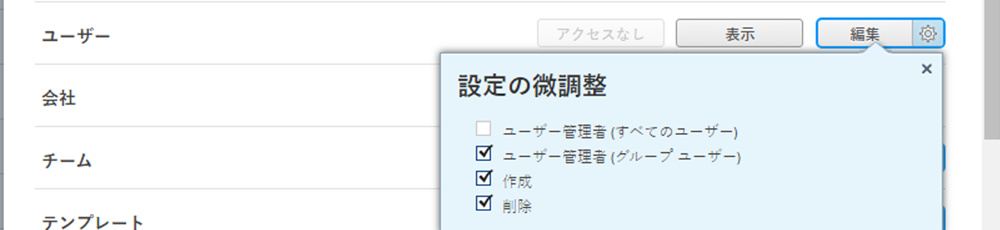

# 別のユーザーとしてのログイン

<!--Audited: 5/2025-->

<!--The highlighted information on this page refers to functionality not yet generally available. It is available for all users only in the Preview environment. -->

<!--
**DON'T DELETE, DRAFT OR HIDE THIS ARTICLE. IT IS LINKED TO THE PRODUCT, THROUGH THE CONTEXT SENSITIVE HELP LINKS. Also linked to other articles: Creating and Managing Groups, etc.

-->

Adobe Workfront の管理者は、別のユーザーの代わりに Workfront にアクセスする必要が生じる場合があります。 また、グループ管理者は、管理対象のグループのメンバーであるユーザーに代わって Workfront にアクセスする必要が生じる場合があります。

例えば、休暇中のユーザーが特定のアクションを実行するまでタスクを進行できない場合、そのユーザーとしてログインし、代わりにアクションを実行できます。

<!--
<note type="note">
Some users, such as executives, need to be able to control which administrators can log in to their accounts, and for how long. Working with your organization, Workfront configures settings that allow this control for these users. When a Workfront administrator or group administrator (associated with one of the user's groups) tries to log in as one of these users, an on-screen message prompts the administrator to contact the user for access. From the user profile area, the user can then grant access to the administrator and specify an expiration time for it. For more information on how the user does this, see
<a href="../../../workfront-basics/manage-your-account-and-profile/configuring-your-user-profile/configure-my-settings.md#access" class="MCXref xref">Access</a> in
<a href="../../../workfront-basics/manage-your-account-and-profile/configuring-your-user-profile/configure-my-settings.md" class="MCXref xref">Configure My Settings</a>.
[Add a note about this being only for the Enterprise package if they decide to do it that way]
</note>
-->

>[!NOTE]
>
>ドキュメントの統合により、個人用の非公開ファイルに接続できるので、管理者は別のユーザーとしてログインしている間はドキュメントの統合にアクセスできません。
>
>ドキュメント統合について詳しくは、[ ドキュメント統合の設定](../../../administration-and-setup/configure-integrations/configure-document-integrations.md)を参照してください。

## アクセス要件

+++ 展開すると、この記事の機能のアクセス要件が表示されます。

<table style="table-layout:auto"> 
 <col> 
 <col> 
 <tbody> 
  <tr> 
   <td>Adobe Workfront パッケージ</td> 
   <td>
任意
</td>
  </tr> 
  <tr> 
   <td>Adobe Workfront プラン</td> 
   <td>
標準

       
プラン
</td> 
  </tr>
  <tr> 
   <td>アクセスレベル設定</td> 
   <td> 
次のいずれかが必要です。
 
    <ul> 
     <li> 
システム管理者のアクセスレベル。 これにより、誰でもログインできます。</li> 
     <li> 
<b>編集</b>アクセスに設定されたアクセスレベルでの<b>ユーザー</b>設定には、<b>作成</b>および<b>設定を微調整</b> の下で有効となる少なくとも 2 つのうち 1 つの<b>ユーザー管理者</b>オプションがあります。 これにより、ライセンスレベルが低いユーザーとしてログインできます。 
 
これらの2つのオプションのうち、<b> ユーザー管理者（グループユーザー） </b>が有効になっている場合は、ユーザーがメンバーであるグループのグループ管理者である必要があります。
 </li> 
    </ul> </td> 
  </tr> 
 </tbody> 
</table>

詳しくは、[Workfront ドキュメントのアクセス要件](/help/quicksilver/administration-and-setup/add-users/access-levels-and-object-permissions/access-level-requirements-in-documentation.md)を参照してください。

+++

## ログインし、別のユーザーとしてアクションを実行する

1. Workfront 管理者またはグループ管理者として Workfront にログインします。

   >[!NOTE]
   >
   >* グループ管理者は、管理するグループのユーザーとしてのみログインできます。 また、ユーザー管理（グループユーザー）権限をアクセスレベルで有効にする必要があります。
   >   
   >  
   >   
   >  この設定は、デフォルトで無効になっています。 詳しくは、[カスタムアクセスレベルの作成または変更](../../../administration-and-setup/add-users/configure-and-grant-access/create-modify-access-levels.md)を参照してください。
   >   
   >* Workfront 管理者のパスワードはリセットできません。

{{step-1-to-setup}}

1. 左側のパネルで、**別名でログイン**&#x200B;をクリックします。

1. 「**別名でログイン**」タブの「**名前の入力を開始…**」ボックスで、ユーザーの名前の入力を開始し、ドロップダウンリストに表示されたら名前をクリックします。

   >[!NOTE]
   >* 選択するユーザーは、Workfrontで定義されたアクセスレベルを持っている必要があります。 ログインする権限を持たないユーザーとしては Workfront システムにログインすることはできません。
   >* グループ管理者は、自分が管理するグループのメンバーであるユーザーとしてのみログインできます。 Workfront 管理者としてログインすることはできません。

1. 「**ログイン**」をクリックします。 別のユーザーとしてログインすると、これを示す通知が画面の上部に表示されます。

   <!--
   
 Might come in a future story:

   -->

   <!--
   
click an Access period and then click Request to ask the user for access to log as him or her for the specified period of time. Continue these steps after the user grants access. Specify somewhere here that this is only for the Enterprise package if they decide on that

   -->

   <!--
   
Or 

   -->

   <!--
   
If a prompt appears indicating that the user has restricted access to their account, contact the user to request access.

   -->

   <!--
   
The user can then can grant you "Log in as" access in their user profile. They can also specify an expiration date and time for the access period. 

   -->

   <!--
   This triggers an email to let you know that you have access to log in as the user, depending on how your event notifications are enabled. For more information, see <a href="../../../workfront-basics/using-notifications/event-notifications.md" class="MCXref xref">Event notifications</a>.
   

   -->

1. ユーザーとして必要なアクションを実行したら、画面上部の&#x200B;**ログアウト**&#x200B;をクリックします。

## 管理者が別のユーザーとしてログインしている間のアクティビティのトラッキングと監査

Workfront は、管理者が別のユーザーとしてログインしている間に実行される、トラッキングおよび監査アクティビティのメカニズムを提供します。

別のユーザーとしてログインすると、そのユーザーの最終ログイン日は、システムまたはグループ管理者がそのユーザーとしてログインした日付に変更されます。

* [項目の指標を表示](#view-indicators-on-items)
* [監査情報の表示](#view-audit-information)

### 項目の指標を表示 {#view-indicators-on-items}

別のユーザーとして Workfront にログインしてアクションを実行すると、Workfront ではログインしているユーザーの代理としてアクションを実行したことが明示されます。

例えば、別のユーザーとしてログインしているアイテムにコメントを付けた場合、そのコメントは、オブジェクトの「更新」セクションを表示する際に、ユーザーの代理として行われたことを示すステートメントが表示されます。

### 監査情報の表示 {#view-audit-information}

1. Workfront 管理者またはグループ管理者として Workfront にログインします。
   {{step-1-to-setup}}
   <!--1. Click the **Main Menu** icon  in the upper-right corner of Adobe Workfront, then click **Setup** .-->

1. 左側のパネルで、**別名でログイン**&#x200B;をクリックし、「**アクセスログ**」タブをクリックします。

   >[!NOTE]
   >
   >システム管理者またはグループ管理者が別のユーザーとして Workfront にログインするたびに、そのイベントは監査証跡に記録されます。 また、管理者が別のユーザーとしてログインしている間に行われた監査可能なアクションは、監査証跡に記録されます。

1. （オプション）次の方法で、監査証跡に表示される結果をフィルタリングできます。

   * ログインしたユーザー別
   * 次のユーザーとしてログインしたユーザー別
   * 日時別
