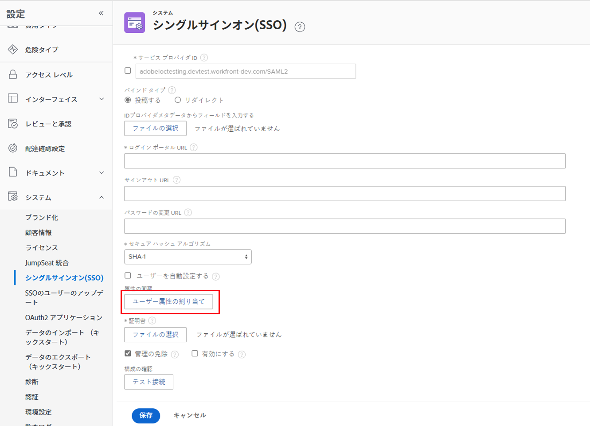
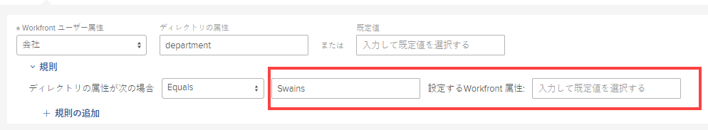

# ユーザー属性のマッピングと新しいユーザーの自動プロビジョニング

シングルサインオン（SSO）を使用して、ID プロバイダーの Active Directory から Adobe Workfront ユーザーに属性を渡すことができます。また、自動プロビジョニングオプション（ジャストインタイムプロビジョニングまたは JIT とも呼ばれます）を使用して、新しいユーザーを Workfront に追加することもできます。

>[!NOTE]
>
>組織が Adobe Admin Console にオンボーディングされている場合は、これは使用できません。詳細情報が必要な場合は、ネットワークまたは IT 管理者にお問い合わせください。

## アクセス要件

この記事の手順を実行するには、次のアクセス権が必要です。

<table style="table-layout:auto"> 
 <col> 
 <col> 
 <tbody> 
  <tr> 
   <td role="rowheader">Adobe Workfront プラン</td> 
   <td>任意</td> 
  </tr> 
  <tr> 
   <td role="rowheader">Adobe Workfront ライセンス</td> 
   <td>プラン</td> 
  </tr> 
  <tr> 
   <td role="rowheader">アクセスレベル設定</td> 
   <td> 
Workfront 管理者である必要があります。
 
<b>メモ</b>：まだアクセス権がない場合は、Workfront 管理者に問い合わせて、アクセスレベルに追加の制限が設定されているかどうかを確認してください。Workfront 管理者がアクセスレベルを変更する方法について詳しくは、<a href="../../../administration-and-setup/add-users/configure-and-grant-access/create-modify-access-levels.md" class="MCXref xref">カスタムアクセスレベルの作成または変更</a>を参照してください。
 </td> 
  </tr> 
 </tbody> 
</table>

## 属性のマッピングに関するヒント

属性をマッピングする際は、次の点に留意してください。

* 必ず、プレビューサンドボックスまたはCustomer Refresh（CR）サンドボックスでテストしてください。
* 管理者アカウントと非管理者アカウントの両方でテストして、属性が正しくマッピングされていることを確認します。
* 自動プロビジョニング中だけでなく、ユーザーが SSO で Workfront にログインするたびに属性がマッピングされます。

## ユーザー属性のマッピングと新しいユーザーの自動プロビジョニング

1. Adobe Workfront の右上隅にある&#x200B;**メインメニュー**&#x200B;アイコン 、**設定**  の順にクリックします。

1. **システム**／**シングルサインオン(SSO)** をクリックします。

1. **タイプ**&#x200B;ドロップダウンリストで、「**SAML 2.0**」をクリックします。

1. 「**ユーザー属性の割り当て**」をクリックします。

   

1. (オプション) Workfront で Active Directory から新しいユーザーを自動的に作成する場合は、「**ユーザーを自動設定する**」をクリックします。

   この機能には、属性マッピングが必要です。

1. 表示されるオプションの行で、必要な属性を Workfront ユーザーにマッピングします。

   住所、マネージャー、担当業務、ホームグループなどの属性をマッピングできます。

   属性マッピングは 1:1 の比率で機能します。例えば、ユーザーが所属するすべてのグループを設定することはできず、設定できるのは 1 人のユーザーにつき 1 つのみです。

   >[!IMPORTANT]
   >
   >ユーザーごとに次の属性が必要です。
   >      
   >* 名
   >* 姓
   >* メールアドレス
   >      
   >属性マッピングでアクセスレベルをマッピングすることはお勧めしません。それを行う場合は、デフォルト値を設定する際に、管理者アクセス権を誤って削除しないように注意してください。

   属性のマッピングに使用できるフィールドを次の表に示します。

   <table style="table-layout:auto"> 
    <col data-mc-conditions=""> 
    <col data-mc-conditions=""> 
    <tbody> 
     <tr> 
      <td role="rowheader">Workfront ユーザー属性</td> 
      <td>マッピングする属性の名前を選択します。</td> 
     </tr> 
     <tr> 
      <td role="rowheader">ディレクトリの属性</td> 
      <td>使用する SSO 属性ラベルを入力します。/td&gt; 
     </tr> 
     <tr> 
      <td role="rowheader">既定値</td> 
      <td> 
「Workfront ユーザー属性」を選択した後、接続中に値が NULL の場合、このフィールドはシステムの対応するデフォルト値が入力されます。属性マッピングルールを適用する場合にのみ、ここに値を入力します（手順 7 を参照）。デフォルト値は、これらのルールの例外として機能します。</td> 
     </tr> 
    </tbody> 
   </table>

1. （オプション）「**ルール**」をクリックして、属性にルールを追加します。

   1. ドロップダウンで、使用する属性修飾子を選択します。
   1. 右側の 2 つのフィールドに、ディレクトリ属性値と、置き換える値を入力します。

      

   「**ルールを追加**」をクリックして、属性にルールを追加します。

1. （オプション）さらにユーザー属性をマッピングするには、「**マッピングを追加**」をクリックして、手順 6～7 を繰り返します。
1. 「**保存**」をクリックします。
