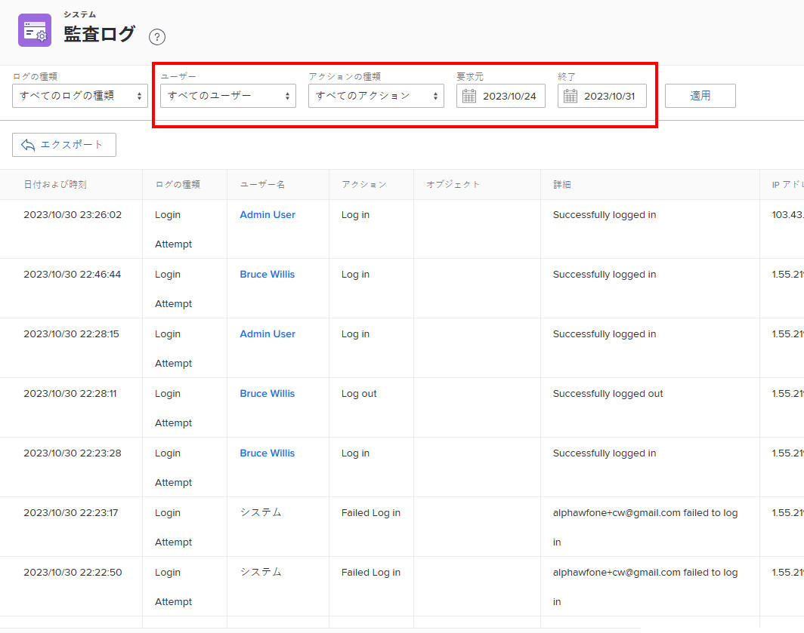

# 監査ログの表示と書き出し

<!--
**DON'T DELETE, DRAFT OR HIDE THIS ARTICLE. IT IS LINKED TO THE PRODUCT, THROUGH THE CONTEXT SENSITIVE HELP LINKS. **
-->

システム内のすべての監査ログ、または特定のフィルタリング条件を満たす監査ログを表示できます。 監査ログを書き出すこともできます。

監査ログは、過去 90 日間にシステムでトリガーされたユーザーの変更をリストします。

すべての監査ログのタイプと、その生成内容について詳しくは、 [監査ログ](../../../administration-and-setup/add-users/create-and-manage-users/audit-logs.md).

## アクセス要件

この記事の手順を実行するには、次の手順を実行する必要があります。

<table style="table-layout:auto"> 
 <col> 
 <col> 
 <tbody> 
  <tr> 
   <td role="rowheader">Adobe Workfrontプラン</td> 
   <td>任意</td> 
  </tr> 
  <tr> 
   <td role="rowheader">Adobe Workfrontライセンス</td> 
   <td> 
計画 
 
Workfront管理者である。
 </td> 
  </tr> 
 </tbody> 
</table>

## 監査ログの表示

1. 次をクリック： **メインメニュー** アイコン  Adobe Workfrontの右上隅で、 **設定** .

1. 左側のパネルで、 **システム/監査ログ**.
1. 内 **ログタイプ** ドロップダウンメニューから、表示する監査ログのタイプを選択します。

   **すべてのログタイプ** はデフォルトで選択されています。

   表示できるすべての監査ログの種類とそれらに含まれる情報の一覧については、 [監査ログ](../../../administration-and-setup/add-users/create-and-manage-users/audit-logs.md).

1. （オプション）使用可能な任意のフィルターを設定します。

   >[!NOTE]
   >
   >Action Type ドロップダウンメニューのオプションは、選択した監査ログによって異なります。

   

1. クリック **適用**.
1. （オプション）「 **フィルターをクリア** ：フィルターに加えた変更をリセットします。

## 監査ログの書き出し

1. 次をクリック： **メインメニュー** アイコン  Adobe Workfrontの右上隅で、 **設定** .

1. 左側のパネルで、 **システム/監査ログ**.

1. 内 **ログタイプ** ドロップダウンメニューから、監査ログを選択します。

   **すべてのログタイプ** はデフォルトで選択されています。

1. 使用可能なフィルターのいずれかを設定し、「 **適用**.

   >[!IMPORTANT]
   >
   >一度に 50,000 件を超えるログを書き出すことはできません。 Workfrontは、ページに表示されるログの数ではなく、設定したフィルターに基づいてログを書き出します。 フィルター済みログの合計数をページの右下隅に表示できます。

1. クリック **書き出し**.
