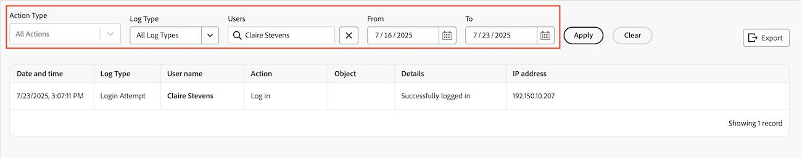

# 監査ログの表示と書き出し

<!--Audited: 08/2025-->

<!--
**DON'T DELETE, DRAFT OR HIDE THIS ARTICLE. IT IS LINKED TO THE PRODUCT, THROUGH THE CONTEXT SENSITIVE HELP LINKS. **
-->

システム内のすべての監査ログ、または特定のフィルタリング条件を満たす監査ログを表示できます。また、監査ログを CSV ファイルに書き出すこともできます。

監査ログには、過去 90 日間にシステムでトリガーされたユーザーの変更がリストされます。

すべての監査ログタイプとその生成内容について詳しくは、[ 監査ログの概要 ](../../../administration-and-setup/add-users/create-and-manage-users/audit-logs.md) を参照してください。

## アクセス要件

+++ 展開すると、この記事の機能のアクセス要件が表示されます。

<table style="table-layout:auto"> 
 <col> 
 <col> 
 <tbody> 
  <tr> 
   <td role="rowheader">Adobe Workfront パッケージ</td> 
   <td>
任意
</td> 
  </tr> 
  <tr> 
  <tr> 
   <td role="rowheader">Adobe Workfront プラン</td> 
   <td>
標準

       
プラン
</td>
  </tr> 
  </tr> 
  <tr> 
   <td role="rowheader">アクセスレベル設定</td> 
   <td>
システム管理者
</td>
  </tr> 
 </tbody> 
</table>

この表の情報について詳しくは、[Workfront ドキュメントのアクセス要件](/help/quicksilver/administration-and-setup/add-users/access-levels-and-object-permissions/access-level-requirements-in-documentation.md)を参照してください。

+++

<!--Old: 

<table style="table-layout:auto"> 
 <col> 
 <col> 
 <tbody> 
  <tr> 
   <td role="rowheader">Adobe Workfront package</td> 
   <td>
Any
</td> 
  </tr> 
  <tr> 
  <tr> 
   <td role="rowheader">Adobe Workfront license</td> 
   <td>
Standard

       
Plan
</td>
  </tr> 
  </tr> 
  <tr> 
   <td role="rowheader">Access level configurations</td> 
   <td>
System Administrator
</td>
  </tr> 
 </tbody> 
</table>-->

## 監査ログの表示

{{step-1-to-setup}}

1. 左側のパネルで、**システム／監査ログ**&#x200B;をクリックします。
1. **アクションタイプ** ドロップダウンで、表示する監査のタイプを選択します。

   >[!NOTE]
   >
   >「アクションタイプ」ドロップダウンメニューのオプションは、選択した監査ログによって異なります。

1. 「**ログタイプ**」ドロップダウンメニューで、表示する監査ログのタイプを選択します。

   デフォルトでは、「**すべてのログタイプ**」が選択されています。

   表示できるすべての監査ログタイプと、それらが含む情報のリストについては、[ 監査ログの概要 ](../../../administration-and-setup/add-users/create-and-manage-users/audit-logs.md) を参照してください。

1. （オプション）次のフィールドに使用可能なフィルターを設定します。

   * **ユーザー**：変更を加えたユーザーの名前を入力します。
   * **開始日**：変更が行われた時間枠の開始日。
   * **終了**：変更が行われた時間枠の終了日。

   

1. 「**適用**」をクリックします。
1. （任意）「**消去**」をクリックして、フィルターに加えた変更をリセットします。

## 監査ログのエクスポート

{{step-1-to-setup}}

1. 左側のパネルで、**システム**/**監査ログ** をクリックします。

1. 「**ログタイプ**」ドロップダウンメニューで「監査ログ」を選択します。

   デフォルトでは「**すべてのログタイプ**」が選択されています。

1. 使用可能なフィルターのいずれかを設定し、「**適用**」をクリックします。

   >[!IMPORTANT]
   >
   >一度に 50,000 件を超えるログをエクスポートすることはできません。Workfront では、ページに表示されるログの数ではなく、設定したフィルターに基づいてログがエクスポートされます。フィルターされたログの合計数は、ページの右下に表示されます。

1. 「**エクスポート**」をクリックします。

   「ファイルを保存」ボックスが開き、書き出したファイルをコンピューターに保存できます。

   監査ログは CSV 形式でのみ保存できます。

   書き出されたファイルの保存を完了します。 コンピューターで見つけて、他のユーザーと共有できるようになりました。
