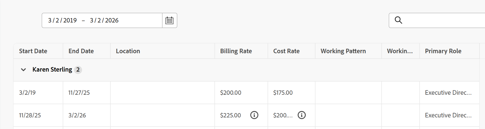

# ユーザーの職歴の表示

次の詳細など、ユーザーの職歴を表示できます。

* 属性
* コストと請求率
* スケジュール

雇用履歴は、これらの詳細がユーザーの時間の経過とともにどのように変化したかを示します。

雇用履歴の各行は、特定の値のセットを表し、この値のセットがユーザーに適用された日付を表示します。 これらの値のいずれかが変更された場合は、新しい値のセットに対して新しい行が表示されます。 情報アイコン は、行間で変更された値をマークします

>[!BEGINSHADEBOX]

**例**

Karen Sterling氏は、2019年3月3日に就任して以来、エグゼクティブディレクターを務めています。 2025年11月11日、彼女の請求とコスト率は上がりましたが、彼女の仕事の役割は同じままでした。

>[!ENDSHADEBOX]

## 職歴の表示

ユーザーリストから雇用履歴を表示したり、ユーザーページで1人のユーザーの合計履歴を表示したりできます。

### ユーザーリストから雇用履歴を表示する

{{step-1-to-users}}

1. 雇用履歴を表示するユーザーの横にあるボックスをクリックします。
1. **雇用履歴** アイコン をクリックします。

   雇用履歴ページが開き、選択したユーザーの履歴が表示されます。

1. 選択した日付範囲を表示するには、日付選択ツールをクリックして日付を調整します。

   ユーザーリストから雇用履歴を表示する場合は、現在の日付の3年前の履歴を表示できます。
1. 結果をフィルタリングするには、**Filter**&#x200B;をクリックし、フィルタリングするフィールド、演算子、値を入力します。 結果は自動的にフィルタリングされます。
1. 列を追加または削除するには、テーブルの右側にある追加アイコン をクリックし、追加する各列の横にあるプラス アイコンをクリックするか、ビューから削除する各列の横にあるマイナス アイコンをクリックします。
1. 雇用履歴を書き出すには、**書き出し**&#x200B;をクリックします。 雇用履歴は、CSVまたはXLSX ファイルとして書き出すことができます。

### ユーザーのページから雇用履歴を表示する

{{step-1-to-users}}

1. 雇用履歴を表示するユーザーの名前をクリックします。
1. ユーザーのユーザーページで、左側のナビゲーションの左側のナビゲーション ](assets/employment-history-left-nav.png)で「雇用履歴をクリックし、追加する各列の横にあるプラス アイコンをクリックするか、ビューから削除する各列の横にあるマイナス アイコンをクリックします。
1. 雇用履歴を書き出すには、**書き出し**&#x200B;をクリックします。 雇用履歴は、CSVまたはXLSX ファイルとして書き出すことができます。

