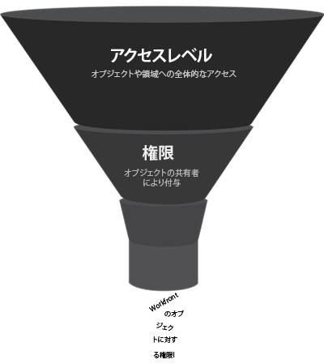

# 新しいアクセスレベルの概要

Adobe Workfront管理者は、次の 2 つの目的でユーザーにアクセスレベルを割り当てます。

* Workfrontにログインして作業するには、すべてのユーザーにアクセスレベルが必要です。
* アクセスレベルを使用して、特定のWorkfrontオブジェクトや領域でユーザーが表示したり実行したりする操作を制御できます。

## Adobe Workfrontの新しい組み込みアクセスレベル {#built-in-access}

Workfrontには、次の 5 つの新しい組み込みアクセスレベルがあります。

* システム管理者
* 標準
* ライト
* コントリビューター
* 外部

ほとんどのWorkfrontオブジェクトタイプでは、アクセスレベルに応じて最大 3 つの権限を使用できます。

<table style="table-layout:auto">
    <tr>
        <td>編集</td>
        <td>ユーザーは、Workfrontオブジェクトの作成、編集、削除および共有ができます</td>
    </tr>
    <tr>
        <td>ビュー</td>
        <td>ユーザーは、 Workfrontオブジェクトを確認および共有できます</td>
    </tr>
    <tr>
        <td>アクセスなし</td>
        <td>ユーザーはWorkfrontオブジェクトにアクセスできません</td>
    </tr>
</table>

カスタムのアクセスレベルが必要な場合は、組み込みのアクセスレベルをコピーし、必要なアクセス量を調整して、様々なWorkfrontオブジェクトタイプに対応できます。 カスタムアクセスレベルの作成について詳しくは、 [カスタムアクセスレベルの作成または変更](../../../administration-and-setup/add-users/configure-and-grant-access/create-modify-access-levels.md).

>[!IMPORTANT]
>
>ユーザーを設定した後で参照できるように、組み込みのアクセスレベルを変更しないことを強くお勧めします。

### システム管理者のアクセスレベル

標準ライセンスに添付されているこの組み込みのアクセスレベルは、Adobe Workfrontシステムの管理を担当するユーザー向けに設計されています。 この組み込みのアクセスレベルは変更できません。

システム管理者のアクセスレベルのユーザーは、Workfront内ですべての操作を実行できます。 他のすべてのユーザーがWorkfrontに入力したすべてのWorkfrontオブジェクトと情報を表示および編集できます。

また、セットアップ領域全体にアクセスし、システムレベルで設定を変更したり、メインメニューのすべての領域にアクセスしたりできます。

詳しくは、 [ユーザーに完全な管理アクセス権を付与する](../../../administration-and-setup/add-users/configure-and-grant-access/grant-a-user-full-administrative-access.md).

### 標準アクセスレベル

また、標準ライセンスに添付されています。このアクセスレベルは、次のユーザー向けに設計されています。

* すべてのプロジェクトを 1 か所で計画、作成、追跡
* ルーチン・プロセスの自動化
* リソースの管理
* リクエストに対するトラッキングと共同作業
* プロジェクトの財務状況を追跡し、報告する
* インバウンドの作業要求を開始
* プロジェクト、タスクおよび問題に関する共同作業

>[!NOTE]
>
>Standard の組み込みアクセスレベルのカスタムバージョンを作成し、様々なWorkfrontオブジェクトタイプに対して使用できるアクセス量を調整できます。 カスタムアクセスレベルの作成について詳しくは、 [カスタムアクセスレベルの作成または変更](../../../administration-and-setup/add-users/configure-and-grant-access/create-modify-access-levels.md).

#### **アクセスの詳細**

標準アクセスレベルのオブジェクトに対して使用できる最高のアクセス設定は次のとおりです。

| Workfrontオブジェクトの種類 | アクセスなし | アクセスを表示 | アクセスを編集 |
|---|---|---|---|
| プロジェクト |   |   | ✓ |
| タスク |   |   | ✓ |
| イシュー |   |   | ✓ |
| ポートフォリオ |   |   | ✓ |
| プログラム |   |   | ✓ |
| レポート（ダッシュボードとカレンダーレポートを含む） |   |   | ✓ |
| フィルター、ビュー、グループ化 |   |   | ✓ |
| ドキュメント |   |   | ✓ |
| ユーザー |   |   | ✓ |
| テンプレート |   |   | ✓ |
| 財務データ |   |   | ✓ |
| リソース管理 |   |   | ✓ |
| シナリオプランナー |   |   | ✓ （デフォルト設定は No Access です。） |
| ボード |   |   | ✓ |
| ホーム |   |   | ✓ |
| 目標 |   |   | ✓ |

{style="table-layout:auto"}

### ライトアクセスレベル

Light ライセンスに添付されているこのアクセスレベルは、次のユーザー向けに設計されています。

* 作業に関連するすべての項目と更新を表示
* プロジェクト、タスクおよび問題の承認
* ダッシュボードとレポートの表示
* 時間を追跡し、タイムシートを承認する
* 問題の作成と管理
* 作業時に更新を行う

ライトアクセスレベルのユーザー：

* 作業項目を割り当てることはできますが、完了できません。
* メインメニューでリクエストやドキュメントにアクセスできます。
* オブジェクトを作成する機能は限られています。プロジェクト、ポートフォリオ、プログラム、レポートを作成することはできません。

>[!NOTE]
>
>Light の組み込みアクセスレベルのカスタムバージョンを作成し、様々なWorkfrontオブジェクトタイプに対して使用できるアクセスの量を調整できます。 カスタムアクセスレベルの作成について詳しくは、 [カスタムアクセスレベルの作成または変更](../../../administration-and-setup/add-users/configure-and-grant-access/create-modify-access-levels.md).

#### **アクセスの詳細**

Light アクセスレベルのオブジェクトに対して使用できる最も高いアクセス設定は次のとおりです。

<table style="table-layout:auto"> 
 <col> 
 <col> 
 <col> 
 <col> 
 <thead> 
  <tr> 
   <th>Workfrontオブジェクトの種類</th> 
   <th>アクセスなし</th> 
   <th>アクセスを表示</th> 
   <th>アクセスを編集</th> 
  </tr> 
 </thead> 
 <tbody> 
  <tr> 
   <td>プロジェクト</td> 
   <td> </td> 
   <td>✓</td> 
   <td> </td> 
  </tr> 
  <tr> 
   <td>タスク</td> 
   <td> </td> 
   <td>✓</td> 
   <td> </td> 
  </tr> 
  <tr> 
   <td>イシュー</td> 
   <td> </td> 
   <td> </td> 
   <td>✓</td> 
  </tr> 
  <tr> 
   <td>ポートフォリオ</td> 
   <td> </td> 
   <td>✓ （デフォルト設定は No Access です。）</td> 
   <td> </td> 
  </tr> 
  <tr> 
   <td>プログラム</td> 
   <td> </td> 
   <td>✓ （デフォルト設定は No Access です。）</td> 
   <td> </td> 
  </tr> 
  <tr> 
   <td>レポート（ダッシュボードとカレンダーレポートを含む）</td> 
   <td> </td> 
   <td>✓</td> 
   <td> </td> 
  </tr> 
  <tr> 
   <td>フィルター、ビュー、グループ化</td> 
   <td> </td> 
   <td> </td> 
   <td>✓</td> 
  </tr> 
  <tr> 
   <td>ドキュメント</td> 
   <td> </td> 
   <td> </td> 
   <td>✓</td> 
  </tr> 
  <tr> 
   <td>ユーザー</td> 
   <td> </td> 
   <td>✓</td> 
   <td> </td> 
  </tr> 
    <tr> 
   <td>チーム</td> 
   <td> </td> 
   <td>✓</td> 
   <td> </td> 
  </tr>
  <tr> 
   <td>テンプレート</td> 
   <td>✓</td> 
   <td> </td> 
   <td> </td> 
  </tr> 
  <tr> 
   <td>財務データ</td> 
   <td>✓</td> 
   <td> 
 
 </td> 
   <td> </td> 
  </tr> 
  <tr> 
   <td>リソース管理</td> 
   <td> </td> 
   <td>✓</td> 
   <td> </td> 
  </tr> 
  <tr> 
   <td>シナリオプランナー </td> 
   <td> </td> 
   <td> </td> 
   <td>✓ （デフォルト設定は No Access です。）</td> 
  </tr> 
  <tr> 
   <td>ボード </td> 
   <td> </td> 
   <td> </td> 
   <td>✓</td> 
     <tr> 
   <td>ホーム </td> 
   <td> </td> 
   <td> </td> 
   <td>✓</td> 
  </tr> 
  <tr>   
   <td>目標 </td> 
   <td> </td> 
   <td> </td> 
   <td>✓</td> 
 </tbody> 
</table>

### 寄稿者のアクセスレベル

寄稿者ライセンスに添付されています。このアクセスレベルは、次のユーザー向けです。

* リクエストを送信
* リクエストの追跡
* リクエストの更新とレビュー

この組み込みのアクセスレベルを持つユーザー：

* リクエストをおこない、それらのリクエストを更新できる
* ドキュメントをアップロードして承認できます
* 送信した問題のステータスを確認できます
* 作業項目に割り当てることはできますが、完了できません
* メインメニューからのみリクエストにアクセスできます。 リクエストキューについて詳しくは、 [リクエストキューの作成](../../../manage-work/requests/create-and-manage-request-queues/create-request-queue.md).

>[!NOTE]
>
>寄稿者の組み込みアクセスレベルのカスタムバージョンを作成し、様々なWorkfrontオブジェクトタイプに対して許可するアクセスの量を調整できます。 カスタムアクセスレベルの作成について詳しくは、 [カスタムアクセスレベルの作成または変更](../../../administration-and-setup/add-users/configure-and-grant-access/create-modify-access-levels.md).

#### **アクセスの詳細**

貢献者アクセスレベルのオブジェクトに対して使用できる最も高いアクセス設定は次のとおりです。

| Workfrontオブジェクトの種類 | アクセスなし | アクセスを表示 | アクセスを編集 |
|---|---|---|---|
| プロジェクト |   | ✓ （プロジェクトの詳細ページのみ） |   |
| タスク |   | ✓（詳細ページのみ） |   |
| 問題 |   |   | ✓ |
| ポートフォリオ | ✓ |   |   |
| プログラム | ✓ |   |   |
| レポート（ダッシュボードとカレンダーレポートを含む） |   | ✓ （「詳細」タブのみ） |   |
| フィルター、ビュー、グループ化 |   |   | ✓ |
| ドキュメント |   |   | ✓ |
| ユーザー |   | ✓ |   |
| チーム |   | ✓ |   |
| テンプレート | ✓ |   |   |
| 財務データ | ✓ |   |   |
| リソース管理 | ✓ |   |   |
| シナリオプランナー | ✓ |   |   |
| ボード |   |   | ✓ （シンプルなカード） |
| ホーム |   | ✓ （更新情報） |   |
| 目標 |   |   | ✓ |

{style="table-layout:auto"}

### 外部ユーザーのアクセスレベル

このアクセスレベルは、有料のWorkfrontライセンスには付属していません。 最も制限が厳しいアクセスレベルです。主に、Workfrontにログインしない外部のコンサルタントなどの共同作業者がドキュメントを確認、ダウンロードまたは表示する必要がある場合に使用します。

Workfrontユーザーは、外部ユーザーがシステムにログインできない場合でも、外部ユーザーにタスクを割り当てることができます。 しかし、この問題は、システム内で未解決のままになるので、我々はこの問題に対して助言を行う。

外部ユーザーのアクセスレベルを持つユーザー：

* 共有されているドキュメントとカレンダーレポートのみを表示できます
* ドキュメントおよびカレンダーレポートを共有しているユーザーを表示します
* 共有されているドキュメントを承認します

このアクセスレベルは変更できません。

>[!IMPORTANT]
>
>「外部ユーザー」は、「セットアップ」の「システム環境設定」領域で「電子メールアドレスを使用して、Workfrontアカウントを持たないユーザーと共同作業する」オプションが有効になっている場合にのみ使用できます。 詳しくは、 [システムセキュリティの環境設定の構成](/help/quicksilver/administration-and-setup/manage-workfront/security/configure-security-preferences.md).

#### **アクセスの詳細**

外部ユーザーアクセスレベルのオブジェクトに対して使用できる最も高いアクセス設定を次に示します。

| Workfrontオブジェクトの種類 | アクセスなし | アクセスを表示 | アクセスを編集 |
|---|---|---|---|
| プロジェクト | ✓ |   |   |
| タスク | ✓ |   |   |
| 問題 | ✓ |   |   |
| ポートフォリオ | ✓ |   |   |
| プログラム | ✓ |   |   |
| レポート（ダッシュボードとカレンダーレポートを含む） |   | ✓ （カレンダーレポートの場合のみ、レポートを共有できない） |   |
| フィルター、ビュー、グループ化 | ✓ |   |   |
| ドキュメント |   | ✓ （ドキュメントを共有できません） |   |
| ユーザー |   | ✓ |   |
| チーム | ✓ |   |   |
| テンプレート | ✓ |   |   |
| 財務データ | ✓ |   |   |
| リソース管理 | ✓ |   |   |
| シナリオプランナー | ✓ |   |   |
| ボード | ✓ |   |   |
| ホーム | ✓ |   |   |
| 目標 | ✓ |   |   |

## アクセスレベルと権限の連携

アクセスレベルは、プロジェクト、タスク、問題など、システムの一般的なオブジェクトタイプや領域でユーザーが表示および実行できる内容を定義します。 権限は、マーケティングキャンペーンを実行するために作成されたプロジェクトなど、システム内の他のユーザーが作成した特定のオブジェクトに対して、何にアクセスできるかを定義します。

次の表は、ユーザーのオブジェクト（ユーザーのアクセスレベルで定義）に対する一般的なアクセス権と、特定の共有オブジェクトに対する権限を比較したものです。

<table style="table-layout:auto"> 
 <col> 
 <col> 
 <col> 
 <thead> 
  <tr> 
   <th> </th> 
   <th>アクセスレベル </th> 
   <th>権限 </th> 
  </tr> 
 </thead> 
 <tbody> 
  <tr> 
   <td>ユーザーのアクセスレベルでWorkfront管理者が許可</td> 
   <td>✓</td> 
   <td> </td> 
  </tr> 
  <tr> 
   <td>オブジェクトレベルでオブジェクトを共有するユーザーによって付与される</td> 
   <td> </td> 
   <td>✓</td> 
  </tr> 
  <tr> 
   <td> 
上位の共有オブジェクトから継承 
   </td> 
   <td> </td> 
   <td>✓</td> 
  </tr> 
 </tbody> 
</table>

ユーザーがオブジェクトを使用して実行できるアクティビティは、アクセスレベルと、ユーザーに付与されている権限の組み合わせで定義されます。

### オブジェクトの共有を通じた権限の付与

ユーザーは、他のユーザーが個々のオブジェクトに対して特定の権限を共有し、付与すると、それらのオブジェクトに対するアクセス権を取得します。

>[!NOTE]
>
>* ユーザーが特定の権限を持つオブジェクトを共有し、そのオブジェクトの下に子オブジェクトがある場合、受信者はそれらの子オブジェクトに対して同じ権限を継承します。
>* アクセスレベルで特定のオブジェクトの削除が制限されている場合、それらのオブジェクトに含まれる子オブジェクトを削除するのを防ぐことはできません。

ユーザーは、個々のオブジェクトに対して、次の権限のいずれかを受信者に付与できます。

* **表示**：このレベルの権限を使用すると、受信者は次のいずれかの方法でオブジェクトを共有できます。

   * すべてのユーザーが表示できるよう、システム全体で（すべてのオブジェクトでは使用できない）
   * Workfrontのライセンスを持たない外部ユーザー（一部のオブジェクトでは利用できません）の場合
   * E メールアドレス（ドキュメントとカレンダーに対してのみ使用可能）

* **Contribute**: （一部のオブジェクトでは使用できません）
* **管理**：誰かがオブジェクトを共有する場合、そのオブジェクトに対する受信者の権限は、受信者のアクセスレベルと、共有者が付与したオブジェクトに対する権限の組み合わせによって決まります。 その組み合わせで使用できるアクセスの最も低い程度が、受信者がオブジェクトに対して何をできるかを決定します。

### シナリオの例

#### **シナリオ 1**

受信者のアクセスレベルでプロジェクトの編集が許可されていない場合、そのユーザーは、管理権限を共有者が付与しても、プロジェクトを編集または削除できません。

また、受信者のアクセスレベルでプロジェクトの編集が許可されているが、共有者がプロジェクトに対する表示のみの権限を付与している場合、ユーザーはプロジェクトを編集または削除できません。

#### **シナリオ 2**

Olivia が Tony とWorkfrontのプロジェクトを共有すると、Tony のそのプロジェクトへのアクセス権は次の 2 つの要素の組み合わせによって決まります。

* Tony のアクセスレベル (Workfront管理者によって割り当てられる )
* Olivia によって指定された、プロジェクトに対する Tony の権限

Tony のプロジェクトに対する行動は、プロジェクトに対してさらに制限されることができますが、彼のアクセスレベルで許されるものを超えて、自由に制限することはできません。

* Tony のアクセスレベルでタスクの作成が許可されない場合、Olivia がタスクを追加する権限を与えても、タスクをプロジェクトに追加できません。
* Tony のアクセスレベルでタスクを作成できない場合、Olivia はタスクをプロジェクトに追加する権限を付与しなかったので、そのプロジェクトにタスクを追加することはできませんが、他のプロジェクトにタスクを追加する権限が与えられています。
