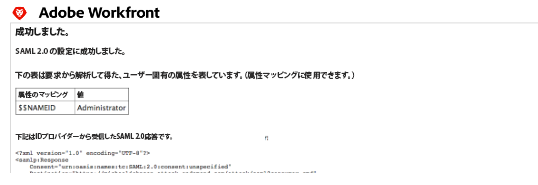

# ADFS を使用した Adobe Workfront と SAML 2.0 の連携の設定

{{important-admin-console-onboard}}

Adobe Workfront の管理者は、Active Directory Federation Services（ADFS）の使用中に、Workfront を、シングルサインオン用の Security Assertion Markup Language（SAML）2.0 ソリューションと統合できます。

このガイドでは、自動プロビジョニングまたは属性マッピングを使用しない ADFS の設定に焦点を当てています。自動プロビジョニングを設定する前に、設定を完了してテストすることをお勧めします。

## アクセス要件

この記事の手順を実行するには、次のアクセス権が必要です。

<table style="table-layout:auto"> 
 <col> 
 <col> 
 <tbody> 
  <tr> 
   <td role="rowheader">Adobe Workfront プラン</td> 
   <td>任意</td> 
  </tr> 
  <tr> 
   <td role="rowheader">Adobe Workfront ライセンス</td> 
   <td>プラン</td> 
  </tr> 
  <tr> 
   <td role="rowheader">アクセスレベル設定</td> 
   <td> 
Workfront 管理者である必要があります。
 
<b>メモ</b>：まだアクセス権がない場合は、Workfront 管理者に問い合わせて、アクセスレベルに追加の制限が設定されているかどうかを確認してください。Workfront 管理者がアクセスレベルを変更する方法について詳しくは、<a href="../../../administration-and-setup/add-users/configure-and-grant-access/create-modify-access-levels.md" class="MCXref xref">カスタムアクセスレベルの作成または変更</a>を参照してください。
 </td> 
  </tr> 
 </tbody> 
</table>

## SAML 2.0 と連携する Workfront に対する認証の有効化

SAML 2.0 を使用してWorkfront web アプリケーションと Workfront モバイルアプリケーションに対する認証を有効にするには、次の節を完了します。

* [Workfront SSO メタデータファイルの取得](#retrieve-the-workfront-sso-metadata-file)
* [証明書利用者信頼の設定](#configure-relying-party-trusts)
* [要求ルールの設定](#configure-claim-rules)
* [メタデータファイルのアップロードと接続テスト](#upload-the-metadata-file-and-test-the-connection)

### Workfront SSO メタデータファイルの取得 {#retrieve-the-workfront-sso-metadata-file}

1. Adobe Workfront の右上隅にある&#x200B;**メインメニュー**&#x200B;アイコン 、**設定**  の順にクリックします。
1. 左側のパネルで、**システム**／**シングルサインオン（SSO）**&#x200B;をクリックします。
1. **タイプ**&#x200B;ドロップダウンメニューで「**SAML 2.0**」をクリックすると、追加の情報とオプションが表示されます。
1. **メタデータ URL** の後に表示される URL をコピーします。
1. [証明書利用者信頼の設定](#configure-relying-party-trusts)の節に進みます。

### 証明書利用者信頼の設定 {#configure-relying-party-trusts}

1. Windows Server 2008 R2（バージョンは異なる場合があります）を使用して、**ADFS マネージャー**&#x200B;を開きます。
1. **開始**&#x200B;に移動します。
1. **管理ツール**&#x200B;をクリックします。
1. **ADFS 2.0 管理**&#x200B;をクリックします。
1. **ADFS**&#x200B;を選択して、**信頼関係**&#x200B;を展開します。
1. **証明書利用者信頼**&#x200B;を右クリックし、「**証明書利用者信頼を追加**」をクリックして、証明書利用者信頼を追加ウィザードを開始します。
1. **ようこそページ**&#x200B;から、「**開始**」を選択します。
1. 「**日付のソースを選択**」セクションで、Workfront からメタデータ URL をペーストします。
1. 「**次へ**」をクリックします。
1. 「**OK**」をクリックして、警告メッセージを確認します。
1. 「**表示名を指定**」セクションに、**表示名**&#x200B;および&#x200B;**メモ**&#x200B;を追加して、信頼を区別し、「**次へ**」をクリックします。
1. 「**すべてのユーザーがこの証明書利用者にアクセスすることを許可**」（または、後で設定する場合は「**なし**」）を選択します。
1. 「**次へ**」をクリックします。

   これにより、「**信頼の追加準備完了**」セクションに移動します。

1. 次の[要求ルールの設定](#configure-claim-rules)の節に進みます。

### 要求ルールの設定 {#configure-claim-rules}

1. 「**信頼の追加準備完了**」セクションで「**次へ**」をクリックして、「**要求ルールを編集ダイアログボックスを開く**」オプションが選択されていることを確認します。

   これにより、後のステップで要求ルールを編集できます。

1. 「**閉じる**」をクリックします。
1. 「**ルールを追加**」をクリックします。
1. 「**LDAP 属性を要求として送信**」を選択します。
1. 「**次へ**」をクリックし、**要求ルールの構成**&#x200B;手順を表示します。
1. 要求ルールを構成するには、以下の最小要件を指定します（このルールは、ユーザー設定の&#x200B;**連合 ID** に入って、ログインしているユーザーの区別に使用します）。

   <table >                
      <tbody>
            <tr>
               <td>要求ルール名
               </td>
               <td>要求ルールの名前を指定します。例えば「Workfront」。</td>
            </tr>
            <tr>
               <td>属性ストア</td>
               <td >ドロップダウンメニューから <b>Active Directory</b> を選択します。</td>
            </tr>
            <tr>
               <td>LDAP 属性</td>
               <td>任意のタイプの属性を指定できます。この属性には <b>SAM-Account-Name</b> を使用することをお勧めします。</td>
            </tr>
            <tr>
               <td>発信する要求のタイプ</td>
               <td>発信する要求のタイプとして<b>名前 ID</b> を選択する必要があります。</td>
            </tr>
      </tbody>
   </table>

1. （オプション）自動プロビジョニングを確立するには、LDAP 属性と発信する要求のタイプの両方で次の要求を追加します。

   * 名
   * 姓
   * メールアドレス

1. 「**完了**」をクリックし、次の画面で「**OK**」をクリックします。
1. 新しい&#x200B;**証明書利用者の信頼**&#x200B;を右クリックし、「**プロパティ**」を選択します。
1. **「詳細」タブ**&#x200B;を選択します。そして「**セキュア ハッシュ アルゴリズム**」で「SHA-1」または「SHA-256」を選択します。

   >[!NOTE]
   >
   >「セキュア ハッシュ アルゴリズム」で選択するオプションは、設定／システム／シングルサインオン (SSO) にある「Workfront」の「セキュア ハッシュ アルゴリズム」フィールドと一致する必要があります。

1. 次の節[メタデータファイルをアップロードして接続をテスト](#upload-the-metadata-file-and-test-the-connection)に続きます。

### メタデータファイルのアップロードと接続テスト {#upload-the-metadata-file-and-test-the-connection}

1. ブラウザーを開き、`https://<yourserver>/FederationMetadata/2007-06/FederationMetadata.xml` にアクセスします。

   メタデータファイルの FederationMetadata.xml ファイルをダウンロードしてください。

1. **IDプロバイダメタデータからフィールドを入力する**&#x200B;の「**ファイルを選択**」をクリックし、**FederationMetadata.xml** ファイルを選択します。

1. （オプション）証明書の情報にメタデータファイルが入力されていない場合は、ファイルを個別にアップロードすることができます。「**証明書**」セクションの「**ファイルを選択**」を選択します。

1. 「**テスト接続**」をクリックします。正しく設定されていると、次のようなページが表示されます。

   

   >[!NOTE]
   >
   >属性マッピングを設定する場合は、テスト接続からディレクトリ属性に属性をコピーします。詳しくは、ユーザー属性のマッピングを参照してください。

1. 「**管理の免除**」を選択し、Workfront 管理者がバイパス URL のある Workfront 資格情報を使用してログインできるようにします。

   `<yourdomain>`.my.workfront.com/login を指すブックマークがリダイレクトをバイパスします。

1. 「**有効にする**」ボックスを選択して設定を有効にします。
1. 「**保存**」をクリックします。

## SSO のユーザーの更新について

このガイドに従うと、**SSO ユーザー名**&#x200B;は対応する **Active Directory ユーザー名**&#x200B;になります。

Workfront 管理者は、SSO のユーザーを一括更新できます。SSO のユーザーの更新について詳しくは、[シングルサインオンのユーザーを更新](../../../administration-and-setup/add-users/single-sign-on/update-users-sso.md)を参照してください。

Workfront 管理者は、ユーザーのプロファイルを編集したり、「連合 ID」フィールドに入力したりして、連合 ID を手動で割り当てることもできます。ユーザーの編集について詳しくは、 [ユーザーのプロファイルを編集](../../../administration-and-setup/add-users/create-and-manage-users/edit-a-users-profile.md)を参照してください。

>[!NOTE]
>
>ユーザーのプロファイルを編集して連合 ID を入れる場合に、**SAML 2.0 認証のみを許可**&#x200B;を選択すると、バイパス URL（`<yourdomain>`.my.workfront.com/login）を使用して Workfront にログインできなくなります。
