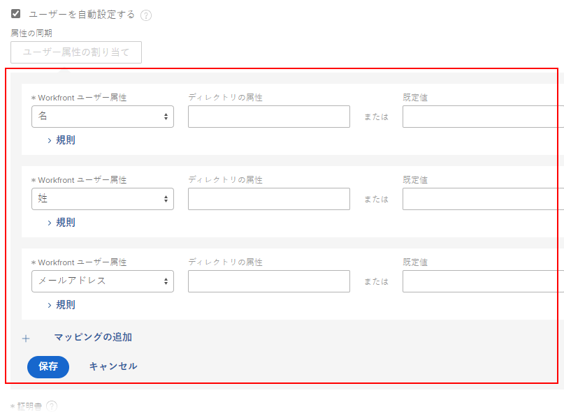
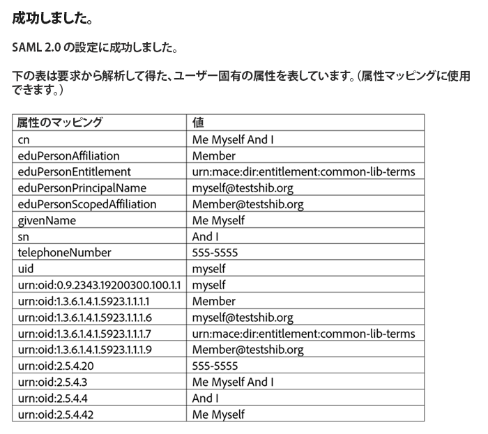

# SAML 2.0 でのAdobe Workfrontの設定

<!--
**DON'T DELETE, DRAFT OR HIDE THIS ARTICLE. IT IS LINKED TO THE PRODUCT, THROUGH THE CONTEXT SENSITIVE HELP LINKS.** 

-->

{{important-admin-console-onboard}}

Adobe Workfrontの管理者は、Workfront Web およびモバイルアプリケーションを、シングルサインオン (SSO) 用の Security Assertion Markup Language(SAML)2.0 ソリューションと統合するように設定できます。

Workfrontで SAML 2.0 を設定したら、次の節で説明するように、設定を維持できます ( [ID プロバイダーの SAML 2.0 メタデータの更新](../../../administration-and-setup/add-users/single-sign-on/update-saml-2-metadata-ip.md).

## アクセス要件

この記事の手順を実行するには、次のアクセス権が必要です。

<table style="table-layout:auto"> 
 <col> 
 <col> 
 <tbody> 
  <tr> 
   <td role="rowheader">Adobe Workfrontプラン</td> 
   <td>任意</td> 
  </tr> 
  <tr> 
   <td role="rowheader">Adobe Workfrontライセンス</td> 
   <td>
新規：標準 

       
または
 
       
現在：プラン 

   </td> 
  </tr> 
  <tr> 
   <td role="rowheader">アクセスレベル設定</td> 
   <td> 
Workfront管理者である。
 
<b>注意</b>：まだアクセス権がない場合は、Workfront管理者に問い合わせて、アクセスレベルに追加の制限が設定されているかどうかを確認してください。 Workfront管理者がアクセスレベルを変更する方法について詳しくは、 <a href="../../../administration-and-setup/add-users/configure-and-grant-access/create-modify-access-levels.md" class="MCXref xref">カスタムアクセスレベルの作成または変更</a>.
 </td> 
  </tr> 
 </tbody> 
</table>

## SAML 2.0 でのWorkfrontに対する認証の有効化

{{step-1-to-setup}}

1. クリック **システム** > **シングルサインオン (SSO)。**

1. Adobe Analytics の **タイプ** ドロップダウンリストで、「 **SAML 2.0。**

1. 表示されるオプションの上部にある「 **SAML 2.0 メタデータのダウンロード** をクリックして、お使いのコンピューターにファイルをダウンロードします。

   SAML 2.0 ID プロバイダーには、Workfrontインスタンスで生成された情報を含む XML ファイルが必要です。 ファイルをダウンロードした後、SAML 2.0 ID プロバイダーサーバーにアクセスし、そこにWorkfront SAML 2.0 メタデータ XML ファイルをアップロードする必要があります。

1. Workfrontで次の情報を指定します。

   <table style="table-layout:auto">
    <col>
    <col>
    <tbody>
     <tr>
      <td role="rowheader">サービス プロバイダ ID </td>
      <td> この URL は既に入力されており、ID プロバイダーに対してWorkfrontを識別します。 例： <code>&lt;yourcompany&gt;.com/SAML2</code>.</td>
     </tr>
     <tr>
      <td role="rowheader">連結タイプ </td>
      <td> 
認証情報の送信に IDP サーバーでサポートされる方法を選択します。

       <ul>
       <li>投稿する</li>
       <li>リダイレクト</li>
       </ul> </td>
     </tr>
     <tr>
      <td role="rowheader">IDプロバイダメタデータからフィールドを入力する </td> 
      <td>SAML 2.0 ID プロバイダーソリューションで、サービスプロバイダーメタデータ XML ファイルを書き出し、コンピューター上の一時的な場所に保存します。 選択 <strong>ファイルを選択</strong>次に、保存したファイルを見つけて選択し、Workfront設定に追加します。</td> 
     </tr> 
     <tr> 
      <td role="rowheader">ログインポータル URL </td> 
      <td>組織の共通のログインポータルを入力します。 これは、ユーザーがWorkfrontおよび SAML 2.0 と統合されているその他すべてのアプリケーションにログインする URL です。</td> 
     </tr>
     <tr>
      <td role="rowheader">ログアウト URL </td> 
      <td> 
IDP サーバーのログアウト URL を入力します。 WorkfrontがWorkfrontからサインアウトする前に、この URL に HTTP リクエストを送信します。 これにより、Workfrontセッションが閉じると、リモートサーバー上のユーザーのセッションが閉じられます。
 
<b>注意</b>：サインアウト URL にリダイレクトされるのは、オプションがある場合のみです。 <strong>SAML 2.0 認証のみを許可</strong> が有効になっていることを確認します。
 </td>
     </tr>
     <tr>
      <td role="rowheader">パスワードの変更 URL </td> 
      <td> 
 ユーザーがリダイレクトされてパスワードを変更する URL を指定します。 
 
Workfrontへのアクセスには SAML 2.0 資格情報が使用されるので、Workfrontを通じてこのアクティビティを完了する代わりに、SAML 2.0 パスワードを変更できるページにユーザーがリダイレクトされる必要があります。
 </td> 
     </tr> 
     <tr> 
      <td role="rowheader">セキュア ハッシュ アルゴリズム </td> 
      <td> 
IDP がサポートする Secure Hash Algorithm(SHA) を選択します。
 
       <ul> 
       <li>SHA-1</li> 
       <li>SHA-256</li> 
       </ul> </td> 
     </tr> 
     <tr> 
      <td role="rowheader">ユーザーの自動プロビジョニング </td> 
      <td> 
このオプションを選択すると、ディレクトリのユーザー名とパスワードを持つ新しいユーザーが初めてWorkfrontにログインしようとすると、システムに自動的にユーザーが作成されます。
 
Workfrontでユーザーを作成するには、Workfrontデータ属性をディレクトリプロバイダー内の次のユーザーデータ属性とマッピングする必要があります。
 
       <ul> 
       <li>名</li> 
       <li>姓</li> 
       <li>メールアドレス</li> 
       </ul> 
       
このチェックボックスを選択すると、次のオプションが表示されます。
 
       
  
 
       
マッピングするWorkfrontユーザー属性をドロップダウンリストから選択し、対応するディレクトリ属性をユーザーディレクトリで指定します。
 
       
The <strong>ディレクトリ属性</strong> フィールドには、SAML 2.0 設定を正常にテストする際に保存したユーザー属性テーブルのディレクトリ属性名を含める必要があります。
 
       
デフォルトのWorkfront値は、 <strong>デフォルト値</strong> フィールドに入力します。 また、SAML 2.0 ID プロバイダーの値に基づいてルールを設定することもできます。
 
       
<b>警告</b>:Workfrontは、ユーザーがシステムにログインするたびに、以下に示す属性のマッピングを試みます。 このため、アクセスレベルのマッピングはお勧めしません。 属性が正しくマッピングされていない場合は、管理アクセスを簡単に削除できます。 クリック <strong>マッピングを追加</strong> をクリックして、ルールを追加します。
       
 
       
次のWorkfront属性をマッピングできます。
 
      <ul> 
      <li> 
アクセスレベル
 </li> 
      <li> 
住所
 </li> 
      <li> 
住所2
 </li> 
      <li> 
1 時間当たりの請求
 </li> 
      <li> 
市区町村
 </li> 
      <li> 
会社
 </li> 
      <li> 
1 時間当たりのコスト
 </li> 
      <li> 
メールアドレス
 </li> 
      <li> 
内線
 </li> 
      <li> 
名
 </li> 
      <li> 
ホーム グループ
 </li> 
      <li> 
ホーム チーム
 </li> 
      <li> 
担当業務
 </li> 
      <li> 
姓
 </li> 
      <li> 
レイアウトテンプレート
 </li> 
      <li> 
マネージャー
 </li> 
      <li> 
携帯電話
 </li> 
      <li> 
電話番号
 </li> 
      <li> 
郵便番号
 </li> 
      <li> 
スケジュール
 </li> 
      <li> 
状態
 </li> 
      <li> 
定期タイムシート
 </li> 
      <li> 
タイトル
 </li> 
      </ul>
      
クリック <strong>保存</strong> ユーザー属性のマッピングが終了したら、次の手順に従います。
 </td> 
     </tr> 
     <tr> 
      <td role="rowheader">証明書 </td> 
      <td> 
認証サービスとWorkfront間の安全な接続を確保するには、有効な SSL 証明書をアップロードします。 OnDemand アカウントの場合、証明書は常に必要です。 この証明書は、SAML 2.0 システム管理者から取得できます。
 </td> 
     </tr> 
     <tr> 
      <td role="rowheader">管理の免除 </td> 
      <td> 
Workfront管理者がWorkfrontログインを使用してWorkfrontにアクセスできるようにします。 このオプションを選択しない場合、Workfront管理者は SAML 2.0 のユーザー名とパスワードを使用する必要があります。
 
      
Workfrontは、まず、Workfront System Administrator のアクセスレベルを持つユーザーの SAML 2.0 を使用してWorkfrontにログインしようとします。 SAML 2.0 認証が失敗した場合、WorkfrontはWorkfront管理者にローカル認証を使用します。
 
      
SAML 2.0 プロバイダーを一時的に使用できなくなった場合にWorkfront管理者がWorkfrontにログインできるように、このオプションを常に選択しておくことをお勧めします。
 </td> 
     </tr> 
     <tr> 
      <td role="rowheader">有効にする </td> 
      <td> 
Workfrontシステムで SSO をアクティブ化します。 ログイン手順がユーザーに伝わっていることを確認します。
 
Workfrontで SSO 設定を有効にした後、 <strong>SAML 2.0 認証のみを許可</strong> 設定をすべてのユーザーに対して設定し、SSO を使用できるようにします。
 
SSO のユーザーの更新の詳細は、 <a href="../../../administration-and-setup/add-users/single-sign-on/update-users-sso.md" class="MCXref xref">シングルサインオンのユーザーを更新する</a>.
 
ユーザー設定について詳しくは、 <a href="../../../administration-and-setup/add-users/create-and-manage-users/edit-a-users-profile.md" class="MCXref xref">ユーザーのプロファイルの編集</a>.
 </td> 
     </tr> 
     <tr> 
      <td role="rowheader">構成の確認 </td> 
      <td> 
      
クリック <strong>接続をテスト</strong> :Workfrontと SAML 2.0 ID プロバイダーが互いに通信できることを確認します。 この接続は、XML ファイルを交換した場合にのみ成功します。
      
 
      
SAML 2.0 ID プロバイダーとWorkfrontの間のリンクを正常にテストすると、次の画像のような画面が表示されます。

      
<b>注意</b>：この画面はブラウザーのポップアップに表示されるので、ブラウザーでポップアップブロッカーを無効にしてください。

      
表に表示される情報を保存して、後で使用できるようにします。

      

</td> 
     </tr> 
    </tbody> 
   </table>

1. クリック **保存** をクリックして SAML 2.0 設定を保存します。
