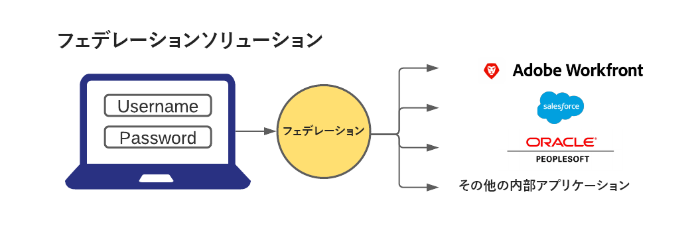

# Adobe Workfront でのシングルサインオンの概要

<!--Audited: 12/2023-->

{{important-admin-console-onboard}}

Workfrontは、Workfrontを既存の会社の SSO ソリューションと統合する、一元的に管理されたシングルサインオン (SSO) 設定を提供します。 この設定は、OnDemand と OnPremise の両方のエンタープライズユーザーが利用できます。

Workfrontで SSO 機能を使用するには、組織で SSO アプリケーションを設定する必要があります。 その後、Workfront を設定して、SSO ソリューションと通信できるようにします。

連合型ソリューションを使用すると、ユーザーは、一元化されたログインポータルにユーザー名とパスワードを入力して、すべてのアプリケーションにログインできます。

## ファイアウォールの設定

SSO ソリューションを使用する場合、Workfront は指定されたポートでサーバーへの接続を開始します。

ファイアウォールまたはメールサーバーが特定のベンダーへのアクセスのみを許可するように設定されている場合は、特定のWorkfront IP アドレスをファイアウォールサーバーに追加する必要があり許可リストに加えるます。 詳しくは、[ファイアウォールの許可リストの設定](../../../administration-and-setup/get-started-wf-administration/configure-your-firewall.md)を参照してください。

## シングルサインオンの設定

Workfront は、次の SSO ソリューションと統合されています。

* SAML 2.0 をサポートする連合型ソリューション

  Workfrontと SAML 2.0 の統合について詳しくは、[SAML 2.0 での Adobe Workfront の設定](../../../administration-and-setup/add-users/single-sign-on/configure-workfront-saml-2.md)を参照してください。

* ADFS を使用した SAML 2.0 をサポートする連合型ソリューション

  ADFS を使用した Workfrontと SAML 2.0 の統合について詳しくは、[ADFS を使用した SAML 2.0 での Adobe Workfront の設定](../../../administration-and-setup/add-users/single-sign-on/configure-workfront-saml-2-adfs.md)を参照してください。
