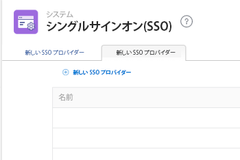

# 拡張認証を使用する際に IDP の SAML 2.0 メタデータを更新する

<!-- enhanced authentication is no longer available for workfront customers -->

{{important-admin-console-onboard}}

Adobe Workfront管理者は、Workfrontシングルサインオン (SSO) を、Security Assertion Markup Language(SAML)2.0 プロトコルをサポートする任意の ID プロバイダーと統合できます。

次の節では、Workfrontアカウントが拡張認証エクスペリエンスにアップグレードされた（一部の組織ではまだ利用できない）場合の統合プロセスについて説明します。 拡張認証エクスペリエンスについて詳しくは、 [拡張認証の概要](../../../administration-and-setup/manage-workfront/security/get-started-enhanced-authentication.md).

拡張認証エクスペリエンスに移行する前の SAML の設定について詳しくは、 [ID プロバイダーの SAML 2.0 メタデータの更新](../../../administration-and-setup/add-users/single-sign-on/update-saml-2-metadata-ip.md).

## アクセス要件

この記事の手順を実行するには、次のアクセス権が必要です。

<table style="table-layout:auto"> 
 <col> 
 <col> 
 <tbody> 
  <tr> 
   <td role="rowheader">Adobe Workfrontプラン</td> 
   <td>任意</td> 
  </tr> 
  <tr> 
   <td role="rowheader">Adobe Workfrontライセンス</td> 
   <td>計画</td> 
  </tr> 
  <tr> 
   <td role="rowheader">アクセスレベル設定</td> 
   <td> 
Workfront管理者である。
 
<b>注意</b>:まだアクセス権がない場合は、Workfront管理者に、アクセスレベルに追加の制限を設定しているかどうかを問い合わせてください。 Workfront管理者がアクセスレベルを変更する方法について詳しくは、 <a href="../../../administration-and-setup/add-users/configure-and-grant-access/create-modify-access-levels.md" class="MCXref xref">カスタムアクセスレベルの作成または変更</a>.
 </td> 
  </tr> 
 </tbody> 
</table>

## ID プロバイダーとして Okta を使用する

Okta は、SAML 2.0 をサポートする ID プロバイダーの例です。この節では、Okta を ID プロバイダーとして使用する方法について説明します。 SAML 2.0 をサポートする別の ID プロバイダーを設定する場合も、同様の手順が必要です。

>[!NOTE]
>
>ユーザーは電子メールアドレスに基づいてマッピングされます。 Okta を使用してWorkfrontにログインするには、Workfrontのお客様に同じ（大文字と小文字が区別されない）E メールアドレスを持つユーザーが作成されている必要があります。

以下の節を完了して、Okta をWorkfrontで ID プロバイダーとして設定します。

* [Okta でのWorkfrontアプリの作成](#create-a-workfront-app-in-okta)
* [Okta インスタンスをWorkfrontの ID プロバイダーとして追加する](#add-your-okta-instance-as-an-identity-provider-in-workfront)

### Okta でのWorkfrontアプリの作成 {#create-a-workfront-app-in-okta}

1. Okta 環境にログインします。
1. 以下を確認します。 **クラシック UI** が Okta インターフェイスの左上隅で選択されている。
1. メニューで、 **アプリ** > **アプリ**.

1. クリック **アプリを追加**&#x200B;を選択し、「 **新しいアプリを作成**.

1. 内 **新しいアプリケーション統合の作成ダイアログ** ボックス、 **SAML 2.0**&#x200B;を選択し、「 **作成**.

1. Workfrontアプリの名前を指定し、 **次へ**.
1. 表示される SAML 設定ページで、SAML 設定ページに必要な情報を探します。

   1. Okta インターフェイスが表示されているブラウザタブを終了せずに、別のブラウザタブまたはウィンドウを開きます。
   1. ブラウザーで次の URL を指定します。

      `https://[your_customer_subdomain].my.workfront.com/auth/saml2/metadata`

   1. 結果の XML ファイルで、 **entityID** および **場所**.

      

   1. 値を **entityID** フィールドをシステムクリップボードに追加します。 このブラウザタブを閉じないでください。

1. 手順 6 で開いた SAML 設定ページに戻ります。
1. 次の **entityID** 入る **オーディエンス URI（SP エンティティ ID）** フィールドに入力します。

1. 他のブラウザータブの XML ファイルで、 **場所** フィールドに入力します。
1. 次の **場所** 入る **シングルサインオン** **URL** フィールドに入力します。

1. スクロールして **属性ステートメント（オプション）** 」セクションに入力します。
1. 内 **名前** フィールド、指定 **電子メール**.

1. 内 **値** フィールド、指定 **user.email**.

1. （オプション）詳細値を追加します。
1. クリック **次へ**.
1. 選択、 **内部アプリを追加している Okta のお客様です**&#x200B;を選択し、「 **完了**.

### Okta インスタンスをWorkfrontの ID プロバイダーとして追加する {#add-your-okta-instance-as-an-identity-provider-in-workfront}

この手順では、Okta をWorkfrontで ID プロバイダーとして設定するための重要な情報を提供します。 その他のマッピングや設定オプションについて詳しくは、 [SAML 2.0 でのAdobe Workfrontの設定](../../../administration-and-setup/add-users/single-sign-on/configure-workfront-saml-2.md).

1. Okta インスタンス用の ID プロバイダーメタデータをダウンロードします。

   1. Okta 環境にログインします。
   1. 以下を確認します。 **クラシック UI** が Okta インターフェイスの左上隅で選択されている。
   1. メニューで、 **アプリ** > **アプリ**.

   1. 作成したWorkfrontアプリをクリックします（「 」の節を参照）。 [Okta でのWorkfrontアプリの作成](#create-a-workfront-app-in-okta)
   1. の **サインオン** タブ、クリック **ID プロバイダーメタデータ**.

      

      メタデータが XML として新しいブラウザータブで開かれます。

   1. ブラウザーの URL フィールドに表示される URL をコピーします。

1. Workfront管理者としてWorkfrontにログインします。
1. 次をクリック： **メインメニュー** アイコン  Adobe Workfrontの右上隅で、 **設定** .

1. 左側のパネルで、 **システム** > **シングルサインオン (SSO)**.

1. （条件付き）2 つのタブが表示される場合、 **新しい SSO プロバイダ** タブをクリックします。

   

   >[!IMPORTANT]
   >
   >既存の SSO 設定は、 **現在の SSO プロバイダー** 「 」タブに移動し、アカウントが拡張認証機能に更新され、新しい SSO 設定が完全に機能するようになります。

1. クリック **新しい SSO プロバイダー**.
1. Okta IDP などの名前を指定し、説明を指定します。
1. 内 **ID プロバイダーメタデータからのフィールドの入力** 「 」セクションで、手順 1 でコピーした URL を、 **メタデータ URL** フィールドに入力します。\
   または、 **ファイルを選択** .xml ファイルをアップロードする場合は、この URL を貼り付けることをお勧めします。

1. 内 **ユーザ属性をマッピング** セクション内の **ディレクトリ属性** フィールド、タイプ **電子メール**. (**電子メールアドレス** が **Workfront User Attribute** フィールド )

1. （オプション）有効にする **デフォルトの SSO プロバイダーにする** 認証用にWorkfrontのログイン画面ではなく、認証されていないユーザーを id プロバイダーのログイン画面に送信する場合。 システム内のすべてのユーザーが ID プロバイダーを通じてWorkfrontにアクセスする場合にのみ、このオプションを有効にすることをお勧めします。
1. を選択します。 **有効にする** チェックボックス。 その前に、システム内のユーザーが新しいログイン操作を認識し、Workfrontシステムへのアクセス権が失われないようにしてください。
1. クリック **接続をテスト**.\
   接続が成功したことを示すメッセージが表示されます。

1. 「**保存**」をクリックします。

## 他の ID プロバイダーの使用

Okta 以外の ID プロバイダー（Ping や Centrify など）を使用する場合は、Workfrontメタデータを ID プロバイダーに再アップロードする必要があります。
