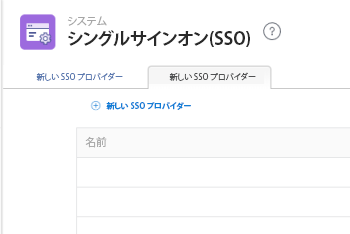

# 拡張認証を使用する際の IDP の SAML 2.0 メタデータの更新

<!-- enhanced authentication is no longer available for workfront customers -->

{{important-admin-console-onboard}}

Adobe Workfront 管理者は、Security Assertion Markup Language（SAML）2.0 プロトコルをサポートする任意の ID プロバイダーを Workfront シングルサインオン（SSO）で統合できます。

以下の節では、Workfront アカウントが拡張認証バージョンにアップグレードされている（まだご利用できない組織もあります）場合の統合プロセスについて説明します。拡張認証バージョンについて詳しくは、[拡張認証の概要](../../../administration-and-setup/manage-workfront/security/get-started-enhanced-authentication.md)を参照してください。

拡張認証バージョンに移行する前の SAML 設定について詳しくは、[ID プロバイダーの SAML 2.0 メタデータの更新](../../../administration-and-setup/add-users/single-sign-on/update-saml-2-metadata-ip.md)を参照してください。

## アクセス要件

この記事の手順を実行するには、次のアクセス権が必要です。

<table style="table-layout:auto"> 
 <col> 
 <col> 
 <tbody> 
  <tr> 
   <td role="rowheader">Adobe Workfront プラン</td> 
   <td>任意</td> 
  </tr> 
  <tr> 
   <td role="rowheader">Adobe Workfront ライセンス</td> 
   <td>プラン</td> 
  </tr> 
  <tr> 
   <td role="rowheader">アクセスレベル設定</td> 
   <td> 
Workfront 管理者である必要があります。
 
<b>メモ</b>：まだアクセス権がない場合は、アクセスレベルに追加の制限が設定されていないかどうか Workfront 管理者にお問い合わせください。Workfront 管理者がユーザーのアクセスレベルを変更する方法については、<a href="../../../administration-and-setup/add-users/configure-and-grant-access/create-modify-access-levels.md" class="MCXref xref">カスタムアクセスレベルの作成または変更</a>を参照してください。
 </td> 
  </tr> 
 </tbody> 
</table>

## Okta を ID プロバイダーとして使用する

Okta は、SAML 2.0 をサポートしている ID プロバイダーの 1 つです。この節では、Okta を ID プロバイダーとして使用する方法について説明します。SAML 2.0 をサポートする別の ID プロバイダーを設定する場合も、同様の手順が必要です。

>[!NOTE]
>
>ユーザーはメールアドレスに基づいてマッピングされます。Okta を使用して Workfront にログインするには、同じメールアドレスのユーザーが Workfront のお客様に作成されている必要があります。メールアドレスは、大文字と小文字を区別しません。

以下の節の手順を実施して、Workfront で Okta を ID プロバイダーとして設定します。

* [Okta で Workfront アプリを作成する](#create-a-workfront-app-in-okta)
* [Okta インスタンスを Workfront の ID プロバイダーとして追加する](#add-your-okta-instance-as-an-identity-provider-in-workfront)

### Okta で Workfront アプリを作成する {#create-a-workfront-app-in-okta}

1. Okta 環境にログインします。
1. Okta インターフェイスの左上隅で&#x200B;**クラシック UI**&#x200B;が選択されていることを確認します。
1. メニューで、**アプリケーション**／**アプリケーション**&#x200B;をクリックします。

1. 「**アプリケーションを追加**」をクリックし、次に「**アプリを新規作成**」をクリックします。

1. **新しいアプリケーションの統合を作成**&#x200B;ダイアログボックスで「**SAML 2.0**」を選択し、「**作成**」をクリックします。

1. Workfront アプリの名前を指定し「**次へ**」をクリックします。
1. 表示される SAML 設定ページで、SAML 設定ページに必要な情報を探します。

   1. Okta インターフェイスが表示されているブラウザーのタブを閉じずに、ブラウザーの別のタブまたは別のウィンドウを開きます。
   1. ブラウザーで次の URL を指定します。

      `https://[your_customer_subdomain].my.workfront.com/auth/saml2/metadata`

   1. 結果の XML ファイルで、**entityID** と&#x200B;**場所**&#x200B;の値を確認します。

      

   1. **entityID** フィールドの値をシステムのクリップボードにコピーします。このブラウザーのタブを閉じないでください。

1. 手順 6 で開いた SAML 設定ページに戻ります。
1. **entityID** フィールドの値を&#x200B;**オーディエンス URI（SP エンティティ ID）**&#x200B;フィールドに貼り付けます。

1. ブラウザーの別のタブの XML ファイルで、**場所**&#x200B;フィールドの値をコピーします。
1. **場所**&#x200B;フィールドの値を&#x200B;**シングルサインオン** **URL** フィールドに貼り付けます。

1. 「**属性ステートメント（オプション）**」セクションまでスクロールします。
1. **名前**&#x200B;フィールドで、**メール**&#x200B;を指定します。

1. **値**&#x200B;フィールドで、**user.email** を指定します。

1. （オプション）その他の値を追加します。
1. 「**次へ**」をクリックします。
1. 「**私は、内部アプリを追加している Okta の顧客です**」を選択し、「**終了**」をクリックします。

### Okta インスタンスを Workfront の ID プロバイダーとして追加する {#add-your-okta-instance-as-an-identity-provider-in-workfront}

この手順では、Workfront で Okta を ID プロバイダーとして設定するための重要な情報を提供しています。その他のマッピングや設定のオプションについて詳しくは、[SAML 2.0 での Adobe Workfront の設定](../../../administration-and-setup/add-users/single-sign-on/configure-workfront-saml-2.md)を参照してください。

1. Okta インスタンスの ID プロバイダーのメタデータをダウンロードします。

   1. Okta 環境にログインします。
   1. Okta インターフェイスの左上隅で&#x200B;**クラシック UI**&#x200B;が選択されていることを確認します。
   1. メニューから、**アプリケーション**／**アプリケーション**&#x200B;をクリックします。

   1. [Okta で Workfront アプリを作成](#create-a-workfront-app-in-okta)の節の説明に従って作成した Workfront アプリをクリックします。
   1. 「**サインオン**」タブで、**IDプロバイダーのメタデータ**&#x200B;をクリックします。

      

      メタデータが、新しいブラウザータブで XML として開きます。

   1. ブラウザーの URL フィールドに表示されている URL をコピーします。

1. Workfront 管理者として Workfront にログインします。
1. Adobe Workfront の右上隅にある&#x200B;**メインメニュー**&#x200B;アイコン 、**設定**  の順にクリック。

1. 左側のパネルで、**システム**／**シングルサインオン（SSO）**&#x200B;をクリックします。

1. （条件付き）タブが 2 つ表示されている場合は、「**新しい SSO プロバイダー**」タブをクリックします。

   

   >[!IMPORTANT]
   >
   >アカウントが強化された認証エクスペリエンスに更新され、新しい SSO 設定が完全に機能するまで、「**現在の SSO プロバイダー**」タブの既存の SSO 設定を削除しないでください。

1. **新しい SSO プロバイダー**&#x200B;をクリックします。
1. Okta IDP などの名前を指定し、説明を指定します。
1. 「**ID プロバイダーのメタデータからフィールドに入力**」セクションで、手順 1 でコピーした URL を&#x200B;**メタデータ URL**&#x200B;フィールドに貼り付けます。\
   または、「**ファイルを選択**」をクリックして .xml ファイルをアップロードすることもできますが、URL を貼り付けることをお勧めします。

1. 「**ユーザー属性のマップ**」セクションの&#x200B;**ディレクトリ属性**&#x200B;フィールドに、**メール**&#x200B;と入力します。（**メールアドレス**&#x200B;は、**Workfront ユーザー属性**&#x200B;フィールドに既に入力されています。）

1. （オプション）「**デフォルトの SSO プロバイダーにする**」を有効にし、認証されていないユーザーを Workfront ログイン画面ではなく ID プロバイダーのログイン画面に送信して認証を行います。システム内のすべてのユーザーが ID プロバイダーを通じて Workfront にアクセスする場合にのみ、このオプションを有効にすることをお勧めします。
1. 「**有効**」チェックボックスを選択します。これを行う前に、システム内のユーザーが Workfront システムにアクセスできなくなることがないよう、新しいログインエクスペリエンスを認識していることを確認してください。
1. 「**接続をテスト**」をクリックします。\
   接続が成功したことを示すメッセージが表示されます。

1. 「**保存**」をクリックします。

## 他の ID プロバイダーの使用

Okta 以外の ID プロバイダー（Ping や Centrify など）を使用する場合は、Workfront メタデータを ID プロバイダーに再アップロードする必要があります。
