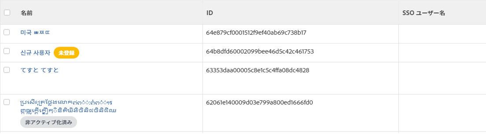
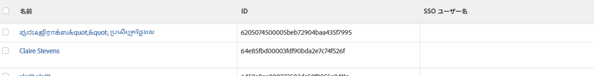

# シングルサインオンに対応するためのユーザーの更新

<!-- Audited: 1/2024 -->

{{important-admin-console-onboard}}

Adobe Workfrontインスタンスでシングルサインオン (SSO) が有効になっている場合、ユーザーは SSO 資格情報を使用してWorkfrontにログインできます。

既に SSO 資格情報に関連付けられたユーザーが設定されている既存のシステムがある場合は、コンマ区切り値（CSV）ファイルを Workfront に読み込むことで、Workfront にユーザーの ID を読み込むことができます。

Workfront と SSO システムの統合について詳しくは、 でのシングルサインオンの概要を参照してください。

## アクセス要件

この記事の手順を実行するには、次のアクセス権が必要です。

<table style="table-layout:auto"> 
 <col> 
 <col> 
 <tbody> 
  <tr> 
   <td role="rowheader">Adobe Workfront プラン</td> 
   <td>任意</td> 
  </tr> 
  <tr> 
   <td role="rowheader">Adobe Workfront ライセンス</td> 
   <td>
新規：標準

または

現在：プラン
</td> 
  </tr> 
  <tr> 
   <td role="rowheader">アクセスレベル設定</td> 
   <td> 
Workfront 管理者である必要があります。
  </td> 
  </tr> 
 </tbody> 
</table>

この表の情報の詳細については、 [Workfrontドキュメントのアクセス要件](/help/quicksilver/administration-and-setup/add-users/access-levels-and-object-permissions/access-level-requirements-in-documentation.md).

## SSO ユーザー名

使用する SSO ソリューションに応じて、SSO 環境でのユーザー名を次のいずれかに名づけることができます。

* SSO ユーザー名
* フェデレーション ID
* フェデレーションユーザー名

SSO 環境で呼び出されるユーザー名に関係なく、フィールドの値は User オブジェクトの「SSO Username」フィールドに格納されます。

ユーザーが SSO 資格情報を使用して Workfront にログインできるようにするには、ユーザーのプロファイルを更新して、Workfront ユーザー名に加えて SSO ユーザー名を含める必要があります。

Workfront管理者は、Workfrontユーザーの SSO Username フィールドを一括で更新できます。そのためには、ユーザー名のリストをWorkfrontに読み込みます。 このリストは、次の条件を満たす必要があります。

* Workfrontユーザー ID(GUID) と、各ユーザーに対応する SSO ユーザー名を含めます
* CSV または TSV ファイルとして保存します。

このプロセスは、Workfront の既存の SSO ユーザー名を更新するか、ユーザー名が見つからない場合は新しい SSO ユーザー名を追加します。

## 読み込みファイルの準備 {#prepare-the-import-file}

Workfront で SSO ユーザー名フィールドを更新する必要があるすべてのユーザーのレポートを作成することで、読み込みファイルの準備を開始できます。

1. Workfront でユーザーレポートを作成します。

   Workfront でユーザーレポートを作成する手順については、[カスタムレポートの作成](../../../reports-and-dashboards/reports/creating-and-managing-reports/create-custom-report.md)を参照してください。

1. レポートの次のフィールドを選択します。

   | フィールド | 説明 |
   |---|---|
   | 名前 | Workfront ユーザーのフルネーム。 |
   | ID | ID は Workfront の英数字の GUID です。 |
   | SSO ユーザー名 | 「SSO ユーザー名」フィールドを追加して、インポートで上書きするユーザー名がないようにします。 ユーザーが SSO 用にまだ更新されていない場合、このフィールドはすべてのユーザーに対して空白です。 |

   

1. レポートを保存します。
1. リストの上部にある「**書き出し**」をクリックして、Excel にレポートを書き出します。
1. エクスポートした Excel ファイルを開き、「SSO ユーザー名」列のレポートで各ユーザーの SSO ユーザー名を追加します。

   >[!IMPORTANT]
   >
   >SSO ユーザー名では大文字と小文字が区別されます。

1. Excel ファイル内の、「 **ID** そして **SSO ユーザー名** 列。

1. 列ヘッダーを削除し、レポートの上部に空白の行がないことを確認します。

   SSO ユーザー名でWorkfrontユーザーを更新するために使用するファイル **必須** 次の順序で、列が 2 つだけ含まれます。

   * 最初の列には、Workfrontユーザー ID(Workfrontで見つかったユーザー GUID) を表示する必要があります。
   * 2 番目の列には、SSO システムに表示される SSO ユーザー名を含める必要があります。
   * 列にはヘッダーを含めず、名前のリストの先頭に空の行を含めることはできません。

     

1. レポートを CSV または TSV ファイルとしてコンピューターに保存します。

## SSO 用にユーザーを更新 {#update-your-users-for-sso}

SSO 向けにユーザーを更新するプロセスでは、SSO ユーザー名フィールドが存在しない場合は Workfront ユーザーに追加し、既にユーザーに関連付けられている値がある場合はそのフィールドの値を更新します。

1. 次をクリック： **[!UICONTROL メインメニュー]** アイコン  Adobe Workfrontの右上隅にある、または（使用可能な場合）、 **[!UICONTROL メインメニュー]** アイコン  左上隅で、「 **設定** .

1. クリックして、 **システム** 次に、 **SSO のユーザーを更新**.

1. 「**ファイルを選択**」をクリックして、準備したファイルを選択します。

   このファイルの準備方法の詳細については、[読み込みファイルの準備](#prepare-the-import-file)を参照してください。

1. ファイルの保存先となるコンピューターを選択し、「 **開く**.

   これにより、SSO 資格情報がWorkfrontに挿入され、すべてのユーザーが SSO 資格情報を使用してWorkfrontにログインできるようになります。

   The **許可するのみ `<SSO Configuration>` 認証** の設定は、CSV に含まれるすべてのユーザーに対して有効になります。 これにより、ユーザーは SSO を使用してログインする必要があります。

## ユーザーのWorkfrontユーザー名に対する SSO の検証

SSO ユーザー名情報を含むユーザーレポートの作成手順については、[読み込みファイルの準備](#prepare-the-import-file)を参照してください。

1. SSO ユーザー名情報を含むユーザーレポートを実行します。

   各ユーザーに対して「SSO ユーザー名」列が設定されます。

1. 「SSO ユーザー名」列の値が SSO サーバー上の「SSO ユーザー名」と一致していることを確認します。
1. 「SSO ユーザー名」列が空白の場合は、ユーザーの SSO ユーザー名を更新します。

   

   SSO 用にユーザーを更新する手順については、[SSO 用にユーザーを更新](#update-your-users-for-sso)を参照してください。
