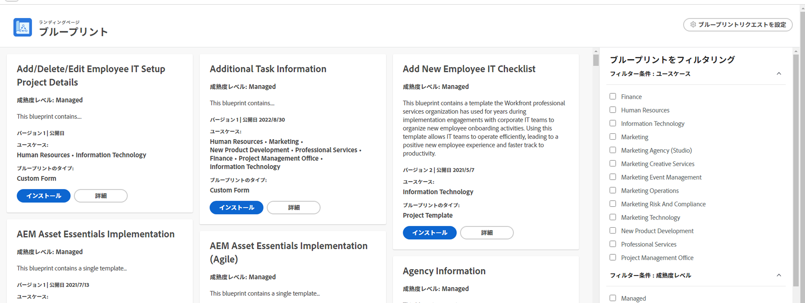

# ブループリントの概要

<!--Audited: 01/2024-->

ブループリントは、Workfrontの一般的な使用例に対処するWorkfrontオブジェクトのセットです。 ブループリントをダウンロードしてインストールし、特定のユースケース用にオブジェクトを設定できます。

>[!INFO]
>
>例：
>
>* **人事組織の設定**
>
>   このブループリントには、人事部門に拡張する組織構造の設定が含まれています。
>
>* **新規従業員 IT チェックリストの追加**
>
>   このブループリントには、新しい従業員のオンボーディングアクティビティを整理するためのテンプレートが含まれています。 このテンプレートを使用すると、IT チームは効率的に業務を行うことができ、従業員にとって新たなポジティブな経験と生産性をより迅速に実現することができます。
>
>* **継承されたインスタンスの基本 | チェックリスト**
>
>    このブループリントには、Workfrontインスタンスの設定方法を明確に理解するために、質問、リソースおよびリンクの短いリストで確認できるプロジェクトテンプレート（またはチェックリスト）が含まれています。 これは、最近Workfrontインスタンスを継承した場合に使用し、どこから始めればよいかに関するガイダンスが必要な場合に使用します。
>
>現在のブループリントを確認するには、[使用可能なブループリントのリスト](/help/quicksilver/administration-and-setup/blueprints/list-of-available-blueprints.md)を参照してください。

ブループリントは、ビジネスと共に成長する作業管理システムを構築するために役立つ基本的な構成要素を提供します。システム管理者は、ブループリントカタログを参照し、すぐに使用できるプロジェクトテンプレート、ダッシュボード、および組織構造をインストールできます。 他のユーザーは、カタログを参照して、ブループリントのインストールをリクエストできます。詳しくは、[ブループリントカタログを参照してブループリントのインストールをリクエスト](../../administration-and-setup/blueprints/browse-catalog.md)を参照してください。

各ブループリントは 1 部門の特定の成熟度レベルを対象とし、実績のあるベストプラクティスをシステムに迅速に実装するのに役立ちます。以下に詳しく説明する成熟度レベルは、ブループリントカタログカードと詳細に示されます。

* **[!UICONTROL 管理]：**&#x200B;管理されたプロジェクトテンプレートは、アクティビティと成果物が標準手順として完全に受け入れられるまで、新しいビジネスプロセスの採用をサポートします。新しいプロセスの各ステップに確実に従うためのタスクが含まれます。

* **[!UICONTROL 統合]：**&#x200B;統合されたプロジェクトテンプレートは、ビジネス機能が標準の操作手順を通じてサポートされることを前提としています。プロセスの参加者は、プロセスに従うために完了しなければならないステップとタスクを把握しています。このプロセスをサポートするために、プロジェクトテンプレートのタスク数を少なくし、レポーティングに必要なマイルストーンやその他の主な成果物のみをトラックするようにします。

## 適切なブループリントを検索

カタログの右側にあるフィルターを使用して、ユースケース、成熟度レベル、インストールステータスおよびタイプ別にブループリントを参照できます。関心のあるブループリントを見つけたら、詳細ページで詳細を表示できます。

### ブループリントのタイプ

ブループリントのタイプは、ブループリントに含まれる内容を示します。タイプはカタログ内のブループリントカードの下部に表示されます。ブループリントは複数のタイプを持つことができます。

次のタイプのブループリントを使用できます。

* **プロジェクトテンプレート**：プロジェクトテンプレートに関連付けられた標準オブジェクト（タスク、タスク、問題、役割、チーム）と、これらのオブジェクトに関連する一部の環境設定が含まれます。 詳しくは、[ブループリントの設定](../../administration-and-setup/blueprints/configure-template-package.md)を参照してください。
* **組織構造**：組織の構造（会社、グループ、ロール、チーム）に関連付けられたオブジェクトが含まれます。 詳しくは、[ブループリントの設定](../../administration-and-setup/blueprints/configure-template-package.md)を参照してください。
* **ダッシュボード**：実装サービスなど、特定のユースケース向けの 1 つ以上のダッシュボードが含まれます。
<!--
* Request queues: Includes one or more projects configured as request queues.
* Custom forms: Includes custom forms attached to another object type, such as a project or portfolio.
* Setup features: Includes one or more elements that are configured in the Setup area of Workfront, such as layout templates.
-->

現在のブループリントを確認するには、[使用可能なブループリントのリスト](/help/quicksilver/administration-and-setup/blueprints/list-of-available-blueprints.md)を参照してください。

### 詳細を表示

各ブループリントには詳細ページが含まれています。 このページから、次の操作を実行できます。

* ワークフローコンテンツの概要を表示
* ブループリントの概要を読み取り
* インストール履歴を表示（「**[!UICONTROL 詳細を表示]**」をクリックして、ブループリントと共にインストールされるオブジェクトの完全なリストを表示）
* 役割、チーム、会社、グループの説明を表示
* プロジェクトテンプレートなどの特定のブループリントを視覚的に示した例を表示（ブラウザーでの画像全体のプレビューや、ダウンロードが可能）

![[!UICONTROL ブループリントの詳細]ページ](assets/blueprint-details-page-2022.png)

## ブループリントをインストール

Workfrontの管理者は、任意の環境（実稼動、プレビューまたはサンドボックス環境）にブループリントを直接インストールできます。 詳しくは、[ブループリントのインストール](../../administration-and-setup/blueprints/blueprints-install.md)または[ブループリントの設定](../../administration-and-setup/blueprints/configure-template-package.md)を参照してください。

インストール後に、次に実行する最適なアクションが把握できない場合があります。詳しくは、[ブループリントのインストール後に実行するアクション](../../administration-and-setup/blueprints/best-next-actions-after-install.md)を参照してください。

## ブループリントとテンプレートに関する追加のメモ

ブループリントは、[!DNL Adobe Workfront] のプロジェクトテンプレート機能を置き換えるものではありません。ブループリントは、新しいテンプレートを素早く作成して、[!DNL Workfront] の作業をより多く整理する手段です。

ブループリントをコピーまたは編集することはできません。ただし、ブループリントからソリューションをインストールした後は、ブループリントから作成されたプロジェクトテンプレート、担当業務またはチームの変更は、[!DNL Workfront] インターフェイスで通常これらのレコードを更新するのと同じ方法で行うことができます。また、ブループリントをインストールすると、テンプレートは [!DNL Workfront] の[!UICONTROL テンプレート]エリアに格納され、オリジナルのブループリントは[!UICONTROL ブループリント]エリアに格納されます。必要に応じてテンプレートを調整する前に、テンプレートのコピーを作成する必要はありません。

お使いの環境で設定されたものをブループリントが削除したり置換したりすることはありません。新しいテンプレートを作成するブループリントをインストールして既存のテンプレートを置き換える場合は、テンプレートからプロジェクトを作成するプランナー間での混乱を避けるために、以前のバージョンを非アクティブ化することをお勧めします。
