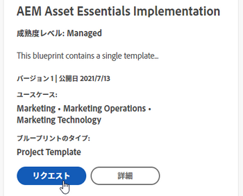

# ブループリントカタログの参照とブループリントのインストールのリクエスト

ブループリントは、ビジネスと共に成長する作業管理システムを構築するために役立つ基本的な構成要素を提供します。 すべての [!DNL Adobe Workfront] ユーザーはブループリントのカタログを参照できます。 [!DNL Workfront] 管理者がブループリントリクエストを有効にしている場合、管理者に特定のブループリントをインストールするようリクエストすることもできます。

ブループリントをインストールできるのはシステム管理者だけです。 詳しくは、[ブループリントのインストール](../../administration-and-setup/blueprints/blueprints-install.md)を参照してください。

## アクセス要件

+++ 展開すると、この記事の機能のアクセス要件が表示されます。

<table style="table-layout:auto"> 
 <col> 
 <col> 
 <tbody> 
  <tr> 
   <td role="rowheader">Adobe Workfront パッケージ</td> 
   <td> 
任意 
 </td> 
  </tr> 
  <tr> 
   <td role="rowheader">Adobe Workfront プラン</td> 
   <td>
コントリビューター以上

依頼者以上

  </td> 
  </tr> 
 </tbody> 
</table>

詳しくは、[Workfront ドキュメントのアクセス要件](/help/quicksilver/administration-and-setup/add-users/access-levels-and-object-permissions/access-level-requirements-in-documentation.md)を参照してください。

+++

## ブループリントカタログを参照

カタログには、組織で利用可能なすべてのブループリントが表示されます。 ブループリントのタイプや成熟度レベルなどのブループリントについて詳しくは、[ブループリントの概要](../../administration-and-setup/blueprints/blueprints-overview.md)を参照してください。

{{step1-to-blueprints}}

1. ブループリントのカタログを参照します。
1. 右側のフィルターパネルを使用して、次のオプションでカタログをフィルターします。

   * ユースケース（[!UICONTROL 人事]や[!UICONTROL マーケティング] など）
   * 成熟度レベル（[!UICONTROL 管理]または[!UICONTROL 統合]）
   * インストールステータス（[!UICONTROL インストール済み] また末[!UICONTROL インストール]）
   * ブループリントタイプ（[!UICONTROL ダッシュボード]、[!UICONTROL 組織構造]、[!UICONTROL プロジェクトテンプレート]<!-- above Custom Form; here, Request Queue, Setup Feature-->）

1. （オプション）ブループリントの&#x200B;**[!UICONTROL 詳細]**&#x200B;をクリックして、その仕組みを確認してください。

   [!UICONTROL 詳細]ページで利用可能なコンテンツについて詳しくは、[ブループリントの概要](../../administration-and-setup/blueprints/blueprints-overview.md)を参照してください。

## ブループリントのインストールをリクエスト

システム管理者がブループリントのリクエストを許可している場合は、ブループリントのインストールを要求できます。 詳しくは、[ブループリントへのアクセスの設定](../../administration-and-setup/blueprints/configure-access-to-blueprints.md)を参照してください。

ブループリントのインストールをリスエストすると、そのリスエストはシステム管理者に送信されます。 通知環境設定に従って、リクエストが完了すると通知が届きます。

{{step1-to-blueprints}}

1. インストールするブループリントを見つけます。 右側のパネルのフィルターを使用して、ユースケース、成熟度レベル、インストール状況、タイプごとにフィルターをかけることができます。
1. ブループリントで&#x200B;**[!UICONTROL リクエスト]**&#x200B;をクリックします。

   ブループリントに&#x200B;**[!UICONTROL リスエスト]**&#x200B;ボタンが表示されない場合は、システム管理者がリクエストを有効にしていません。

   
