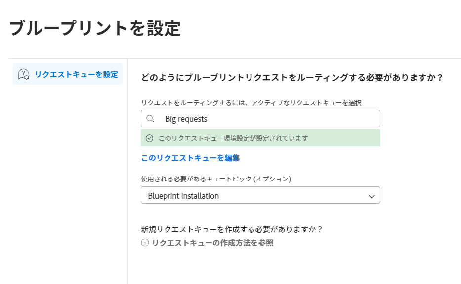

# ブループリントへのアクセス権の設定

すべての [!DNL Adobe Workfront] ユーザーが、ブループリントのカタログを参照できます。

システム管理者は以下を行えます。

* [!UICONTROL ブループリント]をレイアウトテンプレートのメインメニューに追加し、レイアウトテンプレートをユーザーやグループに割り当てる。詳しくは、[レイアウトテンプレートを使用した[!UICONTROL メインメニュー]のカスタマイズ](/help/quicksilver/administration-and-setup/customize-workfront/use-layout-templates/customize-main-menu.md)と[レイアウトテンプレートへのユーザーの割り当て](/help/quicksilver/administration-and-setup/customize-workfront/use-layout-templates/assign-users-to-layout-template.md)を参照してください。

  >[!NOTE]
  >
  >* レイアウトテンプレートが割り当てられていないユーザーには、[!UICONTROL メインメニュー]に[!UICONTROL ブループリント]アイコンが表示されます。
  >* 新規レイアウトテンプレートを作成すると、[!UICONTROL メインメニュー]の[!UICONTROL アクティブなアイテム]リストに[!UICONTROL ブループリント]アイコンが、デフォルトで含まれています。

* リクエストを保存するリクエストキューを設定することで、ユーザーがブループリントのインストールをリクエストするためのアクセス権を有効にする。そこで、リクエストの追跡と更新を一元的に行うことができます。詳しくは、以下の手順に従ってください。
* ブループリントをインストールする。詳しくは、[ブループリントのインストール](../../administration-and-setup/blueprints/blueprints-install.md)を参照してください。

## アクセス要件

この記事の手順を実行するには、次のアクセス権が必要です。

<table style="table-layout:auto"> 
 <col> 
 <col> 
 <tbody> 
  <tr> 
   <td role="rowheader"><strong>[!DNL Adobe Workfront] プラン</strong></td> 
   <td> 
 任意
 </td> 
  </tr> 
  <tr> 
   <td role="rowheader"><strong>Adobe [!DNL Workfront] ライセンス</strong></td> 
   <td>[!UICONTROL Plan]</td> 
  </tr> 
  <tr> 
   <td role="rowheader"><strong>アクセスレベル設定</strong></td> 
   <td> 
[!UICONTROL System Administrator]
 </td> 
  </tr> 
 </tbody> 
</table>

## 前提条件 {#prerequisites}

* ブループリントリクエストを保存するには、既存のリクエストキューを使用する必要があります。プロジェクトはリクエストキューとして保存する必要があります。また、[!UICONTROL 進行中]のステータスになっている必要があります。
* リクエストキューは公開されている必要があります。リクエストキューの詳細で、「[!UICONTROL このキューにリクエストを追加できるユーザー]」は&#x200B;**[!UICONTROL 全員]**&#x200B;に設定する必要があります。

>[!TIP]
>
>ブループリントリクエストのリクエストキューを新規作成する場合は、ブループリントへのアクセス権を設定する前に作成してください。リクエストキューの作成については、[リクエストキューの作成](../../manage-work/requests/create-and-manage-request-queues/create-request-queue.md)を参照してください。

## ブループリントリクエストを保存するリクエストキューを選択

ユーザーからブループリントのインストールをリクエストされる前に、そのリクエスト用のリクエストキューを選択する必要があります。リクエストキューが定義されるまで、ユーザーはブループリントカタログの参照のみ可能です。

1. [!DNL Adobe Workfront] の右上隅にある&#x200B;**[!UICONTROL メインメニュー]**&#x200B;アイコン  をクリックしたあと、「**[!UICONTROL ブループリント]**」を選択します。
1. カタログ画面の右上にある「**[!UICONTROL ブループリントリクエストを設定]**」をクリックします。

   <!--
   <li value="3" data-mc-conditions="QuicksilverOrClassic.Draft mode"> 
In the <strong>Configure blueprints</strong> dialog, ensure that the <strong>Configure request queues</strong> tab is selected.
 </li>
   -->

1. **[!UICONTROL ブループリントを設定]**&#x200B;ダイアログで、アクティブなリクエストキューの名前を入力していき、検索結果に表示されたら選択します。

   >[!IMPORTANT]
   >
   >このリストには、パブリックリクエストキューのみが表示されます。リクエストキューをパブリックにするには、上記の[前提条件](#prerequisites)の節を参照してください。

   リクエストキューの環境設定が指定され、ユーザーがブループリントのインストールをリクエストできるようになりました。

   

1. （オプション）現行のリクエストキューに変更を加えるには、「**[!UICONTROL このリクエストキューを編集]**」をクリックします。

   リクエストキュープロジェクトが新しいブラウザータブで開き、リクエストキューを必要に応じて更新できます。

1. （オプション）リクエストキューにトピックグループまたはキュートピックが含まれている場合は、それらをリストから選択できます。
1. ブループリントカタログに戻るには、「**[!UICONTROL 閉じる]**」をクリックします。

>[!NOTE]
>
>リクエストされたブループリントをインストールする際は、リクエストキューでイシューステータスを&#x200B;**[!UICONTROL クローズ]**&#x200B;または&#x200B;**[!UICONTROL 解決済み]**&#x200B;に変更して、リクエスターに通知が届くようにする必要があります。ブループリントのインストールについては、[ブループリントのインストール](../../administration-and-setup/blueprints/blueprints-install.md)を参照してください。
