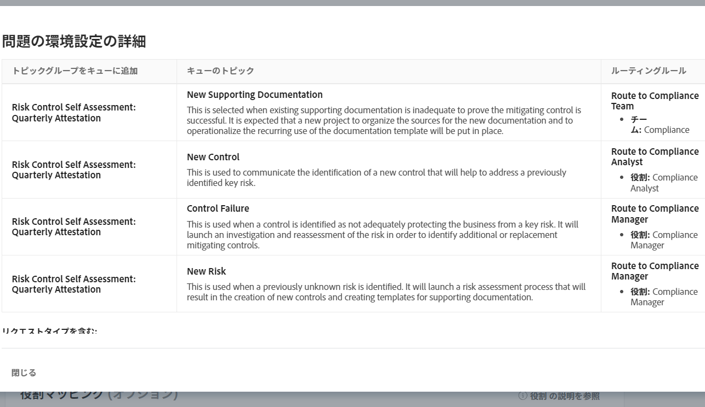
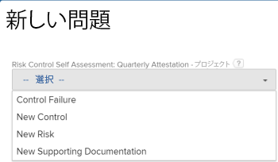
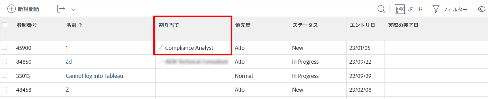

# ブループリントの設定

ブループリントをインストールする前に、ブループリントの詳細を設定できます。 通常、プロジェクトテンプレートと組織構造のブループリントタイプには、いくつかの環境設定と、マッピングする一部のプロパティが必要です。 その他のブループリントタイプは設定が不要な場合があり、そのままインストールします。 インストールについて詳しくは、 [ブループリントのインストール](/help/quicksilver/administration-and-setup/blueprints/blueprints-install.md).

## アクセス要件

この記事の手順を実行するには、次のアクセス権が必要です。

<table style="table-layout:auto"> 
 <col> 
 <col> 
 <tbody> 
  <tr> 
   <td role="rowheader"><strong>[!DNL Adobe Workfront] 計画</strong></td>
   <td>任意</td> 
  </tr> 
  <tr> 
   <td role="rowheader"><strong>Adobe [!DNL Workfront] ライセンス</strong></td>
   <td>[!UICONTROL プラン ]</td> 
  </tr> 
  <tr> 
   <td role="rowheader"><strong>アクセスレベル設定</strong></td>
   <td> 
[!UICONTROL システム管理者 ]
 </td> 
  </tr> 
 </tbody> 
</table>

## プロジェクトテンプレートのブループリントの設定

1. 使用するブループリントを見つけます。
1. クリック **[!UICONTROL インストール]**、環境を選択します。

   <table style="table-layout:auto">
        <tr>
        <td><strong>実稼動</strong></td>
        <td>実稼動環境は実稼動環境です。</td>
    </tr>
    <tr>
        <td><strong>サンドボックス プレビュー</strong></td>
        <td>サンドボックスプレビューは、ライブ環境のレプリカとして機能し、Workfrontが週末に更新するテスト環境です。</td>
    </tr>
    <tr>
        <td><strong>サンドボックス 1 および 2</strong></td>
        <td>カスタム更新サンドボックスは、個別のテスト環境で、手動で更新されます。 カスタム更新サンドボックスを取得するには、追加のコストが必要です。</td>
    </tr>
   </table>

1. 次のセクションに進みます。

   * [[!UICONTROL テンプレート環境設定]](#template-preferences)
   * [[!UICONTROL ロールマッピング]](#role-mapping)
   * [[!UICONTROL チームマッピング]](#team-mapping)
   * [[!UICONTROL 会社マッピング]g](#company-mapping)
   * [[!UICONTROL グループマッピング]](#group-mapping)

## [!UICONTROL テンプレート環境設定] {#template-preferences}

テンプレートのインストール方法を選択します。

ブループリントをインストールする前に、テンプレートの所有権を指定することもできます。 テンプレートをインストールした後で、これらのフィールドに変更を加えることができます。 詳しくは、 [プロジェクトテンプレートの編集](../../manage-work/projects/create-and-manage-templates/edit-templates.md).

![[!UICONTROL テンプレート環境設定] セクション](assets/Blueprints_TemplatePreferences.png)

1. 内 [!UICONTROL テンプレート環境設定] セクションで、新しいテンプレート名を指定します。
1. 以下を指定します。

   <table style="table-layout:auto">
    <tr>
        <td><strong>[!UICONTROL テンプレート所有者 ]<strong></td>
        <td>このユーザーは、テンプレートに対する [!UICONTROL 管理 ] 権限を受け取り、テンプレートを使用してプロジェクトを作成すると、プロジェクトの所有者になります。</td>
    </tr>
    <tr>
        <td><strong>[!UICONTROL テンプレートスポンサー ]</strong></td>
        <td>通常、この人物は、プロジェクトで何が起きているかを知る必要がある管理者、エグゼクティブまたは関係者です。 プロジェクトスポンサーは、プロジェクトへの追加のアクセス権を取得しませんが、プロジェクトの電子メール通知に追加されます。</td>
    </tr>
    <tr>
        <td><strong>[!UICONTROLPortfolio]</strong></td>
        <td>これは、プロジェクトの作成時にプロジェクトが属するポートフォリオです。</td>
    </tr>
    <tr>
        <td><strong>[!UICONTROL プログラム ]</strong></td>
        <td>これは、プロジェクトの作成時にプロジェクトが属するプログラムです。</td>
    </tr>
   </table>

1. テンプレートをアクティブとしてインストールするか非アクティブとしてインストールするかを選択します。
1. 環境設定が使用可能な場合に、定義済みの新しい問題の環境設定を使用するかどうかを選択します。

   クリック **[!UICONTROL 問題の環境設定を表示]** をクリックして、ブループリントと共にインストールされる特定の環境設定を確認します。 インポートしたテンプレートから作成されたプロジェクトで、 [!UICONTROL 問題] 」セクションに入力します。

   <table style="table-layout:auto"> 
    <col> 
    <col> 
    <tbody> 
     <tr> 
      <td role="rowheader"><strong>トピックグループをキューに追加</strong></td> 
      <td> 
キューのトピックグループは、問題または要求の最上位のカテゴリを定義します。 ユーザーは、リクエストを送信する場所を選択する際に、トピックグループをメニューオプションとして表示します。 1 つのトピックグループに複数のキュートピックを含めることができます。 詳しくは、 <a href="../../manage-work/requests/create-and-manage-request-queues/create-topic-groups.md" class="MCXref xref">トピックグループの作成</a>. 
 </td> 
     </tr> 
     <tr> 
      <td role="rowheader"><strong>キューのトピック</strong></td> 
      <td> 
キューのトピックは、ルーティングルールと組み合わせて、問題やリクエストを割り当てます。 トピックグループを選択した後に、ユーザーが問題やリクエストを入力する際に選択するメニューオプションです。 詳しくは、 <a href="../../manage-work/requests/create-and-manage-request-queues/create-queue-topics.md" class="MCXref xref">キュートピックを作成</a>. 
 </td> 
     </tr> 
     <tr> 
      <td role="rowheader"><strong>ルーティングルール</strong></td> 
      <td>ルーティングルールは、特定のジョブロール、ユーザー、チームに問題やリクエストを送信します。 また、リクエストキューに関連付けられているもの以外の特定のプロジェクトにリクエストを送信することもできます。 詳しくは、 <a href="../../manage-work/requests/create-and-manage-request-queues/create-routing-rules.md" class="MCXref xref">ルーティングルールの作成</a>. </td> 
     </tr> 
    </tbody> 
   </table>

   >[!INFO]
   >
   >**例：** このブループリントの新しい問題の環境設定では、4 つのキュートピックが提供されます。 ユーザーは、イシューを作成する際に、これらのトピックの 1 つを選択します。 （1 つのトピックグループのみが存在するので、自動的に適用され、ユーザーは選択する必要はありません）。 ユーザーが問題を完了して送信すると、ルーティングルールは、その問題が割り当てられているジョブの役割またはチームを決定します。
   >
   >
   >

   >[!TIP]
   >
   >* 問題の環境設定を使用すると、プロジェクト上で新しい問題や要求が取り込まれる方法の一貫性を作成できます。
   >* これらの環境設定を設定しても、テンプレートから作成されたプロジェクトが要求キューに自動的には送信されません。 リクエストキューの設定について詳しくは、 [リクエストキューの作成](../../manage-work/requests/create-and-manage-request-queues/create-request-queue.md).
   >* すべてのブループリントに新しい問題の環境設定が含まれているわけではありません。

## [!UICONTROL ロールマッピング] {#role-mapping}

>[!NOTE]
>
>このセクションは、一部のブループリントに表示されない場合があります。

一部のテンプレートには、所定のジョブの役割が含まれます。 ジョブの役割は、テンプレートをプロジェクトに変換する際に、適切な担当者を割り当てるのに役立ちます。 ブループリントをインストールする前に、役割のマッピング方法をカスタマイズできます。 クリック **[!UICONTROL 役割の説明を参照]** を参照して、ブループリントで使用できる役割の詳細を確認してください。

ブループリントは、ロール名で検索し、既存のロールが一致するかどうかを確認します。 検索では大文字と小文字が区別されるので、名前は完全に一致する必要があります。 一致する既存のロールがない場合は、ブループリントに作成してもらうことができます。

![[!UICONTROL ロールマッピング] セクション](assets/Blueprints_RoleMapping.png)

1. ロールが存在する場合、次のいずれかのオプションを選択できます。

   1. 別の名前で新しいロールを作成し、テキストボックスに名前を入力します。
   1. 既存の役割を使用し、選択ボックスで役割を選択します。
   1. マッピングされた役割を使用しない。 一部のタスクには役割が割り当てられないので、このオプションはお勧めしません。

1. ロールが存在しない場合は、次のいずれかのオプションを選択できます。

   1. 新しいロールを作成します。 このオプションは、ブループリントが推奨する役割を作成します。
   1. 別の名前で新しいロールを作成し、テキストボックスに名前を入力します。
   1. 既存の役割を使用し、選択ボックスで役割を選択します。
   1. マッピングされた役割を使用しない。 一部のタスクには役割が割り当てられないので、このオプションはお勧めしません。

>[!NOTE]
>
>インストールプロセスでは、特定のユーザーに役割は適用されません。 ブループリントソリューションをインストールした後に、これらのロールの担当者を確認し、必要に応じて担当者を割り当てる必要があります。 詳しくは、 [ブループリントのインストール後に実行するアクション](../../administration-and-setup/blueprints/best-next-actions-after-install.md).

のジョブの役割の詳細 [!DNL Workfront]を参照してください。 [ジョブの役割の作成と管理](../../administration-and-setup/set-up-workfront/organizational-setup/create-manage-job-roles.md).

## [!UICONTROL チームマッピング] {#team-mapping}

>[!NOTE]
>
>このセクションは、一部のブループリントに表示されない場合があります。

一部のテンプレートには、所定のチームが含まれます。 チームに割り当てられた作業は、チームの任意のメンバーが完了できます。 ブループリントをインストールする前に、チームのマッピング方法をカスタマイズできます。 クリック **[!UICONTROL チームの説明を見る]** ブループリントで利用可能なチームの詳細を確認するには、を参照してください。

ブループリントは、チーム名で検索し、既存のチームが一致するかどうかを確認します。 検索では大文字と小文字が区別されるので、名前は完全に一致する必要があります。 一致する既存のチームがない場合は、ブループリントに作成してもらうことができます。

![[!UICONTROL チームマッピング] セクション](assets/Blueprints_TeamMapping.png)

1. チームが存在する場合は、次のいずれかのオプションを選択できます。

   1. 別の名前で新しいチームを作成し、テキストボックスに名前を入力します。
   1. 用途 [!UICONTROL 既存チーム]を選択し、選択ボックスでチームを選択します。
   1. マッピングされたチームを使用しない。 一部のタスクにはチームが割り当てられないので、このオプションはお勧めしません。

1. チームが存在しない場合は、次のいずれかのオプションを選択できます。

   1. 新しいチームを作成します。 このオプションは、ブループリントが推奨するチームを作成します。
   1. 別の名前で新しいチームを作成し、テキストボックスに名前を入力します。
   1. 用途 [!UICONTROL 既存チーム]を選択し、選択ボックスでチームを選択します。
   1. マッピングされたチームを使用しない。 一部のタスクにはチームが割り当てられないので、このオプションはお勧めしません。

>[!NOTE]
>
>インストールプロセスでは、チームに担当者は追加されません。 ブループリントソリューションをインストールした後でチームの担当者を確認し、必要に応じて担当者を割り当てる必要があります。 詳しくは、 [ブループリントのインストール後に実行するアクション](../../administration-and-setup/blueprints/best-next-actions-after-install.md).

でのチームの機能の詳細 [!DNL Workfront]を参照してください。 [チームの作成と管理](../../people-teams-and-groups/create-and-manage-teams/create-and-mange-teams.md).

## 会社のマッピング {#company-mapping}

>[!NOTE]
>
>このセクションは、一部のブループリントに表示されない場合があります。

一部の設計図には、所定の会社が含まれます。 会社とは、組織、組織内の部門、または顧客を表す組織単位です。 ブループリントをインストールする前に、会社のマッピング方法をカスタマイズできます。 クリック **[!UICONTROL 会社の説明を表示]** ブループリントで利用可能な会社の詳細を確認するには、を参照してください。

ブループリントは、会社名で検索し、既存の会社が一致するかどうかを確認します。 検索では大文字と小文字が区別されるので、名前は完全に一致する必要があります。 一致する既存の会社がない場合は、ブループリントに作成してもらうことができます。 ブループリントの主な会社は、同じ名前を持たない場合でも、環境内の主な会社にマッピングされます。

![[!UICONTROL 会社マッピング] セクション](assets/Blueprints_CompanyMapping.png)

1. 会社が存在する場合は、次のいずれかのオプションを選択できます。

   1. 別の名前で新しい会社を作成し、テキストボックスに名前を入力します。
   1. 既存の会社を使用して、選択ボックスで会社を選択します。\

      ブループリントの主な会社は、同じ名前を持たない場合でも、環境内の主な会社にマッピングされます。
   1. マッピングされた会社を使用しない。 会社が他のオブジェクトで参照する内容が空になるので、このオプションはお勧めしません。

1. 会社が存在しない場合は、次のいずれかのオプションを選択できます。

   1. 会社の新規作成. このオプションは、ブループリントが推奨する会社を作成します。
   1. 別の名前で新しい会社を作成し、テキストボックスに名前を入力します。
   1. 既存の会社を使用して、選択ボックスで会社を選択します。
   1. マッピングされた会社を使用しない。 会社が他のオブジェクトで参照する内容が空になるので、このオプションはお勧めしません。

>[!NOTE]
>
>ブループリントをインストールした後に会社を設定するには、 [ブループリントのインストール後に実行するアクション](../../administration-and-setup/blueprints/best-next-actions-after-install.md).

テンプレートと会社の関連付けについて詳しくは、 [プロジェクトテンプレートの編集](../../manage-work/projects/create-and-manage-templates/edit-templates.md).

会社が [!DNL Workfront]を参照してください。 [会社の作成と編集](../../administration-and-setup/set-up-workfront/organizational-setup/create-and-edit-companies.md).

## [!UICONTROL グループマッピング] {#group-mapping}

>[!NOTE]
>
>このセクションは、一部のブループリントに表示されない場合があります。

一部のブループリントには、所定のグループが含まれます。 グループとは、部門の構造と一致するユーザーのグループです。 グループは、Workfrontのチームや会社と似ていますが、異なります。 ブループリントをインストールする前に、グループのマッピング方法をカスタマイズできます。 クリック **[!UICONTROL グループの説明を参照]** を参照して、ブループリントで使用可能なグループの詳細を確認してください。

ブループリントは、グループ名で検索し、既存のグループが一致するかどうかを確認します。 検索では大文字と小文字が区別されるので、名前は完全に一致する必要があります。 一致する既存のグループがない場合は、ブループリントに作成してもらうことができます。

![[!UICONTROL グループマッピング] セクション](assets/Blueprints_GroupMapping.png)

1. グループが存在する場合は、 **[!UICONTROL グループを再マッピング]** 次のいずれかのオプションを選択します。

   1. **[!UICONTROL 別の名前で新しいグループを作成]**「 」、このグループに割り当てる名前を入力します。 ブループリント定義内のグループへの参照は、代わりに、この新しいグループに関連付けられます。
   1. **[!UICONTROL 既存のグループに置き換え]**&#x200B;を選択し、選択ボックスでグループを検索して選択します。

      >[!NOTE]
      >
      >既存のグループの名前は変更できません。

1. グループが存在しない場合は、次の操作を実行できます。

   1. 推奨グループ名をテキストボックスに入力して変更します。
   1. 選択 **[!UICONTROL グループを再マッピング]** を選択します。 [!UICONTROL 既存のグループに置き換え]を選択し、選択ボックスでグループを検索して選択します。
   1. 選択 **[!UICONTROL グループを再マッピング]** を選択します。 **[!UICONTROL 既存のグループの下に挿入]**&#x200B;を選択し、選択ボックスでグループを検索して選択します。 このオプションを選択すると、既存のグループの下に新しいサブグループが作成されます。

>[!NOTE]
>
>ブループリントのインストール後にグループを設定するには、 [ブループリントのインストール後に実行するアクション](../../administration-and-setup/blueprints/best-next-actions-after-install.md).

でのグループの使用に関する情報 [!DNL Workfront]を参照してください。 [グループの概要](../../administration-and-setup/manage-groups/groups-overview/groups.md).
