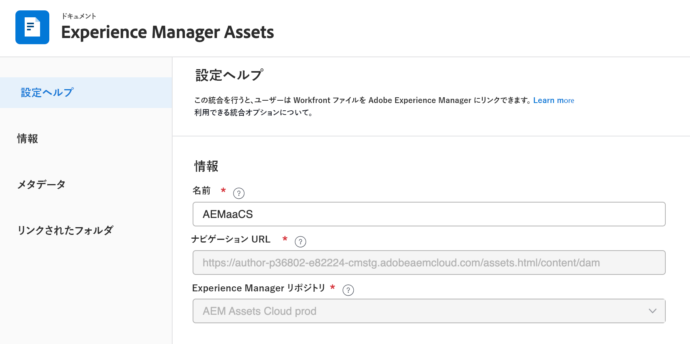
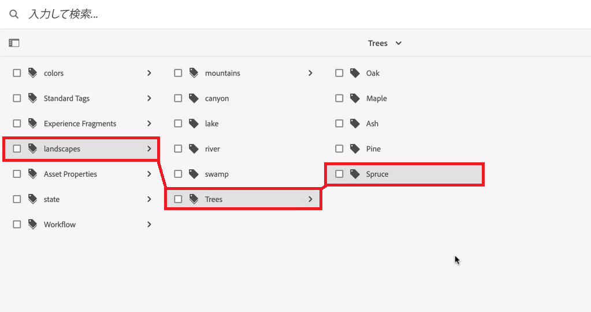
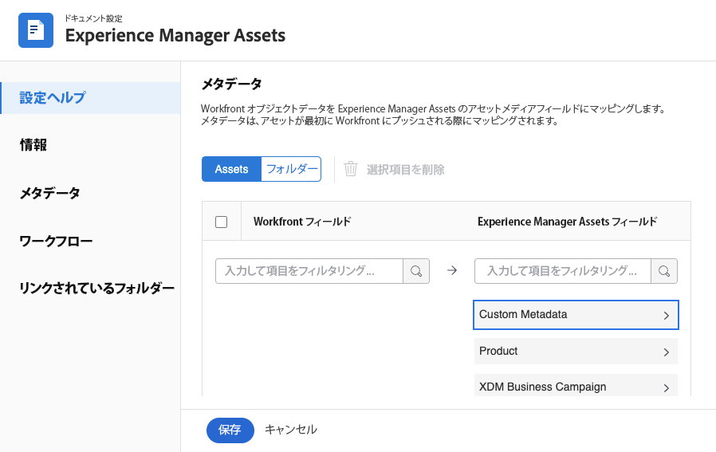
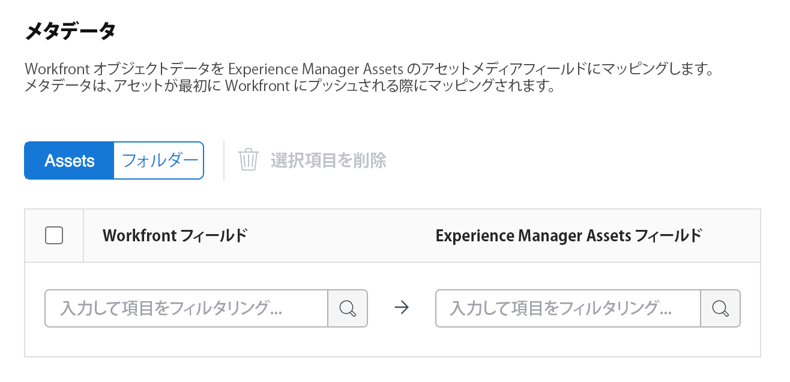
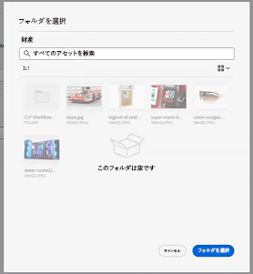

# を設定します。 [!UICONTROL Experience Manager Assetsas a Cloud Service] 統合

作業内容を [!DNL Experience Manager Assets]&#x200B;:

* からのアセットとメタデータのプッシュ [!DNL Adobe Workfront] から [!DNL Experience Manager Assets]&#x200B;
* 次のアセットをリンク： [!DNL Experience Manager Assets] を [!DNL Workfront&#x200B;]
* バージョン管理の使用例の容易化
* リンク先のフォルダーを作成 [!DNL Experience Manager Assets]
* アセットおよびフォルダーのメタデータの追跡
* 次の間でプロジェクトメタデータを同期 [!DNL Workfront] および [!DNL Experience Manager Assets]

>[!NOTE]
>
>複数のExperience Manager Assetsリポジトリを 1 つのWorkfront環境に接続することも、複数のWorkfront環境を組織 ID をまたいで 1 つのExperience Manager Assetsリポジトリに接続することもできます。 設定する統合ごとに、この記事の設定手順に従ってください。

## アクセス要件

以下が必要です。

<table>
  <tr>
   <td><strong>[!DNL Adobe Workfront] 計画*</strong>
   </td>
   <td>任意
   </td>
  </tr>
  <tr>
   <td><strong>[!DNL Adobe Workfront] ライセンス*</strong>
   </td>
   <td>[!UICONTROL プラン ]
   </td>
  </tr>
  <tr>
   <td><strong>[!DNL Experience Manager] ライセンス</strong>
   </td>
   <td>[!UICONTROL Standard]
   </td>
  </tr>
  <tr>
   <td><strong>製品</strong>
   </td>
   <td>必要な機能は次のとおりです。 [!DNL Experience Manager Assets as a Cloud Service]をクリックし、製品にユーザーとして追加される必要があります。
   </td>
  </tr>
  <tr>
   <td>アクセスレベル設定*
   </td>
   <td>次の条件を満たす必要があります。 [!DNL Workfront] 管理者。 詳しくは、 [!DNL Workfront] 管理者向け： <strong>ユーザーに完全な管理アクセス権を付与する</strong>.
   </td>
  </tr>
</table>

*保有するプラン、ライセンスの種類、アクセス権を確認するには、Workfront管理者にお問い合わせください。

## 前提条件

始める前に

* 必要な機能は次のとおりです。 [!DNL Workfront] および [!DNL Adobe Experience Manager Assets] を [!DNL Adobe Admin Consol]e.詳しくは、 [プラットフォームベースの管理上の違い ([!DNL Adobe Workfront]/[!DNL Adobe Business Platform])](/help/quicksilver/administration-and-setup/get-started-wf-administration/actions-in-admin-console.md).

## 統合情報の設定

1. 次をクリック： **[!UICONTROL メインメニュー]** Adobe Workfrontの右上隅にあるアイコンをクリックし、 **[!UICONTROL 設定]** .
1. 選択 **[!UICONTROL ドキュメント]** 左のパネルで、「 **[!UICONTROL [!DNL Experience Manager]統合]**.

   >[!NOTE]
   >
   >この設定領域は、 [!DNL Workfront] 環境は、 [!DNL Adobe Admin Console].

1. 選択 **[!UICONTROL 追加 [!DNL Experience Manager] 統合]**.
1. Adobe Analytics の **[!UICONTROL 名前]** 「 」フィールドに、WorkfrontとExperience Manager Assetsでこの統合を操作する際に表示する名前を入力します。
1. Adobe Analytics の **[!UICONTROL ナビゲーション URL]** 」フィールドに値が入力されると、ナビゲーション URL が自動的に入力されます。 この読み取り専用 URL は、組織の [!DNL Experience Manager] インスタンスを [!UICONTROL メインメニュー] を使用してすばやくアクセスできます。
1. 次の場所からリポジトリを選択： **[!UICONTROL [!DNL Experience Manager]Assets リポジトリ]** ドロップダウンメニュー。 自動的に次の項目が設定されます。 [!DNL Experience Manager] ユーザープロファイルを割り当てる組織 ID に関連付けられたリポジトリ。
   

1. クリック **[!UICONTROL 保存]** または、 [メタデータの設定（オプション）](#set-up-metadata-optional) 」の節を参照してください。

   >[!NOTE]
   >
   >統合が複雑なので、初期設定を保存した後はリポジトリを変更できません。

## メタデータの設定（オプション）

マッピング可能 [!DNL Workfront] のアセットメディアフィールドに対するオブジェクトデータ [!DNL Experience Manager] アセット。

>[!IMPORTANT]
>
>メタデータのマッピングは、次の 1 つの方向にのみ実行できます。 [!DNL Workfront] から [!DNL Experience Manager]. リンク先のドキュメントのメタデータ [!DNL Workfront] から [!DNL Experience Manager] に転送できません [!DNL Workfront].

### メタデータフィールドの設定

メタデータフィールドのマッピングを開始する前に、WorkfrontとExperience Manager Assetsの両方でメタデータフィールドを設定する必要があります。

メタデータフィールドを設定するには：

1. でのメタデータスキーマの設定 [!DNL Experience Manager Assets] で説明されているように [Adobe間でのアセットメタデータマッピングの設定 [!DNL Workfront] および [!DNL Experience Manager Assets]](https://experienceleague.adobe.com/docs/experience-manager-cloud-service/content/assets/integrations/configure-asset-metadata-mapping.html?lang=en).

1. Workfrontでカスタムフォームフィールドを設定します。 [!DNL Workfront] には、使用できる多くの組み込みカスタムフィールドがあります。 ただし、独自のカスタムフィールドを作成することもできます。 [カスタムフォームの作成または編集](/help/quicksilver/administration-and-setup/customize-workfront/create-manage-custom-forms/create-or-edit-a-custom-form.md).

+++ **サポートされているWorkfrontおよびExperience Manager Assetsフィールドの詳細を見るには、ここを展開してください。**

**Experience Manager Assets Tags**

Workfrontでサポートされている任意のフィールドを、Experience Manager Assetsのタグにマッピングできます。 これをおこなうには、Experience Manager Assetsのタグ値がWorkfrontと一致するようにする必要があります。

* タグとWorkfrontのフィールド値は、スペルと形式が完全に一致する必要があります。
* Workfrontのタグが大文字である場合でも、experience manager の assets タグにマッピングされるExperience Manager Assetsフィールド値は、すべて小文字にする必要があります。
* Workfrontフィールドの値にスペースを含めることはできません。
* Workfrontのフィールド値には、Experience Manager Assetsタグのフォルダー構造も含める必要があります。
* 複数の 1 行のテキストフィールドをタグにマッピングするには、メタデータマッピングのWorkfront側にタグ値のコンマ区切りリストを入力し、 `xcm:keywords` Experience Manager Assets側の 各フィールド値は、別々のタグにマッピングされます。 計算フィールドを使用すると、複数のWorkfrontフィールドを組み合わせて、コンマで区切られた単一のテキストフィールドにすることができます。
* ドロップダウンフィールド、ラジオボタンフィールドまたはチェックボックスフィールドの値をマッピングするには、そのフィールドで使用可能な値のコンマ区切りリストを入力します。

>[!INFO]
>
>**例**：ここでフォルダー構造に表示されるタグと照合するには、Workfrontのフィールド値は次のようになります。 `landscapes:trees/spruce`. 「 Workfront 」フィールドの値には小文字が含まれています。
>
>タグツリー内の一番左の項目をタグにする場合は、その後にコロンを付ける必要があります。 この例では、景観タグにマッピングするために、Workfrontのフィールド値は次のようになります。 `landscapes:`.
>
>

Experience Manager Assetsでタグを作成すると、それらは「メタデータ」セクションの「タグ」ドロップダウンに表示されます。 フィールドをタグにリンクするには、「 `xcm:keywords` ( メタデータマッピング領域の「 Experience Manager Assetsフィールド」ドロップダウン )。

タグの作成および管理方法など、Experience Manager Assetsでのタグについて詳しくは、 [タグの管理](https://experienceleague.adobe.com/docs/experience-manager-64/administering/contentmanagement/tags.html).

**Experience Manager Assetsのカスタムメタデータスキーマフィールド**

組み込みフィールドとカスタムWorkfrontフィールドの両方を、Experience Manager Assetsのカスタムメタデータスキーマフィールドにマッピングできます。

Experience Manager Assetsで作成したカスタムメタデータフィールドは、メタデータ設定領域の独自のセクションに整理されます。

<!-- 
link to documentation about creating schema - waiting on response from Anuj about best article to link to
-->

**Workfrontフィールド**

組み込みフィールドとカスタムWorkfrontフィールドの両方をExperience Manager Assetsにマッピングできます。 以下のフィールド値は、大文字と小文字の両方で、WorkfrontとExperience Manager Assetsのスペルが一致する必要があります。

* ドロップダウンフィールド
* 複数選択フィールド

>[!TIP]
>
> フィールドの値が正確に一致するかどうかを確認するには、次に進みます。
>
> * Workfrontの場合は設定/カスタムForms、オブジェクトの場合はフィールド
> * Experience Manager Assetsのアセット/メタデータスキーマ

+++

### アセットのメタデータのマッピング

アセットがからプッシュされると、メタデータがマッピングされます。 [!DNL Workfront] 初めて。 組み込みフィールドまたはカスタムフィールドを持つドキュメントは、アセットの初回送信時に、指定したフィールドに自動的にマッピングされます [!DNL Experience Manager Assets].

アセットのメタデータをマッピングするには：

1. 選択 **[!UICONTROL Assets]** を metadata テーブルの上に配置します。
1. Adobe Analytics の **[!UICONTROL [!DNL Workfront]フィールド]** 列で、組み込みフィールドまたはカスタムWorkfrontフィールドを選択します。

   >[!NOTE]
   >
   >1 つの [!DNL Workfront] 複数のフィールド [!UICONTROL Experience Manager Assets] フィールド。 複数の [!DNL Workfront] フィールドを単一の [!DNL Experience Manager Assets] フィールドに入力します。
   ><!--To map a Workfront field to an Experience Manager Assets tag, see -->

1. Adobe Analytics の [!DNL Experience Manager Assets] 」フィールドで、事前入力されたカテゴリを検索するか、検索フィールドに 2 文字以上入力して、追加のカテゴリにアクセスします。
1. 必要に応じて、手順 2 と 3 を繰り返します。
   
1. クリック [!UICONTROL 保存] または、 [フォルダー](#folders) 」の節を参照してください。

### フォルダーのメタデータのマッピング

ユーザーがプロジェクト上にリンクフォルダーを作成すると、関連するプロジェクト、ポートフォリオおよびプログラムデータが、 [!DNL Experience Manager Assets].

>[!NOTE]
>
>この統合は、次のカスタムメタデータをサポートしていません： [!DNL Adobe Experience Manager].

フォルダーのメタデータをマッピングするには：

1. 選択 **[!UICONTROL フォルダー]** を metadata テーブルの上に配置します。
1. Adobe Analytics の **[!UICONTROL [!DNL Workfront]フィールド]** 列で、組み込みフィールドまたはカスタムWorkfrontフィールドを選択します。

   >[!NOTE]
   >
   >1 つのWorkfrontフィールドを複数のExperience Manager Assetsフィールドにマッピングできます。 複数の [!DNL Workfront] フィールドを単一の [!DNL Experience Manager Assets] フィールドに入力します。

1. Adobe Analytics の **[!DNL Experience Manager Assets]** 」フィールドで、事前入力されたカテゴリを検索するか、検索フィールドに 2 文字以上入力して、追加のカテゴリにアクセスします。
1. 必要に応じて、手順 2 と 3 を繰り返します。
   
1. クリック **[!UICONTROL 保存]** または、 [プロジェクトメタデータの同期](#project-metadata-sync) 」の節を参照してください。

### オブジェクトメタデータの同期

An [!DNL Experience Manager] マッピング先のフィールド [!DNL Workfront] ポートフォリオ、プログラム、プロジェクト、タスク、タスク、問題、ドキュメントの各フィールドは、フィールドが変更されると自動的に更新されます。 [!DNL Workfront].

このオプションを有効にすると、Adobe Experience Manager にプッシュされたAdobeには、ドキュメントのAdobe Experience Managerメタデータをリアルタイムで表示するカードがドキュメントの詳細ページに含まれます。

>[!IMPORTANT]
>
>ユーザーはで書き込みアクセス権が必要です [!DNL Experience Manager] ：メタデータの更新時に同期するために、オブジェクト内に存在するアセットの場合。

1. を有効にします。 **[!UICONTROL オブジェクトのメタデータを同期]** フィールドに入力します。
1. クリック **保存** または、 [ワークフローの設定（オプション）](#set-up-workflows-optional) 」の節を参照してください。

<!--Courtney start here-->

## ワークフローの設定（オプション）

ワークフローとは、WorkfrontをAdobe Experience Manager as a Cloud Serviceに接続する一連のアクションです。 Workfront管理者は、Workfrontでワークフローを設定し、それらをプロジェクトテンプレートに割り当てることができます。 ワークフローが割り当てられているプロジェクトテンプレートを使用してプロジェクトを作成すると、ワークフローで定義されたアクションがトリガーされます。

統合で設定したデフォルトのワークフロー値は、プロジェクトテンプレートレベルとプロジェクトレベルで上書きできます。

### Adobe Experience Managerにリンクされたフォルダーを作成するためのワークフローの設定

1. 切り替え **[!UICONTROL リンクされたフォルダーを作成]** オン。
1. フォルダーパスを選択して、この統合に関連付けるリンクされたすべてのフォルダーの場所を指定します。
   
1. を有効にします。 **Portfolio名とプログラム名を追加** リンクされたPortfolioの名前の最後にフォルダ名とプログラム名を自動的に含めるオプション。
1. クリック **保存** または、 [リンクされたフォルダーの設定（オプション）](#set-up-linked-folders-optional) 」の節を参照してください。

<!--Courtney end here-->

## リンクされたフォルダーの設定（オプション）

ユーザーが [!DNL Experience Manager] その間 [!DNL Workfront] プロジェクト。 フォルダーをリンクすると、そのフォルダーに追加されたすべてのアセットが自動的に [!DNL Workfront] および [!DNL Experience Manager]. アセットが [!DNL Workfront] アセットのメタデータが初めてににプッシュされます。 [!DNL Experience Manager Assets].

次の手順では、リンクされたフォルダーを作成する場所を指定します。 各統合では、リンクされたすべてのフォルダーに対して 1 つの場所のみを指定できます。

リンクされたフォルダーを設定するには：

1. 切り替え **[!UICONTROL リンクされたフォルダを有効にする]** オン。
1. フォルダーパスを選択して、この統合に関連付けるリンクされたすべてのフォルダーの場所を指定します。

   >[!NOTE]
   >
   >ユーザーはで書き込みアクセス権が必要です [!DNL Adobe Experience Manager Assets] を指定し、リンクされたフォルダーを作成します。

1. 「**[!UICONTROL 保存]**」をクリックします。
