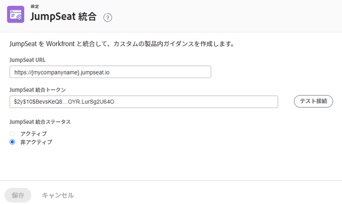

# JumpSeat 統合の設定

[!DNL JumpSeat] を [!DNL Workfront] と統合して、カスタムの製品内ガイダンスをを作成できます。

## アクセス要件

この記事の手順を実行するには、次のアクセス権が必要です。

<table style="table-layout:auto"> 
 <col> 
 <col> 
 <tbody> 
  <tr> 
   <td role="rowheader"><strong>[!DNL Adobe Workfront] プラン*</strong></td> 
   <td> 
[!UICONTROL Enterprise] 
 </td> 
  </tr> 
  <tr> 
   <td role="rowheader"><strong>[!DNL Adobe Workfront] ライセンス*</strong></td> 
   <td>[!UICONTROL Plan]</td> 
  </tr> 
  <tr> 
   <td role="rowheader"><strong>製品</strong></td> 
   <td>アクティブな [!DNL JumpSeat] プランが必要です。</td> 
  </tr> 
  <tr> 
   <td role="rowheader"><strong>アクセスレベル設定*</strong></td> 
   <td> 
 [!DNL Workfront] 管理者である必要があります。[!DNL Workfront] 管理者については、<a href="../../administration-and-setup/add-users/configure-and-grant-access/grant-a-user-full-administrative-access.md" class="MCXref xref">ユーザーへの完全な管理アクセス権の付与</a>を参照してください。
 </td> 
  </tr> 
 </tbody> 
</table>

&#42;ご利用のプラン、ライセンスタイプまたはアクセス権を確認するには、[!DNL Workfront] 管理者にお問い合わせください。

## 前提条件

開始する前に、

* [!DNL JumpSeat] に [!DNL Workfront] をアプリケーションとして追加し、アクティブ化します。詳しくは、[アプリケーションを追加または削除する方法](https://support.jumpseat.io/article/how-to-add-an-application/)を参照してください。

## [!DNL JumpSeat] 統合の設定

プレビュー環境と実稼動環境の両方で、[!DNL JumpSeat] 統合を設定することをお勧めします。

>[!TIP]
>
>[!DNL JumpSeat] に 2 つの別個の [!DNL Workfront] アプリケーション（プレビュー用に 1 つ、実稼動用に 1 つ）を追加してアクティブ化する必要があります。詳しくは、[アプリケーションを追加または削除する方法](https://support.jumpseat.io/article/how-to-add-an-application/)を参照してください。

[!DNL JumpSeat] 統合を設定するには、次の手順に従います。

1. [!DNL Adobe Workfront] の右上隅にある&#x200B;**[!UICONTROL メインメニュー]**&#x200B;アイコン  をクリックしたあと、「**[!UICONTROL 設定]**」をクリックします。
1. 左パネルで、**[!UICONTROL システム]**／**[!UICONTROL [!DNL JumpSeat]統合]**&#x200B;をクリックします。
1. **[!UICONTROL [!DNL JumpSeat]URL]**&#x200B;を入力します。

   **例：** [!DNL https]://{mycompanyname}.jumpseat.io

1. **[!UICONTROL [!DNL JumpSeat]統合トークン]**&#x200B;を入力します。これは、[!DNL JumpSeat] の&#x200B;**[!UICONTROL 設定]**&#x200B;ページで確認できます。

   **例：**$2y$10$BevsKeQ8....OYR.LurSg2U64O

1. 「**[!UICONTROL 構成をテスト]**」をクリックします。
1. 統合を&#x200B;**[!UICONTROL アクティブ]**&#x200B;にするか、**[!UICONTROL 非アクティブ]**&#x200B;にするかを選択します。

   >[!IMPORTANT]
   >
   >統合をアクティブにするには、手順 5 で実行した設定テストに合格する必要があります。

   

1. 「**[!UICONTROL 保存]**」をクリックします。
