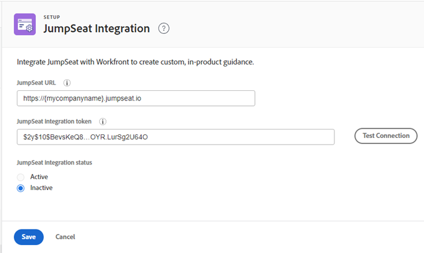

# JumpSeat 統合の設定

[!DNL JumpSeat] を [!DNL Workfront] と統合して、カスタムの製品内ガイダンスをを作成できます。

## アクセス要件

+++ 展開すると、この記事の機能のアクセス要件が表示されます。

<table>
  <tr>
   <td>Adobe Workfront パッケージ
   </td>
    
ワークフロー Ultimate

   <td> 
PrimeまたはUltimate

   </td>
  </tr>
    <tr>
   <td>Adobe Workfront ライセンス
   </td>
   <td>標準
   
計画

   </td>
  </tr>
  </tr>
  <tr>
   <td>製品
   </td>
   <td>アクティブな [!DNL JumpSeat] プランが必要です。
   </td>
  </tr>
   <tr>
   <td>アクセスレベル設定
   </td>
   <td>[!DNL Workfront] 管理者である必要があります。
   </td>
  </tr>
</table>

この表の情報について詳しくは、[Workfront ドキュメントのアクセス要件](/help/quicksilver/administration-and-setup/add-users/access-levels-and-object-permissions/access-level-requirements-in-documentation.md)を参照してください。

+++

## 前提条件

開始する前に、

* [!DNL JumpSeat] に [!DNL Workfront] をアプリケーションとして追加し、アクティブ化します。 詳しくは、[アプリケーションを追加または削除する方法](https://support.jumpseat.io/article/how-to-add-an-application/)を参照してください。

>[!IMPORTANT]
>
>次のアプリケーション URLを使用する必要があります：`.workfront.adobe.com`

## [!DNL JumpSeat] 統合の設定

プレビュー環境と本番環境の両方で、[!DNL JumpSeat] 統合を設定することをお勧めします。

>[!TIP]
>
>[!DNL JumpSeat] に 2 つの別個の [!DNL Workfront] アプリケーション（プレビュー用に 1 つ、実稼動用に 1 つ）を追加してアクティブ化する必要があります。 詳しくは、[アプリケーションを追加または削除する方法](https://support.jumpseat.io/article/how-to-add-an-application/)を参照してください。

[!DNL JumpSeat] 統合を設定するには、次の手順に従います。

{{step-1-to-setup}}

1. 左パネルで、**[!UICONTROL システム]**／**[!UICONTROL [!DNL JumpSeat]統合]**&#x200B;をクリックします。
1. **[!UICONTROL [!DNL JumpSeat]URL]**&#x200B;を入力します。これは、[!DNL JumpSeat]の拡張機能アイコンにあります。

>[!BEGINSHADEBOX]

**例：**

https://{mycompanyname}.jumpseat.io

>>

>[!ENDSHADEBOX]

1. **[!UICONTROL [!DNL JumpSeat]統合トークン]**&#x200B;を入力します。 これは、[!DNL JumpSeat] の&#x200B;**[!UICONTROL 設定]**&#x200B;ページで確認できます。

   **例：** $2y$10$BevsKeQ8....OYR.LurSg2U64O

1. 「**[!UICONTROL 構成をテスト]**」をクリックします。
1. 統合を&#x200B;**[!UICONTROL アクティブ]**&#x200B;にするか、**[!UICONTROL 非アクティブ]**&#x200B;にするかを選択します。

   >[!IMPORTANT]
   >
   >統合をアクティブにするには、手順 5 で実行した設定テストに合格する必要があります。

   

1. 「**[!UICONTROL 保存]**」をクリックします。

>[!TIP]
>
>[!DNL JumpSeat]統合の設定について詳しくは、[JumpSeat+Workfront](https://jumpseat.io/landing-page/jumpseat-workfront/)の[!DNL JumpSeat] ドキュメントを参照してください。
