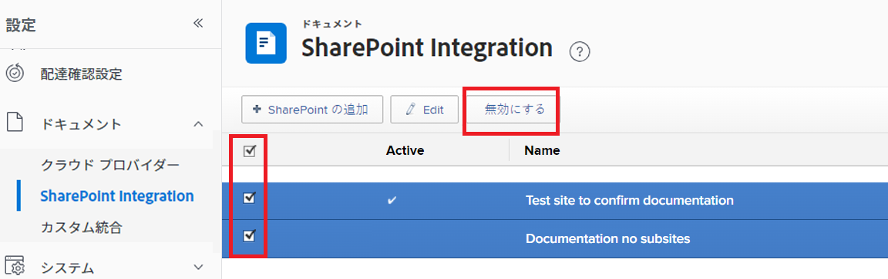

# [!DNL SharePoint] 統合の設定

<!--Audited: 12/2023-->

<!--
<p data-mc-conditions="QuicksilverOrClassic.Draft mode">**DON'T DELETE, DRAFT OR HIDE THIS ARTICLE. IT IS LINKED TO THE PRODUCT, THROUGH THE CONTEXT SENSITIVE HELP LINKS. **</p>
-->

>[!IMPORTANT]
>
>新しい [!DNL SharePoint] 統合は、22.3 リリース（2022年7月）で実稼動環境にリリースされました。ユーザーは引き続き、従来の [!DNL SharePoint] 統合を通じてリンクされたドキュメントにアクセスできますが、SharePoint からドキュメントをリンクするには、新しい [!DNL SharePoint] 統合を使用する必要があります。
>
>* 新しいSharePoint統合は、管理者が設定する必要がない場合があり、個々のユーザーが設定することもできます。 ただし、新しい SharePoint 統合にスムーズに移行できるように、Workfront 管理者は、Workfront の設定領域で設定を小規模に変更する必要があります。
>
>    詳細と手順については、本記事の[ドキュメントに引き続きアクセスするための従来の SharePoint 統合の設定](#configure-the-legacy-sharepoint-integration-for-continued-access-to-documents)を参照してください。
>    
>* 従来の [!DNL SharePoint] 統合を通じて現在リンクされているドキュメントを、新しい統合を通じてリンクすることをお勧めします。
>    
>    ドキュメントをリンクする手順については、[外部アプリケーションからドキュメントをリンク](../../documents/adding-documents-to-workfront/link-documents-from-external-apps.md)を参照してください。

[!DNL Workfront] を [!DNL SharePoint Online] と統合して、ユーザーが Workfront 内で [!DNL SharePoint] ドキュメントに移動し、リンクし、追加できるようにします。提供される機能は他の [!DNL Workfront] 統合（[!DNL Google Drive]、[!DNL Box]、[!DNL Dropbox] など）の機能と似ています。

編集オプションは、[!DNL SharePoint Online] とのみ互換性があります。[!DNL SharePoint] のオンプレミスインスタンス はサポートされていません。

## アクセス要件

この記事の手順を実行するには、以下を保有している必要があります。

<table style="table-layout:auto"> 
 <col> 
 <col> 
 <tbody> 
  <tr> 
   <td role="rowheader">[!DNL Adobe Workfront] プラン</td> 
   <td>任意</td> 
  </tr> 
  <tr> 
   <td role="rowheader">[!DNL Adobe Workfront] ライセンス</td> 
   <td>新規：標準 <p>または</p><p>現在：プラン</p></td> 
  </tr> 
  <tr> 
   <td role="rowheader">アクセスレベル設定*</td> 
   <td>[!DNL Workfront] 管理者であることが必要です。 </td> 
  </tr> 
 </tbody> 
</table>

この表の情報の詳細については、 [Workfrontドキュメントのアクセス要件](/help/quicksilver/administration-and-setup/add-users/access-levels-and-object-permissions/access-level-requirements-in-documentation.md).

## 前提条件

で必要なアクセス権または権限を持っている。 [!DNL SharePoint] を変更または設定するには、以下を実行します。 [!DNL SharePoint] 統合とも呼ばれます。

## 新しい SharePoint 統合によるドキュメントのリンク

個々のユーザーは、新しい [!DNL SharePoint] 統合を通してドキュメントをリンクできます。統合には管理者設定は必要ありません。代わりに、ユーザーはドキュメントをリンクするときに [!DNL Microsoft] アカウントにログインします。これにより、統合はユーザーの [!DNL SharePoint] で利用可能なドキュメントにアクセスできるようになります。

ユーザーが最初に [!DNL Workfront] [!DNL SharePoint] 統合と [!DNL SharePoint] アカウントを使用する場合は、 [!DNL Workfront] は、 [!UICONTROL SharePoint] アカウントを作成するか、Microsoft管理者に権限をリクエストできます。 読み取り権限により、[!DNL Workfront] は [!DNL SharePoint] 上のファイルの表示とアクセスを行えるようになり、書き込み権限により、ユーザーは [!DNL SharePoint] にファイルをアップロードできるようになります。


新しい [!DNL SharePoint] 統合を通じてドキュメントをリンクする手順については、「[外部ドキュメントを  [!DNL Workfront]](../../documents/adding-documents-to-workfront/link-documents-from-external-apps.md#link-an-external-document-to-workfront) にリンクする」を参照してください。

>[!NOTE]
>
>* 組織のMicrosoft設定に応じて、ユーザーには、「権限がリクエストされました」ページではなく、「承認が必要」ページが表示される場合があります。 この場合、ユーザーはこのページを使用して、組織のMicrosoft管理者に SharePoint 統合に対する権限の付与を要求できます。
>
>* [!DNL SharePoint] 統合は、単一の [!DNL SharePoint] インスタンスに接続できます。したがって、ユーザーは 1 つの [!DNL SharePoint] に対して統合を設定できますが、2 番目の [!DNL SharePoint] に対する権限とドキュメントがある場合でも、2 番目の [!DNL SharePoint] への統合を設定することはできません。
>
>* ユーザーは、[!DNL Workfront] [!DNL SharePoint] の統合を通じて、[!DNL SharePoint] アカウントと同じサイト、コレクション、フォルダー、サブフォルダー、ファイルにアクセスできます。

### SharePointからドキュメントをリンク

SharePointから新しい [!DNL SharePoint] 統合については、 [外部ドキュメントを次にリンク： [!DNL Workfront]](../../documents/adding-documents-to-workfront/link-documents-from-external-apps.md#link-an-external-document-to-workfront).

### ドキュメントをSharePointに送信

ドキュメントをSharePointに送信するには：

1. 次をクリック： **送信先** アイコン  「 SharePoint (Graph API) 」を選択します。
1. （オプション）検索バーで、ドキュメントを送信するサイトまたはフォルダーを検索します。
1. リストからサイトまたはフォルダを選択します。

   * サイトは .

   * フォルダには、 .

   * ファイルにはアイコンは表示されません。

1. 「**保存**」をクリックします。


##  [!DNL SharePoint] 統合のセキュリティ、アクセス、および認証情報

### 認証と承認

[!DNL Workfront] は OAuth2 を使用して、アクセストークンと更新トークンを取得します。このアクセストークンは、すべての [!DNL SharePoint] エリアの認証に使用されます。

### アクセスと権限

ユーザーが初めてドキュメントを [!DNL Workfront] から [!DNL SharePoint]の場合は、要求された権限のページに移動し、SharePoint統合に対する権限を付与できます。

>[!NOTE]
>
>組織のMicrosoft設定に応じて、ユーザーには、「権限がリクエストされました」ページではなく、「承認が必要」ページが表示される場合があります。 この場合、ユーザーはこのページを使用して、組織のMicrosoft管理者に SharePoint 統合に対する権限の付与を要求できます。

次の権限がリクエストされます。

| アクセス | 理由 |
|---|---|
| ファイルへのフルアクセス権を持っている | 許可 [!DNL Workfront] をクリックして、アセットをリンクするユーザーのファイルにアクセスします。 ドキュメントが [!DNL Workfront] から [!DNL SharePoint] に送信される場合、[!DNL Workfront] はアセットを作成するためのアクセス権を必要とします。 |
| すべてのサイトコレクションの項目を読み取る | [!DNL Workfront] がアセットを読み取ってユーザーナビゲーションを可能にすることを許可します。 |
| すべてのサイトコレクションの項目を編集または削除する | 許可 [!DNL Workfront] サイトおよびサイトコレクションにアセットを作成する場合。 「削除」は、リンクの試行に失敗した後にクリーンアップする場合にのみ使用します。 |
| アクセス権を付与したデータへのアクセスを維持する | [!DNL Workfront] に更新トークンの生成を許可します。 |
| ログインとユーザープロファイルの読み取り | [!DNL Workfront] が OAuth2 ログインフローを通じて、アクセストークンを使用して、ユーザーの代理として振る舞えるようにします。 |

* このアクセス権は、ユーザーが初めて統合を使用する際にユーザーから付与され、いつでも取り消すことができます。
* この統合で必要な権限は、**委任された**&#x200B;権限です。
* [!DNL Workfront] は、統合で操作を実行するのに最低限必要なアクセス権を要求します。
* [!DNL SharePoint] にリンクされている [!DNL Adobe Workfront] ドキュメントを表示、編集または削除するためのアクセス権は、[!DNL Workfront] でのユーザーのアクセス権に基づいています。ただし、[!DNL SharePoint] のファイルまたはフォルダーの移動、ダウンロードまたは編集には [!DNL SharePoint] へのアクセス権が必要であり、これらの操作へのアクセス権は [!DNL SharePoint] で制御されます。
* ユーザーは、[!DNL SharePoint] にログインしなくても、[!DNL SharePoint] から提供されるサムネールやプレビュー画像を表示したり、[!DNL SharePoint] 内のファイル名やフォルダー名を確認したりできます。
* ユーザーのアクセストークンが使用されるのは、ユーザーがオフラインで、[!DNL Workfront] にリンクされているフォルダーの内容を別のユーザーが表示する場合のみです。アクセストークンは、フォルダー内のドキュメントが追加、削除または編集されたかどうかを検出するために使用されます。

### セキュリティ

[!DNL Workfront] と [!DNL SharePoint] 間のすべての通信は、情報が暗号化される HTTPS で行われます。

[!DNL Workfront] では、[!DNL SharePoint] からのデータを保存、コピーまたは複製しません。唯一の例外は、[!DNL Workfront] が [!DNL SharePoint] からのサムネールを保存して、リストビューとプレビューに表示することです。

アセットが最初に [!DNL Workfront] にアップロードされ、その後 [!DNL SharePoint] に送信された場合、[!DNL Workfront] には最初のファイルのデータが保持されます。ユーザーが [!DNL Workfront] ドキュメントの以前のバージョンをダウンロードできるからです。ドキュメントが [!DNL SharePoint] で作成された場合、[!DNL Workfront] はそのファイルデータを保存しません。

## ドキュメントに継続的にアクセスできるように従来の [!DNL SharePoint] 統合を設定

従来の [!DNL SharePoint] 統合を通じて Workfront にリンクされたドキュメントにユーザーが引き続きアクセスできるようにするには、従来の [!DNL SharePoint] 統合へのアクセス権を再設定し、SharePoint クライアントシークレットを最新の状態に保つ必要があります。

* [従来の [!DNL SharePoint] 統合へのアクセス権を再設定](#reconfigure-access-to-the-legacy-sharepoint-integration)
* [従来の [!DNL SharePoint] 統合に継続的にアクセスできるようにクライアントシークレットを設定](#configure-the-client-secret-for-continued-access-to-the-legacy-sharepoint-integration)

### 従来の [!DNL SharePoint] 統合へのアクセス権を再設定

レガシーの再設定 [!DNL SharePoint] 統合により、レガシー [!DNL SharePoint] 統合と統合します。また、ユーザーがその統合を通じて新しいドキュメントをリンクできないようにする必要があります。

>[!NOTE]
>
> * 従来の [!DNL SharePoint] 統合には「[!DNL SharePoint]」というラベルが付きます。
> * 新しい [!DNL SharePoint] 統合には「[!UICONTROL [!DNL SharePoint] (Graph API)]」というラベルが付きます。

1. Adobe Workfront の右上隅にある&#x200B;**[!UICONTROL メインメニュー]**&#x200B;アイコンをクリックするか、または（使用可能な場合）左上隅にある&#x200B;**[!UICONTROL メインメニュー]**&#x200B;アイコン、「**[!UICONTROL 設定]**」の順にクリックします。
1. 左側のナビゲーションで「**[!UICONTROL ドキュメント]**」を選択したあと、「**[!UICONTROL クラウド プロバイダー]**」を選択します。
1. 「**[!DNL SharePoint]**」オプションと「**[!UICONTROL [!DNL SharePoint](Graph API)]**」オプションが両方とも有効になっていることを確認します。
1. 「**[!UICONTROL 保存]**」をクリックします。
1. 左側のナビゲーションで「**[!UICONTROL ドキュメント]**」を選択したあと、「**[!UICONTROL [!DNL SharePoint]統合]**」を選択します。
1. 既存のすべての統合のリストの左側にあるチェックマークを選択したあと、「**[!UICONTROL 無効にする]**」を選択します。
   


### 従来の [!DNL SharePoint] 統合に継続的にアクセスできるようにクライアントシークレットを設定

お使いの [!DNL SharePoint] クライアントシークレットは 1 年で有効期限が切れます。従来の [!DNL SharePoint] 統合でドキュメントに継続的にアクセスできるようにするには、その [!DNL SharePoint] クライアントシークレットを最新の状態に保つ必要があります。

>[!IMPORTANT]
>
> [!DNL SharePoint] クライアントシークレットは [!DNL Microsoft] で処理されるので、クライアントシークレットの機能と手順は、[!DNL Microsoft] による [!DNL SharePoint] の更新に応じて変更される可能性があります。[!DNL SharePoint] の手順と機能の最新情報については、常に [!DNL Microsoft] のドキュメントを参照してください。

<!--1. Go to the site that your [!DNL SharePoint] integration uses. This may be a site that you created when setting up the integrations, or it may be your organization's root site.

1. Add `/_layouts/15/appregnew.aspx` to the end of the URL in the search bar at the top of your browser window.-->

1. 新しいクライアント秘密鍵を生成します。詳しくは、 [の期限が切れるクライアントの秘密鍵を置き換える [!DNL SharePoint] アドイン](https://docs.microsoft.com/ja-jp/sharepoint/dev/sp-add-ins/replace-an-expiring-client-secret-in-a-sharepoint-add-in#generate-a-new-secret).
1. このクライアントシークレットを安全な場所にコピーします。
1. [!DNL Workfront] に管理者としてログインします。
1. Workfrontで、 **[!UICONTROL メインメニュー]** アイコン  Adobe Workfrontの右上隅にある、または（使用可能な場合）、 **[!UICONTROL メインメニュー]** アイコン  左上隅で、「 **[!UICONTROL 設定]** .
1. 左パネルで、**[!UICONTROL ドキュメント]**／**[!UICONTROL [!DNL SharePoint]統合]**&#x200B;をクリックします。
1. 更新する [!DNL SharePoint] 統合をクリックしたあと、「**[!UICONTROL 編集]**」をクリックします。
1. 次を見つけます。 **接続情報** 」セクションに移動し、新しいクライアント秘密鍵を **[!UICONTROL SharePoint Client Secret]** フィールドに入力します。
1. 「**[!UICONTROL 保存]**」をクリックします。

<!--

## Instructions for setting up the legacy SharePoint integration

>[!IMPORTANT]
>
>This integration has been deprecated. The instructions here are for information only and will be removed in the near future.


Workfront connects to [!DNL SharePoint] Online using OAuth 2.0, a standard used by most web-based integrations for the authentication and authorization of users.

To configure OAuth, you need to create a [!DNL SharePoint] site and a Site App within [!DNL SharePoint]. This process is described in the following sections.

For more information about OAuth, see [http://oauth.net](http://oauth.net/).

>[!TIP]
>
>To make it easy to copy and paste information between [!DNL Workfront] and [!DNL SharePoint] in these steps, we recommend keeping both applications open in separate tabs.

* [Create and configure a [!DNL SharePoint] site](#create-and-configure-a-sharepoint-site) 
* [Grant write permissions to the site app](#grant-write-permissions-to-the-site-app) 
* [Create a [!DNL Workfront] [!DNL SharePoint] integration instance](#create-a-workfront-sharepoint-integration-instance) 
* [Complete your integration](#complete-your-integration) 
* [Add documents](#add-documents)

### Create and configure a [!DNL SharePoint] site  {#create-and-configure-a-sharepoint-site}

In order for [!DNL Workfront] to authenticate with [!DNL SharePoint], [!DNL Workfront] ca use a master site where users have the [!UICONTROL Full Control] permission level or specific Manage permissions. This master site acts as an Authentication Entry Point for [!DNL Workfront].

To create and configure a [!DNL SharePoint] Site:

1. (Optional) If you do not want to use your organization's root site, you can create a master site in [!DNL SharePoint].

   For instructions, visit [Create a site](https://docs.microsoft.com/en-us/sharepoint/create-site-collection) in the [!DNL Microsoft] Documentation.

   * Select the **[!UICONTROL Team Site]** option when creating the site.

1. (Conditional) If you created a site in step 1, go to the site you just created.

   Or

   If you did not create a site in step 1, go to your organization's root site.

1. Add `/_layouts/15/appregnew.aspx` to the end of the URL in the search bar at the top of your browser window.
1. Configure the following fields:

   <table style="table-layout:auto"> 
    <col> 
    <col> 
    <tbody> 
     <tr> 
      <td role="rowheader"> <p>[!UICONTROL Client ID]</p> </td> 
      <td> <p>Click <strong>[!UICONTROL Generate]</strong> to generate a Client ID. Copy this ID to a secure location. You will use it later when you set up the [!DNL SharePoint] integration in [!DNL Workfront].</p> </td> 
     </tr> 
     <tr> 
      <td role="rowheader"> <p>[!UICONTROL Client Secret]</p> </td> 
      <td> <p>Click <strong>[!UICONTROL Generate]</strong> to generate a Client Secret. Copy this Secret to a secure location. You will use it later when you set up the [!DNL SharePoint] integration in [!DNL Workfront].</p> </td> 
     </tr> 
     <tr> 
      <td role="rowheader"> <p>Title</p> </td> 
      <td> <p>Enter a title, such as [!DNL Workfront] Site App. Users see this title when adding documents..</p> </td> 
     </tr> 
     <tr> 
      <td role="rowheader"> <p>[!UICONTROL App Domain]</p> </td> 
      <td> <p><code>my.workfront.com</code> </p> </td> 
     </tr> 
     <tr> 
      <td role="rowheader"> <p>[!UICONTROL Redirect URI]</p> </td> 
      <td> <p><code>https://oauth.my.workfront.com/oauth2/redirect</code> </p> </td> 
     </tr> 
    </tbody> 
   </table>

1. Click **[!UICONTROL Create]**
1. Continue to [Grant write permissions to the site app](#grant-write-permissions-to-the-site-app).

### Grant write permissions to the site app  {#grant-write-permissions-to-the-site-app}

At this point, you have successfully created a Site App and registered it within [!DNL Workfront]. This site app is also known as an app principal in [!DNL SharePoint]. It resides within your tenant. New site apps do not automatically have access to site collections within the tenant. Permissions must be granted explicitly, for each site collection. The steps below will show you how to grant Write permission to the new Site App a site collection. Repeat these steps for each of the site collections you added under [!UICONTROL Visible Site Collections] in the steps above.

This site app must have [!UICONTROL Write] permission to any site collections that users need to access through [!DNL Workfront].

1. Add '/_layouts/15/appinv.aspx' to the URL in [!DNL Sharepoint].

   **Example:**

   ```
   https://mycompany.sharepoint.com/sites/mysite/_layouts/15/appinv.aspx
   ```

1. Configure the following fields

   <table style="table-layout:auto"> 
    <col> 
    <col> 
    <tbody> 
     <tr> 
      <td role="rowheader">[!UICONTROL App ID]</td> 
      <td> <p>Add the Client ID that you created in <a href="#create-and-configure-a-sharepoint-site" class="MCXref xref">Create and configure a [!DNL SharePoint] site </a>and click <strong>[!UICONTROL Lookup]</strong>.</p> </td> 
     </tr> 
     <tr> 
      <td role="rowheader"> <p>[!UICONTROL Client] / [!UICONTROL App Domain] / [!UICONTROL Redirect URL]</p> </td> 
      <td> <p>These automatically fill when you click [!UICONTROL Lookup].</p> </td> 
     </tr> 
     <tr> 
      <td role="rowheader">[!UICONTROL Permission Request XML]</td> 
      <td> <p>Copy the following XML to the [!UICONTROL Permission Request XML] field. Make sure that it is added exactly as shown without additional spaces etc. in order to avoid errors.</p> 
      <div></a> 
      <div style="mc-code-lang: XML;" class="codeSnippetBody" data-mc-continue="False" data-mc-line-number-start="1" data-mc-use-line-numbers="False"> 
       <pre><code><span style="color: #63a35c; ">&lt;AppPermissionRequests&gt;</span><br><span style="color: #63a35c; ">&lt;AppPermissionRequest <span style="color: #795da3; ">Scope</span><span style="color: #df5000; ">="http://sharepoint/content/sitecollection/web"</span> <span style="color: #795da3; ">Right</span><span style="color: #df5000; ">="Write"</span>/&gt;</span><br><span style="color: #63a35c; ">&lt;/AppPermissionRequests&gt;</span></code></pre> 
      </div> 
      </div> </td> 
     </tr> 
    </tbody> 
   </table>

1. Click **[!UICONTROL Create]**. 
1. In the dialog that appears, click **[!UICONTROL Trust it]**.
1. Verify that the site app has access to the site collection by clicking the **[!UICONTROL Site collection app permissions]** link in [!UICONTROL Site Settings].
1. Repeat the steps above for the remaining site collections, then continue with [Create a [!DNL Workfront] [!DNL SharePoint] integration instance](#create-a-workfront-sharepoint-integration-instance).

### Create a [!DNL Workfront] [!DNL SharePoint] integration instance {#create-a-workfront-sharepoint-integration-instance}

When you have created a site app in [!DNL SharePoint], you can now copy information from the site app into [!DNL Workfront]. The site app is an app principal and acts as the conduit through which OAuth requests are made to access documents within site collections.

1. Log into [!DNL Workfront] as an administrator.
1. Click the **[!UICONTROL Main Menu]** icon  in the upper-right corner of Adobe Workfront, then click **[!UICONTROL Setup]** .

1. In the left panel, click **[!UICONTROL Documents]** > **[!UICONTROL [!DNL SharePoint] Integration]**.
1. Click **[!UICONTROL Add [!DNL SharePoint]]**.
1. Configure the following fields:

   <table style="table-layout:auto"> 
    <col> 
    <col> 
    <tbody> 
     <tr> 
      <td role="rowheader"> <p>[!UICONTROL Name]</p> </td> 
      <td> <p>Enter a name for the [!DNL SharePoint] integration. Users see this name when they click [!UICONTROL Add] &gt; [!UICONTROL From] 'name of integration'. </p> </td> 
     </tr> 
     <tr> 
      <td role="rowheader"> <p>[!UICONTROL [!DNL SharePoint] Host Instance]</p> </td> 
      <td> <p><code>&lt;YourDomain&gt;.sharepoint.com</code> </p> </td> 
     </tr> 
     <tr> 
      <td role="rowheader"> <p>[!UICONTROL [!DNL Azure] Access Domain]</p> </td> 
      <td> <p><code>&lt;YourDomain&gt;.onmicrosoft.com</code> </p> <p>This refers to the Master Site that users will use to authenticate through. It is likely the same domain as the [!UICONTROL [!DNL SharePoint] Host Instance].</p> </td> 
     </tr> 
     <tr> 
      <td role="rowheader"> <p>
      </p> </td> 
      <td> <b>Important</b> Site collections are used only in the Legacy [!DNL SharePoint] Integration.
       <ul> 
        <li> <p><b>If you are using your organization's root site</b><b>:</b> </p> <p>Enter <code>/</code></p> </li> 
        <li> <p><b>If you are using a master site and subsites:</b> </p> <p><b>IMPORTANT</b>: [!DNL Microsoft SharePoint] no longer recommends the use of subsites.</p> <p>Enter the URL stem for the site collection that you created in the section above.</p> <p>This is the section of the URL after .com.</p> <p>Example: for the URL <code>https://mycompany.sharepoint.com/sites/mysite</code>, the stem would be <code>/sites/mysite</code>.</p> </li> 
       </ul> </td> 
     </tr> 
     <tr> 
      <td role="rowheader">[!UICONTROL [!DNL SharePoint] Client ID]</td> 
      <td>Enter the Client ID that you generated in <a href="#create-and-configure-a-sharepoint-site" class="MCXref xref">Create and configure a [!DNL SharePoint] site </a>.</td> 
     </tr> 
     <tr> 
      <td role="rowheader">[!UICONTROL [!DNL SharePoint] Client Secret]</td> 
      <td>Enter the Client Secret that you generated in <a href="#create-and-configure-a-sharepoint-site" class="MCXref xref">Create and configure a [!DNL SharePoint] site </a>.</td> 
     </tr> 
     <tr> 
      <td role="rowheader">[!UICONTROL Visible Site Collections]</td> 
      <td> <b>Important</b> Site collections are used only in the Legacy [!DNL SharePoint] integration.
       <ul> 
        <li> <p><b> If you are using your organization's root site</b><b>:</b> </p> <p>Enter <code>/</code></p> </li> 
        <li> <p><b>If you are using a master site and subsites:</b> </p> <p><b>IMPORTANT</b>: [!DNL Microsoft SharePoint] no longer recommends the use of subsites.</p> <p>For each subsite you want to add to your [!DNL SharePoint] integration, enter the stem of the subsite.</p> <p>Example: for the URL<code>https://mycompany.sharepoint.com/sites/mysite/mysubsite</code>, the stem would be <code>/sites/mysite/mysubsite</code>.</p> <p><b>NOTE</b>:   <p>If you want to test your configuration only (no subsites), enter the stem of the master site. </p> <p>Example: for the URL <code> https://mycompany.sharepoint.com/sites/mysite</code>, the stem would be <code>/sites/mysite</code>.</p> <p>When you have tested your configuration as described in <a href="#complete-your-integration" class="MCXref xref">Complete your integration</a>, you must remove the master site and enter the subsites.</p> 
          <ol> 
           <li value="1">Click the <strong>[!UICONTROL Main Menu]</strong> icon  in the upper-right corner of [!DNL Adobe Workfront], then click <strong>[!UICONTROL Setup]</strong> .<li><p>In the left panel, click <strong>[!UICONTROL Documents]</strong> &gt; <strong>[!UICONTROL [!DNL SharePoint] Integration]</strong>.</p></li><li><p>Click the [!DNL SharePoint] integration you are setting up, then click Edit.</p></li><li><p>Delete the stem for the master site from the [!UICONTROL Visible Site Collections] field.</p></li><li><p>For each subsite you want to add to your [!DNL SharePoint] integration, enter the stem of the subsite.</p></li><p>Example: for the URL<code>https://mycompany.sharepoint.com/sites/mysite/mysubsite</code>, the stem would be <code>/sites/mysite/mysubsite</code>.</p></li> 
          </ol> </p> </li> 
       </ul> <p> </p> <p> </p> </td> 
     </tr> 
    </tbody> 
   </table>

1. Click **[!UICONTROL Save]**
1. Continue to [Complete your integration](#complete-your-integration).

### Complete your integration {#complete-your-integration}

The basic configuration is almost complete.

1. In Workfront, Click the **[!UICONTROL Main Menu]** icon  in the upper-right corner of Adobe Workfront, then click **[!UICONTROL Documents]** .
1. Click **[!UICONTROL Add new]**.
1. Click **[!UICONTROL From] `<title of your [!DNL SharePoint] site>`** in the dropdown.

   A dialog that invites you to Trust this site appears.

   >[!NOTE]
   >
   >If this dialog does not appear, your [!DNL SharePoint] integration is not configured correctly.

1. Click **[!UICONTROL Trust it]**.

### Add documents {#add-documents}

You can now add documents from your [!DNL SharePoint] site.

For instructions, see [Link an external document to [!DNL Workfront]](../../documents/adding-documents-to-workfront/link-documents-from-external-apps.md#linking-existing-documents) in [Link documents from external applications](../../documents/adding-documents-to-workfront/link-documents-from-external-apps.md)

>[!IMPORTANT]
>
>If the user who linked a folder no longer has access to the external application, [!DNL Workfront] can no longer access the contents of the folder. This may happen, for example, if the user who originally linked the folder leaves the company. To ensure continued access, a user with access to the folder must re-link the folder.
> 

-->

## トラブルシューティング

* [問題： [!DNL SharePoint]  統合を使用すると、ユーザーに認証ベースのエラーが発生します。](#problem-users-experience-authentication-based-errors-when-using-the-sharepoint-integration)
* [問題： [!DNL Workfront] 内の  [!DNL SharePoint]  ファイルを参照しようとすると、サイトコレクションの一部またはすべてが表示されません。](#problem-when-attempting-to-browse-sharepoint-files-in-workfront-i-do-not-see-any-or-all-of-my-site-collections)
* [問題： [!DNL SharePoint] で以前にリンクされたフォルダーやドキュメントにアクセスできません。](#problem-i-cannot-access-previously-linked-folders-and-documents-in-sharepoint)

### 問題：[!DNL SharePoint] 統合を使用すると、ユーザーに認証ベースのエラーが発生します。 {#problem-users-experience-authentication-based-errors-when-using-the-sharepoint-integration}

解決策：

ユーザーは、[!DNL SharePoint] サイトに対する適切な権限を持っている必要があります。

[!UICONTROL フルコントロール]のアクセス権を持つユーザーは、[!DNL SharePoint] 統合に必要なすべての権限を持っています。ユーザーにフルコントロールアクセス権を付与したくない場合は、次の権限を付与する必要があります。

<table style="table-layout:auto"> 
 <col> 
 <col> 
 <tbody> 
  <tr> 
   <td role="rowheader"> <p>[!UICONTROL Design]</p> </td> 
   <td> <p>表示、追加、更新、削除、承認、カスタマイズが可能</p> </td> 
  </tr> 
  <tr> 
   <td role="rowheader"> <p>[!UICONTROL Edit]</p> </td> 
   <td> <p>リストの追加、編集、削除が可能。リスト項目とドキュメントの表示、追加、更新、削除が可能</p> </td> 
  </tr> 
  <tr> 
   <td role="rowheader"> <p>[!UICONTROL Contribute]</p> </td> 
   <td> <p>リスト項目とドキュメントの表示、追加、更新、削除が可能</p> </td> 
  </tr> 
  <tr> 
   <td role="rowheader"> <p>[!UICONTROL View only]</p> </td> 
   <td> <p>ページ、リスト項目、ドキュメントの表示が可能（サーバーサイドのファイルハンドラーを持つドキュメントタイプは、ブラウザーで表示可能でダウンロード不可）</p> </td> 
  </tr> 
 </tbody> 
</table>

権限レベルの作成および編集手順について詳しくは、Microsoft ドキュメントの[権限レベルの作成および編集方法](https://docs.microsoft.com/ja-jp/sharepoint/how-to-create-and-edit-permission-levels)を参照してください。

<!--

### Problem: As a [!DNL Workfront] user, I am unable to provision a new [!DNL SharePoint] instance. When I attempt to do I see an error. {#problem-as-a-workfront-user-i-am-unable-to-provision-a-new-sharepoint-instance-when-i-attempt-to-do-i-see-an-error}

Solutions:

This can be caused by a number of things, originating in either [!DNL Workfront] or [!DNL SharePoint]'s configuration. Verify that:

* The Client ID, Client Secret, return URL and other configuration fields are correctly mapped between the [!DNL Workfront] [!DNL SharePoint] Integration instance and the [!DNL SharePoint] Site App.
* The user has [!UICONTROL Full Control] permission to the Site Collection used for authentication.
* The Site App is listed under [!UICONTROL Site App Permissions] for the [!UICONTROL Site Collection] used for authentication.

-->

### 問題：[!DNL Workfront] 内の [!DNL SharePoint] ファイルを参照しようとすると、サイトコレクションの一部またはすべてが表示されません。 {#problem-when-attempting-to-browse-sharepoint-files-in-workfront-i-do-not-see-any-or-all-of-my-site-collections}

解決策：

[!DNL Workfront] でサイトコレクションを表示するには、次の条件を満たす必要があります。

<!--

* The site collection must be registered in the [!DNL Workfront] [!DNL SharePoint] Integration instance.

  To verify this in [!DNL Workfront]:

   1. Go to [!UICONTROL Setup] > [!UICONTROL Documents] > [!UICONTROL [!DNL SharePoint] Integration].
   1. Edit the [!DNL SharePoint] Integration instance information.
   1. Verify that the site collection is listed under [!UICONTROL Visible Site Collections].
   -->

* ユーザーは、[!DNL SharePoint] のサイトコレクションに対するビューアクセス権を持っている必要があります。

  次の手順でこれを検証します。 [!DNL SharePoint]、SharePointでサイトコレクションの権限を確認します。

<!--* The [!DNL SharePoint] Site App must have access to the site collection.

  To verify this in [!DNL SharePoint]:

   1. Go to the site collection > [!UICONTROL Settings] > [!UICONTROL Site app permissions].
   1. Ensure that the [!UICONTROL Site App] used by [!DNL Workfront] is listed here.
   1. (Conditional) If the Site App is not listed, add to the site collection using _layouts/15/appinv.aspx.

      For information about adding the site collection, see Granting Write Permissions To The Site App.
      
-->

### 問題：[!DNL SharePoint] で以前にリンクされたフォルダーやドキュメントにアクセスできません。 {#problem-i-cannot-access-previously-linked-folders-and-documents-in-sharepoint}

解決策：

[!DNL SharePoint] フォルダーをリンクしたユーザーが認証できなくなった場合、[!DNL Workfront] はフォルダーのコンテンツにアクセスできなくなります。この問題は、例えば、フォルダーを最初にリンクしたユーザーが退職した場合に発生する可能性があります。

引き続きアクセスできるように、フォルダーへのアクセス権を持つユーザーは、フォルダーを再リンクする必要があります。

外部プロバイダーからのフォルダーのリンクについて詳しくは、[外部アプリケーションからのドキュメントのリンク](../../documents/adding-documents-to-workfront/link-documents-from-external-apps.md)を参照してください。

<!--

### Problem: I see a "404 not found" error when attempting to add a document from [!DNL Sharepoint]

#### Solution:

This error might occur if one of the sites configured in the [!UICONTROL Visible Site Collections] list has been deleted in Sharepoint. Check the [!UICONTROL Visible Site Collections] list, and remove any sites that have been deleted in Sharepoint.-->