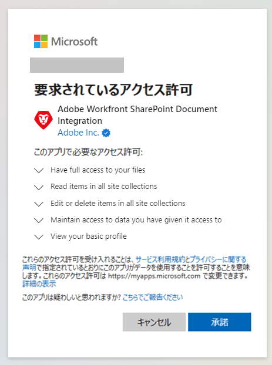

# レガシーの設定 [!DNL SharePoint] 統合

<!--
<p data-mc-conditions="QuicksilverOrClassic.Draft mode">**DON'T DELETE, DRAFT OR HIDE THIS ARTICLE. IT IS LINKED TO THE PRODUCT, THROUGH THE CONTEXT SENSITIVE HELP LINKS. **</p>
-->

>[!IMPORTANT]
>
>新しい [!DNL SharePoint] 統合は、22.3 リリース（2022 年 7 月）で実稼動環境にリリースされました。 ユーザーは、従来の [!DNL SharePoint] 統合の場合、新しい [!DNL SharePoint] SharePointからドキュメントをリンクするための統合
>
>* 新しいSharePoint統合は、管理者が設定する必要はなく、個々のユーザーが設定できます。 ただし、新しいSharePoint統合にスムーズに移行できるように、Workfront管理者は、Workfrontのセットアップ領域で小さな設定を変更する必要があります。
   >
   >    詳細および手順については、 [ドキュメントに引き続きアクセスするための従来のSharePoint統合の設定](#configure-the-legacy-sharepoint-integration-for-continued-access-to-documents) 」を参照してください。
>    
>* 現在レガシーの [!DNL SharePoint] 新しい統合による統合。
   >    
   >    ドキュメントをリンクする手順については、 [外部アプリケーションからドキュメントをリンク](../../documents/adding-documents-to-workfront/link-documents-from-external-apps.md).


統合可能な [!DNL Workfront] と [!DNL SharePoint Online]を使用して、ユーザーが移動、リンク、および追加できるようにする [!DNL SharePoint] Workfront内のドキュメント。 提供される機能は他の機能と似ています [!DNL Workfront] 統合（例： ） [!DNL Google Drive], [!DNL Box]、および [!DNL Dropbox].

この統合は、 [!DNL SharePoint Online]. のオンプレミスインスタンス [!DNL SharePoint] はサポートされていません。

## アクセス要件

この記事の手順を実行するには、次の手順を実行する必要があります。

<table style="table-layout:auto"> 
 <col> 
 <col> 
 <tbody> 
  <tr> 
   <td role="rowheader">[!DNL Adobe Workfront] 計画</td> 
   <td>任意</td> 
  </tr> 
  <tr> 
   <td role="rowheader">[!DNL Adobe Workfront] ライセンス</td> 
   <td>[!UICONTROL プラン ]</td> 
  </tr> 
  <tr> 
   <td role="rowheader">アクセスレベル設定*</td> 
   <td> <p>次の条件を満たす必要があります。 [!DNL Workfront] 管理者。 詳しくは、 [!DNL Workfront] 管理者向け： <a href="../../administration-and-setup/add-users/configure-and-grant-access/grant-a-user-full-administrative-access.md" class="MCXref xref">ユーザーに完全な管理アクセス権を付与する</a>.</p> </td> 
  </tr> 
 </tbody> 
</table>

&#42;ご利用のプラン、ライセンスの種類、アクセス権を確認するには、 [!DNL Workfront] 管理者。

## 前提条件

で必要なアクセス権または権限を持っている。 [!DNL SharePoint] 組織の [!DNL SharePoint].

## 新しいSharePoint統合によるドキュメントのリンク

個々のユーザーは、新しい [!DNL SharePoint] 統合とも呼ばれます。 統合には管理者設定は必要ありません。 代わりに、ユーザーが [!DNL Microsoft] ドキュメントをリンクする際にアカウントを作成します。これにより、統合でユーザーの [!DNL SharePoint].

ユーザーが [!DNL Workfront] [!DNL SharePoint] 統合と [!DNL SharePoint] アカウントを使用する場合、 [!DNL Workfront] は、 [!UICONTROL SharePoint] アカウント 読み取り権限許可 [!DNL Workfront] 次のファイルを表示してアクセスする： [!DNL SharePoint]、および書き込み権限を持つユーザーは、にファイルをアップロードできます。 [!DNL SharePoint].



新しい [!DNL SharePoint] 統合については、 [外部ドキュメントを次にリンク： [!DNL Workfront]](../../documents/adding-documents-to-workfront/link-documents-from-external-apps.md#link-an-external-document-to-workfront)

>[!NOTE]
>
>* A [!DNL SharePoint] 統合は、 [!DNL SharePoint] インスタンス。 したがって、ユーザーは、 [!DNL SharePoint]を設定する必要がありますが、1 秒に対する統合を設定することはできません [!DNL SharePoint](2 番目の [!DNL SharePoint].
>
>* ユーザーは、 [!DNL Workfront] [!DNL SharePoint] の統合と同様に、 [!DNL SharePoint] アカウント


## のセキュリティ、アクセス、および認証情報 [!DNL SharePoint] 統合

### 認証と承認

[!DNL Workfront] は OAuth2 を使用して、アクセストークンと更新トークンを取得します。 このアクセストークンは、すべての [!DNL SharePoint] 領域

### アクセスと権限

ユーザーが初めてドキュメントを [!DNL Workfront] から [!DNL SharePoint]に設定されている場合は、次の権限を要求する画面が表示されます。

| アクセス | 理由 |
|---|---|
| ファイルへのフルアクセス権を持つ | 許可 [!DNL Workfront] をクリックして、アセットをリンクするユーザーのファイルにアクセスします。 ドキュメントの送信元 [!DNL Workfront] から [!DNL SharePoint], [!DNL Workfront] アセットを作成するには、アクセス権が必要です。 |
| すべてのサイトコレクションの項目を読み取る | 許可 [!DNL Workfront] をクリックしてアセットを読み取り、ユーザーナビゲーションを有効にします。 |
| すべてのサイトコレクションの項目を編集または削除 | 許可 [!DNL Workfront] をクリックして、sites と site collection にアセットを作成します。 「削除」は、リンクの試行に失敗した後にクリーンアップする場合にのみ使用します。 |
| アクセス権を付与したデータへのアクセスを維持 | 許可 [!DNL Workfront] 更新トークンを生成します。 |
| サインインとユーザープロファイルの読み取り | 許可 [!DNL Workfront] を使用して、OAuth2 ログインフローを通じて、ユーザーの代わりにアクセストークンを使用します。 |

このアクセス権は、ユーザーが初めて統合を使用する際に付与され、いつでも取り消すことができます。

へのアクセスに関して以下の点を考慮してください。 [!DNL SharePoint] から [!DNL Workfront] [!DNL SharePoint] 統合：

* この統合に必要な権限は次のとおりです。 **委任** 権限。
* [!DNL Workfront] は、統合で操作を実行するのに必要な最小限のアクセス権を要求します。
* 次の項目の表示、編集、削除を行うためのアクセス [!DNL Adobe Workfront] リンクされたドキュメント [!DNL SharePoint] は、 [!DNL Workfront]. ただし、 [!DNL SharePoint] ファイルまたはフォルダーは、次へのアクセスを必要とします： [!DNL SharePoint]にアクセスし、これらのアクションへのアクセスを制御するには、 [!DNL SharePoint].
* ユーザーは、次の場所から提供されるサムネールを表示し、画像をプレビューできます [!DNL SharePoint]の [!DNL SharePoint]（にログインせずに） [!DNL SharePoint].
* ユーザーのアクセストークンは、ユーザーがオフラインの場合にのみ使用され、別のユーザーがリンク先のフォルダーのコンテンツを表示する場合にのみ使用されます [!DNL Workfront]. アクセストークンは、フォルダー内のドキュメントが追加、削除または編集されたかどうかを検出するために使用されます。

### セキュリティ

間のすべての通信 [!DNL Workfront] および [!DNL SharePoint] は HTTPS 経由で実行され、情報を暗号化します。

[!DNL Workfront] 次のデータを保存、コピー、複製しない [!DNL SharePoint]. 唯一の例外は [!DNL Workfront] 次のサムネールを保存： [!DNL SharePoint] をクリックして、リスト表示とプレビューに表示します。

アセットが最初に [!DNL Workfront]に送信してから、 [!DNL SharePoint], [!DNL Workfront] ユーザーは以前のバージョンのをダウンロードできるので、最初のファイルのデータを保持します。 [!DNL Workfront] 文書。 ドキュメントが [!DNL SharePoint], [!DNL Workfront] はそのファイルデータを保存しません。

## レガシーの [!DNL SharePoint] ドキュメントへの継続的なアクセスの統合

従来の [!DNL SharePoint] 統合の場合、従来の [!DNL SharePoint] 統合をおこない、SharePoint Client Secret を最新の状態に保ちます。

* [従来の [!DNL SharePoint] 統合](#reconfigure-access-to-the-legacy-dnl-sharepoint-integration)
* [従来の [!DNL SharePoint] 統合](#configure-the-client-secret-for-continued-access-to-the-legacy-dnl-sharepoint-integration)

### 従来の [!DNL SharePoint] 統合

レガシーを使用してリンクされたドキュメントに確実にアクセスするには [!DNL SharePoint] 統合では、ユーザーがその統合を通じて新しいドキュメントをリンクできないようにしますが、次の手順を実行します。

>[!NOTE]
>
> * レガシー [!DNL SharePoint] 統合に「[!DNL SharePoint].&quot;
> * 新しい [!DNL SharePoint] 統合に「[!UICONTROL [!DNL SharePoint] （グラフ API）].&quot;


1. 次をクリック： **[!UICONTROL メインメニュー]** アイコン  Adobe Workfrontの右上隅で、 **[!UICONTROL 設定]** .
1. 選択 **[!UICONTROL ドキュメント]** 左側のナビゲーションで、「 **[!UICONTROL クラウドプロバイダー]**.
1. 必ず **[!DNL SharePoint]** オプションと **[!UICONTROL [!DNL SharePoint]（グラフ API）]** オプションは両方とも有効です。
1. 「**[!UICONTROL 保存]**」をクリックします。
1. 選択 **[!UICONTROL ドキュメント]** 左側のナビゲーションで、「 **[!UICONTROL [!DNL SharePoint]統合]**.
1. リストの左側にあるすべての既存の統合のチェックマークを選択し、「 」を選択します。 **[!UICONTROL 無効にする]**.


### 従来の [!DNL SharePoint] 統合

お使いの [!DNL SharePoint] クライアントシークレットは、1 年に 1 回期限切れになります。 レガシーのドキュメントに引き続きアクセスできるようにするには [!DNL SharePoint] 統合のために、 [!DNL SharePoint] クライアントシークレットが最新です。

>[!IMPORTANT]
>
> 理由： [!DNL SharePoint] クライアントシークレットは、 [!DNL Microsoft]、クライアントシークレットの機能および手順は、 [!DNL SharePoint] 作成元 [!DNL Microsoft]. 常に [!DNL Microsoft] の手順と機能に関する最新の情報に関するドキュメント [!DNL SharePoint].

<!--1. Go to the site that your [!DNL SharePoint] integration uses. This may be a site that you created when setting up the integrations, or it may be your organization's root site.

1. Add `/_layouts/15/appregnew.aspx` to the end of the URL in the search bar at the top of your browser window.-->

1. 新しいクライアント秘密鍵を生成します。詳しくは、 [の期限が切れるクライアント秘密鍵を置き換える [!DNL SharePoint] アドイン](https://docs.microsoft.com/en-us/sharepoint/dev/sp-add-ins/replace-an-expiring-client-secret-in-a-sharepoint-add-in#generate-a-new-secret)
1. このクライアント秘密鍵を安全な場所にコピーします。
1. ログイン [!DNL Workfront] 管理者として。
1. Workfrontで、 **[!UICONTROL メインメニュー]** アイコン  Adobe Workfrontの右上隅で、 **[!UICONTROL 設定]** .
1. 左側のパネルで、 **[!UICONTROL ドキュメント]** > **[!UICONTROL [!DNL SharePoint]統合]**.
1. をクリックします。 [!DNL SharePoint] 統合を更新し、「 **[!UICONTROL 編集]**.
1. 新しいクライアント秘密鍵を **[!UICONTROL クライアント秘密鍵]** フィールドに入力します。
1. 「**[!UICONTROL 保存]**」をクリックします。

<!--

## Instructions for setting up the legacy SharePoint integration

>[!IMPORTANT]
>
>This integration has been deprecated. The instructions here are for information only and will be removed in the near future.


Workfront connects to [!DNL SharePoint] Online using OAuth 2.0, a standard used by most web-based integrations for the authentication and authorization of users.

To configure OAuth, you need to create a [!DNL SharePoint] site and a Site App within [!DNL SharePoint]. This process is described in the following sections.

For more information about OAuth, see [http://oauth.net](http://oauth.net/).

>[!TIP]
>
>To make it easy to copy and paste information between [!DNL Workfront] and [!DNL SharePoint] in these steps, we recommend keeping both applications open in separate tabs.

* [Create and configure a [!DNL SharePoint] site](#create-and-configure-a-sharepoint-site) 
* [Grant write permissions to the site app](#grant-write-permissions-to-the-site-app) 
* [Create a [!DNL Workfront] [!DNL SharePoint] integration instance](#create-a-workfront-sharepoint-integration-instance) 
* [Complete your integration](#complete-your-integration) 
* [Add documents](#add-documents)

### Create and configure a [!DNL SharePoint] site  {#create-and-configure-a-sharepoint-site}

In order for [!DNL Workfront] to authenticate with [!DNL SharePoint], [!DNL Workfront] ca use a master site where users have the [!UICONTROL Full Control] permission level or specific Manage permissions. This master site acts as an Authentication Entry Point for [!DNL Workfront].

To create and configure a [!DNL SharePoint] Site:

1. (Optional) If you do not want to use your organization's root site, you can create a master site in [!DNL SharePoint].

   For instructions, visit [Create a site](https://docs.microsoft.com/en-us/sharepoint/create-site-collection) in the [!DNL Microsoft] Documentation.

   * Select the **[!UICONTROL Team Site]** option when creating the site.

1. (Conditional) If you created a site in step 1, go to the site you just created.

   Or

   If you did not create a site in step 1, go to your organization's root site.

1. Add `/_layouts/15/appregnew.aspx` to the end of the URL in the search bar at the top of your browser window.
1. Configure the following fields:

   <table style="table-layout:auto"> 
    <col> 
    <col> 
    <tbody> 
     <tr> 
      <td role="rowheader"> <p>[!UICONTROL Client ID]</p> </td> 
      <td> <p>Click <strong>[!UICONTROL Generate]</strong> to generate a Client ID. Copy this ID to a secure location. You will use it later when you set up the [!DNL SharePoint] integration in [!DNL Workfront].</p> </td> 
     </tr> 
     <tr> 
      <td role="rowheader"> <p>[!UICONTROL Client Secret]</p> </td> 
      <td> <p>Click <strong>[!UICONTROL Generate]</strong> to generate a Client Secret. Copy this Secret to a secure location. You will use it later when you set up the [!DNL SharePoint] integration in [!DNL Workfront].</p> </td> 
     </tr> 
     <tr> 
      <td role="rowheader"> <p>Title</p> </td> 
      <td> <p>Enter a title, such as [!DNL Workfront] Site App. Users see this title when adding documents..</p> </td> 
     </tr> 
     <tr> 
      <td role="rowheader"> <p>[!UICONTROL App Domain]</p> </td> 
      <td> <p><code>my.workfront.com</code> </p> </td> 
     </tr> 
     <tr> 
      <td role="rowheader"> <p>[!UICONTROL Redirect URI]</p> </td> 
      <td> <p><code>https://oauth.my.workfront.com/oauth2/redirect</code> </p> </td> 
     </tr> 
    </tbody> 
   </table>

1. Click **[!UICONTROL Create]**
1. Continue to [Grant write permissions to the site app](#grant-write-permissions-to-the-site-app).

### Grant write permissions to the site app  {#grant-write-permissions-to-the-site-app}

At this point, you have successfully created a Site App and registered it within [!DNL Workfront]. This site app is also known as an app principal in [!DNL SharePoint]. It resides within your tenant. New site apps do not automatically have access to site collections within the tenant. Permissions must be granted explicitly, for each site collection. The steps below will show you how to grant Write permission to the new Site App a site collection. Repeat these steps for each of the site collections you added under [!UICONTROL Visible Site Collections] in the steps above.

This site app must have [!UICONTROL Write] permission to any site collections that users need to access through [!DNL Workfront].

1. Add '/_layouts/15/appinv.aspx' to the URL in [!DNL Sharepoint].

   **Example:**

   ```
   https://mycompany.sharepoint.com/sites/mysite/_layouts/15/appinv.aspx
   ```

1. Configure the following fields

   <table style="table-layout:auto"> 
    <col> 
    <col> 
    <tbody> 
     <tr> 
      <td role="rowheader">[!UICONTROL App ID]</td> 
      <td> <p>Add the Client ID that you created in <a href="#create-and-configure-a-sharepoint-site" class="MCXref xref">Create and configure a [!DNL SharePoint] site </a>and click <strong>[!UICONTROL Lookup]</strong>.</p> </td> 
     </tr> 
     <tr> 
      <td role="rowheader"> <p>[!UICONTROL Client] / [!UICONTROL App Domain] / [!UICONTROL Redirect URL]</p> </td> 
      <td> <p>These automatically fill when you click [!UICONTROL Lookup].</p> </td> 
     </tr> 
     <tr> 
      <td role="rowheader">[!UICONTROL Permission Request XML]</td> 
      <td> <p>Copy the following XML to the [!UICONTROL Permission Request XML] field. Make sure that it is added exactly as shown without additional spaces etc. in order to avoid errors.</p> 
      <div></a> 
      <div style="mc-code-lang: XML;" class="codeSnippetBody" data-mc-continue="False" data-mc-line-number-start="1" data-mc-use-line-numbers="False"> 
       <pre><code><span style="color: #63a35c; ">&lt;AppPermissionRequests&gt;</span><br><span style="color: #63a35c; ">&lt;AppPermissionRequest <span style="color: #795da3; ">Scope</span><span style="color: #df5000; ">="http://sharepoint/content/sitecollection/web"</span> <span style="color: #795da3; ">Right</span><span style="color: #df5000; ">="Write"</span>/&gt;</span><br><span style="color: #63a35c; ">&lt;/AppPermissionRequests&gt;</span></code></pre> 
      </div> 
      </div> </td> 
     </tr> 
    </tbody> 
   </table>

1. Click **[!UICONTROL Create]**. 
1. In the dialog that appears, click **[!UICONTROL Trust it]**.
1. Verify that the site app has access to the site collection by clicking the **[!UICONTROL Site collection app permissions]** link in [!UICONTROL Site Settings].
1. Repeat the steps above for the remaining site collections, then continue with [Create a [!DNL Workfront] [!DNL SharePoint] integration instance](#create-a-workfront-sharepoint-integration-instance).

### Create a [!DNL Workfront] [!DNL SharePoint] integration instance {#create-a-workfront-sharepoint-integration-instance}

When you have created a site app in [!DNL SharePoint], you can now copy information from the site app into [!DNL Workfront]. The site app is an app principal and acts as the conduit through which OAuth requests are made to access documents within site collections.

1. Log into [!DNL Workfront] as an administrator.
1. Click the **[!UICONTROL Main Menu]** icon  in the upper-right corner of Adobe Workfront, then click **[!UICONTROL Setup]** .

1. In the left panel, click **[!UICONTROL Documents]** > **[!UICONTROL [!DNL SharePoint] Integration]**.
1. Click **[!UICONTROL Add [!DNL SharePoint]]**.
1. Configure the following fields:

   <table style="table-layout:auto"> 
    <col> 
    <col> 
    <tbody> 
     <tr> 
      <td role="rowheader"> <p>[!UICONTROL Name]</p> </td> 
      <td> <p>Enter a name for the [!DNL SharePoint] integration. Users see this name when they click [!UICONTROL Add] &gt; [!UICONTROL From] 'name of integration'. </p> </td> 
     </tr> 
     <tr> 
      <td role="rowheader"> <p>[!UICONTROL [!DNL SharePoint] Host Instance]</p> </td> 
      <td> <p><code>&lt;YourDomain&gt;.sharepoint.com</code> </p> </td> 
     </tr> 
     <tr> 
      <td role="rowheader"> <p>[!UICONTROL [!DNL Azure] Access Domain]</p> </td> 
      <td> <p><code>&lt;YourDomain&gt;.onmicrosoft.com</code> </p> <p>This refers to the Master Site that users will use to authenticate through. It is likely the same domain as the [!UICONTROL [!DNL SharePoint] Host Instance].</p> </td> 
     </tr> 
     <tr> 
      <td role="rowheader"> <p>
      </p> </td> 
      <td> <b>Important</b> Site collections are used only in the Legacy [!DNL SharePoint] Integration.
       <ul> 
        <li> <p><b>If you are using your organization's root site</b><b>:</b> </p> <p>Enter <code>/</code></p> </li> 
        <li> <p><b>If you are using a master site and subsites:</b> </p> <p><b>IMPORTANT</b>: [!DNL Microsoft SharePoint] no longer recommends the use of subsites.</p> <p>Enter the URL stem for the site collection that you created in the section above.</p> <p>This is the section of the URL after .com.</p> <p>Example: for the URL <code>https://mycompany.sharepoint.com/sites/mysite</code>, the stem would be <code>/sites/mysite</code>.</p> </li> 
       </ul> </td> 
     </tr> 
     <tr> 
      <td role="rowheader">[!UICONTROL [!DNL SharePoint] Client ID]</td> 
      <td>Enter the Client ID that you generated in <a href="#create-and-configure-a-sharepoint-site" class="MCXref xref">Create and configure a [!DNL SharePoint] site </a>.</td> 
     </tr> 
     <tr> 
      <td role="rowheader">[!UICONTROL [!DNL SharePoint] Client Secret]</td> 
      <td>Enter the Client Secret that you generated in <a href="#create-and-configure-a-sharepoint-site" class="MCXref xref">Create and configure a [!DNL SharePoint] site </a>.</td> 
     </tr> 
     <tr> 
      <td role="rowheader">[!UICONTROL Visible Site Collections]</td> 
      <td> <b>Important</b> Site collections are used only in the Legacy [!DNL SharePoint] integration.
       <ul> 
        <li> <p><b> If you are using your organization's root site</b><b>:</b> </p> <p>Enter <code>/</code></p> </li> 
        <li> <p><b>If you are using a master site and subsites:</b> </p> <p><b>IMPORTANT</b>: [!DNL Microsoft SharePoint] no longer recommends the use of subsites.</p> <p>For each subsite you want to add to your [!DNL SharePoint] integration, enter the stem of the subsite.</p> <p>Example: for the URL<code>https://mycompany.sharepoint.com/sites/mysite/mysubsite</code>, the stem would be <code>/sites/mysite/mysubsite</code>.</p> <p><b>NOTE</b>:   <p>If you want to test your configuration only (no subsites), enter the stem of the master site. </p> <p>Example: for the URL <code> https://mycompany.sharepoint.com/sites/mysite</code>, the stem would be <code>/sites/mysite</code>.</p> <p>When you have tested your configuration as described in <a href="#complete-your-integration" class="MCXref xref">Complete your integration</a>, you must remove the master site and enter the subsites.</p> 
          <ol> 
           <li value="1">Click the <strong>[!UICONTROL Main Menu]</strong> icon  in the upper-right corner of [!DNL Adobe Workfront], then click <strong>[!UICONTROL Setup]</strong> .<li><p>In the left panel, click <strong>[!UICONTROL Documents]</strong> &gt; <strong>[!UICONTROL [!DNL SharePoint] Integration]</strong>.</p></li><li><p>Click the [!DNL SharePoint] integration you are setting up, then click Edit.</p></li><li><p>Delete the stem for the master site from the [!UICONTROL Visible Site Collections] field.</p></li><li><p>For each subsite you want to add to your [!DNL SharePoint] integration, enter the stem of the subsite.</p></li><p>Example: for the URL<code>https://mycompany.sharepoint.com/sites/mysite/mysubsite</code>, the stem would be <code>/sites/mysite/mysubsite</code>.</p></li> 
          </ol> </p> </li> 
       </ul> <p> </p> <p> </p> </td> 
     </tr> 
    </tbody> 
   </table>

1. Click **[!UICONTROL Save]**
1. Continue to [Complete your integration](#complete-your-integration).

### Complete your integration {#complete-your-integration}

The basic configuration is almost complete.

1. In Workfront, Click the **[!UICONTROL Main Menu]** icon  in the upper-right corner of Adobe Workfront, then click **[!UICONTROL Documents]** .
1. Click **[!UICONTROL Add new]**.
1. Click **[!UICONTROL From] `<title of your [!DNL SharePoint] site>`** in the dropdown.

   A dialog that invites you to Trust this site appears.

   >[!NOTE]
   >
   >If this dialog does not appear, your [!DNL SharePoint] integration is not configured correctly.

1. Click **[!UICONTROL Trust it]**.

### Add documents {#add-documents}

You can now add documents from your [!DNL SharePoint] site.

For instructions, see [Link an external document to [!DNL Workfront]](../../documents/adding-documents-to-workfront/link-documents-from-external-apps.md#linking-existing-documents) in [Link documents from external applications](../../documents/adding-documents-to-workfront/link-documents-from-external-apps.md)

>[!IMPORTANT]
>
>If the user who linked a folder no longer has access to the external application, [!DNL Workfront] can no longer access the contents of the folder. This may happen, for example, if the user who originally linked the folder leaves the company. To ensure continued access, a user with access to the folder must re-link the folder.
> 

-->

## トラブルシューティング

* [問題：ユーザーは、 [!DNL SharePoint] 統合とも呼ばれます。](#problem-users-experience-authentication-based-errors-when-using-the-sharepoint-integration)
* [問題：参照しようとしたとき [!DNL SharePoint] ファイル [!DNL Workfront]の場合、サイトコレクションが表示されません。](#problem-when-attempting-to-browse-sharepoint-files-in-workfront-i-do-not-see-any-or-all-of-my-site-collections)
* [問題：以前リンクしたフォルダやドキュメントには、 [!DNL SharePoint].](#problem-i-cannot-access-previously-linked-folders-and-documents-in-sharepoint)

### 問題：ユーザーは、 [!DNL SharePoint] 統合とも呼ばれます。 {#problem-users-experience-authentication-based-errors-when-using-the-sharepoint-integration}

解決策：

ユーザーは、 [!DNL SharePoint] サイト。

次を持つユーザー： [!UICONTROL フルコントロール] には、お客様に必要な権限がすべて付与されています [!DNL SharePoint] 統合とも呼ばれます。 ユーザーにフルコントロールアクセス権を付与したくない場合は、次の権限を付与する必要があります。

<table style="table-layout:auto"> 
 <col> 
 <col> 
 <tbody> 
  <tr> 
   <td role="rowheader"> <p>[!UICONTROL デザイン ]</p> </td> 
   <td> <p>表示、追加、更新、削除、承認およびカスタマイズが可能</p> </td> 
  </tr> 
  <tr> 
   <td role="rowheader"> <p>[!UICONTROL 編集 ]</p> </td> 
   <td> <p>リストの追加、編集、削除が可能リストの項目とドキュメントの表示、追加、更新、削除を行うことができます</p> </td> 
  </tr> 
  <tr> 
   <td role="rowheader"> <p>[!UICONTROL Contribute]</p> </td> 
   <td> <p>リストの項目とドキュメントを表示、追加、更新、削除できます</p> </td> 
  </tr> 
  <tr> 
   <td role="rowheader"> <p>[!UICONTROL 表示のみ ]</p> </td> 
   <td> <p>ページ、リスト項目、およびドキュメントを表示できます（サーバー側のファイルハンドラーを持つドキュメントタイプは、ブラウザーで表示できますが、ダウンロードできません）</p> </td> 
  </tr> 
 </tbody> 
</table>

権限レベルの作成および編集手順については、 [権限レベルの作成および編集方法](https://docs.microsoft.com/en-us/sharepoint/how-to-create-and-edit-permission-levels) (Microsoftドキュメント ) を参照してください。

<!--

### Problem: As a [!DNL Workfront] user, I am unable to provision a new [!DNL SharePoint] instance. When I attempt to do I see an error. {#problem-as-a-workfront-user-i-am-unable-to-provision-a-new-sharepoint-instance-when-i-attempt-to-do-i-see-an-error}

Solutions:

This can be caused by a number of things, originating in either [!DNL Workfront] or [!DNL SharePoint]'s configuration. Verify that:

* The Client ID, Client Secret, return URL and other configuration fields are correctly mapped between the [!DNL Workfront] [!DNL SharePoint] Integration instance and the [!DNL SharePoint] Site App.
* The user has [!UICONTROL Full Control] permission to the Site Collection used for authentication.
* The Site App is listed under [!UICONTROL Site App Permissions] for the [!UICONTROL Site Collection] used for authentication.

-->

### 問題：参照しようとしたとき [!DNL SharePoint] ファイル [!DNL Workfront]の場合、サイトコレクションが表示されません。 {#problem-when-attempting-to-browse-sharepoint-files-in-workfront-i-do-not-see-any-or-all-of-my-site-collections}

解決策：

でサイトコレクションを表示するには [!DNL Workfront]の場合は、次の条件を満たす必要があります。

<!--

* The site collection must be registered in the [!DNL Workfront] [!DNL SharePoint] Integration instance.

  To verify this in [!DNL Workfront]:

   1. Go to [!UICONTROL Setup] > [!UICONTROL Documents] > [!UICONTROL [!DNL SharePoint] Integration].
   1. Edit the [!DNL SharePoint] Integration instance information.
   1. Verify that the site collection is listed under [!UICONTROL Visible Site Collections].
   -->

* ユーザーは、のサイトコレクションに対するビューアクセス権を持っている必要があります。 [!DNL SharePoint].

   次の手順でこれを検証します。 [!DNL SharePoint]に移動します。 [!DNL SharePoint]を開き、サイトコレクションを開きます。 [!UICONTROL 設定] > [!UICONTROL サイトの権限].
<!--* The [!DNL SharePoint] Site App must have access to the site collection.

  To verify this in [!DNL SharePoint]:

   1. Go to the site collection > [!UICONTROL Settings] > [!UICONTROL Site app permissions].
   1. Ensure that the [!UICONTROL Site App] used by [!DNL Workfront] is listed here.
   1. (Conditional) If the Site App is not listed, add to the site collection using _layouts/15/appinv.aspx.

      For information about adding the site collection, see Granting Write Permissions To The Site App.
      
-->

### 問題：以前リンクしたフォルダやドキュメントには、 [!DNL SharePoint]. {#problem-i-cannot-access-previously-linked-folders-and-documents-in-sharepoint}

解決策：

リンクしたユーザーが [!DNL SharePoint] フォルダーは認証できなくなりました [!DNL Workfront] では、フォルダーのコンテンツにアクセスできなくなりました。 この問題は、例えば、フォルダーを最初にリンクしたユーザーが会社を離れた場合に発生する可能性があります。

引き続きアクセスできるように、フォルダーへのアクセス権を持つユーザーは、フォルダーを再リンクする必要があります。

外部プロバイダーからのフォルダーのリンクについて詳しくは、 [外部アプリケーションからドキュメントをリンク](../../documents/adding-documents-to-workfront/link-documents-from-external-apps.md).

<!--

### Problem: I see a "404 not found" error when attempting to add a document from [!DNL Sharepoint]

#### Solution:

This error might occur if one of the sites configured in the [!UICONTROL Visible Site Collections] list has been deleted in Sharepoint. Check the [!UICONTROL Visible Site Collections] list, and remove any sites that have been deleted in Sharepoint.-->