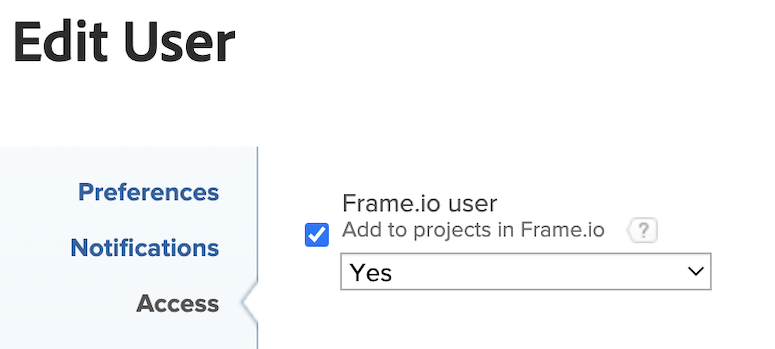

# [!DNL Workfront] と [!DNL Frame.io] の統合の設定

Workfront管理者は、設定エリアでデフォルトの Frame.io アカウントを設定し、Workfrontで Frame.io ユーザーを指定することで、Workfrontと Frame.io の統合を有効にします。 これにより、プロジェクトコーディネーターはWorkfront プロジェクトを使用して作業を計画および開始し、レビューと承認のワークフローを実行できます。

## アクセス要件

>[!IMPORTANT]
>
>この機能は、[!DNL Adobe Admin Console] に登録されている組織のみが利用できます。

+++ 展開すると、この記事の機能のアクセス要件が表示されます。

この記事の手順を実行するには、次のアクセス権が必要です。

<table>
  <tr>
   <td>[!DNL Adobe Workfront] プラン*</td>
   <td>任意</td>
  </tr>
  <tr>
   <td>[!DNL Adobe Workfront] ライセンス
   </td>
   <td>
現在：[!UICONTROL Plan]

   
新規：[!UICONTROL Standard]
</td>
  </tr>
  <tr>
   <td>アクセスレベル設定
   </td>
   <td>[!DNL Workfront] 管理者である必要があります。
   </td>
  </tr>

</table>

この表にある情報についての詳細は、[Workfront ドキュメントのアクセス要件](/help/quicksilver/administration-and-setup/add-users/access-levels-and-object-permissions/access-level-requirements-in-documentation.md)を参照してください。

+++

## デフォルトの [!DNL Frame.io] アカウントを設定 [!BADGE  近日公開 ]{type=Informative}

デフォルトの [!DNL Frame.io] アカウントが設定されると、[!DNL Workfront] で作成されたプロジェクトには、Frame.io で作成されたミラープロジェクトが含まれます。

>[!IMPORTANT]
>
>この機能は、近日公開予定です。 現時点では、Workfront チームが Frame.io アカウントを手動で追加します。 Adobe アカウント担当者にお問い合わせください。

## Workfront グループで 1 つの Frame.io アカウントを設定する

1 つのWorkfront グループを、デフォルトのアカウントとは異なる 1 つの Frame.io アカウントに関連付けることができます。

Workfront グループで 1 つの Frame.io アカウントを設定するには：

{{step-1-to-setup}}

1. 左側のパネルで、「**グループ**」をクリックします。
1. 既存のグループを選択するか、「**グループを作成**」をクリックします。
1. 左側のパネルで、「**Frame.io に接続**」をクリックします。
1. API 開発者トークンを入力します。
1. 「**接続を開始**」をクリックします。
1. （条件付き）複数の Frame.io アカウントの管理者である場合は、使用するアカウントを選択します。

## Frame.io ユーザーの有効化

Frame.io を定期的に使用するWorkfront ユーザーは、Frame.io ユーザーとしてマークされる必要があります。 Workfront管理者は、Workfront ユーザープロファイルで Frame.io ユーザーを指定できます。

>[!TIP]
>
>クリエイティブツールで定期的に作業し、Frame.io ユーザーとしてレビューおよび承認用のアセットをアップロードするユーザーを有効にすることをお勧めします。

ユーザーがWorkfrontで Frame.io ユーザーとしてマークされ、プロジェクトに追加された場合：

* Frame.io のコラボレーターとして追加されます。<!--do we need to be more explicit about a frame license being provisioned for them?-->
* Frame.io からWorkfrontにアセットを送信して、正式なレビューと承認を受けることができます。
* Workfrontから一方向の同期フォルダーの情報を表示できます。 [!BADGE  準備中 ]{type=Informative}

Frame.io ユーザーを有効にするには：

{{step-1-to-users}}

1. 1 人以上のユーザーを選択し、**編集** アイコン  をクリックします。
1. 「アクセス」セクションで、「Frame.io のプロジェクトに追加」チェックボックスを有効にし、ドロップダウンメニューで **はい** を選択します。
   

   >[!NOTE]
   >
   >このチェックボックスをオフにすると、ユーザーは過去の割り当てへのアクセス権を保持し、今後 Frame.io プロジェクトに追加されます。<!-- If the user is deactivated, they lose all access to previous assignments and are removed from the Frame.io account.-->
