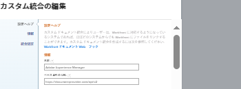

# [!DNL Adobe Experience Manager] レガシーコネクタを使用した [!DNL Workfront] の設定

<!-- Audited: 4/2025 -->

[!DNL Adobe Workfront] 管理者は、[!UICONTROL Adobe Experience Manager（AEM）Assets] と [!DNL Workfront] を統合し、ワークフロー内でアセットを作成、共有、保守するための包括的なコンテンツ管理ソリューションを組織に提供できます。

## アクセス要件

+++ 展開すると、この記事の機能のアクセス要件が表示されます。

<table>
  <tr>
   <td>Adobe Workfront パッケージ
   </td>
   <td> <p>PrimeまたはUltimate</p>
    <p>ワークフロー Ultimate</p>
   </td>
  </tr>
  <tr>
   <td>Adobe Workfront ライセンス
   </td>
   <td><p>標準</p>
   <p>プラン</p>
   </td>
  </tr>
   <tr>
   <td>アクセスレベル設定
   </td>
   <td>[!DNL Workfront] 管理者である必要があります。
   </td>
  </tr>
</table>

詳しくは、[Workfront ドキュメントのアクセス要件](/help/quicksilver/administration-and-setup/add-users/access-levels-and-object-permissions/access-level-requirements-in-documentation.md)を参照してください。

+++

## [!DNL Workfront for AEM Assets]

[!DNL Workfront for AEM Assets connector] により、組織は次の操作を実行できます。

* AEM のアセットとフォルダーを [!DNL Workfront] のプロジェクト、タスク、課題、リクエストにリンクすることで、クリエイティブコンテンツの共同作業および管理を行うことができます。

  サードパーティアプリケーションとのドキュメント統合の設定の詳細については、[ドキュメント統合の設定](../../administration-and-setup/configure-integrations/configure-document-integrations.md)を参照してください。

* [!DNL AEM Digital Asset Managemen]t（DAM）リポジトリと統合すると、[!DNL Workfront] を使用して DAM に保存されているデジタル アセットを管理および共有できるようになります。

  ドキュメントとアセットフォルダーのリンクの詳細については、[外部アプリケーションからのドキュメントのリンク](../../documents/adding-documents-to-workfront/link-documents-from-external-apps.md)を参照してください。

* 両方のアプリケーションのメタデータを結合してアセットに適用します。
* アセットの包括的な通信ストリームを表示します。[!DNL Workfront] または [!UICONTROL AEM Assets] のいずれかでアセットに対して行われた更新とコメントは、もう一方のアプリケーションに同期され、アセットに対して行われた通信の包括的な履歴が確立されます。

  [!DNL Workfront] でコメントを作成する方法について詳しくは、[ドキュメントへの更新の追加](../../documents/managing-documents/add-update-documents.md)を参照してください。

## [!DNL AEM Assets] コネクタをインストールするための前提条件

[!DNL Workfront]AEM Assets[!UICONTROL  の ] コネクタをインストールする前に、次の前提条件が満たされていることを確認してください。

* [!UICONTROL AEM Assets] は、バージョン 6.5 以降でインストールおよび設定されています。 [!UICONTROL AEM Assets] のインストールについては、[[!DNL Adobe Experience Manager]  ドキュメント](https://experienceleague.adobe.com/en/docs/experience-manager)を参照してください。
* （条件付き）ファイアウォールのルールが期待どおりにトラフィックを許可しない場合は、クラスターの IP アドレスやドメインを許可リストに追加します。詳しくは、[ファイアウォールの許可リストの設定](../../administration-and-setup/get-started-wf-administration/configure-your-firewall.md)を参照してください。

## [!DNL Workfront for AEM Assets] コネクタパッケージのインストール {#install-the-workfront-for-aem-assets-connector-package}

>[!IMPORTANT]
>
>以下の手順は、[!DNL Workfront with AEM Assets] 拡張コネクタ [[!DNL Workfront for Experience Manager]  に置き換えられた ](../../documents/workfront-and-experience-manager-integrations/workfront-for-experience-manager-enhanced-connector/workfront-for-aem-enhanced-connector.md) しい従来のコネクタを対象としています。 詳しくは、アカウント担当者にお問い合わせください。

[!DNL Workfront for AEM Assets] コネクタをインストールするには、[!UICONTROL CRX パッケージマネージャー] を使用して、コネクタをパッケージとして AEM に読み込む必要があります。

1. AEM が既にインストールされているワークステーションに、[!DNL Workfront for AEM Assets] コネクタインストールファイルをダウンロードします。

   [!DNL Workfront for AEM Assets] コネクタは、[!DNL Workfront] の担当者から入手できます。

1. 管理者アカウントを使用して AEM にログインします。
1. **[!UICONTROL ツール]**/**[!UICONTROL デプロイメント]**/**[!UICONTROL パッケージ]** をクリックします。 [!UICONTROL CRX パッケージマネージャー]が開きます。

1. 「**[!UICONTROL パッケージをアップロード]」をクリックします。**

1. **[!UICONTROL パッケージをアップロード]** ダイアログボックスで、**[!UICONTROL Workfront コネクタ]** パッケージを参照して選択し、「**[!UICONTROL OK]**」をクリックします。 パッケージは [!UICONTROL CRX パッケージマネージャー]に表示されます。

1. 「**[!UICONTROL インストール]」をクリックします。**

1. **[!UICONTROL パッケージ]**&#x200B;ダイアログボックスで、詳細設定を無視して、「**[!UICONTROL インストール]**」をクリックします。
1. （オプション）コネクタが正常にインストールされたことを確認するには、[!UICONTROL アクティビティログ]に次のステートメントが表示されていることを確認します。

   ```
   Package installed in <time>
   ```

1. [!UICONTROL CRX パッケージマネージャー ] を閉じます。 コネクタがインストールされ、[!DNL Workfront] と統合するように [!DNL AEM Assets] を設定できるようになりました。

1. [ [!DNL Workfront]](#configure-aem-assets-to-integrate-with-workfront) と統合する  [!DNL AEM Assets]  の設定に進みます。

## [!DNL Workfront] と統合する [!DNL AEM Assets] の設定 {#configure-aem-assets-to-integrate-with-workfront}

コネクタをインストールした後、コネクタパッケージを AEM に読み込みし、[!DNL Workfront] 内のドキュメントとリンクするように AEM を設定します。

コネクタのインストールについて詳しくは、[ [!DNL Workfront for AEM Assets]  コネクタパッケージのインストール](#install-the-workfront-for-aem-assets-connector-package)を参照してください。

* [前提条件](#prerequisites)
* [AEM の  [!DNL Workfront] との統合](#integrate-aem-with-workfront)
* [[!UICONTROL AEM Externalizer] の設定](#configure-the-aem-externalizer)

### 前提条件 {#prerequisites}

開始する前に、workfront-service の権限を有効にする必要があります。

1. AEMで、**[!UICONTROL ツール]**/**[!UICONTROL セキュリティ]**/**[!UICONTROL 権限]** に移動します。
1. 左上隅で、ドロップダウンメニューの「**[!UICONTROL ユーザー]**&#x200B;」を選択し、「*[!UICONTROL 検索]*&#x200B;」フィールドに「**[!UICONTROL workfront-service]**」と入力します。 [!UICONTROL workfront-service] ユーザーを選択します。
1. 画面の右側で、**[!UICONTROL ACE の追加]**&#x200B;を選択して新しいエントリを作成します。
1. &#x200B;**[!UICONTROL Add New Entry]**&#x200B; ウィンドウの **[!UICONTROL Path]**&#x200B; フィールドでチェックボックスアイコンを選択し、フォルダー */conf を選択し* す。
1. 「**権限**」フィールドに「*jcr:read*」と入力します。
1. 右上隅の「**追加**」を選択します。
1. （オプション）上記の手順を繰り返して、さらにエントリを作成します。

### AEM の [!DNL Workfront] との統合 {#integrate-aem-with-workfront}

1. 管理者として AEM Assets にログインします。
1. **[!UICONTROL ツール]**/**[!UICONTROL Cloud Services]**/**[!UICONTROL Workfront Integration Configuration]**/**[!UICONTROL Global-Workfront].**&#x200B;**&#x200B;** をクリックします

1. （条件付き）まだ作成していない場合は、[!DNL Workfront] クラウド設定ファイルを作成します。

   1. [!DNL Global-Workfront] ページの右上隅にある「作成 **[!UICONTROL をクリック]** ます。
   1. **[!UICONTROL Workfront URL]** ボックスで、[!DNL Workfront] インスタンスの URL を指定します。

      例えば、[!DNL https]://`<account>`.my.workfront.com と指定します。ここで `<account>` は、AEM との統合に使用するアカウントです。

   1. 「&#x200B;**[!UICONTROL ベースフォルダー]**」フィールドで、チェックボックスアイコンを選択します。
   1. ドロップダウンメニューで、[!DNL Workfront] のオブジェクトにリンクされているドキュメントが格納されているパスを選択します。
   1. 表示される AEM モーダルで、[!DNL Workfront] オブジェクトに接続されたドキュメントを含むフォルダーへのパスに従います。フォルダーを選択し、右上隅にある **[!UICONTROL 選択]**&#x200B;を押します。

      ルート /content/dam/ の下の任意のフォルダーにリンクできます。

   1. Adobe Analytics の **[!UICONTROL Workfront API キー]**&#x200B;ボックスで、[!UICONTROL Workfront] API キーを指定します。

      以下の手順で [!DNL Workfront] API キーを取得します。

      1. 「ブラウザー」タブを開き、[!DNL Workfront] アカウントに、[!DNL Workfront] 管理者としてログインします。

      {{step-1-to-setup}}

      1. **[!UICONTROL システム]**／**[!UICONTROL 顧客情報]**&#x200B;をクリックします。

         既に API キーを生成している場合は、[!DNL Workfront] API キーが **ユーザーの API キー** ラベルの下に表示されます。

      1. （条件付き）API キーをまだ生成していない場合は、生成する必要があります。

         1. 「**[!UICONTROL API キー設定]**」セクションで、「**[!UICONTROL 作成後、API キーの有効期限]** オプションが **なし** に設定されていることを確認します。

            有効期限を選択した場合、API キーの有効期限が切れた後、コネクタは動作を停止します。次に、API キーを再生成し、[!DNL Workfront] 設定を更新する必要があります。

         1. **[!UICONTROL ユーザーの API キー]** ラベルの下の **[!UICONTROL API キーを生成]** をクリックします。 [!DNL Workfront] の API キーが生成されて、表示されます。
      1. API キーをクリップボードにコピーします。
      1. AEM Connector のブラウザータブを開き、**[!DNL Workfront API Key]** ボックスに、コピーした API キーを貼り付けます。
   1. （条件付き）[!UICONTROL [!DNL Workfront]統合設定]ページの左上隅の「**[!UICONTROL 詳細]**」タブをクリックし、該当する場合は、以下のオプションを選択します。

      **[!UICONTROL コレクションのブラウジングを許可]：**&#x200B;組織が [!DNL Workfront] ユーザーに AEM Assets コレクションを [!DNL Workfront] オブジェクトにリンクすることを許可する場合は、このオプションを選択します。

      **[!UICONTROL ユーザーFederated ID]:** 組織がWorkfrontへのログイン時に Federated ID またはシングルサインオン（SSO）を使用している場合は、このオプションを選択します。

      **[!UICONTROL メールドメインを無視]：** AEM ユーザーがユーザー ID にドメイン名を使用しない場合には、このオプションを選択します。

      **[!UICONTROL アクセスを制限]：**&#x200B;許可リストに追加する必要がある適切な [!DNL Workfront] IP アドレスを指定するには、このオプションを選択します。許可リストに関して詳しくは、[ファイアウォールの許可リストの設定](../../administration-and-setup/get-started-wf-administration/configure-your-firewall.md)を参照してください。

   1. Workfront Integration Configuration ページの左上隅にある「**[!UICONTROL 基本]**」タブをクリックしてから、「**[!UICONTROL 接続]** をクリックします。

      >[!NOTE]
      >
      >変更の適用には時間がかかる場合があります。バンドルを再起動すると、プロセスが高速になる場合があります。


1. （条件付き）既に [!DNL Workfront] クラウド設定ファイルが作成されている場合、「**[!UICONTROL Global-[!DNL Workfront]]**」をクリックしてから、左上隅の「**[!UICONTROL プロパティ]**」をクリックします。

1. 「**[!UICONTROL キーを生成]」をクリックして AEM API キーを生成し、**&#x200B;次に、AEM API キーをクリップボードにコピーします。

   [!UICONTROL Workfront] と統合する [!UICONTROL AEM Assets] を後で設定する際に、AEM API キーが必要になります。詳しくは、[AEM Assets と統合するために Workfront を設定](#configure-workfront-to-integrate-with-aem-assets)を参照してください。

1. 右上隅にある「**[!UICONTROL 保存]**」をクリックします。 [!UICONTROL Global-[!DNL Workfront]] ウィンドウが表示されます。

   

1. （オプション）AEMと [!DNL Workfront] の間で双方向通信を同期させます。

   1. **[!UICONTROL Global-[!DNL Workfront]] をクリックします。**
   1. ウィンドウの左上隅にある「**[!UICONTROL プロパティ]**」をクリックします。 **[!UICONTROL [!DNL Workfront]統合設定]**&#x200B;ページが表示されます。

      

   1. （オプション）[!UICONTROL AEM Assets] および [!DNL Workfront] 間でのコメントの同期を有効にするには、**[!UICONTROL コメント同期を有効にする]** をクリックします。

      >[!IMPORTANT]
      >
      >アセットを同期するには、「[!UICONTROL ドキュメントの同期]」を有効にする必要があります。

   1. （オプション）コメントの同期をオフにするには、「**[!UICONTROL コメント同期を無効にする]」をクリックします。**

      または

      AEM インスタンスに登録された[!UICONTROL メモ作成]イベント登録を削除します。

      イベント登録について詳しくは、[Event Subscription API](../../wf-api/general/event-subs-api.md) を参照してください。

1. [[!UICONTROL AEM Externalizer の設定]](#configure-the-aem-externalizer)を続行します。

### [!UICONTROL AEM Externalizer] の設定 {#configure-the-aem-externalizer}

[!UICONTROL AEM Externalizer] によって、AEM は [!DNL Workfront] で使用できる形式の URL を渡すことができます。適切に設定されていない場 [!DNL Workfront]、AEM API を呼び出すことはできず、WorkfrontでAEM ドキュメントをリンクする URL は機能しません。

1. AEMで、**[!UICONTROL ツール]**/**[!UICONTROL 操作]**/**[!UICONTROL Web コンソール]** をクリックします。

1. 「**[!UICONTROL OSGI]**」をクリックし、ドロップダウンメニューで「**[!UICONTROL 設定]**」をクリックします。

1. 設定リストで、「&#x200B;**[!UICONTROL Day CQ Link Externalizer]」を選択します。** Externalizer **[!UICONTROL ページが]** 示されます。

1. 「**[!UICONTROL ドメイン]**」セクションで、「**[!UICONTROL 作成者]**」フィールドに一覧表示されるドメインが、AEM ユーザーが外部からアクセスできるドメイン名であることを確認します。

   「[!UICONTROL 作成者]」フィールドのドメイン名は、AEM インスタンスの URL 行に一覧表示されるドメインと一致する必要があります。

   ![[!DNL Extenalizer].png](assets/extenalizer-350x128.png)

1. （条件付き）必要に応じて、「**[!UICONTROL 作成者]**」フィールドのドメインを更新します。
1. 「**[!UICONTROL 保存]**」をクリックします。ドキュメントを [!UICONTROL  とリンクするように ]0}AEM Assets} が構成されました。[!DNL Workfront]

1. [ [!DNL AEM assets]](#configure-workfront-to-integrate-with-aem-assets) と統合する  [!DNL Workfront]  の設定を続行します。

## [!DNL AEM assets] と統合する [!DNL Workfront] の設定 {#configure-workfront-to-integrate-with-aem-assets}

AEM Assets[!UICONTROL  コネクタ用の ]Workfront（[AEM Assets用の [!UICONTROL Workfront] コネクタパッケージのインストール ](#install-the-workfront-for-aem-assets-connector-package) を参照）および [!UICONTROL AEM Assets] [ （[!UICONTROL  と連携するための ]AEM Assets [!DNL Workfront]](#configure-aem-assets-to-integrate-with-workfront) の設定を参照）をインストールしたら、[!DNL Workfront] と [!DNL Workfront] の間でドキュメントをリンクするように [!DNL AEM Assets] を設定する必要があります。

1. 管理者としてWorkfrontにログインします。

   >[!TIP]
   >
   >[!UICONTROL Workfront] では、AEM 統合専用の [!UICONTROL Workfront] 管理者を作成することをお勧めします。ユーザーへの [!UICONTROL Workfront] 管理者アクセスレベルの割り当てについて詳しくは、[特定のエリアに対する管理者アクセス権のユーザーへの付与](../../administration-and-setup/add-users/configure-and-grant-access/grant-users-admin-access-certain-areas.md)を参照してください。

{{step-1-to-setup}}

1. **[!UICONTROL ドキュメント]**/**[!UICONTROL カスタム統合 ].** をクリックします。

1. 「**[!UICONTROL カスタム統合を追加]**」をクリックします。
1. 「**[!UICONTROL 名前]**」ボックスに、カスタム統合の名前を入力します。

   [!UICONTROL Workfront] 内で統合を使用する場合にユーザーに表示される名前です。

1. 「**[!UICONTROL ベース API URL]**」ボックスに、AEM インスタンスの URL を入力します。

   ベース API URL は、AEM インスタンスの URL に、/bin/webhooks/api/ のパスが続くように構成されます。

   

1. **[!UICONTROL 認証タイプ]**&#x200B;ドロップダウンメニューで、「**[!UICONTROL API キー]」を選択します。**

1. 「**[!UICONTROL API キー]**」ボックスに、[!UICONTROL AEM Assets] 設定時にコピーした AEM API キーを貼り付けます。
1. 「**[!UICONTROL 保存]**」をクリックします。
1. （オプション）統合が[!UICONTROL アクティブ]とマークされていることを確認します。\
   

   [!DNL Workfront] は [!DNL AEM Assets] と連携するように設定されました。

   AEM のアセットにアクセスするには、コネクタを使用する必要がある各 [!DNL Workfront] ユーザーを、AEM のユーザーとして設定する必要があります。ユーザーの作成については、[コネクタを使用するためのユーザーの設定](#set-up-users-to-use-the-connector)を参照してください。

## コネクタを使用するためのユーザーの設定 {#set-up-users-to-use-the-connector}

コネクタにアクセスするには、ユーザーが AEM のユーザープロファイルを持ち、[!UICONTROL 作成]権限と[!UICONTROL 削除]権限を含むアクセスレベルを持つ [!DNL Workfront] グループに属している必要があります。

[!DNL Workfront] 権限について詳しくは、[カスタムアクセスレベルの作成または変更](../../administration-and-setup/add-users/configure-and-grant-access/create-modify-access-levels.md)を参照してください。

* [ [!DNL AEM assets] でのユーザーの設定](#set-up-users-in-aem-assets)

### [!DNL AEM assets] でのユーザーの設定 {#set-up-users-in-aem-assets}

1. Workfront 管理者として [!DNL AEM Assets] にログインします。
1. **[!UICONTROL ツール]**/**&#x200B;**&#x200B;**[!UICONTROL Security]**/**[!UICONTROL ユーザー]** をクリックします。

1. （条件付き）ユーザーが AEM のユーザープロファイルを持っていない場合は、AEM ユーザープロファイルを作成します。

   1. 「**[!UICONTROL ユーザーを作成]」をクリックします。**
   1. ユーザーの個人情報を入力します。

      

      必須フィールドは「**ID**」フィールドのみです。 ユーザーの AEM ID は、ユーザーの [!DNL Workfront] ID（[!DNL Workfront] メールアドレス）と一致する必要があります。

      [!DNL Workfront] と統合するように AEM を設定した際に「**[!UICONTROL メールドメインを無視]**」オプションを選択した場合、AEM ID は [!DNL Workfront] メールアドレスと一致しません。

1. （条件付き）ユーザーがAEM プロファイルを持っている場合、そのユーザーのAEM プロファイルを開きます。

   1. 「&#x200B;**[!UICONTROL ユーザー]**」をクリックします。 **[!UICONTROL ユーザー管理]**&#x200B;ページが表示されます。

   1. 追加するユーザーをクリックし、「**[!UICONTROL プロパティ]**」をクリックします。 ユーザーの設定ページが表示されます。

1. 「**[!UICONTROL グループ]**」タブをクリックします。

   

1. **[!UICONTROL 作成]**&#x200B;権限と&#x200B;**[!UICONTROL 削除]**&#x200B;権限を含むアクセスレベルを持つ 1 つ以上の [!DNL Workfront] グループにユーザーが属していることを確認してください。

   1. ユーザーを既存のグループに追加するには、まず「**[!UICONTROL グループ名を入力]**」ボックスにグループ名の入力を開始し、ドロップダウンメニューにグループ名が表示されたら選択します。

      または

      ユーザーをメンバーとするグループを選択するには、「**[!UICONTROL このユーザーがメンバーであるグループ]**」セクションでグループを選択します。

1. 「**[!UICONTROL 保存]」をクリックします。**
