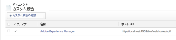
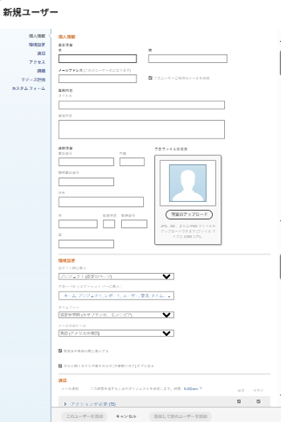

# 設定 [!DNL Workfront] と [!DNL Adobe Experience Manager] レガシーコネクタ

As a [!DNL Adobe Workfront] 管理者、 [!DNL Workfront] と [!UICONTROL Adobe Experience Manager (AEM) Assets] ワークフロー内でのアセットの作成、共有、メンテナンスに関する包括的なコンテンツ管理ソリューションを組織に提供する。

## アクセス要件

この記事の手順を実行するには、次のアクセス権が必要です。

<table style="table-layout:auto"> 
 <col> 
 <col> 
 <tbody> 
  <tr> 
   <td role="rowheader">[!DNL Adobe Workfront] 計画*</td> 
   <td>任意</td> 
  </tr> 
  <tr> 
   <td role="rowheader">[!DNL Adobe Workfront] ライセンス*</td> 
   <td>[!UICONTROL プラン ]</td> 
  </tr> 
  <tr> 
   <td role="rowheader">アクセスレベル設定*</td> 
   <td> <p>次の条件を満たす必要があります。 [!DNL Workfront] 管理者。 詳しくは、 [!DNL Workfront] 管理者向け： <a href="../../administration-and-setup/add-users/configure-and-grant-access/grant-a-user-full-administrative-access.md" class="MCXref xref">ユーザーに完全な管理アクセス権を付与する</a>.</p> </td> 
  </tr> 
 </tbody> 
</table>

&#42;ご利用のプラン、ライセンスの種類、アクセス権を確認するには、 [!DNL Workfront] 管理者。

## [!DNL Workfront for AEM Assets]

この [!DNL Workfront for AEM Assets connector] では、組織で次の操作を実行できます。

* AEMのアセットやフォルダーをでプロジェクト、タスク、問題、要求にリンクすることで、クリエイティブコンテンツの共同作業と管理をおこなう [!DNL Workfront].

   サードパーティアプリケーションとのドキュメント統合の設定について詳しくは、  [ドキュメント統合の設定](../../administration-and-setup/configure-integrations/configure-document-integrations.md).

* との統合 [!DNL AEM Digital Asset Managemen]t(DAM) リポジトリ ( [!DNL Workfront] :DAM に保存されたデジタルアセットを管理および共有します。

   ドキュメントとアセットフォルダーのリンクについて詳しくは、   [外部アプリケーションからドキュメントをリンク](../../documents/adding-documents-to-workfront/link-documents-from-external-apps.md).

* 両方のアプリケーションのメタデータを組み合わせてアセットに適用します。
* アセットの包括的な通信ストリームを表示します。 内でアセットに対しておこなわれた更新およびコメント [!DNL Workfront] または [!UICONTROL AEM Assets] は他のアプリケーションと同期され、アセットに対しておこなわれた通信の包括的な履歴を確立します。

   でのコメント作成の詳細 [!DNL Workfront]を参照してください。 [ドキュメントに更新を追加する](../../documents/managing-documents/add-update-documents.md).

## をインストールするための前提条件 [!DNL AEM Assets] コネクタ

事前に [!DNL Workfront] コネクタ [!UICONTROL AEM Assets]を使用する場合は、次の前提条件が満たされていることを確認します。

* [!UICONTROL AEM Assets] インストールおよび設定済み、バージョン 6.5 以降。 インストールに関する情報 [!UICONTROL AEM Assets]を参照し、 [[!DNL Adobe Experience Manager] ドキュメント](https://experienceleague.adobe.com/docs/experience-manager.html).
* （条件付き）ファイアウォール規則でトラフィックが期待どおりに許可されない場合は、クラスターの IP アドレスまたはドメインをドメインに追加し許可リストます。 詳しくは、 [ファイアウォールの設定を許可リスト行う](../../administration-and-setup/get-started-wf-administration/configure-your-firewall.md).

## のインストール [!DNL Workfront for AEM Assets] コネクタパッケージ {#install-the-workfront-for-aem-assets-connector-package}

>[!IMPORTANT]
>
>以下の手順は、 [!DNL Workfront with AEM Assets] 従来のコネクタ ( [[!DNL Workfront for Experience Manager] 拡張コネクタ](../../documents/workfront-and-experience-manager-integrations/workfront-for-experience-manager-enhanced-connector/workfront-for-aem-enhanced-connector.md). 詳しくは、アカウント担当者にお問い合わせください。

をインストールするには、以下を実行します。 [!DNL Workfront for AEM Assets] コネクタの場合は、 [!UICONTROL CRX パッケージマネージャー].

1. AEMを既にインストール済みのワークステーションで、 [!DNL Workfront for AEM Assets] コネクタのインストールファイル。

   次の [!DNL Workfront for AEM Assets] コネクタから [!DNL Workfront] 担当者。

1. 管理者アカウントを使用してAEMにログインします。
1. クリック **[!UICONTROL ツール]** > **[!UICONTROL 導入]** > **[!UICONTROL パッケージ]**.

   この [!UICONTROL CRX パッケージマネージャー] が開きます。

1. クリック **[!UICONTROL パッケージをアップロード].**

1. 内 [!UICONTROL パッケージをアップロード] ダイアログボックスで、を参照して選択します。 [!UICONTROL Workfront Connector] パッケージを選択し、「 **[!UICONTROL OK]**.\
   パッケージが [!UICONTROL CRX パッケージマネージャー].

1. クリック **[!UICONTROL インストール].**

1. の [!UICONTROL パッケージ] ダイアログボックスで、[ 詳細設定 ] を無視し、[ **[!UICONTROL インストール]**.
1. （オプション）コネクタが正常にインストールされたことを確認するには、次の文が [!UICONTROL アクティビティログ]:

   ```
   Package installed in <time>
   ```

1. を閉じる [!UICONTROL CRX パッケージマネージャー].

   コネクタがインストールされ、設定が可能になりました。 [!DNL AEM Assets] と統合する [!DNL Workfront].

1. 続行 [設定 [!DNL AEM Assets] と統合する [!DNL Workfront]](#configure-aem-assets-to-integrate-with-workfront).

## 設定 [!DNL AEM Assets] と統合する [!DNL Workfront] {#configure-aem-assets-to-integrate-with-workfront}

コネクタをインストールしたら、コネクタパッケージをAEMに読み込み、でドキュメントとリンクするようにAEMを設定します [!DNL Workfront].

コネクタのインストールについて詳しくは、  [のインストール [!DNL Workfront for AEM Assets] コネクタパッケージ](#install-the-workfront-for-aem-assets-connector-package).

* [前提条件](#prerequisites)
* [AEMとの統合 [!DNL Workfront]](#integrate-aem-with-workfront)
* [の設定 [!UICONTROL AEM Externalizer]](#configure-the-aem-externalizer)

### 前提条件 {#prerequisites}

開始する前に、ワークフロントサービスに対する権限を有効にする必要があります。

1. AEMで、に移動します。 **[!UICONTROL ツール]**> **[!UICONTROL セキュリティ]**> **[!UICONTROL 権限]**.
1. 左上隅で、「 」を選択します。 **[!UICONTROL ユーザー]**&#x200B;を選択&#x200B;し、 *[!UICONTROL workfront service]* 内 **[!UICONTROL 検索]**&#x200B;フィールド を選択します。 [!UICONTROL workfront service] ユーザー。
1. 画面の右側で、「 」を選択します。 **[!UICONTROL ACE を追加]** をクリックして新しいエントリを作成します。
1. 内&#x200B;の&#x200B;**[!UICONTROL 新しいエントリの追加]**&#x200B;ウィン&#x200B;ドウで、「 **[!UICONTROL パス]**&#x200B;」フィールドで、次のフォルダーを選択します。 */conf*
1. 「権限」フィールドに次のように入力します。 *jcr:read*
1. 選択 **[!UICONTROL 追加]**&#x200B;右&#x200B;上隅に
1. （オプション）手順を繰り返して、さらにエントリを作成します。

### AEMとの統合 [!DNL Workfront] {#integrate-aem-with-workfront}

1. 管理者としてAEM Assetsにログインします。
1. クリック **[!UICONTROL ツール]** >**[!UICONTROL Cloud Services]**>**[!UICONTROL Workfront統合の設定]** >**[!UICONTROL Global-Workfront].**&#x200B;**&#x200B;**

1. （条件付き）まだ作成していない場合は、 [!DNL Workfront] クラウド設定ファイル。

   1. クリック  **[!UICONTROL 作成]** の右上隅に [!DNL Global-Workfront] ページ。
   1. 内 **[!UICONTROL Workfront URL]** ボックスに、 [!DNL Workfront] インスタンス。

      例： [!DNL https]://`<account>`.my.workfront.com `<account>` は、AEMとの統合に使用するアカウントです。

   1. 内&#x200B;の&#x200B;**[!UICONTROL 基本フォルダー]** 「 」フィールドで、チェックボックスアイコンを選択し、ドロップダウンメニューで、ドキュメントのリンク先のパスを選択します [!DNL Workfront] オブジェクトが保存されます。
   1. 表示されるAEMモーダルで、接続先のドキュメントを含むフォルダーへのパスに従います。 [!DNL Workfront] オブジェクト。 フォルダーを選択し、 **[!UICONTROL 選択]**&#x200B;をクリックします。

      ルート/content/dam/の下の任意のフォルダーにリンクできます。

   1. 内 **[!UICONTROL Workfront API キー]** ボックスに、 [!UICONTROL Workfront] API キー。

      次の手順で [!DNL Workfront] API キー：

      1. ブラウザータブを開き、 [!DNL Workfront] としてアカウント [!DNL Workfront] 管理者。
      1. 次をクリック： **[!UICONTROL メインメニュー]** アイコン  右上隅に [!DNL Adobe Workfront]を選択し、「 **[!UICONTROL 設定]** .

      1. クリック **[!UICONTROL システム]** >**[!UICONTROL 顧客情報]**.

         API キーが既に生成されている場合は、 [!DNL Workfront] 「API キー」が「ユーザーの API キー」ラベルの下に表示されます。

      1. （条件付き）API キーをまだ生成していない場合は、生成する必要があります。

         1. 内 **[!UICONTROL API キー設定]** セクションで、 **[!UICONTROL 作成後、API キーは]** 」オプションが「なし」に設定されている。

            有効期限を選択した場合、API キーの有効期限が切れた後、コネクタは動作を停止します。 その後、API キーを再生成し、 [!DNL Workfront] 設定。

         1. 以下 **[!UICONTROL ユーザーの API キー]** ラベル、クリック **[!UICONTROL API キーを生成]**.

            の API キー [!DNL Workfront] がを生成して表示します。
      1. API キーをクリップボードにコピーします。
      1. AEM Connector のブラウザータブを開き、 **[!DNL Workfront API Key]** 」ボックスに、コピーした API キーを貼り付けます。
   1. （条件付き） **[!UICONTROL 詳細]** タブ [!UICONTROL [!DNL Workfront] 統合の設定] ページを開き、必要に応じて次のオプションを選択します。

      **[!UICONTROL コレクションの参照を許可]:**&#x200B;組織が [!DNL Workfront] AEM Assetsコレクションのリンク先ユーザー [!DNL Workfront] オブジェクト。

      **[!UICONTROL ユーザーFederated ID]:** 組織がWorkfrontへのログイン時に Federated ID またはシングルサインオン (SSO) を使用している場合は、このオプションを選択します。

      **[!UICONTROL メールドメインを無視]:** AEMユーザーがユーザー ID にドメイン名を使用しない場合は、このオプションを選択します。

      **[!UICONTROL アクセスを制限]:** このオプションを選択して、適切な [!DNL Workfront] に追加する必要がある IP アドレ許可リストス。 このタブについて詳し許可リストくは、 [ファイアウォールの設定を許可リスト行う](../../administration-and-setup/get-started-wf-administration/configure-your-firewall.md).

   1. 次をクリック： **[!UICONTROL 基本]** 」タブをクリックし、Workfront統合の設定ページの左上隅にある **[!UICONTROL 接続]**.

      >[!NOTE]
      >
      >変更の適用には時間がかかる場合があります。 バンドルを再起動すると、プロセスが高速になる場合があります。


1. （条件付き）既に [!DNL Workfront] クラウド設定ファイル、「 **[!UICONTROL Global-[!DNL Workfront]]**&#x200B;をクリックし、左上隅の **[!UICONTROL プロパティ]**.

1. 「 」をクリックしてAEM API キーを生成する **[!UICONTROL キーを生成],** 次に、AEM API キーをクリップボードにコピーします。

   後で設定する際にAEM API キーが必要になります [!UICONTROL Workfront] と統合する [!UICONTROL AEM Assets]. 詳しくは、 [WorkfrontとAEM Assets を統合するための設定](#configure-workfront-to-integrate-with-aem-assets).

1. 右上隅で、 **[!UICONTROL 保存]**.

   この [!UICONTROL Global-[!DNL Workfront]] ウィンドウが表示されます。

   

1. （オプション）AEMとの双方向通信の同期 [!DNL Workfront].

   1. クリック **[!UICONTROL Global-[!DNL Workfront]].**
   1. ウィンドウの左上隅で、 **[!UICONTROL プロパティ]**.

      この [!UICONTROL [!DNL Workfront] 統合の設定] ページが表示されます。

      

   1. （オプション）間のコメントの同期を有効にするには [!UICONTROL AEM Assets] および [!DNL Workfront]をクリックし、 **[!UICONTROL コメント同期の有効化]**.

      >[!IMPORTANT]
      >
      >有効にする必要があります [!UICONTROL ドキュメントの同期] をクリックしてアセットを同期します。

   1. （オプション）コメントの同期をオフにするには、 **[!UICONTROL コメント同期を無効にする].**

      または

      を削除します。 [!UICONTROL メモ作成] AEMインスタンスに登録されたイベント購読。

      イベントの購読について詳しくは、 [イベント購読 API](../../wf-api/general/event-subs-api.md).

1. 続行 [の設定 [!UICONTROL AEM Externalizer]](#configure-the-aem-externalizer).

### の設定 [!UICONTROL AEM Externalizer] {#configure-the-aem-externalizer}

この [!UICONTROL AEM Externalizer] AEMが [!DNL Workfront]. 適切に設定されていない場合は、 [!DNL Workfront] はAEM API を呼び出せません。そのため、WorkfrontでAEMドキュメントにリンクする URL が機能しません。

1. AEMで、 **[!UICONTROL ツール]** > **[!UICONTROL 運用]** >**[!UICONTROL Web コンソール]**.

1. クリック **[!UICONTROL OSGI]**&#x200B;を選択し、「 **[!UICONTROL 設定]** 」と入力します。

1. 設定リストで、「 」を選択しま&#x200B;す。**[!UICONTROL Day CQ Link Externalizer].**

   この [!UICONTROL Externalizer] ページが表示されます。

1. 内 **[!UICONTROL ドメイン]** 」セクションで、 [!UICONTROL 作成者] フィールドは、AEMユーザーが外部からアクセスできるドメイン名です。

   のドメイン名 [!UICONTROL 作成者] フィールドは、AEMインスタンスの URL 行にリストされているドメインと一致する必要があります。

   ![[!DNL Extenalizer].png](assets/extenalizer-350x128.png)

1. （条件付き）必要に応じて、 [!UICONTROL 作成者] フィールドに入力します。
1. 「**[!UICONTROL 保存]**」をクリックします。

   [!UICONTROL AEM Assets] ドキュメントを次とリンクするように設定されました： [!DNL Workfront]

1. 続行 [設定 [!DNL Workfront] と統合する [!DNL AEM assets]](#configure-workfront-to-integrate-with-aem-assets).

## 設定 [!DNL Workfront] と統合する [!DNL AEM assets] {#configure-workfront-to-integrate-with-aem-assets}

インストール後、 [!UICONTROL Workfront for AEM Assets] コネクタ ( [のインストール [!UICONTROL Workfront for AEM Assets] コネクタパッケージ](#install-the-workfront-for-aem-assets-connector-package)) および設定 [!UICONTROL AEM Assets] ( [設定[!UICONTROL  AEM Assets] と統合する [!DNL Workfront]](#configure-aem-assets-to-integrate-with-workfront))、 [!DNL Workfront] ～間で文書を結び付ける [!DNL Workfront] および [!DNL AEM Assets].

1. にログインします。 [!DNL Workfront] as a [!UICONTROL Workfront] 管理者。

   >[!TIP]
   >
   >[!UICONTROL Workfront] では、 [!UICONTROL Workfront] AEM統合専用の管理者。 割り当てに関する詳細 [!UICONTROL Workfront] ユーザーへの管理者アクセスレベル ( [特定の領域に対する管理者アクセス権をユーザーに付与する](../../administration-and-setup/add-users/configure-and-grant-access/grant-users-admin-access-certain-areas.md).

1. 次をクリック： **[!UICONTROL メインメニュー]** アイコン  右上隅に [!DNL Adobe Workfront]を選択し、「 **[!UICONTROL 設定]** .

1. クリック **[!UICONTROL ドキュメント]**> **[!UICONTROL カスタム統合].**

1. クリック **[!UICONTROL カスタム統合の追加]**.
1. 内 **[!UICONTROL 名前]** ボックスに、カスタム統合の名前を指定します。

   これは、 [!UICONTROL Workfront];例えば、 *&quot;[!DNL AEM Assets]&quot;* の名前。

1. 内 **[!UICONTROL ベース API URL]** ボックスに、AEMインスタンスの URL を指定します。

   ベース API URL は、AEMインスタンスの URL と次のパスで構成されます。/bin/webhooks/api/

   

1. 内 **[!UICONTROL 認証タイプ]** ドロップダウンメニューで、「 **[!UICONTROL ApiKey].**

1. 内&#x200B;の&#x200B;**[!UICONTROL API キー]** 」ボックスに、設定時にコピーしたAEM API キーを貼り付けます。 [!UICONTROL AEM Assets].
1. 「**[!UICONTROL 保存]**」をクリックします。
1. （オプション）統合がマークされていることを確認します。 [!UICONTROL アクティブ].\
   

   [!DNL Workfront] を [!DNL AEM Assets].

   AEMのアセットにアクセスするには、 [!DNL Workfront] コネクタを使用する必要があるユーザーは、AEMでユーザーとして設定する必要があります。 ユーザーの作成について詳しくは、  [コネクタを使用するユーザーを設定](#set-up-users-to-use-the-connector).

## コネクタを使用するユーザーを設定 {#set-up-users-to-use-the-connector}

ユーザーがコネクタにアクセスするには、AEMにユーザープロファイルがあり、に属している必要があります [!DNL Workfront] 次を含むアクセスレベルを持つグループ [!UICONTROL 作成] および [!UICONTROL 削除] 権限。

詳しくは、 [!DNL Workfront] 権限については、 [カスタムアクセスレベルの作成または変更](../../administration-and-setup/add-users/configure-and-grant-access/create-modify-access-levels.md).

* [でのユーザーの設定 [!DNL AEM assets]](#set-up-users-in-aem-assets)

### でのユーザーの設定 [!DNL AEM assets] {#set-up-users-in-aem-assets}

1. にログインします。 [!DNL AEM Assets] as a [!DNL Workfront] 管理者。
1. クリック **[!UICONTROL ツール]** >**&#x200B;**&#x200B;**[!UICONTROL セキュリティ]** >**[!UICONTROL ユーザー]**.

1. （条件付き）ユーザーがAEMにユーザープロファイルを持っていない場合、AEMユーザープロファイルを作成します。

   1. クリック **[!UICONTROL ユーザーを作成].**
   1. ユーザーの個人情報を入力します。

      

      唯一の必須フィールドは ID フィールドです。 ユーザーのAEM ID は、 [!DNL Workfront] ID( ユーザーの [!DNL Workfront] 電子メールアドレス。

      選択した [!UICONTROL メールドメインを無視] 」オプションを使用します。 [!DNL Workfront]を指定した場合、AEM ID が [!DNL Workfront] 電子メールアドレス。

1. （条件付き）ユーザーがAEMプロファイルを持っている場合は、そのユーザーのAEMプロファイルを開きます。

   1. クリック&#x200B;**[!UICONTROL ユーザー].**

      この [!UICONTROL ユーザー管理] ページが表示されます。

   1. 追加するユーザーをクリックし、 **[!UICONTROL プロパティ]**.

      ユーザーの設定ページが表示されます。

1. 次をクリック： **[!UICONTROL グループ]** タブをクリックします。

   

1. ユーザーが少なくとも 1 つに属していることを確認してください [!DNL Workfront] 次を含むアクセスレベルを持つグループ [!UICONTROL 作成] および [!UICONTROL 削除] 権限。

   1. ユーザーを既存のグループに追加するには、まず **[!UICONTROL グループ名を入力]** 」ボックスを選択し、ドロップダウンメニューに表示されたらグループを選択します。

      または

      ユーザーがメンバーとなるグループを選択するには、 **[!UICONTROL このユーザーがメンバーとして属しているグループ]** 」セクションに入力します。

1. 「**[!UICONTROL 保存]」をクリックします。**
