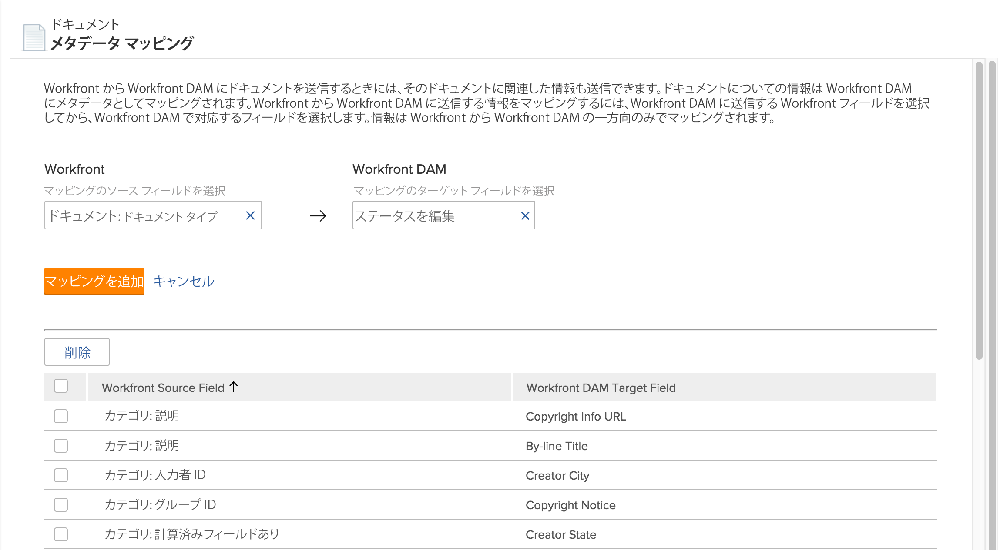

# メタデータマッピングの設定

メタデータは、ドキュメントに関連付けられた説明情報です。 次の設定が可能です。 [!DNL Adobe Workfront] に送信するドキュメントを含むメタデータを含める [!DNL Workfront] アプリケーション。

## アクセス要件

この記事の手順を実行するには、次のアクセス権が必要です。

<table style="table-layout:auto"> 
 <col> 
 <col> 
 <tbody> 
  <tr> 
   <td role="rowheader">[!DNL Adobe Workfront] 計画</td> 
   <td>任意</td> 
  </tr> 
  <tr> 
   <td role="rowheader">[!DNL Adobe Workfront] ライセンス</td> 
   <td>[!UICONTROL プラン ]</td> 
  </tr> 
  <tr> 
   <td role="rowheader">アクセスレベル設定</td> 
   <td> 
次の条件を満たす必要があります。 [!DNL Workfront] 管理者。 詳しくは、 <a href="../../administration-and-setup/add-users/configure-and-grant-access/grant-a-user-full-administrative-access.md" class="MCXref xref">ユーザーに完全な管理アクセス権を付与する</a>.
 
<b>注意</b>:まだアクセス権がない場合は、 [!DNL Workfront] 管理者（アクセスレベルに追加の制限を設定している場合） を参照してください。 [!DNL Workfront] 管理者はアクセスレベルを変更できます。詳しくは、 <a href="../../administration-and-setup/add-users/configure-and-grant-access/create-modify-access-levels.md" class="MCXref xref">カスタムアクセスレベルの作成または変更</a>.
 </td> 
  </tr> 
 </tbody> 
</table>

## について [!DNL Workfront] メタデータ

内のドキュメントのメタデータ [!DNL Workfront] 関連するプロジェクト名、タスクの説明、計画完了日などの情報を含めることができます。 As a [!DNL Workfront] 管理者、 [!DNL Workfront] 送信元のドキュメントにメタデータを含める [!DNL Workfront] 次の [!DNL Workfront] アプリケーション：

* [!DNL Workfront DAM]

メタデータをドキュメントと共に送信する前に、まず含めるメタデータを指定またはマッピングする必要があります。 で使用する任意のフィールドをマッピングできます。 [!DNL Workfront]. メタデータマッピングを設定すると、 [!DNL Workfront] アプリケーションは、マッピングされたメタデータを含みます。

ユーザーがドキュメントを [!DNL Workfront] から [!DNL Workfront] アプリケーション、マッピングされたメタデータはドキュメントに沿って転送されます。 ドキュメントのバージョンが [!DNL Workfront] アプリケーションが次にリンクされている： [!DNL Workfront]、でのドキュメントのメタデータに対する変更 [!DNL Workfront] は、 [!DNL Workfront] アプリケーション。 マッピングされたフィールドが [!DNL Workfront] を変更した場合は、更新されたメタデータを含む新しいバージョンのドキュメントをに送信する必要があります。 [!DNL Workfront] アプリケーション。

>[!NOTE]
>
>メタデータは、次の 1 つの方向にのみマッピングできます。から [!DNL Workfront] から [!DNL Workfront DAM]. リンク先のドキュメントのメタデータ [!DNL Workfront] から [!DNL Workfront DAM] はWorkfrontに転送できません。

同じ [!DNL Workfront] の各メタデータフィールド [!DNL Workfront DAM]ですが、複数のアプリケーションのどちらのアプリケーションでもメタデータフィールドを使用することはできません [!DNL Workfront] メタデータフィールド

複数の [!DNL Workfront] 1 つのメタデータフィールド ( [!DNL Workfront] アプリケーションで、最初に [!DNL Workfront] をクリックして、オブジェクトの個々のカスタムフィールドをすべて表示します。 次に、計算指標 [!DNL Workfront] フィールドを [!DNL Workfront] アプリケーション。 計算カスタムフィールドの詳細については、 [計算データをカスタムフォームに追加する](../../administration-and-setup/customize-workfront/create-manage-custom-forms/add-calculated-data-to-custom-form.md).

メタデータマッピングプロセスのフィールドをマッピングする前に、 [!DNL Workfront]. 詳しくは、 [ドキュメント統合の設定](../../administration-and-setup/configure-integrations/configure-document-integrations.md).

## 設定 [!DNL Workfront] メタデータを送信する

1. 次をクリック： **[!UICONTROL メインメニュー]** アイコン  右上隅に [!DNL Adobe Workfront]を選択し、「 **[!UICONTROL 設定]** .

1. 左側のパネルで、 **[!UICONTROL ドキュメント]** > **[!UICONTROL メタデータマッピング]**.

   

1. 内 **[!UICONTROL マッピングのソースフィールドを選択]** ボックスに、マッピング先のWorkfrontフィールドの名前を入力します [!DNL Workfront DAM]をクリックし、リストに表示されたら選択します。
1. 内 **[!UICONTROL マッピングのターゲットフィールドを選択]** ボックスで、選択した [!DNL Workfront] フィールドに入力します。

1. クリック **[!UICONTROL マッピングを追加]**.

   マッピングされたフィールドは、ページの下部に表示されるマッピングされたフィールドに表示されます。

1. 手順 5 と 6 を繰り返し、必要なすべてのを追加します。 [!DNL Workfront] フィールドとそれに対応する [!DNL Workfront DAM] フィールド。

## マッピングされたフィールドを削除

1. にログインします。 [!DNL Workfront] 管理者として。
1. 次をクリック： **[!UICONTROL メインメニュー]** アイコン  右上隅に [!DNL Adobe Workfront]を選択し、「 **[!UICONTROL 設定]** .

1. 左側のパネルで、 **[!UICONTROL ドキュメント]** > **[!UICONTROL メタデータマッピング]**.

1. マッピングされたフィールドのリストで、メタデータマッピングから削除するフィールドを選択します。
1. クリック **[!UICONTROL 削除]**.

   指定されたフィールドはマッピングされなくなりました。 ユーザーがからドキュメントを送信したとき [!DNL Workfront] から [!DNL Workfront DAM]の場合、削除されたフィールド内に含まれるメタデータは、ドキュメントと共に転送されません。

   マッピングされたフィールドを削除する前に送信されたドキュメントには、削除されたフィールドのメタデータを含め、送信された元のメタデータが保持されます。
