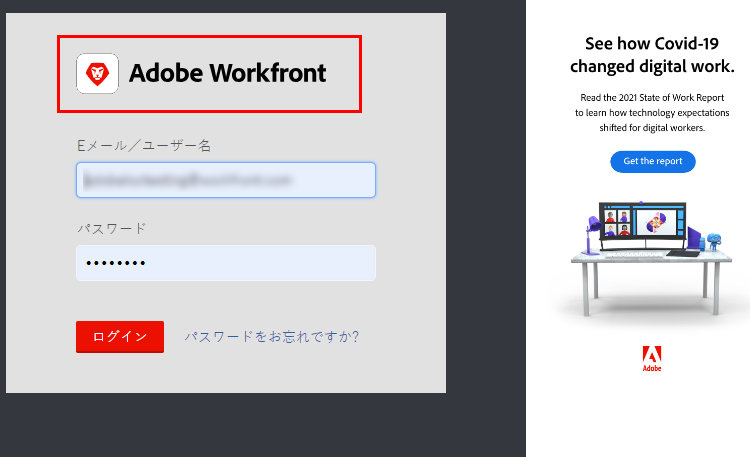
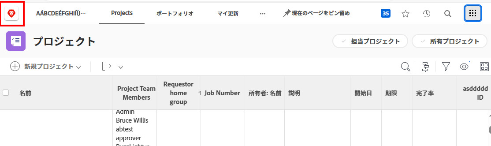
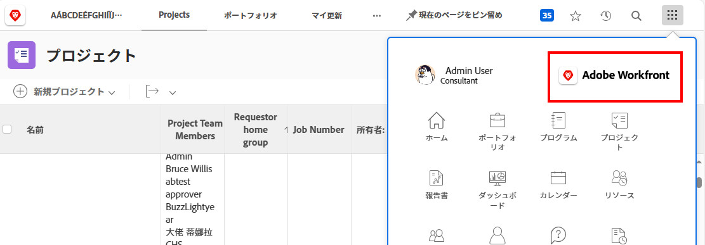
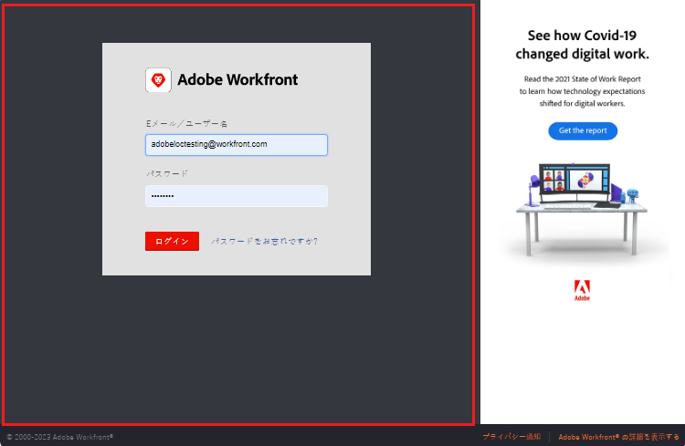

# Adobe Workfront インスタンスのブランディング

<!--
**DON'T DELETE, DRAFT OR HIDE THIS ARTICLE. IT IS LINKED TO THE PRODUCT, THROUGH THE CONTEXT SENSITIVE HELP LINKS. **
-->

>[!IMPORTANT]
>
>このページで説明する手順は、まだ [!DNL Adobe Experience Cloud] にオンボーディングしていない組織にのみ適用されます。
>
> 組織が [!DNL Adobe Experience Cloud] にオンボーディング済みの場合、ブランディングは利用できません。

Workfront の管理者は、次の場所でロゴを使用して Workfront のブランドを設定できます。

* ログイン画面

  

* ナビゲーションエリア上部

  

* メインメニュー

  

また、ログイン画面の背景画像やカラーを変更することもできます。

>[!NOTE]
>
>* 組織の Workfront インスタンスがカスタム SSO ポータルを使用している場合、ログインの背景画像とカラーは変更できません。詳細情報が必要な場合は、ネットワークまたは IT 管理者にお問い合わせください。
><!--
>or is enabled with Adobe IMS  >
>  >
>-->
>
>* Workfront の管理者またはグループ管理者は、レイアウトテンプレートを使用して、特定のグループおよびユーザーの Workfront をブランディングすることもできます。レイアウトテンプレートのブランディングは、この記事で説明するシステムレベルのブランディングを上書きします。レイアウトテンプレートでのブランディングの手順については、[レイアウトテンプレートを使用した Adobe Workfront のブランディング](../../../administration-and-setup/customize-workfront/use-layout-templates/brand-wf-using-a-layout-template.md)を参照してください。

## アクセス要件

この記事の手順を実行するには、次のアクセス権が必要です。

<table style="table-layout:auto"> 
 <col> 
 <col> 
 <tbody> 
  <tr> 
   <td role="rowheader">Adobe Workfront プラン</td> 
   <td>任意</td> 
  </tr> 
  <tr> 
   <td role="rowheader">Adobe Workfront ライセンス</td> 
   <td>プラン</td> 
  </tr> 
  <tr> 
   <td role="rowheader">アクセスレベル設定</td> 
   <td> 
Workfront 管理者である必要があります。
 
<b>メモ</b>：まだアクセス権がない場合は、アクセスレベルに追加の制限が設定されていないかどうか Workfront 管理者にお問い合わせください。Workfront 管理者がユーザーのアクセスレベルを変更する方法については、<a href="../../../administration-and-setup/add-users/configure-and-grant-access/create-modify-access-levels.md" class="MCXref xref">カスタムアクセスレベルの作成または変更</a>を参照してください。
 </td> 
  </tr> 
 </tbody> 
</table>

## ログイン画面のブランディング

1. Adobe Workfront の右上隅にある&#x200B;**メインメニュー**&#x200B;アイコン  をクリックし、「**設定**」 をクリックします。

1. **システム**／**ブランディング**&#x200B;をクリックします。

1. 次の変更を加えて、ブランディング画像を使用して Workfront をカスタマイズします。

   <table style="table-layout:auto"> 
    <col> 
    <col> 
    <tbody> 
     <tr> 
      <td role="rowheader"> 
ホームアイコンのブランディング （上部ナビゲーションエリアの左端に表示）
 </td> 
      <td> 
Adobe Analytics の <strong>上部ナビゲーションエリア</strong>セクション（<strong>ホームアイコン</strong>の下）で、ボックスの任意の場所をクリックし、ロゴ画像を探して選択します。または、画像をボックスにドラッグします。
 
画像を切り抜くには、スクロールコントロールを使用し、所定のスペース内の希望の位置に画像をドラッグします。
 
120 x 120 の画像をお勧めします。GIF、JPG、PNG、SVG のいずれかの形式を使用できます。
 
このアイコンは、レポート、リスト、ダッシュボード、およびユーザーが PDF ファイルとして書き出す配信レポートにも表示されます。
 </td> 
     </tr> 
     <tr> 
      <td role="rowheader"> 
メインメニュー  ロゴ  のブランディング（メインメニューの右上隅に表示）
 </td> 
      <td> 
<strong>ナビゲーションエリア上部</strong>セクションの<strong>メインメニューロゴ</strong>で、ボックス内の任意の場所をクリックし、ロゴ画像を見つけて選択します。または、画像をボックスにドラッグします。
 
画像を切り抜くには、スクロールコントロールを使用し、所定のスペース内の希望の位置に画像をドラッグします。
 
300 x 120 ピクセルの画像をお勧めします。GIF、JPG、PNG、SVG のいずれかの形式を使用できます。
 </td> 
     </tr> 
     <tr> 
      <td role="rowheader">ログイン画面のロゴのブランド化 （ユーザーがログイン資格情報を入力するボックスの左上に表示）</td> 
      <td> 
<strong>ログイン画面</strong>下で、ボックスの任意の場所をクリックし、ロゴ画像を探して選択します。画像を切り抜くには、スクロールコントロールを使用し、所定のスペース内の希望の位置に画像をドラッグします。
 
300 x 120 ピクセルの画像をお勧めします。GIF、JPG、PNG、SVG のいずれかの形式を使用できます。
 </td> 
     </tr> 
     <tr> 
      <td role="rowheader">ログイン画面の背景色のブランディング （ユーザーがログイン資格情報を入力するボックスの後ろに表示）</td> 
      <td> 
<strong>ログイン画面</strong>の下で、<strong>背景色</strong>を設定します。 
 
RGB または HEX カラーコードを使用できます。
 
背景色は、ログイン画面の背景画像がログイン画面の背景画像より大きい場合（この表の次の行を参照）、または画像に透明度がある場合にのみ表示されます。
 </td> 
     </tr> 
     <tr> 
      <td role="rowheader">ログイン画面の背景画像のブランディング （ユーザーがログイン資格情報を入力するボックスの後ろに表示）</td> 
      <td> 
       <ol style="list-style-type: lower-alpha;"> 
        <li value="1"> 
 <strong>ログイン画面</strong>エリア（<strong>背景画像</strong>の下）で、ボックスをクリックして、JPG または PNG 画像（最大 20 個）を検索して選択します。 
 
複数の背景画像がランダムな順序で表示され、ユーザーがログインページを更新するたびに変更されます。2 MB 以下の画像を使用することをお勧めします。
 </li> 
        <li value="2"> 
アップロードした各背景画像の上にポインタを合わせて、設定（歯車）アイコンをクリックし、次のいずれかのオプションを使用して、画像をログイン画面の背景に表示する場所と方法を指定します。
 
         <ul> 
          <li> 
<strong>画面を塗りつぶす</strong>：画像をログイン画面の背景に合わせて調整します。画像は拡大される場合があります。高解像度の画像（最大 2 MB）を使用すると、最適な結果が得られます。
 
このオプションを使用すると、Workfront バナーはカスタマイズできず、画像の一部が見えなくなります。
 </li> 
          <li> 
<strong>タイル</strong>：画像を元のサイズで、ログイン画面の背景エリア全体に並べます。これは、パターンを作成する場合に便利です。青い整列オプションを選択して、背景エリアの左上隅、中央上、右上からタイルを開始します。
 </li> 
          <li> 
<strong>位置</strong>：ログイン画面の背景エリアの左上、中央、右上の青い整列オプションの 1 つを使用して、選択した位置に画像を元のサイズに配置します。
 
ログイン画面の残りの背景エリアは、背景色で塗りつぶされます。背景色の詳細については、この表の前の行を参照してください。
 </li> 
         </ul> </li> 
       </ol> </td> 
     </tr> 
     <tr> 
      <td role="rowheader">デフォルトのブランディングにリセット</td> 
      <td> 
デフォルトのブランディングにリセットすると、アップロードしたすべての写真と画像が削除されます。
 
画面の右下隅で「<strong>すべてのブランディングを Workfront のデフォルトにリセット</strong>」をクリックして、「<strong>はい</strong>」をクリックします。
 </td> 
     </tr> 
    </tbody> 
   </table>

   >[!NOTE]
   >
   >組織の Workfront インスタンスがカスタム SSO Portal を使用している場合は使用できません。
   ><!--   >
   >or is enabled with Adobe IMS   >
   >   >
   >-->
   >
   >詳細情報が必要な場合は、ネットワークまたは IT 管理者にお問い合わせください。

1. 「**保存**」をクリックします。
