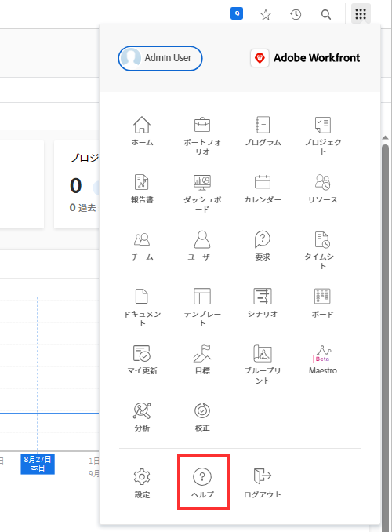
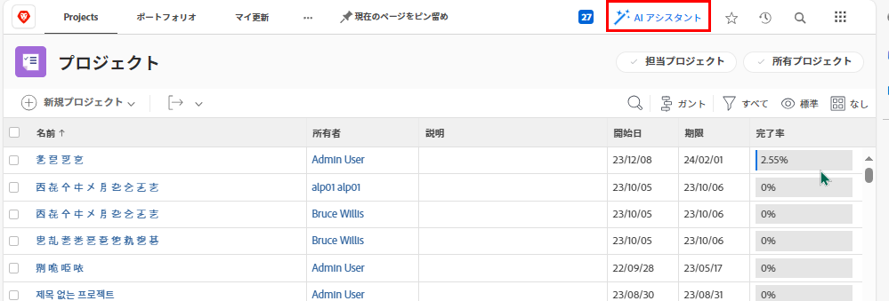

# カスタムヘルプ URL の設定

組織での Workfront の使用状況に関する情報を含んだカスタムの内部ヘルプサイトを作成した場合は、そのサイトに移動するようにメインメニューのヘルプアイコンを設定できます。

これは、メインメニューのメインヘルプリンクや、Workfront ヘルプサイトにユーザーを誘導する Workfront 全体のコンテキスト依存ヘルプリンクには影響しません。

Workfront で設定したカスタムのヘルプ URL と標準の Workfront ヘルプサイトの両方にユーザーがアクセスする方法については、[新バージョンの Adobe Workfront での Workfront ヘルプへのアクセス](/help/quicksilver/workfront-basics/navigate-workfront/workfront-navigation/access-workfront-help.md)を参照してください。

## アクセス要件

この記事の手順を実行するには、次のアクセス権が必要です。

<table style="table-layout:auto"> 
 <col> 
 <col> 
 <tbody> 
  <tr> 
   <td role="rowheader">Adobe Workfront プラン</td> 
   <td>任意</td> 
  </tr> 
  <tr> 
   <td role="rowheader">Adobe Workfront ライセンス</td> 
   <td>プラン</td> 
  </tr> 
  <tr> 
   <td role="rowheader">アクセスレベル設定</td> 
   <td> 
Workfront 管理者である必要があります。
 
<b>メモ</b>：まだアクセス権がない場合は、Workfront 管理者に問い合わせて、アクセスレベルに追加の制限が設定されているかどうかを確認してください。Workfront 管理者がアクセスレベルを変更する方法について詳しくは、<a href="../../../administration-and-setup/add-users/configure-and-grant-access/create-modify-access-levels.md" class="MCXref xref">カスタムアクセスレベルの作成または変更</a>を参照してください。
 </td> 
  </tr> 
 </tbody> 
</table>

## カスタムヘルプ URL の設定

1. Adobe Workfront の右上隅にあるメインメニューアイコン  をクリックし、「設定」をクリックします。
1. **システム**／**環境設定**&#x200B;をクリックします。
1. 「**一般的な環境設定**」セクション内の「**ヘルプ URL**」フィールドに、カスタムヘルプサイトの URL を入力します。

   カスタムヘルプの場所でログイン資格情報が必要な場合は、ユーザーが Workfront からサイトにアクセスする際に、それらの資格情報が必要になります。シングルサインオン（SSO）を使用していない場合は、カスタムヘルプサイトへの資格情報を Workfront の資格情報とは別に管理する必要が生じる場合があります。

1. 「**保存**」をクリックします。
