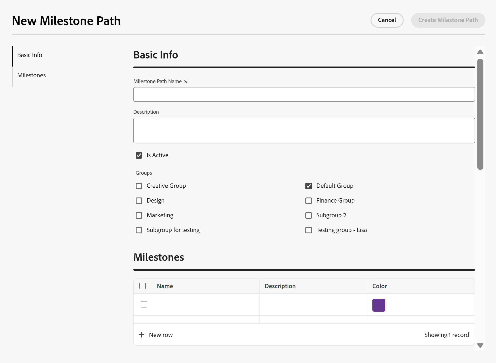
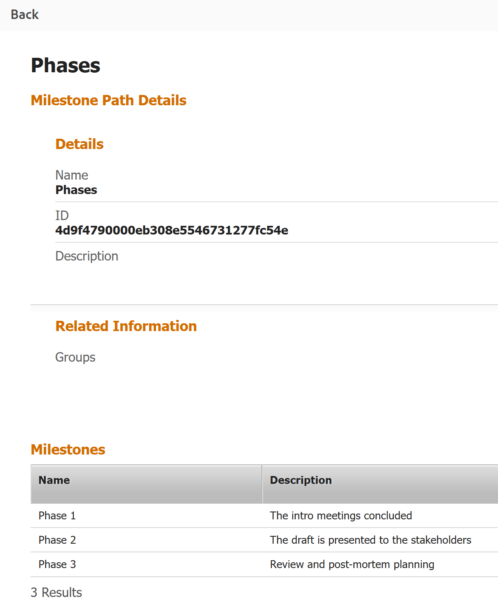

# マイルストーンパスを作成

<!--Audited: 08/2025-->

<!--
NOTE: DON'T DELETE, DRAFT OR HIDE THIS ARTICLE. IT IS LINKED TO THE PRODUCT, THROUGH THE CONTEXT SENSITIVE HELP LINKS.
-->

<!--
The highlighted information on this page refers to functionality not yet generally available. It is available only in the Preview environment for all customers. After the monthly releases to Production, the same features are also available in the Production environment for customers who enabled fast releases.    

For information about fast releases, see [Enable or disable fast releases for your organization](/help/quicksilver/administration-and-setup/set-up-workfront/configure-system-defaults/enable-fast-release-process.md). 
-->

<!--

 

The highlighted information on this page refers to functionality not yet generally available. It is available only in the Preview environment for all customers. The same features will also be available in the Production environment for all customers starting with  a week from the Preview release.      

For more information, see [Interface modernization](/help/quicksilver/product-announcements/product-releases/interface-modernization/interface-modernization.md).  

 
-->

Adobe Workfront 管理者は、システム内の任意のプロジェクトに適用できるマイルストーンパスを作成します。このエリアでマイルストーンパスに加えた変更は、Workfront システム全体に影響を与えます。

## アクセス要件

+++ 展開すると、この記事の機能のアクセス要件が表示されます。

<table style="table-layout:auto"> 
 <col> 
 <col> 
 <tbody> 
  <tr> 
   <td role="rowheader">Adobe Workfront パッケージ</td> 
   <td>
任意
</td> 
  </tr> 
  <tr> 
  <tr> 
   <td role="rowheader">Adobe Workfront プラン</td> 
   <td>
標準

       
プラン
</td>
  </tr> 
  </tr> 
  <tr> 
   <td role="rowheader">アクセスレベル設定</td> 
   <td>
システム管理者
</td>
  </tr> 
 </tbody> 
</table>

この表の情報について詳しくは、[Workfront ドキュメントのアクセス要件](/help/quicksilver/administration-and-setup/add-users/access-levels-and-object-permissions/access-level-requirements-in-documentation.md)を参照してください。

+++

<!--
Old: 

<table style="table-layout:auto"> 
 <col> 
 <col> 
 <tbody> 
  <tr> 
   <td role="rowheader">Adobe Workfront plan</td> 
   <td>Any</td> 
  </tr> 
  <tr> 
   <td role="rowheader">Adobe Workfront license</td> 
   <td>
Standard

   
Plan

   </td> 
  </tr> 
  <tr> 
   <td role="rowheader">Access level configurations</td> 
   <td> 
You must be a Workfront administrator.
</td> 
  </tr> 
 </tbody> 
</table>

*For information, see [Access requirements in Workfront documentation](/help/quicksilver/administration-and-setup/add-users/access-levels-and-object-permissions/access-level-requirements-in-documentation.md). 

+++
-->

## マイルストーンとマイルストーンパス

プロジェクト内の主要タスクを、事前に定義されたマイルストーンに関連付けることができます。この機能を使用すると、管理者や他の関係者に対し、プロジェクトの進行状況などに関する概要を提供できます。

事前に定義されたすべてのマイルストーンの合計は、マイルストーンパスと呼ばれます。

マイルストーンパスを作成する最初の手順は、マイルストーンの手順の内容を識別し、マイルストーンを確立することです。マイルストーンパスは複数のプロジェクトに関連付けることができるので、マイルストーンの手順は、任意のプロジェクトの一般的なフェーズまたはステージである必要があります。

マイルストーンパスをプロジェクトに関連付け、マイルストーンをタスクに関連付ける方法に関して詳しくは、[タスクへのマイルストーンの関連付け](../../../manage-work/tasks/manage-tasks/associate-milestones-with-tasks.md)を参照してください。

## マイルストーンパスを作成

{{step-1-to-setup}}

1. **プロセス**／**マイルストーンパス**&#x200B;をクリックします。
1. **新しいマイルストーンパス**&#x200B;をクリックします。

   「新規マイルストーンパス」ボックスが開きます。

   

1. 左側のパネルで「**基本情報**」をクリックします。

   次の情報を更新します。

   <table style="table-layout:auto">
    <tr>
      <td>マイルストーンパス名</td>
       <td>マイルストーンパスの名前を入力します。</td>
    </tr>
    <tr>
      <td>説明</td>
      <td>説明を入力して、マイルストーンパスを定義します。</td>
    </tr>
    <tr>
       <td>アクティブ</td>
      <td>マイルストーンパスをアクティブにする場合は、このチェックボックスを選択します。他のユーザーが、プロジェクトの作成時や編集時に、このパスを見つけてプロジェクトに添付できます。非アクティブなマイルストーンパスは、プロジェクトに添付できません。これはデフォルトで有効になっています。</td>
    </tr>
    <tr>
      <td>グループ</td>
      <td>リストに表示されたグループを選択し、これらのグループのユーザーがこのマイルストーンパスを表示してプロジェクトに適用できるようにします。マイルストーンパスに入るユーザーのホームグループは、デフォルトで選択されています。</td>
    </tr>
   </table>

1. 左側のパネルで「**マイルストーン**」をクリックします。

1. **新しい行**&#x200B;をクリックして、パスにマイルストーンを追加します。
1. 次の情報を更新します。

   <table style="table-layout:auto"> 
    <col> 
    <col> 
    <tbody> 
     <tr> 
      <td role="rowheader">名前</td> 
      <td>それぞれのマイルストーンに、わかりやすい名前を入力します。</td> 
     </tr> 
     <tr> 
      <td role="rowheader">説明</td> 
      <td>マイルストーンの説明を入力します。</td> 
     </tr> 
     <tr> 
      <td role="rowheader">色</td> 
      <td> 
マイルストーンに関連付けるカラーを選択します。 
 
カラーを選択しない場合は、マイルストーンパスで最後に使用されたカラーが選択されます。マイルストーンごとに一意のカラーを選択することをお勧めします。カラーは、視覚的およびレポートの目的で使用されます。
 </td> 
     </tr> 
    </tbody> 
   </table>

1. （オプション）各マイルストーンをドラッグ&amp;ドロップして並べ替えます。
1. 「**マイルストーンパスを作成**」をクリックして変更を保存します。

   マイルストーンパスをプロジェクトに関連付ける準備が整いました。

   マイルストーンパスをプロジェクトに関連付ける方法と、マイルストーンをタスクに関連付ける方法に関して詳しくは、[タスクへのマイルストーンの関連付け](../../../manage-work/tasks/manage-tasks/associate-milestones-with-tasks.md)を参照してください。

1. （オプション）マイルストーンパスリストから、1つのマイルストーンを選択し、**編集** アイコン をクリックしてマイルストーンパスを開き、その情報を編集します。
1. （オプション）「**書き出し**」アイコン「」をクリックし、次の形式から選択して、マイルストーンパスリストをファイルに書き出します。

   * PDF
   * Excel
   * Excel（xlsx）
   * タブ区切り

1. （オプション）マイルストーンリストで1つまたは複数のマイルストーンを選択し、**削除** アイコン をクリックして削除します。
1. 「**はい、削除します**」をクリックします。

   マイルストーンは削除され、復元できません。 マイルストーンパスは、以前に関連していたプロジェクトから削除され、すべてのマイルストーンが関連するタスクから削除されます。

   削除されたマイルストーンは復元できません。

## プロジェクトレポートでのマイルストーンパスの詳細の表示

プロジェクトレポートでマイルストーンパスの詳細を表示できます。

マイルストーンパスをプロジェクトに関連付けると、その詳細をプロジェクトレポートで確認できます。

マイルストーンパスをプロジェクトに関連付ける方法について詳しくは、[ プロジェクトの編集](/help/quicksilver/manage-work/projects/manage-projects/edit-projects.md)を参照してください。

{{step1-to-reports}}

1. 「**新しいレポート**」をクリックし、「**プロジェクト**」をクリックします。
1. 「**列を追加**」をクリックします。
1. この列&#x200B;**領域の**&#x200B;表示で、**マイルストーンパス**&#x200B;と入力し始め、表示されたら「**マイルストーンパス名**」をクリックします。
1. （オプション）「**フィルター**」をクリックし、次のフィルターをレポートに追加します。**プロジェクトマイルストーンパス IDが空白ではありません**。

   フィルターを使用すると、レポート内のマイルストーンパスに関連付けられているプロジェクトのみを表示できます。

1. 「**保存して閉じる**」をクリックします。
1. レポートの名前を追加し、**適用**&#x200B;をクリックします。

   プロジェクトレポートが表示されます。 各プロジェクトに関連付けられたマイルストーンパスは、レポートの最後の列に表示されます。
1. レポートの最後の列のマイルストーンパスの名前をクリックします。

   マイルストーンパスの詳細が表示されます。

   

   マイルストーンパスの詳細ページには、次の情報が表示されます。

   * マイルストーンパス名、ID、および説明
   * マイルストーンパスグループ
   * マイルストーン名、説明、カラー、カラーアイコン

1. （オプション）「**戻る**」をクリックして、プロジェクトレポートに戻ります。

