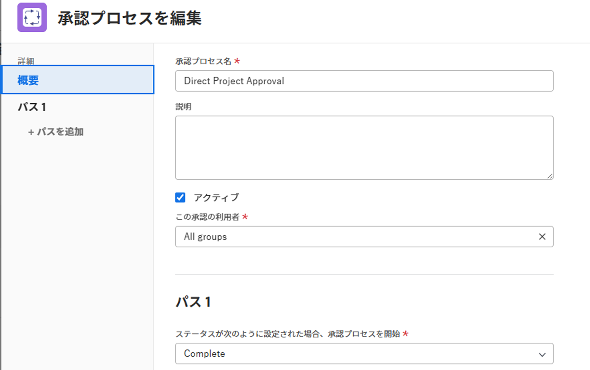

# 承認プロセスの編集

Adobe Workfront 管理者、または承認プロセスへの管理者アクセス権を持っている場合、システム内のすべての承認プロセスを表示および編集できます。

グループ管理者は、管理対象のグループに関連付けられた承認プロセスを表示および編集できます。

承認プロセスの作成については、[作業アイテムの承認プロセスの作成](../../../administration-and-setup/customize-workfront/configure-approval-milestone-processes/create-approval-processes.md)を参照してください。

>[!NOTE]
>
>* 既に使用中のグローバル承認プロセスを編集すると、変更は、既に関連付けられているシステム全体のすべてのオブジェクトに影響を与えます。
>* オブジェクトで既に開始している承認プロセスの現在のステージに新しい承認者を追加すると、そのオブジェクトのプロセスがリセットされ、承認者はやり直しを強いられます。
>
>  ただし、オブジェクトで既に開始している承認プロセスで次の変更を加えた場合、そのプロセスは中断せずに続行されます。
>
>* 現在のステージの後にステージを追加
>* 現在のステージの前に承認者を追加

## アクセス要件

以下が必要です。

<table style="table-layout:auto"> 
 <col> 
 <col> 
 <tbody> 
  <tr> 
   <td role="rowheader">Adobe Workfront プラン*</td> 
   <td>任意</td> 
  </tr> 
  <tr> 
   <td role="rowheader">Adobe Workfront ライセンス*</td> 
   <td>プラン</td> 
  </tr> 
  <tr> 
   <td role="rowheader">アクセスレベル設定*</td> 
   <td> 
システム管理者以外の場合は、承認プロセスへの管理者アクセス権
 
<b>メモ</b>：まだアクセス権がない場合は、Workfront 管理者に問い合わせて、アクセスレベルに追加の制限が設定されているかどうかを確認してください。Workfront 管理者がアクセスレベルを変更する方法について詳しくは、<a href="../../../administration-and-setup/add-users/configure-and-grant-access/create-modify-access-levels.md" class="MCXref xref">カスタムアクセスレベルの作成または変更</a>を参照してください。
 </td> 
  </tr> 
 </tbody> 
</table>

&#42;保有するプラン、ライセンスタイプ、アクセス権を確認するには、Workfront 管理者に問い合わせてください。

## 既存の承認プロセスを編集

1. Adobe Workfront の右上隅にある&#x200B;**メインメニュー**&#x200B;アイコン  をクリックして、**設定**  をクリックします。
1. （条件付き）システムレベルの承認プロセスを編集する場合、左パネルで&#x200B;**プロセス**／**承認**&#x200B;をクリックします。

   または

   グループレベルの承認プロセスを編集する場合は、次の手順を実行します。

   1. 左側のパネルで、**グループ**  をクリックします。
   1. グループ承認プロセスを一覧表示または管理するグループの名前をクリックします。
   1. 左側のパネルで、「**承認**」をクリックします。場合によっては、まず「**さらに表示**」をクリックする必要があります。

1. 編集する承認プロセスの種類に応じて、「**プロジェクトの承認**」、「**タスクの承認**」、「**イシューの承認**」のいずれかのタブをクリックします。

1. 編集するプロジェクトを選択し、リストの上部にある「**編集**」をクリックします。「承認プロセスの編集」ボックスが表示されます。

   

1. 表示されるボックスで、次の情報を指定します。

   <table style="table-layout:auto"> 
    <col> 
    <col> 
    <tbody> 
     <tr> 
      <td role="rowheader">承認プロセス名</td> 
      <td>承認プロセスにわかりやすい名前を入力します。ユーザーがオブジェクトに承認プロセスを適用すると、この名前が表示されます（<a href="../../../review-and-approve-work/manage-approvals/associate-approval-with-work.md" class="MCXref xref">新規または既存の承認プロセスと作業の関連付け</a>を参照）。</td> 
     </tr> 
     <tr> 
      <td role="rowheader">説明</td> 
      <td>承認プロセスの説明を入力します。これは、<b>設定</b>エリアの「<b>承認</b>」セクションの承認プロセス名の横に表示されます。</td> 
     </tr> 
     <tr> 
      <td role="rowheader">アクティブ</td> 
      <td> 
他のユーザーが作成するプロジェクト、タスクおよびイシューに承認プロセスを添付できるようにする場合は、このオプションを有効のままにします。 
 
このオプションは、デフォルトで有効になっています。
 
ヒント：承認プロセスを非アクティブとしてマークすると、組織で承認プロセスを使用する必要がなくなったが使用履歴情報を保持したい場合に役立ちます。
 </td> 
     </tr> 
     <tr data-mc-conditions=""> 
      <td role="rowheader">この承認の利用者 </td> 
      <td> 
特定のグループにのみ属するプロジェクト、タスク、イシュー、テンプレートに対して承認プロセスを使用できるようにするには、グループの名前を入力し始め、表示されたら選択します。
 
       <ul> 
        <li>システム管理者、または承認プロセスへの管理者アクセス権を持っている場合は、名前を入力すると、システム内のすべてのグループが表示されます。<b>すべてのグループ</b>はデフォルトで選択されています。 </li> 
        <li>承認プロセスへの管理者アクセス権を持たないグループ管理者は、その名前を入力する際に、管理対象のグループに承認プロセスを割り当てることができます。「<b>すべてのグループ</b>」オプションは利用できません。</li> 
       </ul> 
このオプションは、1 回限りの承認プロセスには使用できません。
 
<b>警告</b>：グループ固有の承認プロセスを変更すると、既に作業項目に関連付けられている既存の承認プロセスが変更される場合があります。これらの変更点について詳しくは、<a href="../../../administration-and-setup/customize-workfront/configure-approval-milestone-processes/how-changes-affect-group-approvals.md" class="MCXref xref">グループと承認プロセスの変更が割り当てられた承認プロセスに及ぼす影響</a>を参照してください。
 
グループのページからグループの承認プロセスを一覧表示および管理する方法について詳しくは、<a href="../../../administration-and-setup/manage-groups/work-with-group-objects/create-and-modify-groups-approval-processes.md" class="MCXref xref">グループレベルの承認プロセス</a>を参照してください。 
 
承認プロセスへの管理者アクセス権について詳しくは、<a href="../../../administration-and-setup/add-users/configure-and-grant-access/grant-users-admin-access-certain-areas.md" class="MCXref xref">特定のエリアに対する管理者アクセス権をユーザーに付与</a>を参照してください。
 </td> 
     </tr> 
    </tbody> 
   </table>

1. 次のオプションを使用して、承認プロセスのパスを設定します。

   パスとは、承認プロセスで実行する必要がある操作を指定する場所です。パスにステージを作成して、承認作業の実行者と順序を指定します。

   <table style="table-layout:auto"> 
    <col> 
    <col> 
    <tbody> 
     <tr> 
      <td role="rowheader"> 
ステータスが次のように設定された場合、承認プロセスを開始
 </td> 
      <td> 
作業アイテムの承認プロセスをトリガーにするステータスを選択します。誰かが作業アイテムをこのステータスに更新すると、承認プロセスが開始します。 
 
複数の承認プロセスパスに対して同じステータスを選択することはできません。
 
使用可能なステータスは、「<b>」オプションで選択した内容に基づきます。この承認は、</b> によって使用されることができます（上記の表で説明）。
 
      <ul> 
      <li> 次の場合 <b>すべてのグループ</b>を選択した場合、システム全体でロックされたステータスのみを使用できます。<!--Remove "locked" when story about using an unlocked status in approval processes goes to preview-->
      </li> 
      <li> 
特定のグループを選択した場合、そのグループが使用できるステータスのみが使用可能になります
 </li> 
      </ul> 
承認プロセスとステータスの連携について詳しくは、<a href="../../../review-and-approve-work/manage-approvals/approval-process-in-workfront.md" class="MCXref xref">承認プロセスの概要</a>の記事の<a href="../../../review-and-approve-work/manage-approvals/approval-process-in-workfront.md#how2" class="MCXref xref">承認プロセスがステータスに依存する方法</a>の節を参照してください。
 </td> 
     </tr> 
     <tr> 
      <td role="rowheader">ステージ名</td> 
      <td>（オプション）パスの最初のステージを表す名前を入力します。ステージ名を指定しない場合、デフォルトの名前は<b>ステージ 1</b> です。</td> 
     </tr> 
     <tr> 
      <td role="rowheader">承認者</td> 
      <td> 
このステージの承認者として指定するユーザー、チームまたは担当業務の名前を入力し、ドロップダウンリストに表示されたら名前をクリックします。アクティブなユーザー、担当業務、およびチームのみを追加できます。 

   
<b>ヒント</b>：

   
ユーザーを承認者として追加する場合は、同じ名前のユーザーを区別するために、アバター、ユーザーのプライマリの役割、またはメールアドレスに注意してください。ユーザーを追加したときに表示するには、少なくとも 1 つの担当業務に関連付ける必要があります。

      
ユーザーがユーザーのメールを表示するには、アクセスレベルで、連絡情報の表示の設定を有効にしておく必要があります。詳しくは、<a href="../../add-users/configure-and-grant-access/grant-access-other-users.md">ユーザーへのアクセス権の付与</a>を参照してください。
。

   
<b>メモ</b>：

   承認者としてユーザー、チームまたは役割を追加しても、その承認に関連付けられたオブジェクトに対する権限は自動的には付与されません。承認ステップがトリガーされると、オブジェクトに対する権限が付与されます。そうでない場合は、承認を決定する前に、オブジェクトをユーザー、チームまたは役割と共有する必要があります。 

   
また、個人の役割を指定することで、個人を承認者に指定することもできます。例えば、プロジェクト所有者、プロジェクトスポンサー、ポートフォリオ所有者、プログラム所有者、または管理者を承認者として割り当てることができます。これらのオプションは、入力を始めると自動的に表示されます。
 
      
<b>重要</b>：  
      <ul> 
      <li> プロジェクトスポンサーに承認を割り当て、誰もプロジェクトのスポンサーとして指定されていない場合、承認はプロジェクト所有者に再割り当てされます。プロジェクトの所有者として誰も指定されていない場合、承認は Workfront 管理者に割り当てられます。 </li> 
      <li> 承認を役割に割り当て、「<b>承認者がプロジェクトチームに属している必要はありません</b>」オプションを無効になっているが、プロジェクトチーム内に承認の役割と一致する役割がない場合、承認はプロジェクト所有者に再割り当てられます。承認設定について詳しくは、<a href="../../../administration-and-setup/customize-workfront/configure-approval-milestone-processes/establish-approval-settings.md" class="MCXref xref">グローバル承認設定を指定</a>を参照してください。
      </li> 
      <li>プロジェクト所有者に承認を割り当て、誰もプロジェクトの所有者として指定されていない場合、設定エリアの「顧客情報」セクションで示されているように、承認はメインの Workfront 管理者に再割り当てされます。詳しくは、<a href="../../../administration-and-setup/get-started-wf-administration/configure-basic-info.md" class="MCXref xref">システムの基本情報を設定</a>を参照してください。</li> 
      

 
      <li>
担当業務を承認者として割り当てると、その担当業務に関連付けられ、プロジェクトチームにも属するすべてのユーザーが承認を決定できます。 
 
      
チームを承認者として割り当てると、そのチーム内のすべてのユーザーが承認を決定できます。 
 
      
プロジェクトチームについて詳しくは、<a href="../../../manage-work/projects/planning-a-project/project-team-overview.md" class="MCXref xref">プロジェクトチームの概要</a>を参照してください。作業の承認について詳しくは、<a href="../../../review-and-approve-work/manage-approvals/approving-work.md" class="MCXref xref">作業の承認</a>を参照してください。

      </li>
      </ul>  
      </td> 
   </tr> 
     <tr> 
      <td role="rowheader">必要な決定は 1 つだけです</td> 
      <td>（ステージに複数の承認者を追加した場合にのみ表示）このステージで、ステージ上のいずれか 1 人の承認者が作業項目を承認または却下できる場合は、このオプションを選択します。このアクションによって、作業項目のステージからの移動が許可されます。  
      
このオプションを選択しない場合、項目がステージから移動する前に、指定されたすべての承認者が（任意の順序で）ステージを承認または拒否する必要があります。承認者のいずれか 1 人がステージを却下した場合、プロセスは中断し、必要な変更を行うためにやり直します。その後、承認者はステージを再び承認または却下できます。
 
      
チームが承認者として指定されると、チームのメンバーは誰でもステージを許可または却下できます。
 
      </td> 
     </tr> 
     <tr> 
      <td role="rowheader"> 
ステージを追加
 </td> 
      <td>（オプション）上記の 3 つの行で説明したオプションを使用して、パスに別のステージを追加します。パスには、必要な数のステージを追加できます。</td> 
     </tr>
     <tr> 
      <td role="rowheader"> 承認が却下されたときのアクションを選択します</td> 
      <td> 
パスの任意のステージで作業項目が却下された場合に実行するアクションを選択します。
 
      <ul> <li><strong>イシューの作成</strong>：（プロジェクトおよびタスクの承認プロセスでのみ使用可能）承認プロセスが実行されているプロジェクトまたはタスクにイシューが作成されます。タスクに割り当てられたデフォルトのリソース、またはプロジェクトの所有者がイシューに割り当てられます。デフォルトでは、作成されるイシューの名前は「<strong>承認却下（プロジェクトまたはタスク名）</strong>」となります。却下が発生した承認プロセスに応じて、タスクまたはプロジェクトの下に入力される拒否イシューです。</li> 
      <li> 
<strong>ステータスを次の値に設定</strong>：次のいずれかを選択します。
 
      <ul> <li><strong>前のステータス</strong>：却下されたプロジェクト、タスクまたはイシューは、承認プロセスを有効化するステータスの前のステータスに戻ります。</li> 
      <li> 
<strong>リスト内のその他のステータス</strong>：却下されたオブジェクトは、「保留中」など、選択したステータスに移動します。Workfront システムに追加したデフォルトのステータスまたはカスタムステータスの 1 つを選択できます。
 
承認パスの却下ステータスとして、承認プロセスに関連付けられたステータスを選択すると、却下されたオブジェクトは選択したステータスに移動し、「承認待ち」としてマークされます。

      
例えば、却下ステータスに「保留中」を選択し、「保留中」ステータスが承認プロセスに関連付けられている場合、却下されたオブジェクトは承認が必要な「保留中 - 承認待ち」のステータスになります。
    
システム全体の承認プロセスでは、システム全体のステータスのみを使用できます。
 
グループ固有の承認プロセスの場合、すべてのグループステータスを使用できます。これには、グループ管理者が特にグループ用として作成したカスタムステータスや、システム全体のステータスが含まれます。 
 
承認プロセスとステータスの連携について詳しくは、<a href="../../../review-and-approve-work/manage-approvals/approval-process-in-workfront.md" class="MCXref xref">承認プロセスの概要</a>の記事の「<a href="../../../review-and-approve-work/manage-approvals/approval-process-in-workfront.md#how2" class="MCXref xref">承認プロセスがステータスに依存する方法</a>」の節を参照してください。
 </li>
      </ul> 
     </tr> 
    </tbody> 
   </table>

1. （オプション）「**パスを追加**」をクリックして、前の手順のオプションのリストを参照し、承認プロセスに別のパスを追加します。

   新しいパスは、別のステータスに関連付ける必要があります。このパスは、項目が更新されてこのステータスを表示するときにトリガーされます。同じステータスに対して 2 つのパスを指定することはできません。

1. 「**保存**」をクリックします。
1. （オプション）次のいずれかの操作を行います。

   * [新規または既存の承認プロセスを作業に関連付ける](../../../review-and-approve-work/manage-approvals/associate-approval-with-work.md)で説明されているように、承認プロセスを、システム全体の特定のプロジェクト、タスクまたはイシューに関連付けます。
   * Workfront 以外では、[新規または既存の承認プロセスを作業と関連付ける](../../../review-and-approve-work/manage-approvals/associate-approval-with-work.md)で説明されているように、承認プロセスをプロジェクト、タスク、またはイシューと関連付けることができることをユーザーに通知します。
   * この承認プロセスが却下され、項目が別のステータスになった場合、トリガーされる別の承認プロセスを作成します。これにより、承認プロセスを相互にリンクすることができます。
