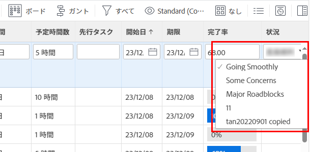

# 条件の表示順を変更する

条件がプロジェクト、タスクおよび問題に表示される順序を変更できます。

* ユーザーがプロジェクトを編集しているとき

   

* ユーザーがタスクまたはイシューの条件を変更しているとき

   

## アクセス要件

この記事の手順を実行するには、次のアクセス権が必要です。

<table style="table-layout:auto"> 
 <col> 
 <col> 
 <tbody> 
  <tr> 
   <td role="rowheader">Adobe Workfrontプラン</td> 
   <td>任意</td> 
  </tr> 
  <tr> 
   <td role="rowheader">Adobe Workfrontライセンス</td> 
   <td>計画</td> 
  </tr> 
  <tr> 
   <td role="rowheader">アクセスレベル設定</td> 
   <td> 
Workfront管理者である。
 
<b>注意</b>:まだアクセス権がない場合は、Workfront管理者に、アクセスレベルに追加の制限を設定しているかどうかを問い合わせてください。 Workfront管理者がアクセスレベルを変更する方法について詳しくは、 <a href="../../../administration-and-setup/add-users/configure-and-grant-access/create-modify-access-levels.md" class="MCXref xref">カスタムアクセスレベルの作成または変更</a>.
 </td> 
  </tr> 
 </tbody> 
</table>

## 条件の表示順を変更する

1. 次をクリック： **メインメニュー** アイコン  Adobe Workfrontの右上隅で、 **設定** .

1. クリック **プロジェクト環境設定** > **条件**.

1. を選択します。 **プロジェクト**,**タスク**&#x200B;または **問題** タブをクリックします。

1. ドラッグ  順序を変更する条件。

   新しい順序は自動的に保存されます。

条件のカスタマイズについて詳しくは、 [カスタム条件](../../../administration-and-setup/customize-workfront/create-manage-custom-conditions/custom-conditions.md).
