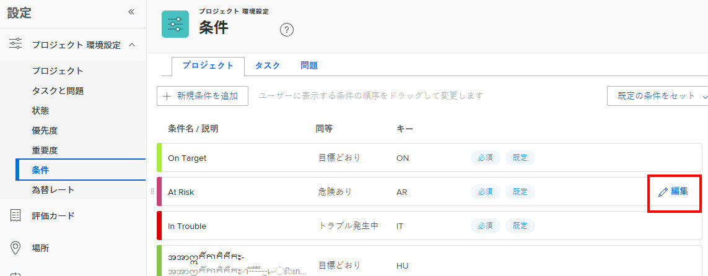
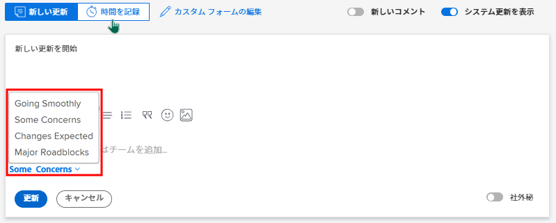

# カスタム条件の作成または編集

Adobe Workfront管理者は、組織のニーズに合ったプロジェクト、タスクおよびイシューのカスタム条件を作成または編集できます。

## アクセス要件

この記事の手順を実行するには、次のアクセス権が必要です。

<table style="table-layout:auto"> 
 <col> 
 <col> 
 <tbody> 
  <tr> 
   <td>Adobe Workfrontプラン</td> 
   <td>任意</td> 
  </tr> 
  <tr> 
   <td>Adobe Workfrontライセンス</td> 
   <td>計画</td> 
  </tr> 
  <tr> 
   <td>アクセスレベル設定</td> 
   <td> 
Workfront管理者である。
 
<b>注意</b>:まだアクセス権がない場合は、Workfront管理者に、アクセスレベルに追加の制限を設定しているかどうかを問い合わせてください。 Workfront管理者がアクセスレベルを変更する方法について詳しくは、 <a href="../../../administration-and-setup/add-users/configure-and-grant-access/create-modify-access-levels.md" class="MCXref xref">カスタムアクセスレベルの作成または変更</a>.
 </td> 
  </tr> 
 </tbody> 
</table>

## カスタム条件の作成または編集

1. 次をクリック： **メインメニュー** アイコン  Adobe Workfrontの右上隅で、 **設定** .

1. クリック **プロジェクト環境設定** > **条件**.

1. オブジェクトタイプ (**プロジェクト**, **タスク**&#x200B;または **問題**) をクリックして、条件に関連付けます。

1. 新しい条件を作成するには、 **新しい条件の追加**.

   または

   既存の条件を編集するには、編集する条件の上にマウスポインターを置いて、 **編集** 右端に表示されるアイコン。

   

1. 次のオプションを使用して、カスタム条件を設定します。

   <table style="table-layout:auto"> 
    <col> 
    <col> 
    <tbody> 
     <tr> 
      <td>条件名</td> 
      <td>（必須）条件を説明する名前を入力します。</td> 
     </tr> 
     <tr> 
      <td>説明</td> 
      <td>（オプション）条件を使用するユーザーの目的の説明を入力します。</td> 
     </tr> 
     <tr> 
      <td>色</td> 
      <td>（オプション）色アイコンをクリックして、プロジェクト、タスクまたはタスクに表示する条件の色を選択します。 16 進数を入力することもできます。</td> 
     </tr> 
     <tr> 
      <td>同等 </td> 
      <td>
（プロジェクトの場合のみ必須）新しい条件の機能に最も適したドロップダウンリストのオプションをクリックします。 例えば、「Tracking Well」という名前の条件の場合、「On Target」をクリックします。 これにより、デフォルトの条件の動作方法が決まります。 作成する条件は、ドロップダウンメニューのオプションの 1 つと同じである必要があります。

      
デフォルトの条件について詳しくは、 <a href="../../../administration-and-setup/customize-workfront/create-manage-custom-conditions/set-custom-condition-default-projects.md" class="MCXref xref">カスタム条件をプロジェクトのデフォルトとして設定する</a> および <a href="../../../administration-and-setup/customize-workfront/create-manage-custom-conditions/set-custom-condition-default-tasks-issues.md" class="MCXref xref">タスクとタスクのデフォルトとしてカスタム条件を設定</a>.

      
条件の作成が終了した後は、このオプションを変更できません。
</td> 
     </tr> 
     <tr> 
      <td>キー</td> 
      <td>
（必須）プロジェクト条件の場合、ユーザーが認識できる英数字の省略形を入力します。 タスクまたは問題の条件の場合は、01 ～ 99 の 2 桁の数値コードを入力します。 

      
API で使用され、レポート目的で使用できるこのキーは、各オブジェクトで一意である必要があります。

      
条件を保存した後で条件のキーを変更することはできません。 
</td> 
     </tr> 
     <tr> 
      <td>条件を非表示</td> 
      <td>
（オプション）このオプションは、ユーザーに使用してほしくなくなったが、履歴的な理由で保持したいカスタム条件で使用できます。 

      
作業項目で使用されているカスタム条件を非表示にした場合、非表示にした後も、それらの作業項目にその条件が引き続き表示されます。 
</td> 
     </tr> 
    </tbody> 
   </table>

   >[!TIP]
   >
   >条件の用語と色は、3 つのオブジェクトタイプすべてにわたって標準化できます。 これをおこなうには、1 つのタブ（プロジェクト、タスク、問題）から他の 2 つのタブの対応する条件に、条件名と色の 16 進コードをコピーします。

1. （オプション）ドラッグ  任意の条件を新しい位置に追加して、リストを並べ替えます。

   これにより、プロジェクト、タスクおよび問題で条件が表示される順序が変更されます。

   * ユーザーがプロジェクトを編集しているとき

      

   * ユーザーが [ 更新 ] タブでタスクまたはイシューの条件を変更している場合：

      

   * ユーザーがリスト表示でタスクまたはイシューの条件を変更する場合：

      

1. 「**保存**」をクリックします。

カスタム条件は、プロジェクトのデフォルト条件またはタスクやタスクのデフォルト条件として設定できます。 詳しくは、 [カスタム条件をプロジェクトのデフォルトとして設定する](../../../administration-and-setup/customize-workfront/create-manage-custom-conditions/set-custom-condition-default-projects.md) および [タスクとタスクのデフォルトとしてカスタム条件を設定](../../../administration-and-setup/customize-workfront/create-manage-custom-conditions/set-custom-condition-default-tasks-issues.md).

カスタム条件について詳しくは、 [カスタム条件](../../../administration-and-setup/customize-workfront/create-manage-custom-conditions/custom-conditions.md).
