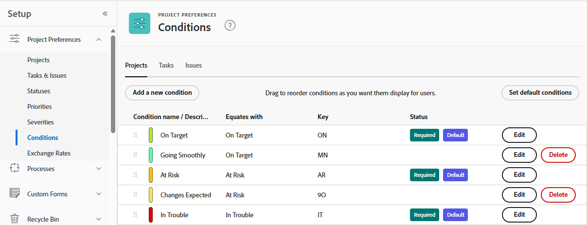

# カスタム条件の作成または編集

Adobe Workfront 管理者は、組織のニーズに合わせて、プロジェクト、タスクおよびイシューのカスタム条件を作成または編集できます。

## アクセス要件

+++ 展開すると、この記事の機能のアクセス要件が表示されます。

<table style="table-layout:auto"> 
 <col> 
 <col> 
 <tbody> 
  <tr> 
   <td>Adobe Workfront パッケージ</td> 
   <td>
任意
</td> 
  </tr> 
  <tr> 
   <td>Adobe Workfront プラン</td> 
   <td>
標準

       
プラン
</td>
  </tr> 
  <tr> 
   <td>アクセスレベル設定</td> 
   <td>システム管理者</td> 
  </tr> 
 </tbody> 
</table>

詳しくは、[Workfront ドキュメントのアクセス要件](/help/quicksilver/administration-and-setup/add-users/access-levels-and-object-permissions/access-level-requirements-in-documentation.md)を参照してください。

+++

## カスタム条件の作成または編集

{{step-1-to-setup}}

1. **プロジェクト環境設定**／**条件**&#x200B;をクリックします。

1. 条件に関連付けるオブジェクトタイプ（**プロジェクト**、**タスク**&#x200B;または&#x200B;**イシュー**）のタブをクリックします。

1. 新しい条件を作成するには、「**新しい条件を追加**」をクリックします。

   または

   既存の条件を編集するには、条件名の横にある **編集** をクリックします。

   

1. 次のオプションを使用して、カスタム条件を設定します。

   <table style="table-layout:auto"> 
    <col> 
    <col> 
    <tbody> 
     <tr> 
      <td>条件名</td> 
      <td>（必須）条件のわかりやすい名前を入力します。</td> 
     </tr> 
     <tr> 
      <td>説明</td> 
      <td>（オプション）条件を使用するユーザー向けに、条件の目的の説明を入力します。</td> 
     </tr> 
     <tr> 
      <td>色</td> 
      <td>（オプション）色アイコンをクリックし、プロジェクト、タスクまたはイシューに表示される際の条件の色を選択します。16 進数を入力することもできます。</td> 
     </tr> 
     <tr> 
      <td>次と同等 </td> 
      <td>
（プロジェクトの場合のみ必須）新しい条件の機能を最もよく記述するオプションをドロップダウンリストでクリックします。例えば、「Tracking Well」という名前の条件の場合に「目標どおり」をクリックするといった具合です。これにより、デフォルト条件がどのように機能するかが決まります。作成する条件はどれも、ドロップダウンメニューのオプションのいずれかと一致する必要があります。

      
デフォルト条件については、<a href="../../../administration-and-setup/customize-workfront/create-manage-custom-conditions/set-custom-condition-default-projects.md" class="MCXref xref">カスタム条件をプロジェクトのデフォルトとして設定</a>および<a href="../../../administration-and-setup/customize-workfront/create-manage-custom-conditions/set-custom-condition-default-tasks-issues.md" class="MCXref xref">カスタム条件をタスクとイシューのデフォルトとして設定</a>を参照してください。

      
条件の作成が終了した後は、このオプションを変更できません。
</td> 
     </tr> 
     <tr> 
      <td>キー</td> 
      <td>
（必須）プロジェクト条件の場合は、ユーザーが認識できる英数字の略語を入力します。タスク条件またはイシュー条件の場合は、01～99 の 2 桁の数値コードを入力します。 

      
このキーは API で使用され、レポート目的で使用できるもので、オブジェクトごとに一意である必要があります。

      
条件を保存した後は、条件のキーを変更することはできません。 
</td> 
     </tr> 
     <tr> 
      <td>条件を非表示</td> 
      <td>
（オプション）このオプションは、ユーザー用ではなくなったが、歴史的な理由で残しておくカスタム条件に使用できます。 

      
作業アイテムで使用されてきたカスタム条件を非表示にした場合、その条件は非表示にした後も、それらの作業アイテムに引き続き表示されます。 
</td> 
     </tr> 
    </tbody> 
   </table>

   >[!TIP]
   >
   >条件の用語と色は、3 つのオブジェクトタイプすべてにわたって標準化できます。それには、条件名と色の 16 進コードを、1 つのタブ（「プロジェクト」、「タスク」、「イシュー」）から他の 2 つのタブの対応する条件にコピーします。

1. （任意）任意の条件  を新しい位置にドラッグして、リストを並べ替えます。

   これにより、プロジェクト、タスクおよびイシューでの条件の表示順序が変わります。

   * ユーザーがプロジェクトを編集する場合：

     

   * ユーザーがリスト表示でタスクまたはイシューの条件を変更する場合

     

     >[!NOTE]
     >
     >デフォルトの条件ビューでは、「**条件**」フィールドはインラインで編集できないタイプのフィールドです。 **条件** フィールドを個別にビューに追加した場合は、編集が可能です。 インライン編集について詳しくは、[Adobe Workfrontのリスト内の項目をインライン編集 &#x200B;](/help/quicksilver/workfront-basics/navigate-workfront/use-lists/inline-edit-objects.md) を参照してください。

1. 「**保存**」をクリックします。

カスタム条件を、プロジェクトや、タスクおよびイシューのデフォルト条件として設定できます。詳しくは、[カスタム条件をプロジェクトのデフォルトとして設定](../../../administration-and-setup/customize-workfront/create-manage-custom-conditions/set-custom-condition-default-projects.md)および[カスタム条件をタスクとイシューのデフォルトとして設定](../../../administration-and-setup/customize-workfront/create-manage-custom-conditions/set-custom-condition-default-tasks-issues.md)を参照してください。

カスタム条件について詳しくは、[カスタム条件](../../../administration-and-setup/customize-workfront/create-manage-custom-conditions/custom-conditions.md)を参照してください。

<!-- THIS WAS ORIGINALLY BETWEEN THE OTHER TWO BULLETS.
   * When a user is changing the condition for a task or issue on the Updates tab:

     
   -->
