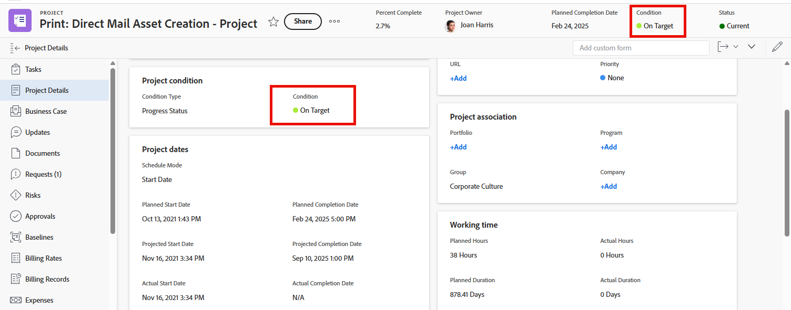

# カスタム条件をプロジェクトのデフォルトとして設定する

プロジェクトの状況タイプが「手動」ではなく「進行ステータス」に設定されている場合、[プロジェクト状況と状況タイプの概要](../../../manage-work/projects/manage-projects/project-condition-and-condition-type.md)で説明されているとおり、Adobe Workfront はプロジェクトの進行に応じて、プロジェクトの 3 つのビルトインのデフォルト状況（「目標どおり」、「危険あり」、または「トラブル発生中」）のいずれかを自動的に表示します。

これら 3 つのビルトインのデフォルト条件を使用する代わりに、カスタム条件をデフォルト条件として設定できます。例えば、オンターゲットのデフォルト条件を変更して、すべてのプロジェクトでトラッキングウェルとして表示することができます。

## アクセス要件

+++ 展開すると、この記事の機能のアクセス要件が表示されます。

この記事の手順を実行するには、次のアクセス権が必要です。

<table style="table-layout:auto"> 
 <col> 
 <col> 
 <tbody> 
  <tr> 
   <td role="rowheader">Adobe Workfront プラン</td> 
   <td>任意</td> 
  </tr> 
  <tr> 
  <tr> 
   <td role="rowheader">Adobe Workfront プラン</td> 
   <td>
新規：標準

       
または

       
現在：プラン
</td>
  </tr> 
  </tr> 
  <tr> 
   <td role="rowheader">アクセスレベル設定</td> 
   <td>[!UICONTROL System Administrator]</td>
  </tr> 
 </tbody> 
</table>

この表の情報について詳しくは、[Workfront ドキュメントのアクセス要件](/help/quicksilver/administration-and-setup/add-users/access-levels-and-object-permissions/access-level-requirements-in-documentation.md)を参照してください。

+++

## カスタム条件をすべてのプロジェクトのデフォルト条件として設定します。

{{step-1-to-setup}}

1. **プロジェクト環境設定**／**条件**&#x200B;をクリックします。

1. 「**プロジェクト**」タブをクリックします。
1. 「**デフォルトの条件を設定**」をクリックします。
1. 変更する既定の条件のドロップダウン メニューで、代わりに使用するカスタム条件をクリックします。
1. 変更する他のデフォルト条件については、前の手順を繰り返します。
1. 「**保存**」をクリックします。

タスクとイシューのデフォルト条件としてカスタム条件を設定する方法については、[タスクとイシューのデフォルトとしてカスタム条件を設定](../../../administration-and-setup/customize-workfront/create-manage-custom-conditions/set-custom-condition-default-tasks-issues.md)を参照してください。

ユーザーが手動で条件を更新できるプロジェクトの設定については、[&#x200B; タスクおよび問題の条件の更新 &#x200B;](../../../manage-work/projects/updating-work-in-a-project/update-condition-for-tasks-and-issues.md) を参照してください。
