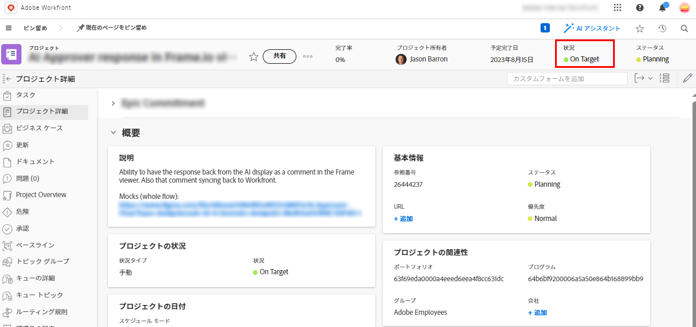

# カスタム条件をプロジェクトのデフォルトとして設定する

プロジェクトの条件の種類が「手動」ではなく「進捗状況」に設定されている場合、Adobe Workfrontでは、「ターゲット時」、「リスク時」、「トラブル時」の 3 つの組み込みのデフォルト条件のいずれかが、進行中に自動的に表示されます。 [プロジェクト条件と条件タイプの概要](../../../manage-work/projects/manage-projects/project-condition-and-condition-type.md).

これらの 3 つの組み込みのデフォルト条件を使用する代わりに、カスタム条件をデフォルト条件として設定できます。 例えば、On Target のデフォルト条件を変更して、すべてのプロジェクトで「Tracking Well」と表示することができます。

## アクセス要件

この記事の手順を実行するには、次のアクセス権が必要です。

<table style="table-layout:auto"> 
 <col> 
 <col> 
 <tbody> 
  <tr> 
   <td role="rowheader">Adobe Workfrontプラン</td> 
   <td>任意</td> 
  </tr> 
  <tr> 
   <td role="rowheader">Adobe Workfrontライセンス</td> 
   <td>計画</td> 
  </tr> 
  <tr> 
   <td role="rowheader">アクセスレベル設定</td> 
   <td> 
Workfront管理者である。
 
<b>注意</b>:まだアクセス権がない場合は、Workfront管理者に、アクセスレベルに追加の制限を設定しているかどうかを問い合わせてください。 Workfront管理者がアクセスレベルを変更する方法について詳しくは、 <a href="../../../administration-and-setup/add-users/configure-and-grant-access/create-modify-access-levels.md" class="MCXref xref">カスタムアクセスレベルの作成または変更</a>.
 </td> 
  </tr> 
 </tbody> 
</table>

## すべてのプロジェクトのデフォルト条件としてカスタム条件を設定します。

1. 次をクリック： **メインメニュー** アイコン  Adobe Workfrontの右上隅で、 **設定** .

1. クリック **プロジェクト環境設定** > **条件**.

1. 次をクリック： **プロジェクト** タブをクリックします。
1. クリック **デフォルト条件の設定**.
1. 変更するデフォルトの条件の横にあるドロップダウンメニューで、代わりに使用するカスタム条件をクリックします。
1. 他の既定の条件を変更する場合は、前の手順を繰り返します。
1. 「**保存**」をクリックします。

カスタム条件をタスクや問題のデフォルト条件として設定する方法については、 [タスクとタスクのデフォルトとしてカスタム条件を設定](../../../administration-and-setup/customize-workfront/create-manage-custom-conditions/set-custom-condition-default-tasks-issues.md).

ユーザーが手動で条件を更新できるようにプロジェクトを設定する方法については、 [タスクおよび問題の条件を更新](../../../manage-work/projects/updating-work-in-a-project/update-condition-for-tasks-and-issues.md).

カスタム条件について詳しくは、 [カスタム条件](../../../administration-and-setup/customize-workfront/create-manage-custom-conditions/custom-conditions.md).
